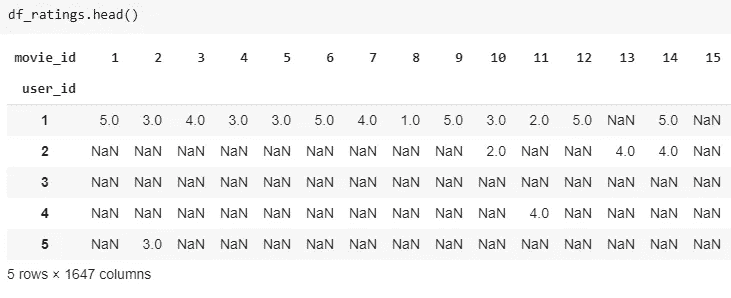
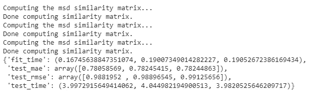
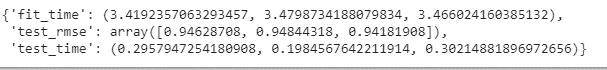
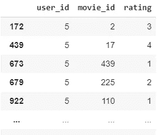

# 基于 Python 协同过滤的推荐系统

> 原文：<https://medium.com/analytics-vidhya/recommendation-system-using-collaborative-filtering-cc310e641fde?source=collection_archive---------2----------------------->

*本博客用 python* 展示了一个基于 ***协同过滤的推荐系统***

****

*在开始用 python 实现基于元数据的推荐系统之前，我建议您花 4 分钟阅读这篇博客，它用外行的术语定义了推荐系统及其类型。*

*[https://medium . com/@ saketgarodia/the-world-of-recommender-systems-e4ea 504341 AC？source = friends _ link&sk = 508 a 980d 8391 DAA 93530 a 32 e 9c 927 a 87](/@saketgarodia/the-world-of-recommender-systems-e4ea504341ac?source=friends_link&sk=508a980d8391daa93530a32e9c927a87)*

*通过这篇博客，我将展示如何在 Kaggle 的 MovieLens 100k 数据集上用 Python 实现一个基于 ***协同过滤的*** 推荐系统。*

*我们将使用的数据集是 Kaggle 上的 MovieLens 100k 数据集:*

*[](https://www.kaggle.com/prajitdatta/movielens-100k-dataset) [## MovieLens 100K 数据集

### 稳定的基准数据集。1000 名用户对 1700 部电影的 100，000 次评分

www.kaggle.com](https://www.kaggle.com/prajitdatta/movielens-100k-dataset) 

让我们开始实施它。

# 问题定式化

*利用其他用户的力量，建立一个基于协同过滤技术推荐电影的推荐系统。*

# 履行

首先，让我们导入所有必要的库，我们将使用它们来创建一个基于内容的推荐系统。让我们也导入必要的数据文件。

我们将使用 **surprise** 包，它内置了 SVD、KMean clustering 等协作过滤模型。

```
#importing necessary librariesimport numpy as npimport pandas as pdfrom sklearn.metrics.pairwise import cosine_similarityfrom sklearn.metrics import mean_squared_errorfrom sklearn.model_selection import train_test_splitfrom surprise import Reader, Dataset, KNNBasicfrom surprise.model_selection import cross_validatefrom surprise import SVDr_cols = ['user_id', 'movie_id', 'rating', 'timestamp']ratings = pd.read_csv('u.data',  sep='\t', names=r_cols,encoding='latin-1')ratings.head()i_cols = ['movie_id', 'title' ,'release date','video release date', 'IMDb URL', 'unknown', 'Action', 'Adventure','Animation', 'Children\'s', 'Comedy', 'Crime', 'Documentary', 'Drama', 'Fantasy','Film-Noir', 'Horror', 'Musical', 'Mystery', 'Romance', 'Sci-Fi', 'Thriller', 'War', 'Western']movies = pd.read_csv('u.item',  sep='|', names=i_cols, encoding='latin-1')movies.head()u_cols = ['user_id', 'age', 'sex', 'occupation', 'zip_code']users = pd.read_csv('u.user', sep='|', names=u_cols,encoding='latin-1')users.head()
```

所以，我们有 **1682 部独特的电影**和 **10 万的总收视率**由 **943 个用户**为这些独特的电影。

现在，我们需要将我们的“评级”数据框架分成两部分——第一部分训练算法来预测评级，第二部分测试预测的评级是否接近预期。这将有助于评估我们的模型。

我们将 y 作为“用户 id ”,只是为了确保分裂导致**分层采样**,并且我们在训练集中拥有所有的用户 id，以使我们的算法强大。

```
#Assign X as the original ratings dataframe and y as the user_id column of ratings.X = ratings.copy()y = ratings[‘user_id’]#Split into training and test datasets, stratified along user_idX_train, X_test, y_train, y_test = train_test_split(X, y, test_size = 0.25, stratify=y, random_state=42)
```

我们在**培训**组中有 **75k 评级**，在**测试**组中有 **25k** 来评估我们的模型。

```
df_ratings = X_train.pivot(index=’user_id’, columns=’movie_id’, values=’rating’)Now, our df_ratings dataframe is indexed by user_ids with movie_ids belonging to different columns and the values are the ratings with most of the values as Nan as each user watches and rates only few movies. Its a **sparse** dataframe.
```

以下是我们稀疏评级数据框的外观:



现在，我们将使用两种不同的方法进行协同过滤。在第一种方法中，我们将使用评级的**加权平均值**，我们将使用基于模型的分类方法实施第二种方法，如 **KNN (K 最近邻)**和 **SVD(奇异值分解)**。我们稍后将讨论 KNN 和奇异值分解。

在第一种方法中，我们将使用余弦相似度作为权重，使用评级的**加权平均值**。与输入用户更相似的用户将在我们对输入用户的评级计算中具有更高的权重。

让我们首先用 0 代替空值，因为余弦相似度对 NA 值不起作用，让我们继续使用评级的加权平均值来构建推荐器函数。

# **方法一:加权平均法**

```
df_ratings_dummy = df_ratings.copy().fillna(0)df_ratings_dummy.head()
#cosine similarity of the ratingssimilarity_matrix = cosine_similarity(df_ratings_dummy, df_ratings_dummy)similarity_matrix_df = pd.DataFrame(similarity_matrix, index=df_ratings.index, columns=df_ratings.index)#calculate ratings using weighted sum of cosine similarity#function to calculate ratings def calculate_ratings(id_movie, id_user):if id_movie in df_ratings:cosine_scores = similarity_matrix_df[id_user] #similarity of id_user with every other userratings_scores = df_ratings[id_movie]      #ratings of every other user for the movie id_movie#won't consider users who havent rated id_movie so drop similarity scores and ratings corresponsing to np.nanindex_not_rated = ratings_scores[ratings_scores.isnull()].indexratings_scores = ratings_scores.dropna()cosine_scores = cosine_scores.drop(index_not_rated)#calculating rating by weighted mean of ratings and cosine scores of the users who have rated the movieratings_movie = np.dot(ratings_scores, cosine_scores)/cosine_scores.sum()else:return 2.5return ratings_movie
```

现在，我们已经编写了一个函数来计算给定用户和电影的评级，让我们看看它在测试集上的表现如何。

```
calculate_ratings(3,150) #predicts rating for user_id 150 and movie_id 3
```

2.9926409218795715

让我们构建一个函数 score_on_test_set，它使用 **root_mean_squared_error** 在测试集上评估我们的模型

```
#evaluates on test setdef score_on_test_set():user_movie_pairs = zip(X_test[‘movie_id’], X_test[‘user_id’])predicted_ratings = np.array([calculate_ratings(movie, user) for (movie,user) in user_movie_pairs])true_ratings = np.array(X_test[‘rating’])score = np.sqrt(mean_squared_error(true_ratings, predicted_ratings))return score
test_set_score = score_on_test_set()print(test_set_score)
```

测试集上的均方误差为 **1.0172。**

**test_set 的均方根误差为 1.01** ，这有点令人惊讶。这意味着我们的算法在使用加权平均评分来预测新用户的电影评分方面非常有效。现在让我们使用基于**模型的**方法，看看我们能在多大程度上改善均方根误差。

# 方法 1:基于模型的方法

在基于模型的方法中，我们将使用两个模型: **KNN** 和**奇异值分解**。惊喜包内置了不同模型的库来构建推荐系统，我们将使用相同的库。

在**基于 KNN 的方法**中，预测是通过找到与要预测其评级的 input_user 相似的一群用户，然后取这些评级的平均值来完成的。KNN 是一种著名的分类算法。

在 **SVD(奇异值分解)方法**中，通过应用**矩阵分解技术**将稀疏的用户电影(收视率)矩阵压缩成密集矩阵。如果 M 是用户*电影矩阵，SVD 将其分解为 3 部分:M = UZV，其中 U 是用户概念*矩阵，Z 是不同概念的权重，V 是概念电影*矩阵。“概念”可以通过把它想象成类似电影的超集来直观地理解，就像“悬疑惊悚片”类型可以是一个概念，等等。

一旦 SVD 将原始矩阵分解成 3，密集矩阵就直接用于使用输入电影所属的概念来预测(用户，电影)对的评级。

```
# installing surprise library!pip install surprise#Define a Reader object#The Reader object helps in parsing the file or dataframe containing ratingsratings = ratings.drop(columns=’timestamp’)reader = Reader()#dataset creationdata = Dataset.load_from_df(ratings, reader)#modelknn = KNNBasic()#Evaluating the performance in terms of RMSEcross_validate(knn, data, measures=[‘RMSE’, ‘mae’], cv = 3)
```



我们可以看到，与加权平均法相比，KNN 的**均方根误差**甚至进一步降低到了 **0.98** 。在预测电影收视率方面，KNN 无疑比加权平均法表现得更好。

现在，让我们看看 SVD 的表现。

```
#Define the SVD algorithm objectsvd = SVD()#Evaluate the performance in terms of RMSEcross_validate(svd, data, measures=[‘RMSE’], cv = 3)
```



误差甚至进一步降低到 0.948 的“rmse”值，这是我们使用的 3 种方法中最好的结果。

```
trainset = data.build_full_trainset()svd.fit(trainset)ratings[ratings[‘user_id’] == 5]
```



```
svd.predict(1, 110)
```

通过 **SVD** 模型对用户 id 1 和电影 110 的预测是 2.14，而实际评分是 2，这有点令人惊讶。

要了解基于内容和元数据的方法，请浏览我的以下博客:

1.  基于内容的推荐系统:[https://medium . com/@ saketgarodia/content-based-Recommender-Systems-in-python-2b 330 e 01 EB 80？](/@saketgarodia/content-based-recommender-systems-in-python-2b330e01eb80?source=friends_link&sk=339a4eaa360453fe6952a10190ec5e9e)
2.  基于元数据的推荐系统:[*https://medium . com/@ saketgarodia/metadata-based-Recommender-Systems-in-python-c 6 aae 213 b 25 c*](/@saketgarodia/metadata-based-recommender-systems-in-python-c6aae213b25c)

谢谢你。*