# 推荐人|第一部分

> 原文：<https://medium.com/analytics-vidhya/recommenders-part-i-a9b8cac55dad?source=collection_archive---------9----------------------->

Spark 3 和 TensorFlow 2 的候选生成


阿尔伯特·雷恩在 [Unsplash](https://unsplash.com/s/photos/luxury-shopping?utm_source=unsplash&utm_medium=referral&utm_content=creditCopyText) 上拍摄的照片

问候人类！今天我们要用 python 设计一个推荐系统。我们将利用亚马逊上的奢侈品评级数据集。我们的架构将模仿 YouTube [提出的双神经网络推荐器。](https://static.googleusercontent.com/media/research.google.com/en//pubs/archive/45530.pdf)

在整个练习中，我将试图模仿生产部署的特征，因此，将云计算的健康剂量用于存储、数据处理和模型训练。谷歌云平台(GCP)是当今的首选提供商，使用以下服务:

1.  [DataProc](https://cloud.google.com/dataproc) (用于火花作业)
2.  [云存储](https://cloud.google.com/storage)(用于文件管理)
3.  [计算引擎](https://cloud.google.com/compute)(用于 GPU 训练)

这个想法是，虽然今天的数据集很小(选择它是为了让您可以快速完成这个练习)，但是您将能够在您的生产数据流中嵌入 Spark / Cloud 组件，这应该要大几个数量级。

对于那些不关心上述内容的人，我还在 repos 中包含了本地化的脚本。如果你选择包含云资源，你可以创建一个谷歌云账户。薇薇恩·化身在这里为你提供了一个很好的 GCP 入门指南。

在继续之前，您应该对您的项目证书、GPU 配额和存储桶结构有一个大致的了解。你可以在这里找到亚马逊评分数据的全部内容。

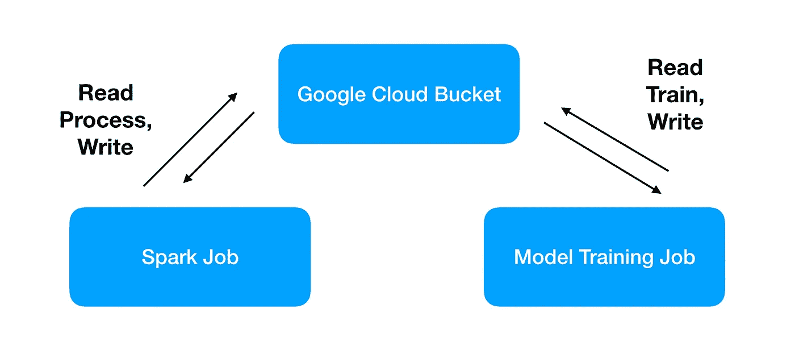

我利用了奢侈品美容评级数据( **574，628 个样本** ) —您可以在任何评级数据集上运行此代码，因为它们共享一个公共模式。

今天的练习将涵盖:

1.  配置 Dataproc 集群
2.  借助 Spark 将评级数据转化为预测功能
3.  用 TensorFlow 2 构建候选生成神经网络
4.  使用配备 GPU 的虚拟机实例训练上述模型
5.  用平均精度@ K 评估建议

后续练习将涵盖 YouTube 架构中描述的排名网络。

**问题**

用户参与是数字黄金。观看时间、文章分享和广告点击等指标都有助于任何平台的底线。这使得回答以下问题非常有利可图:我们如何设计内容提要来最大化参与度？进入推荐系统。

**系统设计**

今天，许多推荐系统遵循两阶段结构。第一阶段，**候选生成**，利用一个模型生成一个可能引起用户兴趣的项目列表。随后的**排名**阶段部署一个模型，根据一些参与度指标(如观看时间、购买可能性等)对该列表进行排名，从而解决上述问题。

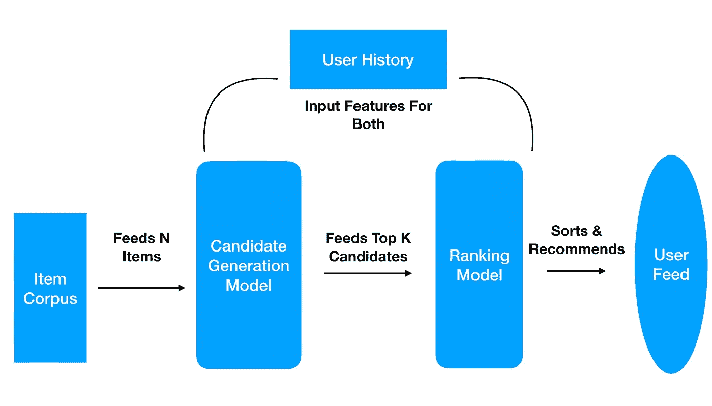

如果你读了 YouTube 的论文，你会注意到一种直观的方式来框架今天的候选生成问题是**极端多类分类**。您构建了一个神经网络，其输出是一个形状为 *n_items* 的软最大向量。K 个最有可能的项目成为你对那个用户的推荐。

上述方法的一个警告是，当 *n_items* 达到数千甚至数百万时，会出现两个问题:

1.  通过 softmax 图层渐变下降需要一段时间。
2.  为每个训练样本生成这样大小的输出向量会消耗大量内存。

为了减轻上述问题，我们将问题重新定义为一个**二元分类**任务。我们不是预测每个样本的每个项目的概率，而是获取数据的 *product_id* ，将其作为一个特征输入到模型中，并预测用户使用该产品的概率。

现在你会问:既然评级数据集中的每个样本都表达了一个参与度和评级的项目，那么我们的所有标签不都是 1 吗？是的。这就是**负采样**——一种从 Word2Vec 借来的技术——的用武之地。

你可以在这里找到来自 Munesh Lakhey [的精彩介绍，但是当我们进入代码时，你也能非常清楚地看到它是如何工作的。](/towardsdatascience/word2vec-negative-sampling-made-easy-7a1a647e07a4)

要点如下:对于数据集中的每个样本(都是正样本)，我们创建 N 个合成负样本，以便模型可以学习产生这两个类的特征之间的区别。

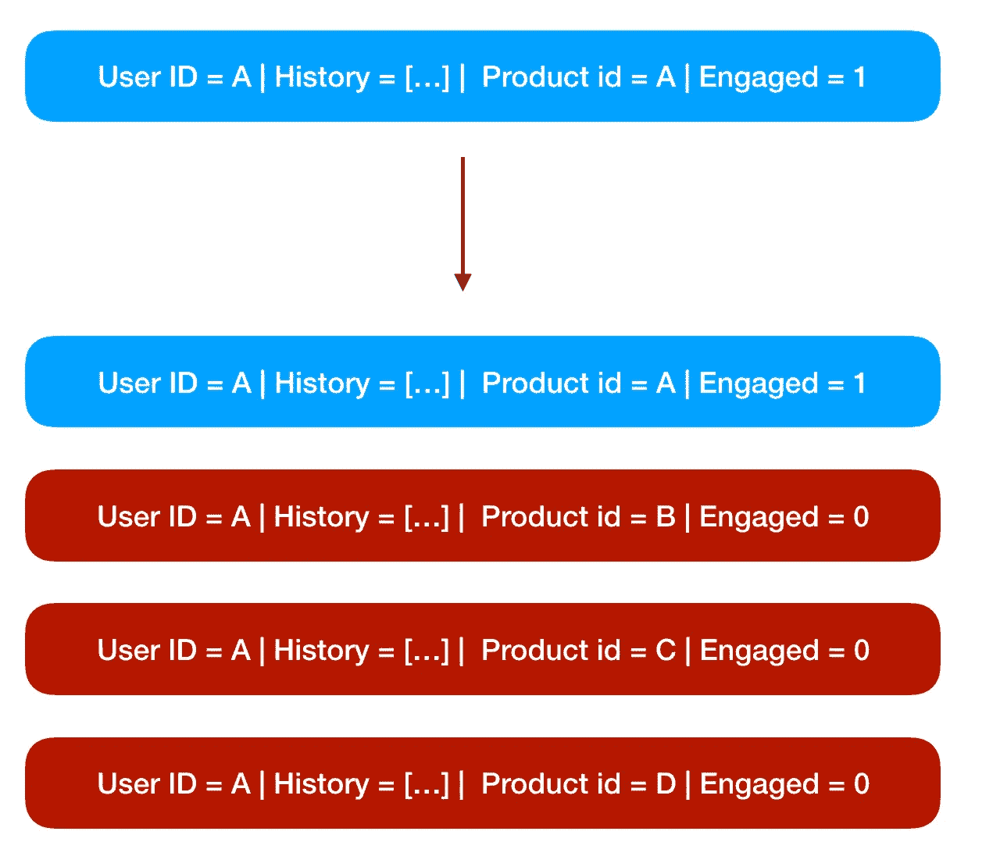

从单个阳性样本创建阴性样本

这里需要注意的重要一点是，通过将问题重新构建为一个二元分类任务，我们偏离了作者的方法。

作者全速推进 softmax 方法，并通过采样 softmax 损失减轻过高的梯度下降开销。我今天提出二进制变体，作为那些也想绕过上述警告 2 的人的一种选择。

**型号**

如果你有推荐器的经验，你可能熟悉推荐器的协同过滤风格，通常通过 ALS(交替最小二乘法)解决。这些模型通过分解评级矩阵来学习用户和产品 id 的潜在因素表示。

今天的方法还将学习每个用户和产品的矢量表示。但是按照 Word2Vec 的方式，我们将使用 Keras 的嵌入层。下面是将要加入的功能的完整列表:

1.  用户标识
2.  产品 ID
3.  最后 N 个产品 id
4.  最后 N 个喜欢的产品 id
5.  最后 N 个不喜欢的产品 id

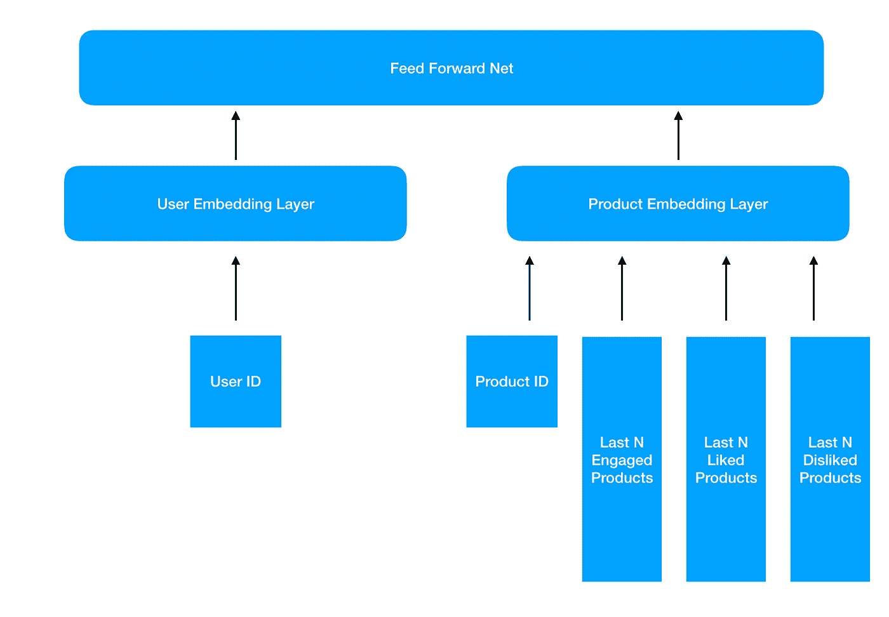

神经网络的输入

与传统协作过滤相比的主要优势:

1.  我们可以学习不确定数量的项目的向量表示——经典的矩阵分解算法只允许用户和金块嵌入。
2.  我们可以添加不确定数量的非嵌入特性——比如滚动方式或用户活动计数。

**Python 环境**


[马修·史密斯](https://unsplash.com/@whale?utm_source=unsplash&utm_medium=referral&utm_content=creditCopyText)在 [Unsplash](https://unsplash.com/s/photos/environment?utm_source=unsplash&utm_medium=referral&utm_content=creditCopyText) 上拍照

我为这个练习创建了两个独立的 PyCharm 项目:一个用于数据处理，另一个用于模型训练。每个项目都有自己的环境——我做出这个决定是为了让机器映像更精简，从而简化后续的部署过程。

下面列出了这两种环境的一些要点。我利用 Anaconda 3 进行环境管理，并在两个代码仓库中包含了 *environment.yml* 文件(在 MacOS Mojave 中创建),以方便那些只想复制我的设置的人。请记住，你仍然需要事先安装 Spark。

**数据处理**

1.  Python 3.7
2.  PySpark 3
3.  谷歌云存储 1.3

这里 *可以找到完整的代码回购[。](https://github.com/michaelyma12/recommender-data)*

**模特培训**

1.  Python 3.7
2.  张量流 2.0
3.  标准 ML 堆栈(Numpy、Pandas、Scikit-Learn)
4.  谷歌云存储 1.3

你可以在这里找到完整的回购代码[。](https://github.com/michaelyma12/recommender)

## **如何跟随**


阿图尔·图马斯扬在 [Unsplash](https://unsplash.com/s/photos/clone-trooper?utm_source=unsplash&utm_medium=referral&utm_content=creditCopyText) 上的照片

请记住，我不会叙述*项目中的每一行*代码。因此，我向您提供了两个如何跟进的选项:

1.  拥抱云计算元素，并遵循处理和训练组件的示例 *_cg-data.py* 和*示例 _cg-training.py* 。按照说明创建谷歌云资源。
2.  跳过云计算元素，简单地运行*example _ CG-data _ local . py*和*example _ CG-training _ local . py*进行处理和训练组件。我将原始的 *ratings.csv* 和预先计算的培训、验证和维持输入包含在适当的回购协议中，供选择这条道路的人使用。

复制和粘贴你在下面看到的每一个代码块将*而不是*产生一个工作流程，因为有助手/样板函数，我就不叙述了。

相反，我建议克隆 repos 并在 PyCharm(或另一个 IDE)中运行上面提到的脚本。一行一行地这样做，这样您就可以一边做一边观察输出——我重申一下 *environment.yml* 文件是专门包含的，这样您就可以这样做了。

**Spark 中的安装数据**

我们对[推荐者数据](https://github.com/michaelyma12/recommender-data)回购的概述从这里开始。

为了模拟部署环境，我将项目目录的大部分内容上传到云存储中。其中一些文件将在稍后的初始化脚本中被 Dataproc 读取。其他的将被简单地读取用于处理。

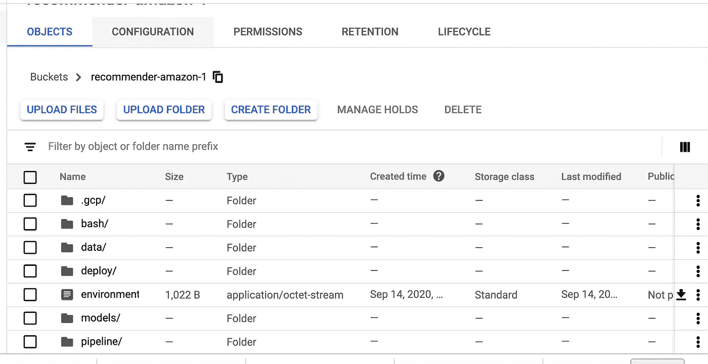

一旦我们的存储设置好了，我们就必须控制我们的 spark 会话。配置内存分配对于保证使用集群的全部资源处理数据至关重要。

默认 Dataproc 集群的规格由一个具有 4 个 CPU 和 15 GB 内存的驱动程序节点和两个规格相同的执行器节点组成。Yarn 已经从 executor 节点中占用了 6 GB 的内存，只剩下 24 GB。

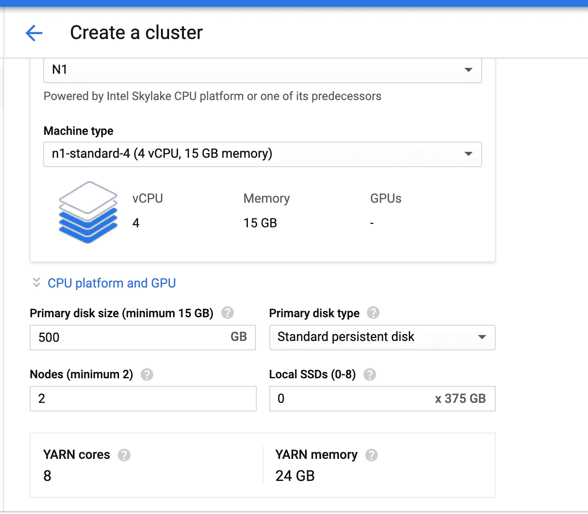

Dataproc 集群的默认执行器规格

我们将 8 个内核分成 4 个执行器，每个执行器分配 6 GB 内存。这比给每个执行器一个完整的节点和 12 GB 内存要好，因为更大的堆大小会增加垃圾收集的持续时间。它也胜过为每个执行器分配一个内核，因为这将剥夺我们在共享 JVM 上运行多个内核的好处。

如果您决定绕过 Dataproc 并在您的本地机器上运行它，2 GB 的驱动程序和执行器内存就足够了——它们无论如何都会指向相同的东西，因为您的本地机器将充当两者。

最后，我们需要配置 spark 从云存储中读取数据。这包括下载必要的 JAR，你可以在 Kashif Sohail 的[这篇](/@kashif.sohail/read-files-from-google-cloud-storage-bucket-using-local-pyspark-and-jupyter-notebooks-f8bd43f4b42e)优秀文章中找到，通过“spark.jars”配置参数链接到它，并在 spark 的 Hadoop 配置下添加一个到你的 GCP 凭证的路径。执行上述所有操作的代码如下所示:

```
*# initialize spark* spark_session = SparkSession.builder.\
    appName("sample").\
    config("spark.jars", "PATH/TO/GCS-CONNECTOR/JAR").\
    config('spark.executor.memory', '6g').\
    config('spark.executor.cores', '2').\
    config('spark.driver.memory', '2g').\
    getOrCreate()
spark_session._jsc.hadoopConfiguration().set('fs.gs.impl', 'com.google.cloud.hadoop.fs.gcs.GoogleHadoopFileSystem')
spark_session._jsc.hadoopConfiguration().set("google.cloud.auth.service.account.json.keyfile",
                                             "PATH/TO/JSON/CREDENTIALS")
spark_session._jsc.hadoopConfiguration().set('fs.gs.auth.service.account.enable', 'true')
```

在上传到云存储之前，我会将一些文件写到我的本地机器上。为此，我使用了 **ModelStorage()** 助手类，稍后您将看到它处理与 Google 的*云存储*库交互的锅炉板。

```
*# setup paths* model_path = 'models/luxury-beauty/candidate-generation'
model_bucket = 'recommender-amazon-1'
cg_storage = ModelStorage(bucket_name=model_bucket, model_path=model_path)
```

**转换数据**

为了确保每一列都是我们需要的类型，我们利用 Spark 的 **StructType** 类来确保正确的模式。该类利用一列 **StructField** 实例将模式转换到 SparkSQL 数据帧上。

```
rating_schema = StructType([
    StructField("product_id", StringType(), *True*),
    StructField("user_id", StringType(), *True*),
    StructField("rating", DoubleType(), *True*),
    StructField("timestamp", LongType(), *True*)
])stdout.write('DEBUG: Reading in data ...\n')
ratings = spark_session.read.csv("gs://recommender-amazon-1/data/ratings/luxury-beauty.csv",
                                 header=*False*,
                                 schema=rating_schema)
ratings = ratings.withColumn("timestamp", to_timestamp(ratings["timestamp"]))
```

当我们在解决一个二元分类问题时，我们添加了一个 1 的“目标”列。这表明数据框中的项目都是我们分类任务的阳性样本。

```
ratings = ratings.withColumn("target", lit(1))
```

为了最终将 *user_id* 和 *product_id* 值提供给 Keras 嵌入层，我们必须将这些列从它们当前的字符串值转换成数字。

```
*# encode product ids* ratings, product_id_mapping = encode_column(ratings, 'product_id')
save_pickle(product_id_mapping, os.path.join(model_path, 'product_id_encoder.pkl'))
cg_storage.save_file_gcs('product_id_encoder.pkl')

*# encode user ids* ratings, user_id_mapping = encode_column(ratings, 'user_id')
save_pickle(user_id_mapping, os.path.join(model_path, 'user_id_encoder.pkl'))
cg_storage.save_file_gcs('user_id_encoder.pkl')
```

上面的代码为我们的嵌入特性执行分类编码，并将其保存在云存储中以备后用。

这里的一个额外的指针是，Keras 将在以后大量使用序列特征的填充(列表 *product_id* 值)。Keras 中的默认填充值是 0，这意味着在训练过程中将忽略所有的 0。但是由于 StringIndexer 从 0-(N-1)开始产生标签，我们必须将所有编码值上移 1。

```
*def* encode_column(data, column):
    *"""encode column and save mappings"""* column_encoder = StringIndexer().setInputCol(column).setOutputCol('encoded_{}'.format(column))
    encoder_model = column_encoder.fit(data)
    data = encoder_model.transform(data).withColumn('encoded_{}'.format(column),
                                                    col('encoded_{}'.format(column)).cast('int'))
    data = data.drop(column)
    data = data.withColumnRenamed('encoded_{}'.format(column), column)
    data = data.withColumn(column, col(column) + lit(1))
    id_mapping = dict([(elem, i + 1) *for* i, elem *in* enumerate(encoder_model.labels)])
    *return* data, id_mapping
```

现在是构建作者所谓的多价功能的时候了。这些只是以列表形式出现的特性，而不是单个值。在这个练习中，我们使用用户在接触当前物品之前接触的最后 10 个物品(本文使用过去观看的 50 个视频)。推理是直观的:用户已经交互过的先前项目的列表可能比单个先前项目提供更多的预测能力。

要构建这样一个滚动窗口，我们需要 Spark 的名副其实的**窗口**类。我们用“user_id”划分窗口，并按“时间戳”升序排序。

在创建窗口之前，我们还通过 *user_id* 对我们的数据进行重新分区，以最大限度地减少分区之间的混乱，以便对按用户分组的行进行后续操作。

```
*# create window spec for user touch windows* stdout.write('DEBUG: Creating touched windows ...\n')
ratings = ratings.withColumn('timestamp', col('timestamp').cast('long'))
window_thres = 10
user_window_preceding = Window.partitionBy('user_id').orderBy(asc('timestamp')).rowsBetween(-window_thres, -1)
user_window_present = Window.partitionBy('user_id').orderBy(asc('timestamp'))
ratings = ratings.repartition(col('user_id'))
```

这里需要注意的一点是 **rowsBetween()** 方法，它将窗口限制在前面第 10 行和前面一行之间。如果没有这种方法，默认配置将把窗口限制在当前行和所有前面的行之间。

现在我们可以使用 SparkSQL 的 **collect_list()** 函数来收集用户在指定窗口中遇到的所有“product_id”值。我们现在有了 SparkSQL 的**数组类型**的新列。

```
*# get windows of touched items* ratings = ratings.withColumn(
    'liked_product_id', collect_list(when(col('rating') > 3.0, col('product_id')).otherwise(lit(*None*))).over(user_window_preceding)
)
ratings = ratings.withColumn(
    'disliked_product_id', collect_list(when(col('rating') < 3.0, col('product_id')).otherwise(lit(*None*))).over(user_window_preceding)
)
ratings = ratings.withColumn('touched_product_id', collect_list(col('product_id')).over(user_window_preceding))
```

从上面的逻辑分支，我们还基于用户以前“喜欢”和“不喜欢”的项目来创建特征。用户给出的评分> 3 的任何项目都将被标记为“喜欢”——与此相反的是，用户给出的评分< 3.

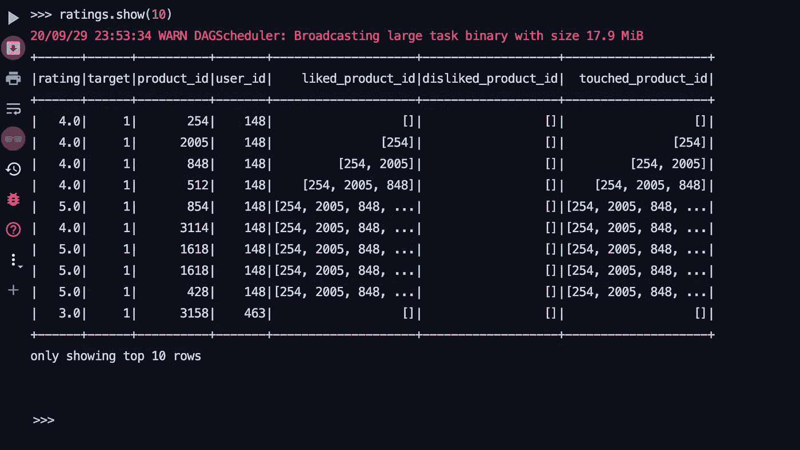

**形成了一个保留集**

在任何负采样发生之前，我们将创建一个维持集。该集合存在于训练和验证空间之外，将用于在练习结束时评估模型作为推荐者的功效。与此同时，训练集和验证集将充斥着负面样本——验证集仅作为分类器来衡量模型的有效性。

```
*# construct holdout set* stdout.write('Constructing holdout set ...')
ratings = ratings.withColumn('rank', row_number().over(user_window_present))
holdout_thres = 10
holdout_ratings = ratings.filter(col('rank') >= holdout_thres).\
    drop('rank').\
    drop('timestamp')
prediction_states = holdout_ratings.filter(col('rank') == holdout_thres).select(
    col('user_id'),
    col('touched_product_id'),
    col('liked_product_id'),
    col('disliked_product_id')
)
final_states = holdout_ratings.groupby('user_id').agg(collect_set('product_id').alias('holdout_product_id'))
holdout_frame = prediction_states.join(final_states, ['user_id'])
```

我们的维持组将只包括那些至少购买了 10 件商品的用户。这些用户在十岁以后购买的所有商品都将成为他们“保留包”的一部分。该模型将使用维持集开始时的用户功能状态来生成一个已排序的推荐列表。那些项目中实际包含在拒绝约定中的部分将决定推荐者的功效。

上述内容的一个特点是，在 SparkSQL Dataframe 被转换为 pandas variant 并保存为 CSV 之后，读取 pandas variant 的后续操作将原来的列表列解释为字符串列([1，2，3]被读作'[1，2，3]')。因此，我也保存了一个字典，以便以后进行类型转换。

```
# save holdout types
holdout_types = dict([(field.name, str(field.dataType)) *for* field *in* holdout_frame.schema.fields])
save_pickle(holdout_types, os.path.join(model_path, 'holdout_types.pkl'))
cg_storage.save_file_gcs('holdout_types.pkl')# save holdout dataframe
holdout_frame = holdout_frame.toPandas()
holdout_frame.to_csv(os.path.join(model_path, 'holdout.csv'), index=*False*)
cg_storage.save_file_gcs('holdout.csv')
```

请确保将定型集和验证集与此维持集分开。

```
ratings = ratings.filter(col('rank') < holdout_thres).\
    drop('rank').\
    drop('timestamp')
ratings.persist()
```

**高效负采样**


micha Parzuchowski 在 [Unsplash](https://unsplash.com/s/photos/poker?utm_source=unsplash&utm_medium=referral&utm_content=creditCopyText) 上拍摄的照片

现在我们来看一些底片。该过程的要点是获取每个用户，获取他们没有在数据集上交互的所有项目，并添加一个带有“目标”标签 0 的行。这实际上告诉了模型哪些用户和先前的项目历史组合不会对某些项目产生影响。

现在我们如何有效地进行这项工作呢？一种粗略的方法是浏览整个产品列表，获取用户接触过的产品的集合差异，并从中进行采样。考虑到负面项目的数量，为每个用户重复这个过程对内存并不友好。

另一种方法是抽样检查。这意味着从项目语料库中采样 N 次，并且每当一个项目是肯定的时就重新采样。这样的过程将具有 O(N)复杂度。

以上是可行的，但是假设我们有一个整数数组，为什么不排序并利用二分搜索法呢？我们可以将复杂度降低到 O(log(N))。

我们将部署的方法称为矢量化二分搜索法，其实现如下所示:

```
*def* negative_sampling(pos_ids, num_items, sample_size=10):
    *"""negative sample for candidate generation. assumes pos_ids is ordered."""* raw_sample = np.random.randint(0, num_items - len(pos_ids), size=sample_size)
    pos_ids_adjusted = pos_ids - np.arange(0, len(pos_ids))
    ss = np.searchsorted(pos_ids_adjusted, raw_sample, side='right')
    neg_ids = raw_sample + ss
    *return* neg_ids
```

我从 Jason Tam 的文章[这里](/@2j/negative-sampling-in-numpy-18a9ad810385)中学到了这个方法。如果你想要更深入的解释，请仔细阅读他的文章。为了在我们的分布式数据帧中应用该函数，我们广播了字典，并将其提供给下面的嵌套 UDF。

```
*# function to perform negative sampling among cluster nodes
def* negative_sampling_distributed_f(broadcasted_touched_dictionary):
    *"""perform negative sampling in parallel using all of a user's touched products"""
    def* f(user_col, num_items, sample_size):
        *return* negative_sampling(broadcasted_touched_dictionary.value.get(user_col),
                                 num_items, sample_size).tolist()
    *return* f# register it as a UDF
stdout.write('DEBUG: Beginning negative sampling ... \n')
num_products = int(max_product_id)
negative_sampling_distributed = negative_sampling_distributed_f(broadcasted_touched_dict)
spark_session.udf.register('negative_sampling_distributed', 
negative_sampling_distributed)# run it
negative_sampling_distributed_udf = udf(negative_sampling_distributed, ArrayType(StringType()))
ratings_negative = ratings.withColumn(
    'negatives', negative_sampling_distributed_udf('user_id', lit(num_products), lit(3))
)
```

上面的代码在我们的 DataFrame 中创建了一个新列，每行都有一个负数数组。广播的对象是包含每个用户参与的所有产品的字典——这样，只有用户没有参与的项目将被采样为负面。

但是，我们希望将这些数组转换成它们自己的行，这样它们就可以作为训练数据输入。为此，我们利用 SparkSQL 的 **explode()** 函数。由于这些是阴性样本，我们在“目标”栏中填入 0。

```
ratings_negative = ratings_negative.\
    drop('product_id').\
    withColumn('product_id', explode('negatives')).\
    drop('negatives')
ratings_negative = ratings_negative.\
    drop('target').\
    withColumn('target', lit(0))
ratings_negative.persist()ratings = ratings.drop('negatives')
ratings_all = ratings.unionByName(ratings_negative)
ratings_all.show()
```

注意，我们通过持久化数据帧来结束上面的块。我们这样做是因为我们必须考虑 Spark 对 DataFrame 对象的惰性评估是如何与负采样的随机性相一致的。

因为在没有调用 **persist()** 或 **cache()** 的情况下，数据帧永远不会存储在内存中，并且每次在数据帧上触发转换时，都会重新构造*，需要对数据进行多次转换的后续操作将多次执行负采样，从而在每次调用时产生一组不同的负值。*

当我们对数据进行分层混洗分割时，为什么这是有害的原因将变得清楚。

```
stdout.write('DEBUG: Beginning stratified split ...')
ratings_all = ratings_all.select('user_id', 'product_id', 'touched_product_id',
                                 'liked_product_id', 'disliked_product_id', 'target')
train_df, val_df = stratified_split_distributed(ratings_all, 'target', spark_session)
```

上面的函数将我们的数据帧剥离到其裸露的 RDD，添加我们的“目标”列作为键，通过所述键采样，并将获得的样本重建为训练集。同样的 80%来自两个“目标”类。

```
*def* stratified_split_distributed(df, split_col, spark_session, train_ratio=0.8):
    *"""stratified split using spark"""* split_col_index = df.schema.fieldNames().index(split_col)
    fractions = df.rdd.map(*lambda* x: x[split_col_index]).distinct().map(*lambda* x: (x, train_ratio)).collectAsMap()
    kb = df.rdd.keyBy(*lambda* x: x[split_col_index])
    train_rdd = kb.sampleByKey(*False*, fractions).map(*lambda* x: x[1])
    train_df = spark_session.createDataFrame(train_rdd, df.schema)
    val_df = df.exceptAll(train_df)
    *return* train_df, val_df
```

我们保留之前的负采样数据帧的原因是，我们通过获取完整数据帧和训练数据帧之间的集合差来获得我们的验证集。

上面的逻辑将评估完整的数据帧两次，一次在分层抽样期间，另一次在 **exceptAll()** 方法期间——如果我们没有保存负数据帧，它将使用第二批随机抽样的负数据帧重新计算一个新的数据帧。

新计算的实体和分层抽样发生的实体之间的集合差将无效。

**书写输出**

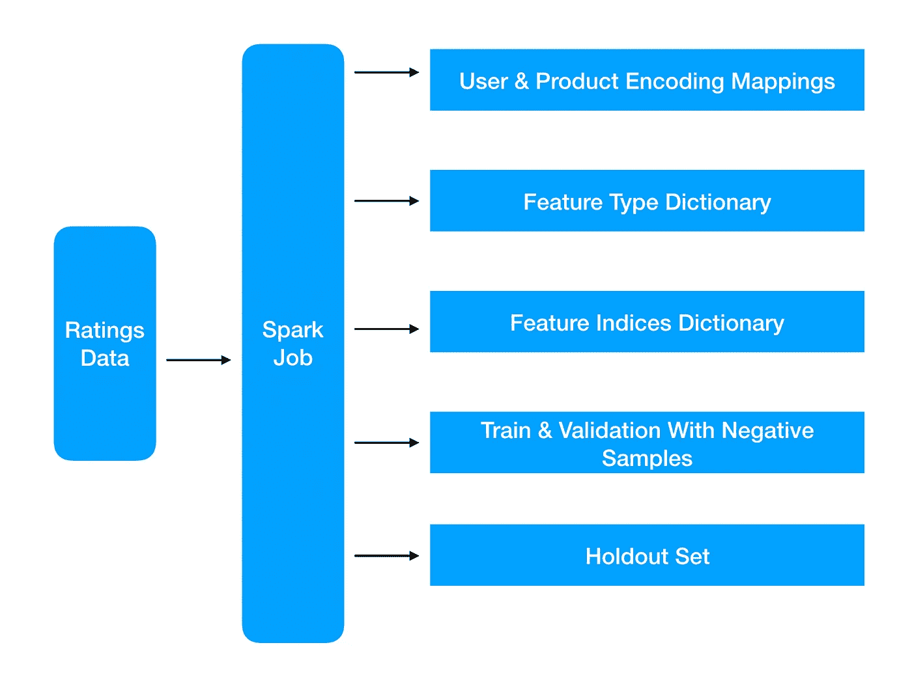

作业写入云存储桶的内容

为了结束数据处理，我们将数据帧转换为 pandas，并以 CSV 文件的形式保存到云存储中。我们还将以字典的形式保存我们的特征的顺序以及它们的类型。下游代码将读取这些字典，并使用它们为我们的 keras 模型构建适当的输入。

```
stdout.write('DEBUG: Converting dataframes to pandas ...' + '\n')
train_pd = train_df.toPandas()
train_pd.to_csv(os.path.join(model_path, 'train.csv'), index=*False*)
cg_storage.save_file_gcs('train.csv')

val_pd = val_df.toPandas()
val_pd.to_csv(os.path.join(model_path, 'validation.csv'), index=*False*)
cg_storage.save_file_gcs('validation.csv')stdout.write('DEBUG: Saving feature indices ... \n')
feature_indices = dict([(feature, i) *for* i, feature *in* enumerate(ratings_all.schema.fieldNames())])
save_pickle(feature_indices, os.path.join(model_path, 'feature_indices.pkl'))
cg_storage.save_file_gcs('feature_indices.pkl')

stdout.write('DEBUG: Saving feature types ... \n')
feature_types = dict([(field.name, str(field.dataType)) *for* field *in* ratings_all.schema.fields])
save_pickle(feature_types, os.path.join(model_path, 'feature_types.pkl'))
cg_storage.save_file_gcs('feature_types.pkl')
```

**提交 Spark 作业**

为了在 Dataproc 集群上运行我们的工作，我们必须正确地配置我们的集群环境。首先初始化一个新的 Dataproc 集群:

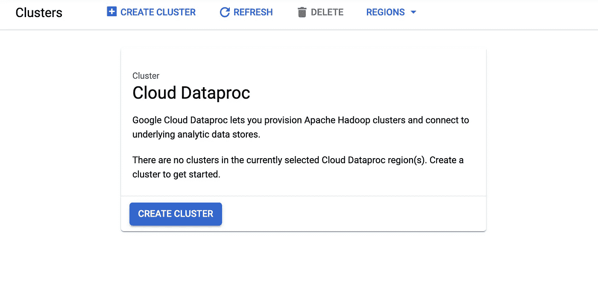

接下来，您需要确保集群的 Spark 版本和我们脚本(3.0)中的版本一致。安装了 Spark 3.0 的唯一一个 Dataproc 图像是预览——点击设置底部附近的‘高级选项’并选择预览图像的 Debian 变体。

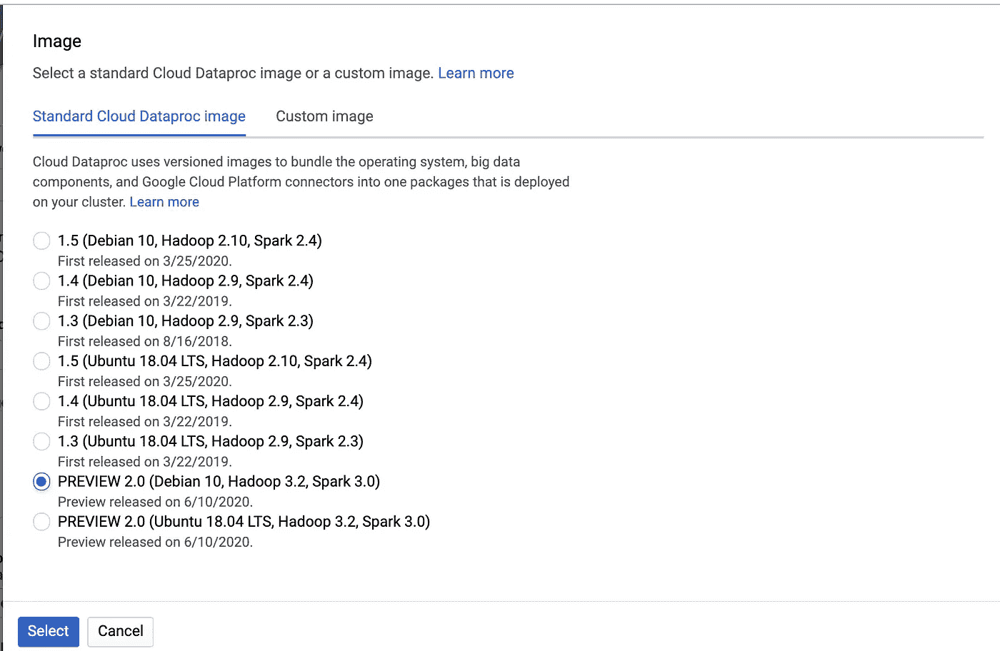

选择预览 2.0 图像的 Debian 变体

现在我们想配置主节点和工作节点来运行我们的 Python 环境。为此，我们部署了一个**初始化脚本**。它只是一个 bash 脚本，Dataproc 从集群上所有节点的根节点运行，然后才让它们运行。

```
**#!/usr/bin/env bash** *echo* "Updating apt-get ..."
*apt-get* update

*echo* "Setting up python environment ..."
*wget* https://storage.googleapis.com/hadoop-lib/gcs/gcs-connector-latest-hadoop2.jar -P /usr/lib/spark/jars/
*gsutil* cp gs://recommender-amazon-1/environment.yml .
*/opt/conda/miniconda3/bin/conda* env create -f environment.yml

*echo* "Setting up credentials ..."
*cd* /
*mkdir* -p recommender-data/models/candidate_generation
*gsutil* cp -r gs://recommender-amazon-1/.gcp recommender-data/
*gsutil* cp -r gs://recommender-amazon-1/pipeline recommender-data/

*echo* "Activating conda environment as default ..."
*echo* "export PYTHONPATH=/recommender-data:*$*{PYTHONPATH}" | *tee* -a /etc/profile.d/effective-python.sh ~/.bashrc
*echo* "export PYSPARK_PYTHON=/opt/conda/miniconda3/envs/recommender-data/bin/python3.7" *>> /etc/profile.d/effective-python.sh*
```

我从云存储中复制了我的 *environment.yaml* 和源代码，并在节点的 *effective-python.sh* 中复制了**PYSPARK _ PYTHON***变量，以便从我的定制环境中运行所有 PYSPARK 作业。我还在 **PYTHONPATH** 中包含了我的源代码，所以我的定制模块可以被 python 解释器识别。*

**

*在“初始化操作”一节中部署 bash 脚本的变体来执行上述序列。然后只需启动集群并提交作业。*

*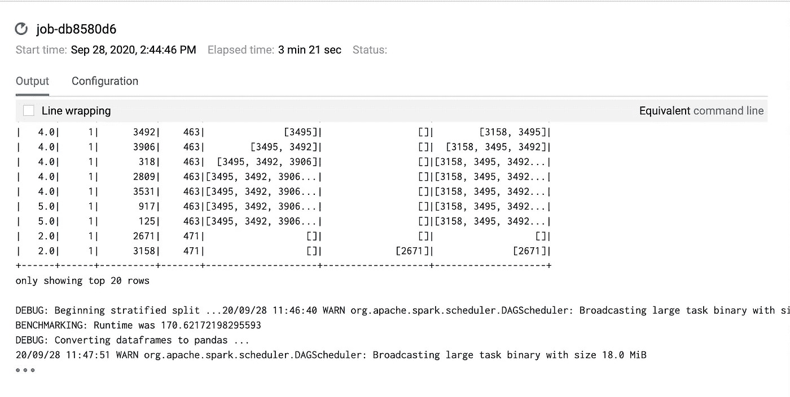*

***构建神经网络***

**

*照片由[桑迪·米勒](https://unsplash.com/@sandym10?utm_source=unsplash&utm_medium=referral&utm_content=creditCopyText)在 [Unsplash](https://unsplash.com/s/photos/wizard?utm_source=unsplash&utm_medium=referral&utm_content=creditCopyText) 上拍摄*

*这部分发生在[推荐人](https://github.com/michaelyma12/recommender)回购中。跟随 *example_cg-training.py* 或者*example _ CG-training-local . py*如果你要去当地。这是 python 过程的开始:*

```
**# load cloud storage, configure training and validation matrices* stdout.write('DEBUG: Reading data from google cloud storage ...\n')
cg_storage = ModelStorage(bucket_name='recommender-amazon-1', model_path='models/luxury-beauty/candidate-generation')
shared_embeddings = SharedEmbeddingSpec(name='product_id',
                                        univalent=['product_id'],
                                        multivalent=['touched_product_id', 'liked_product_id', 'disliked_product_id'])
cg_data = CandidateGenerationData(univalent_features=['user_id'], shared_features=[shared_embeddings])
cg_data.load_train_data(cg_storage)*
```

*我在这里创建了许多新的类，第一个是 **CandidateGenerationData。**将 ModelStorage 实例输入其 **load_train_data()** 方法将从云存储中读取相关的字典、特征编码器和训练数据帧。*

*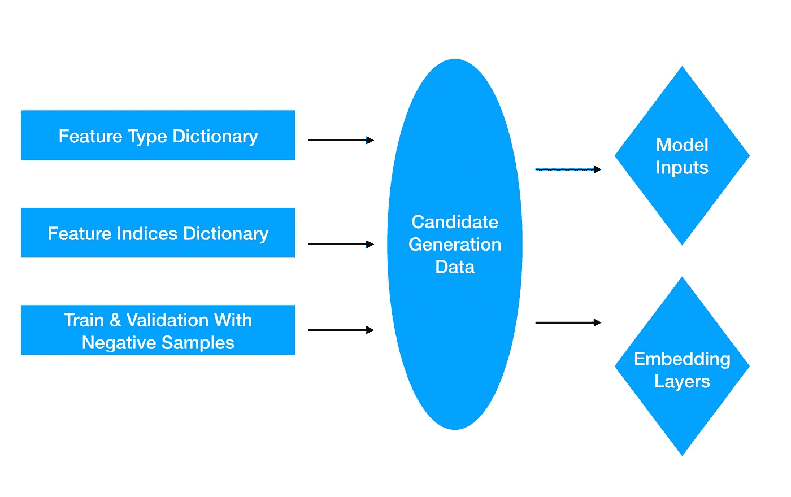*

*我再次强烈建议你克隆上面链接的 repos，并钻研定制类的源代码。*

*对 SharedEmbeddingSpec 类的讨论将留到我们使用它时再讨论。对于那些对 **load_train_data()** 方法感兴趣的人:*

```
**def* load_train_data(*self*, model_storage, gcs=*True*):
    *"""load data"""
    self*.feature_indices = model_storage.load_pickle('feature_indices.pkl', gcs=gcs)
    *self*.feature_types = model_storage.load_pickle('feature_types.pkl', gcs=gcs)
    *self*.holdout_types = model_storage.load_pickle('holdout_types.pkl', gcs=gcs)
    *self*.embedding_max_values = model_storage.load_pickle('embedding_max_values.pkl', gcs=gcs)
    *self*.embedding_dimensions = dict([(key, 20) *for* key, value *in self*.embedding_max_values.items()])

    stdout.write('DEBUG: Loading holdout frame and categorical encoders ... \n')
    *self*.user_encoder = model_storage.load_pickle('user_id_encoder.pkl', gcs=gcs)
    *self*.product_encoder = model_storage.load_pickle('product_id_encoder.pkl', gcs=gcs)
    *self*.holdout_frame = *self*.fit_feature_types(
        pd.read_csv(os.path.join(model_storage.bucket_uri, model_storage.model_path, 'holdout.csv')),
        *self*.holdout_types
    ) *if* gcs *else* pd.read_csv(os.path.join(model_storage.local_path, 'holdout.csv'))

    stdout.write('DEBUG: Loading train and validation dataframes ... \n')
    train_df = pd.read_csv(os.path.join(model_storage.bucket_uri, model_storage.model_path, 'train.csv')) *if* gcs *else* \
        pd.read_csv(os.path.join(model_storage.local_path, 'train.csv'))
    train_matrix = *self*.fit_feature_types(train_df, *self*.feature_types).values

    val_df = pd.read_csv(os.path.join(model_storage.bucket_uri, model_storage.model_path, 'validation.csv')) *if* gcs \
        *else* pd.read_csv(os.path.join(model_storage.local_path, 'validation.csv'))
    val_matrix = *self*.fit_feature_types(val_df, *self*.feature_types).values

    y_index = *self*.feature_indices[*self*.target_col]
    x_indices = [i *for* col, i *in self*.feature_indices.items() *if* col != *self*.target_col]
    *self*.x_train, *self*.y_train = train_matrix[:, x_indices], train_matrix[:, y_index].astype(np.float32)
    *self*.x_val, *self*.y_val = val_matrix[:, x_indices], val_matrix[:, y_index].astype(np.float32)*
```

*回到类的初始化，您会注意到两个值得讨论的构造参数:*

1.  **单价 _ 特性**
2.  **共享 _ 特性**

*这为对象提供了如何构造神经网络嵌入层的指导。Keras 模型中每个嵌入层的实现有两个组件:*

1.  *一个 *keras.layers.Input()* 对象，用来读入嵌入的 id*
2.  *一个*keras . layers . embedding()*对象，将这些 id 转换成潜在向量*

*我们将为每个嵌入特性构建这两层的过程封装在一个 **EmbeddingPair** 类中，该类读取特性的化合价(单价、多价、共享)并构建适当的层。您可以在下面看到 CandidateGenerationData 如何为每个嵌入特性构造嵌入对实例:*

```
**def* build_embedding_layers(*self*):
    *"""build embedding layers for keras model"""
    self*.embedding_pairs = [EmbeddingPair(embedding_name=feature,
                                          embedding_dimension=*self*.embedding_dimensions[feature],
                                          embedding_max_val=*self*.embedding_max_values[feature])
                            *for* feature *in self*.univalent_features] + \
                           [EmbeddingPair(embedding_name=feature,
                                          embedding_dimension=*self*.embedding_dimensions[feature],
                                          embedding_max_val=*self*.embedding_max_values[feature],
                                          valence='multivalent')
                            *for* feature *in self*.multivalent_features] + \
                           [EmbeddingPair(embedding_name=feature.name,
                                          embedding_dimension=*self*.embedding_dimensions[feature.name],
                                          embedding_max_val=*self*.embedding_max_values[feature.name],
                                          valence='shared', shared_embedding_spec=feature)
                            *for* feature *in self*.shared_features]*
```

*注意对象是如何从 *embedding_max_val* 字典中读取的，这是从我们的 PySpark 进程中保存的最大嵌入值的字典。*

*这里还可能感兴趣的是不同类型的层的构造。*

```
**def* build_univalent_layer(*self*):
    *"""build univalent embedding"""* cat_id = keras.layers.Input(shape=(1,), name="input_" + *self*.embedding_name, dtype='int32')
    embeddings = keras.layers.Embedding(input_dim=*self*.embedding_max_val + 1,
                                        output_dim=int(*self*.embedding_dimension),
                                        name=*self*.embedding_name)(cat_id)
    embedding_vector = keras.layers.Flatten(name='flatten_' + *self*.embedding_name)(embeddings)
    *self*.input_layers.append(cat_id)
    *self*.embedding_layers.append(embedding_vector)*
```

*上面的代码为单叶特征构造了对象对—注意输入层中的 *shape=(1，)*。这就足够了，因为单叶特征只包含一个嵌入 ID。构建多价嵌入层的代码(项目 id 列表)如下所示:*

```
**def* build_multivalent_layer(*self*):
    *"""build multivalent embedding"""* cat_list = keras.layers.Input(shape=(*None*,), name='input_' + *self*.embedding_name, dtype='int32')
    embeddings = keras.layers.Embedding(input_dim=*self*.embedding_max_val + 2,
                                        output_dim=int(*self*.embedding_dimension),
                                        name=*self*.embedding_name + "_embedding", mask_zero=*True*)
    embeddings_avg = keras.layers.Lambda(*lambda* x: K.mean(x, axis=1), name=*self*.embedding_name + "_embeddings_avg")
    multivalent_vec = embeddings(cat_list)
    multivalent_avg = embeddings_avg(multivalent_vec)
    *self*.input_layers.append(cat_list)
    *self*.embedding_layers.append(multivalent_avg)*
```

*注意输入层中的 *shape=(None，)*，它提供了接受可变长度的嵌入 id 列表的能力。*

*另一个值得注意的参数是 *mask_zero=True。*我们这样配置是因为 Keras 要求输入具有相同的形状。这意味着像“touched_product_id”这样的特征的每个样本必须具有相同的形状，而不管实际触摸了多少产品。因此，只有一个以前接触过的产品的用户会有一个类似[product_id，0，0，0，0，0]的向量。 *mask_zero=True* 只是告诉模型忽略所有的 0。*

*最后，值得花点时间讨论一下 *shared_features* 参数，它表示单叶和多叶特性之间共享的嵌入。在我们的例子中，我们希望“产品标识”和“接触产品标识”都是单独的特征。“product_id”作为我们的查询变量，告诉推荐者评估如果特定产品呈现给用户，参与的可能性。“touched_product_id”用于教导推荐者特定的使用历史如何影响可能性。*

*然而，在这两种情况下，我们希望单个产品的潜在向量表示是相同的。*

```
*@dataclass
*class* SharedEmbeddingSpec:
    *"""class to store shared embedding specifications"""* name: str
    univalent: List[str]
    multivalent: List[str]*
```

*我们用 **SharedEmbeddingSpec** 类来管理上述关系。注意它是如何将单价和多价特征保存为列表的——因为您可能希望拥有共享相同嵌入的单价特征列表。*

*例如，共享单叶嵌入将“产品标识”作为一个特征，然后“收藏夹产品标识”作为另一个特征，您可能希望两者都从相同的潜在向量表示体中调用。*

***EmbeddingPair** 实例将采用规范并构建共享嵌入层，如下所示。*

```
**def* build_shared_layer(*self*, shared_embedding_spec):
    *"""build shared embedding inputs"""* embeddings = keras.layers.Embedding(input_dim=*self*.embedding_max_val + 2,
                                        output_dim=int(*self*.embedding_dimension),
                                        name=*self*.embedding_name + "_embedding", mask_zero=*True*)
    embeddings_avg = keras.layers.Lambda(*lambda* x: K.mean(x, axis=1), name=*self*.embedding_name + "_embeddings_avg")

    *for* feature *in* shared_embedding_spec.univalent:
        shared_cat_id = keras.layers.Input(shape=(1,), name="input_" + feature, dtype='int32')
        shared_univalent_vec = embeddings(shared_cat_id)
        shared_univalent_avg = embeddings_avg(shared_univalent_vec)
        *self*.input_layers.append(shared_cat_id)
        *self*.embedding_layers.append(shared_univalent_avg)

    *for* feature *in* shared_embedding_spec.multivalent:
        shared_cat_list = keras.layers.Input(shape=(*None*,), name='input_' + feature, dtype='int32')
        shared_multivalent_vec = embeddings(shared_cat_list)
        shared_multivalent_avg = embeddings_avg(shared_multivalent_vec)
        *self*.input_layers.append(shared_cat_list)
        *self*.embedding_layers.append(shared_multivalent_avg)*
```

*请注意单价和多价要素的输入图层是如何传递到同一个嵌入图层的。*

*在构建了嵌入层之后，我们开始构建传递给 Keras 的 numpy 对象列表。回想一下，每个 *keras.layers.Input()* 实例从自己的 numpy 向量中读取数据。这意味着不像某些 ML 模型那样将所有的特征聚集到一个 numpy 对象中，我们必须为每个嵌入特征创建一个单独的向量。*

```
**def* build_model_inputs(*self*, x):
    *"""return model inputs"""* inputs = []
    numeric_indices = [*self*.feature_indices[feature] *for* feature *in self*.numeric_features]
    *if* numeric_indices: inputs.append(x[:, numeric_indices].astype(np.float32))

    *for* feature *in self*.univalent_features:
        inputs.append(x[:, *self*.feature_indices[feature]].astype(np.float32))

    *for* feature *in self*.multivalent_features:
        inputs.append(pad_sequences_batched(x, *self*.feature_indices[feature]).astype(np.float32))

    *for* feature *in self*.shared_features:
        *for* uni_feature *in* feature.univalent:
            inputs.append(x[:, *self*.feature_indices[uni_feature]].astype(np.float32))
        *for* multi_feature *in* feature.multivalent:
            inputs.append(pad_sequences_batched(x, *self*.feature_indices[multi_feature]).astype(np.float32))
    *return* inputs*
```

*注意所有的多价特征是如何用 0 填充的。这就是为什么我们在前面的 Spark 工作中给编码加了一个 1。还要注意，部署了非常简单的功能排序:*

1.  *单价的*
2.  *多价的*
3.  *共享的*

*很明显，可以找到一种更复杂的方式来处理这个问题，但是为了简单起见，我让它保持原样。让 CandidateGenerationData 实例执行上述所有操作的代码如下:*

```
**# begin model construction* stdout.write('DEBUG: Building model inputs ... \n')
class_weights = {0: 1, 1: 3}
cg_data.build_embedding_layers()
cg_inputs_train = cg_data.build_model_inputs(cg_data.x_train)
stdout.write('DEBUG: Listing available CPUs/GPUs ... \n')
stdout.write(str(device_lib.list_local_devices()))*
```

*现在我们准备用 Keras 构建实际的神经网络。如您所见，这很简单:*

```
**def* nn_candidate_generation_binary(embedding_pairs):
    *"""Return a NN with both regular augmentation and concatenated embeddings"""* input_layers, embedding_layers = [elem *for* pair *in* embedding_pairs *for* elem *in* pair.input_layers],\
                                     [elem *for* pair *in* embedding_pairs *for* elem *in* pair.embedding_layers]
    concat = keras.layers.Concatenate()(embedding_layers)
    layer_1 = keras.layers.Dense(64, activation='relu', name='layer1')(concat)
    output = keras.layers.Dense(1, activation='sigmoid', name='out')(layer_1)
    model = keras.models.Model(input_layers, outputs=output)
    model.compile(optimizer='adam', loss='binary_crossentropy', metrics=['accuracy'])
    *return* model*
```

*微调神经网络架构的练习超出了本文的范围。显然，您可以尝试添加脱落层、正则化等——我只是为您稍后将构建的赛车展示一个底盘。*

*从上面可以看出，您需要注意的一点是，该函数如何获取存储在 CandidateGenerationData 实例中的嵌入对，并提取所有的输入和嵌入层。它将输入层定位为以我们上面描述的单叶——多叶——共享的向量顺序读取，将 id 输入到适当的嵌入层，然后连接它们。剩下的逻辑就是你标准的向前传球。*

*构建、拟合和保存模型的代码如下所示:*

```
*stdout.write('DEBUG: Fitting model ... \n')
*from* tensorflow.keras.models *import* load_model
tensorboard_callback = TensorBoard(log_dir=os.path.join(cg_storage.local_path, 'logs'), histogram_freq=1,
                                   write_images=*True*)
keras_callbacks = [tensorboard_callback]
cg_model = nn_candidate_generation_binary(cg_data.embedding_pairs)
start = time.time()
cg_model.fit(cg_inputs_train, cg_data.y_train, class_weight=class_weights, epochs=3,
             callbacks=keras_callbacks, batch_size=256)
duration = time.time() - start
stdout.write('BENCHMARKING: Total training time was ' + str(duration) + '\n')
cg_storage.save_model_gcs(cg_model)
cg_storage.save_directory_gcs('logs')*
```

***推荐者评价***

**

*照片由 [JC Gellidon](https://unsplash.com/@jcgellidon?utm_source=unsplash&utm_medium=referral&utm_content=creditCopyText) 在 [Unsplash](https://unsplash.com/s/photos/nba?utm_source=unsplash&utm_medium=referral&utm_content=creditCopyText) 上拍摄*

*现在，我们使用我们的验证集来评估一些分类指标，然后使用我们的维持集来评估推荐的有效性。重要的是要注意评估神经网络作为分类器和推荐器的性能之间的区别。*

*在第一种情况下，我们只是评估模型的能力，以确定用户是否会参与任何单个项目。像准确度和 F1 这样的简单指标就足够了。*

```
**# evaluate classification metrics for validation set* cg_inputs_val = cg_data.build_model_inputs(cg_data.x_val)
predictions = cg_model.predict(cg_inputs_val)
predictions_class = np.where(predictions > 0.5, 1, 0)
print('EVALUATION: Building classification report ... \n')
stdout.write(classification_report(cg_data.y_val, predictions_class))*
```

*上面的代码只是从 sklearn 运行了一个*classification _ report()*。分类是在包含阴性样本的验证集上执行的，因此它实际上是衡量模型区分有机阳性样本和阴性样本输出的能力。*

*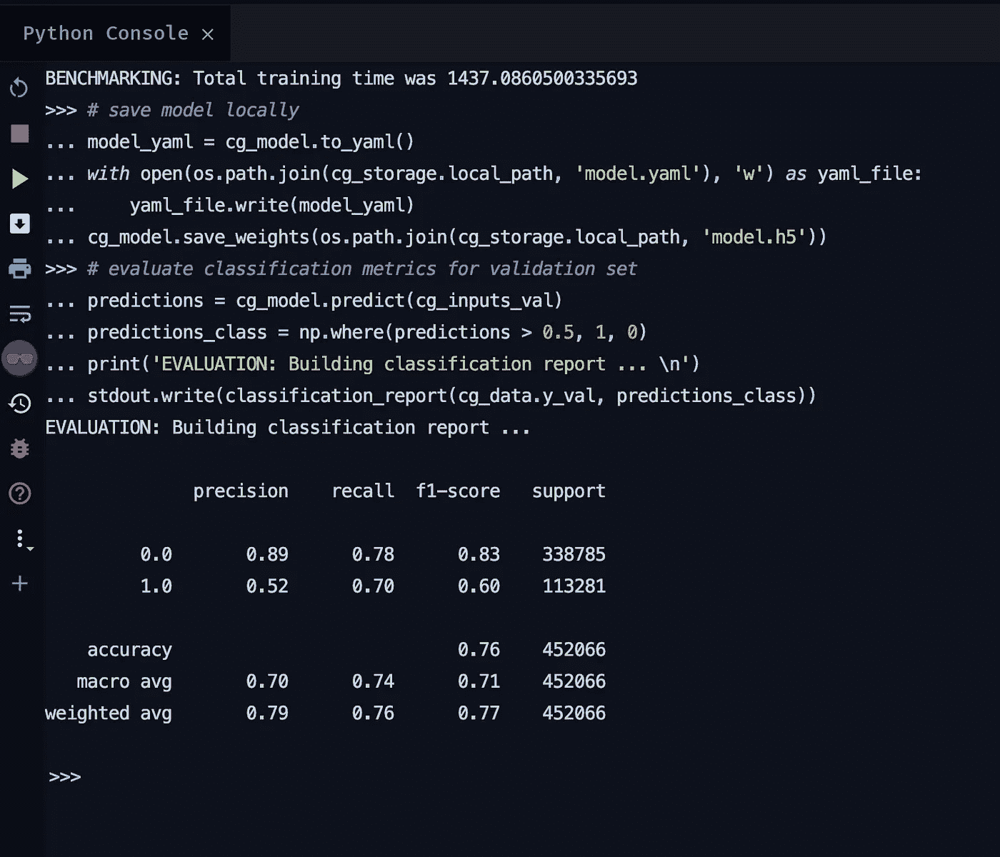*

*以上几点。我们的合成阴性样本的高精度告诉我们，该模型已经获得了一些我们的用户*不会*参与的线索。*

*在阳性类别上有精确的空间，但是考虑到我们对于每个阳性有 3 个阴性样本，该模型已经成功地学习了随机猜测的重要信号。*

*我们现在利用之前在调用 *fit()* 方法时包含的 Tensorboard 回调。假设您已经激活了适当的环境，您可以从命令行访问 UI:*

```
*tensorboard --logdir=./models/luxury-beauty/candidate-generation/logs*
```

*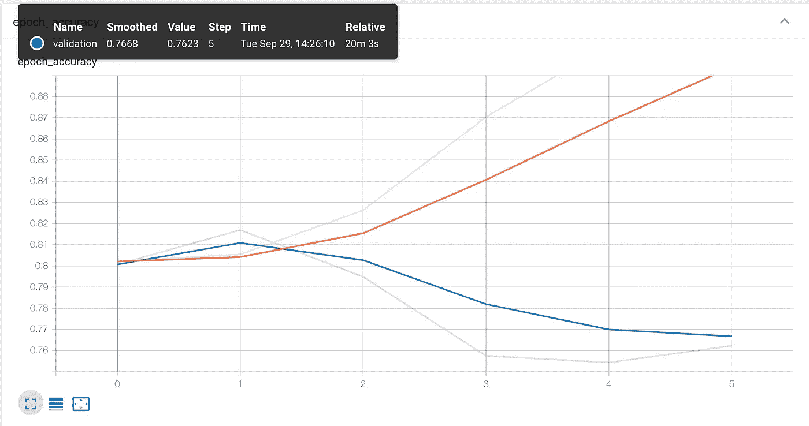*

*验证准确度在第一个和第二个历元之间下降*

*很明显，在第一个纪元之后，验证准确性下降，不需要更多的训练。*

*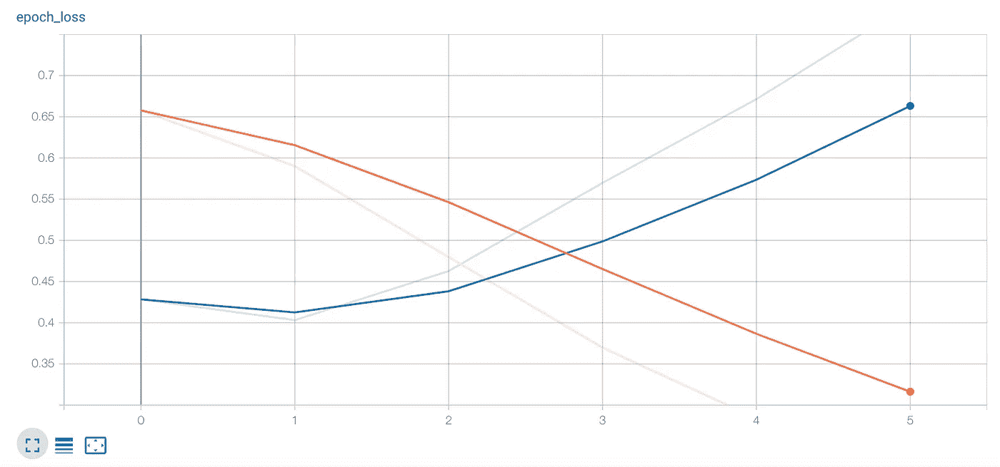*

*验证损失的相应增加*

*现在让我们看看嵌入矩阵中的权重是如何在每个时期进行训练的。*

*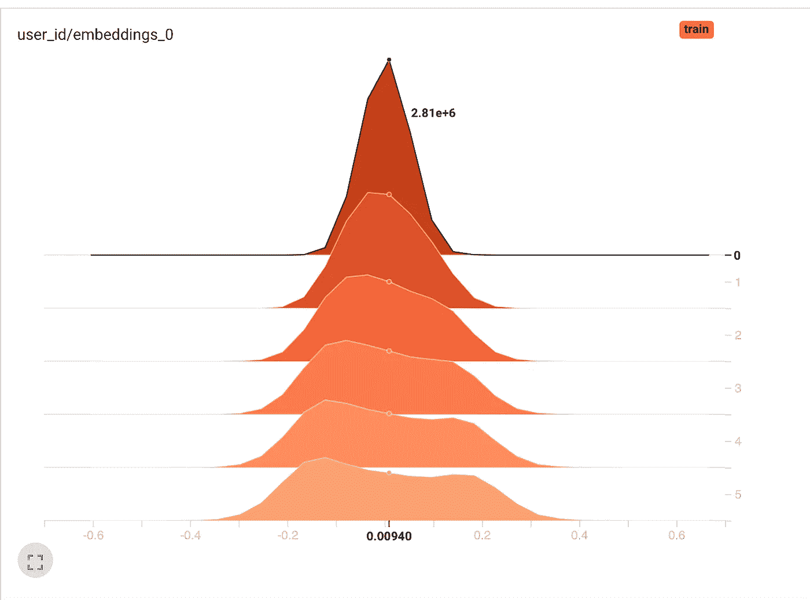*

*用户嵌入权重*

*以上是一个很好的迹象——虽然嵌入矩阵以正态分布的值开始，但模型通过梯度下降学习了更有效的表示。权重分布的变化证实了嵌入提供了预测信号。*

*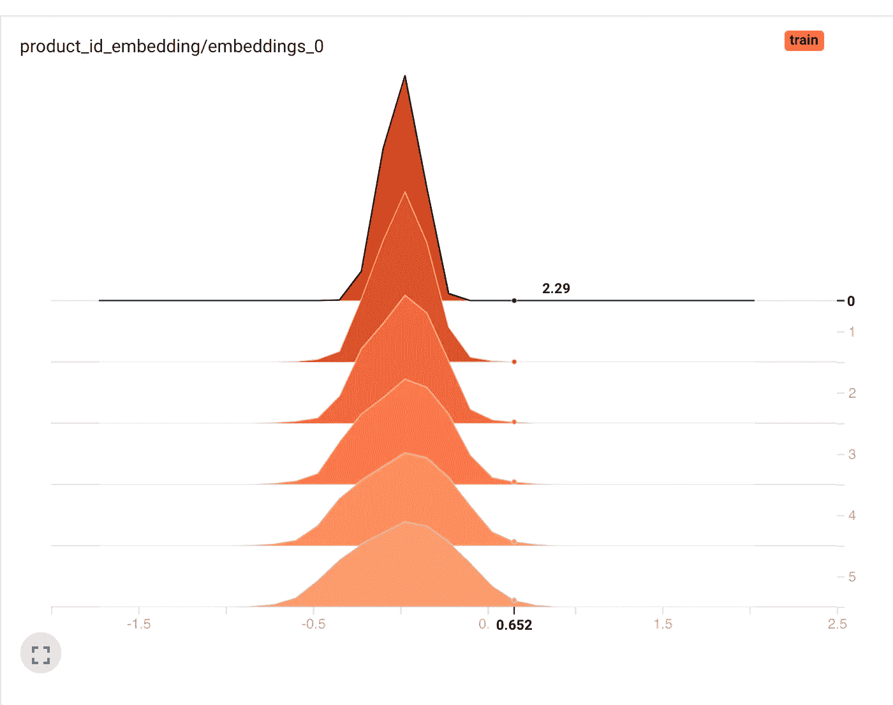*

*产品嵌入重量*

*除了分类指标，我们还评估了该模型从整个语料库中产生与用户相关的项目列表的能力。为此，我们将使用一个稍微复杂一点的指标，叫做平均精度。*

```
**# eval recommender* candidate_generator = CandidateGenerator(cg_data=cg_data, cg_model=cg_model)
k = int(len(cg_data.product_encoder.values()) / 50)
mean_avg_p, avg_p_frame = candidate_generator.map_at_k(k = k)*
```

*对 MAP@K 的完整解释超出了本练习的范围，但是您可以在这里找到索尼娅·索特尔[的精彩解释。简而言之，average precision @ K 衡量每个用户的前 K 个推荐(按模型输出概率降序排列)的质量。MAP @ K 就是这些每用户分数的平均值。](http://sdsawtelle.github.io/blog/output/mean-average-precision-MAP-for-recommender-systems.html)*

*我们的模型获得了 *4.4%* 的分数。请记住，我们只训练了大约 50 万行样本数据，而 YouTube 利用了大约数十亿行样本数据。此外，他们的模型将最近 50 次视频观看作为一个特征，而我们有限的数据使得采取任何超过最近 10 次的产品都是不可行的。*

*毫不夸张地说，如果我们使用更多的数据，我们可以实现他们基线模型的 6%地图(他们只嵌入了观看历史)。同样值得注意的是，当他们添加其他嵌入时，如搜索历史和人口统计嵌入(年龄、地理等)，MAP 上升到 11%。如果你有数据，肯定还有改进的空间。*

***用英伟达特斯拉 T4 GPU 训练***

*现在我们部署一个 GPU 来加速训练。对于这个练习来说，这一步完全是可选的——在给定我们的样本集大小的情况下，您可以在合理的时间框架内训练神经网络而无需 GPU。*

*还要记住，GPU 带来的好处会随着模型的复杂性而增加。我们在这里使用一个非常简单的神经网络结构，没有时间分布层或卷积层，只有一个密集层跟随级联嵌入。随着模型复杂度的增加，您将看到更大的速度增益。*

*你需要启动 GPU 的第一件事是谷歌的许可。所有新帐户的全局 GPU 配额都是 0，这意味着你必须到你的配额页面请求增加。*

*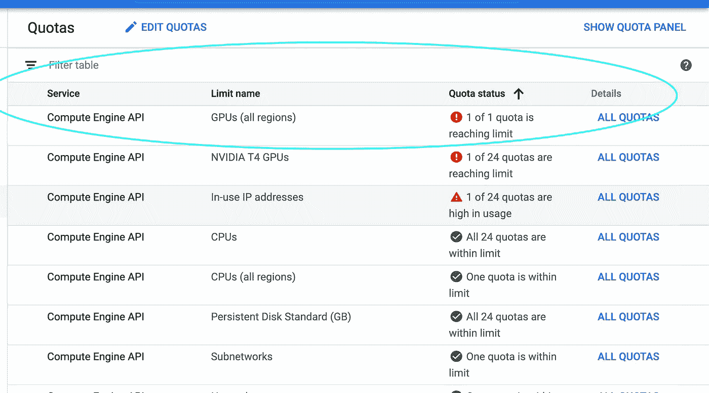*

*一旦你的请求被批准，启动一个 [**深度学习虚拟机**](https://cloud.google.com/deep-learning-vm) 实例——这只是一个带有深度学习定制机器映像的**计算引擎**实例。选择将最小化您的网络延迟的区域，选择包括单个 Nvidia Tesla T4，并启动。*

*现在，回想一下 Python 进程对云存储的读写。虽然 VM 实例在默认情况下有权限从您的存储桶中读取数据，但是它需要额外的权限才能将您的模型文件写到那里。*

*要对此进行配置，请从您的云控制台停止您的实例。然后点击它的名字，并点击顶部菜单栏中的编辑。在*访问范围*标题下，查找*存储*，将权限从*读*改为*读写*。然后重新启动实例。*

*一旦完成，ssh 进入您的实例。假设您已经在本地机器上配置了 *gustil* ，您可以使用控制台提供的命令来完成。*

```
*gcloud compute ssh --project YOUR-PROJECT --zone YOUR-REGION \
  YOUR-INSTANCE-NAME*
```

*显然，您也想将您的源代码 scp 到 VM 上。深度学习虚拟机映像应该已经包含了运行该作业所需的所有包——所以只需用 *python* 命令运行它。*

```
*gcloud compute scp --project YOUR-PROJECT-NAME --zone YOUR-REGION --recurse recommender.zip tensorflow-2-vm:~/*
```

*图像的默认 python 解释器已经带有 TensorFlow 2.0 和必要的 Google cloud 库——您需要添加的唯一包是 *ml_metrics* 。一旦你用 pip 安装了它，你应该可以只用 *python* 命令*运行任何一个示例脚本。**

*TensorFlow 默认情况下会检测和利用 GPU，您可以在下面看到它对特斯拉 T4 的检测。*

*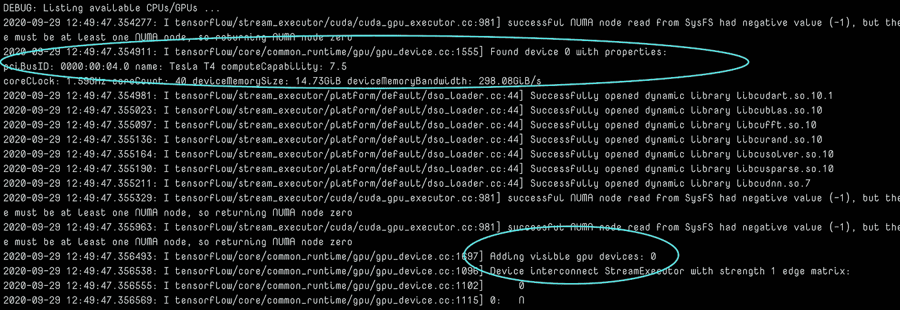*

*找到 GPU。*

*一个有趣的重复现象是，有些人读到“添加可见的 gpu 设备:0”这一行，担心没有找到 GPU。事实并非如此 GPU 的名字简单来说就是 0。*

**

*丹尼斯·阿加蒂在 [Unsplash](https://unsplash.com/?utm_source=unsplash&utm_medium=referral&utm_content=creditCopyText) 拍摄的照片*

*如果您想检查 GPU 的内存使用情况，只需从 shell 中运行 *nvidia-smi* 命令。*

*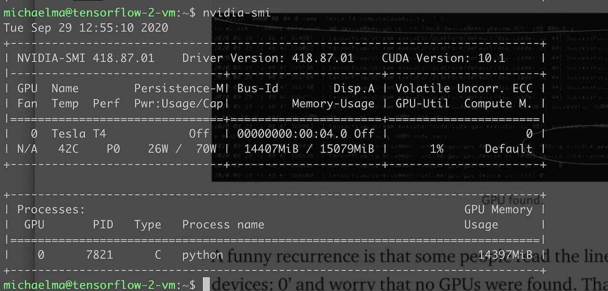*

*再说一遍，那是 GPU 0 在运行——不是 0 个 GPU 在运行:)*

***结论***

*我希望已经为你自己提供了一个合理的外骨骼，更好的推荐者。*

*请在下面留下问题或给我发电子邮件至 michaelyma12@gmail.com。一个类似的详细介绍排名网络的帖子正在进行中。快乐推荐。*