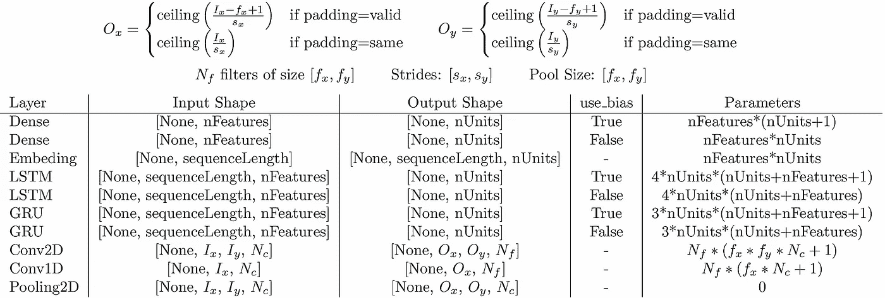

# 在 Keras 中协调数据形状和参数计数

> 原文：<https://medium.com/analytics-vidhya/reconciling-data-shapes-and-parameter-counts-in-keras-f5057a35594?source=collection_archive---------2----------------------->

*卷积层及其表亲在 Keras/Tensorflow 中检查汇集层的形状修改和参数计数，作为层参数的函数…*


Keras 是深度学习的代名词。使用 Keras 构建连接图层的多输入多输出网络是一项常规任务。数据/张量(多维数字矩阵)从一层到另一层，从入口到出口，随着网络一路上积累了数百万个参数，扭曲并改变了它们的方式。数据形状在挤过一个层时如何变形，该层向网络模型添加了多少参数，这些当然是所讨论的层的函数，以及该层在 Keras 中是如何被实例化的。在之前的文章[中深度学习中的流动张量和堆积参数](http://xplordat.com/2019/06/06/flowing-tensors-and-heaping-parameters-in-deep-learning/):

*   我们详细研究了密集层、嵌入层和递归层(LSTM/GRU ),以了解数据在通过这些层时形状如何以及为什么会发生变化。
*   使用描述层内数据修改的方程，我们导出了用于所述修改的这些层的每一层中使用的可训练参数的数量的公式。

我们在这里继续练习图像分类中大量使用的卷积层和池层。我们通过运行[视觉问题回答模型](https://keras.io/getting-started/functional-api-guide/#visual-question-answering-model)来结束系列，并确认我们的公式/分析对于可训练参数和输出形状是正确的。片段的完整代码可以从 [github](https://github.com/ashokc/Reconciling-Data-Shapes-and-Parameter-Counts-in-Keras) 获得。

# 1.卷积层

卷积层基本上是特征提取器。它们主要用于图像，但也可以应用于文本，用于模式/特征识别及其分类。当处理文本时，我们首先使用嵌入层或使用外部提供的向量将单词转换为数字向量。

## 1.1 输入形状

卷积层的输入可以是成批的图像或句子。Keras 默认输入数据为“通道 _ 最后”,意味着通道/特征的数量 *N_c* 将是最后一个维度，通常第一个维度是 batch_size，此处为“无”。在这两者之间是图像的尺寸(或者在文本的情况下是序列长度)。

> *【批量大小，{图像/文本尺寸}，通道/特征数量】*


图一。一个句子可以被看作是一个一维图像，像素的数量与单词的数量相同，每个像素/单词的通道数量与单词向量的长度相同

## 1.2 输出形状

卷积运算在几篇文章中用漂亮的图片等很好地解释了。我们感兴趣的是形状变换和参数计数。下面的图 2 和表 1 总结了下面关于形状转换的讨论。


图二。具有 N_f 过滤器的卷积层将[I_x，I_y，N_c]图像转换为[O_x，O_y，N_f]图像。O_x、O_y 和可训练参数的数量由所示公式给出。

1.  卷积层的输出由滤波器产生。例如在二维中，每个滤波器具有类似[ *f_x，f_y* 的大小。每个滤波器自动地 *N_c* 深，其中 *N_c* 是输入中的通道数。即它的实际形状是[ *f_x，f_y，N_c* ]
2.  每个滤波器为输出生成一个新通道。也就是说，将图像与具有 64 个滤波器的*然而多个通道*进行卷积产生了具有 64 个通道的输出图像。
3.  上面 2 中输出图像的尺寸[ *O_x* ， *O_y* ]取决于 Keras 中的两个设置。

*   *步距* ***s_x*** ， ***s_y*** :滤波器如何沿数字/像素的输入矩阵移动，以进行逐元素的乘积和求和运算。s= 1 表示过滤器一次移动一个像素/单元
*   *填充*:当滤波器尺寸( *f_x* 和 *f_y* )及其跨越图像的步距( *s_x* 和*s _ y*)(*I _ x*和 *I_y* )不完全正确时，部分输入数据可能无法被卷积层处理。这是在 Keras 中默认发生的情况(填充= **有效**)。当填充设置为 **same** 时，输入图像/矩阵被*填充*类似于 0 的假数据，这样所有的真实数据都会被过滤器处理。下表 1 总结了 Keras 与 Tensorflow 卷积后输出图像的形状和大小。


表 1。在 Keras(版本 2.2.4)中与 Tensorflow 后端(版本 1.13.1)卷积后输出图像形状

## 1.3 参数计数

除了增加输出图像中的通道数量之外，每个滤镜还会给表格带来一系列参数。我们已经看到，滤波器在二维中具有[ *f_x，f_y，N_c* ]的形状(或者在一维图像/文本中具有[ *f_x，N_c* )，其中 *N_c* 是输入中的通道数。过滤器参数的关键属性如下。

1.  即使滤波器在输入图像/矩阵中大步前进和滑动，它也使用相同的参数。
2.  有一个权重与每个滤波器单元和通道相关联。换句话说，一个过滤器有 *f_x * f_y * N_c* 个权重。
3.  整个滤波器只有一个偏置参数。

因此，如果卷积层采用大小为[*f _ x，f _ y*]的 *N_f* 滤波器，对具有 *N_c* 通道的输入图像进行卷积，则以下等式给出了添加到模型中的参数数量。


等式 1。卷积层增加参数个数的公式

## 1.4 示例

考虑下面的代码片段，其中 100×95 大小的“rgb”图像被连续通过两个卷积层。

将表 1 和等式 1 中的公式投入使用，我们应该会得到以下输出形状和参数计数。


下面运行 Keras 的输出与我们的预测相符。

```
Layer (type) Output Shape Param # 
=================================================================
Conv_Layer_1 (Conv2D) (None, 49, 94, 55) 1045 
_________________________________________________________________
Conv_Layer_2 (Conv2D) (None, 17, 47, 35) 19285 
=================================================================
Total params: 20,330
Trainable params: 20,330
Non-trainable params: 0
```


图 3。Keras 中的输出形状和参数计数与预测相匹配

# 2.汇集层

池层与卷积层密切相关。它们的目的是减少上游卷积层输出的图像的尺寸。他们通过从每个汇集区中挑选一个(例如平均值或最大值)来实现。池区域是一片区域(很像卷积层中的过滤器),根据步幅和填充的设置在输入图像中移动。以下是关于池化图层的要点。

*   **输入/输出形状**:计算输出图像尺寸(O_x，O_y)的规则/公式**与卷积层的规则/公式**相同。参数 *pooling_size* 充当在定义卷积层的过滤器中使用的 kernel_size 的角色。另外，除非另有说明，否则*步距*与*池大小*相同。所以我们简单参考表 1。
*   **可训练参数:**没有参数。

池层所做的就是为数据/形状转换应用固定的规则。这是与 1.4 节相同的例子，但是使用了池层。

运行它，我们得到的输出图像形状( *O_x* 和 *O_y* )与我们之前看到的卷积层完全相同。在所有 *N_c* 通道中独立发生池化，因此保留了通道的数量。

```
Layer (type) Output Shape Param # 
=================================================================
Valid_Pool_Layer_1 (MaxPooli (None, 49, 94, 3) 0 
_________________________________________________________________
Same_Pool_Layer_2 (MaxPoolin (None, 17, 47, 3) 0 
=================================================================
Total params: 0
Trainable params: 0
Non-trainable params: 0
```


图 4:池层根据表 1 中的公式修改图像大小。保留图像中的通道数。他们没有给模型添加任何参数

# 3.可视化问答模型

我们用我们的公式解决 Keras 指南中的[例题](https://keras.io/getting-started/functional-api-guide/#visual-question-answering-model)来结束这篇文章。在其他层中，该示例使用了我们在本系列中研究过的密集层、嵌入层、LSTM 层、Conv2D 层和池层。以下是他们描述中的引文:

> *当被问到关于一张图片的自然语言问题时，这个模型可以选择正确的一个单词的答案。*
> 
> *它的工作原理是将问题编码成一个向量，将图像编码成一个向量，将两者连接起来，并在潜在答案的一些词汇上进行逻辑回归训练。*
> 
> *Keras 指南*

这里是我们公式的总结，包括上一篇文章中的公式。我们将在核实时参考它。



图 5。各层形状和参数计算公式的总结。

需要注意 Keras 中各层的默认设置。

*   卷积层:步幅=(1，1)，填充= '有效'
*   池层:跨度=池大小，填充= '有效'
*   密集的 LSTM 图层:use_bias = True

根据我们的公式，代码片段、*预期的*形状/参数计数和*实际的* Keras 输出，并按顺序显示在下面的每一层中。

```
_____________________________________________________________
Layer (type) Output Shape Param # 
=================================================================
vision_model.add(Conv2D(64, (3, 3), activation=’relu’, padding=’same’, input_shape=(224, 224, 3))) # **Code snippet**O_x = O_y = ceil(224/1) = 224 # As per formulae in Figure 5
Num. Params: 64 * (3 * 3 * 3 + 1) = 64*28 = 1792 # **As per formulae in Figure 5**conv2d_1 (Conv2D) (None, 224, 224, 64) 1792 # **Actual by Keras/Tensorflow**
_________________________________________________________________
vision_model.add(Conv2D(64, (3, 3), activation=’relu’))O_x = O_y = ceil((224–3 + 1)/1) = 222
Num. Params: 64 * (3*3*64 +1) = 64 * 577 = 36928conv2d_2 (Conv2D) (None, 222, 222, 64) 36928 
_________________________________________________________________
vision_model.add(MaxPooling2D((2, 2)))O_x = O_y = ceil((222–2 + 1)/2) = 111
Num. Params: 0max_pooling2d_1 (MaxPooling2 (None, 111, 111, 64) 0
_________________________________________________________________
vision_model.add(Conv2D(128, (3, 3), activation=’relu’, padding=’same’))O_x = O_y = ceil(111/1) = 111
Num. Params: 128 * (3 * 3 * 64 + 1) = 73856conv2d_3 (Conv2D) (None, 111, 111, 128) 73856
_________________________________________________________________
vision_model.add(Conv2D(128, (3, 3), activation=’relu’))O_x = O_y = ceil((111–3 + 1)/1) = 109
Num. Params: 128 * (3 * 3 * 128 + 1) = 147584conv2d_4 (Conv2D) (None, 109, 109, 128) 147584
_________________________________________________________________
vision_model.add(MaxPooling2D((2, 2)))O_x = O_y = ceil((109–2 + 1)/2) = 54
Num. Params: 0max_pooling2d_2 (MaxPooling2 (None, 54, 54, 128) 0
_________________________________________________________________
vision_model.add(Conv2D(256, (3, 3), activation=’relu’, padding=’same’))O_x = O_y = ceil(54/1) = 54
Num. Params: 256 * (3 * 3 * 128 + 1) = 295168conv2d_5 (Conv2D) (None, 54, 54, 256) 295168
_________________________________________________________________
vision_model.add(Conv2D(256, (3, 3), activation=’relu’))O_x = O_y = ceil((54–3+1)/1) = 52
Num. Params: 256 * (3 * 3 * 256 + 1) = 590080conv2d_6 (Conv2D) (None, 52, 52, 256) 590080
_________________________________________________________________
vision_model.add(Conv2D(256, (3, 3), activation=’relu’))O_x = O_y = ceil((52–3+1)/1) = 50
Num. Params: 256 * (3 * 3 * 256 + 1) = 590080conv2d_7 (Conv2D) (None, 50, 50, 256) 590080
_________________________________________________________________
vision_model.add(MaxPooling2D((2, 2)))O_x = O_y = ceil((50–2 + 1)/2) = 25
Num. Params: 0max_pooling2d_3 (MaxPooling2 (None, 25, 25, 256) 0
_________________________________________________________________
vision_model.add(Flatten())All data as a single vector of size: 25*25*256 = 160000
Num. Params = 0flatten_1 (Flatten) (None, 160000) 0
=================================================================
Total params: 1,735,488
Trainable params: 1,735,488
Non-trainable params: 0
_________________________________________________________________
__________________________________________________________________________________________________encoded_image = vision_model(image_input)Layer (type) Output Shape Param # Connected to 
==================================================================================================
question_input = Input(shape=(100,), dtype=’int32')sequenceLength = 100
Num. Params = 0input_2 (InputLayer) (None, 100) 0
__________________________________________________________________________________________________
embedded_question = Embedding(input_dim=10000, output_dim=256, input_length=100)(question_input)nWords = 10000
Num. Params = size of weight matrix = nWords * output_dim = 10000 * 256 = 2560000embedding_1 (Embedding) (None, 100, 256) 2560000 input_2[0][0] 
__________________________________________________________________________________________________
input_1 (InputLayer) (None, 224, 224, 3) 0 
__________________________________________________________________________________________________
encoded_question = LSTM(256)(embedded_question)nFeatures=256, nUunits=256
Num. Params = 4*nUnits*(nUnits+nFeatures+1) = 4*256*513 = 525312lstm_1 (LSTM) (None, 256) 525312 embedding_1[0][0] 
__________________________________________________________________________________________________
(this is just the convolved image as a vector obtained above after ‘flatten_1’)
sequential_1 (Sequential) (None, 160000) 1735488 input_1[0][0]
__________________________________________________________________________________________________
merged = keras.layers.concatenate([encoded_question, encoded_image])Output size: 256 (from question/LSTM) + 160000 (from image/Conv2D) = 160256
Num. Params = 0concatenate_1 (Concatenate) (None, 160256) 0 lstm_1[0][0] 
 sequential_1[1][0] 
__________________________________________________________________________________________________
output = Dense(1000, activation=’softmax’)(merged)nFeatures = 160256, nUnits=1000, Output size: 1000
#Params = nUnits*(nFeatures+1) = 1000 * (160256 + 1) = 160257000dense_1 (Dense) (None, 1000) 160257000 concatenate_1[0][0] 
==================================================================================================
Total params: 165,077,800
Trainable params: 165,077,800
Non-trainable params: 0
```

我们满意地注意到，随着数据从输入移动到输出，我们对输出形状和可训练参数数量的预测与每一层的 Keras gets 完全匹配。

# 4.结论

在本系列中，我们深入一些流行的层，看看它们如何扭曲传入的数据形状，以及它们使用了多少参数。从根本上理解这些阴谋诡计，可以揭开其背后的神秘面纱，使我们能够为新的应用程序设计高效的模型。

*原载于 2019 年 6 月 18 日*[*http://xplordat.com*](http://xplordat.com/2019/06/18/reconciling-data-shapes-and-parameter-counts-in-keras/)*。*