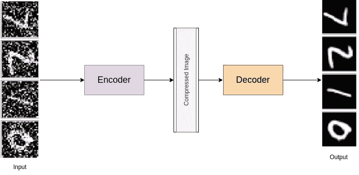
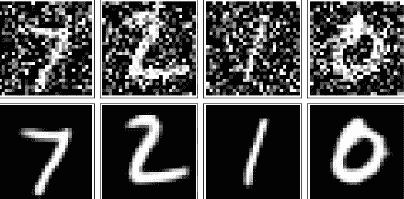
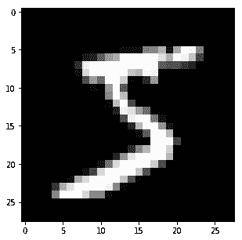
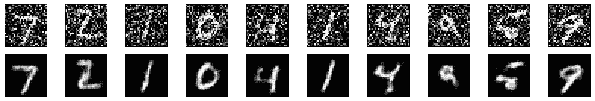

# 使用去噪自动编码器重建损坏的数据(Python 代码)

> 原文：<https://medium.com/analytics-vidhya/reconstruct-corrupted-data-using-denoising-autoencoder-python-code-aeaff4b0958e?source=collection_archive---------10----------------------->

## 这篇文章将在几分钟内帮助你揭开使用 autoencoder 去噪的神秘面纱！！



自动编码器在实践中并不太有用，但它们可以用来非常成功地对图像去噪，只需通过在有噪声的图像上训练网络即可。我们可以通过向训练图像添加高斯噪声，然后将值剪切到 0 和 1 之间来生成有噪声的图像。

> 去噪自动编码器迫使隐藏层提取更鲁棒的特征，并限制它仅学习身份。Autoencoder 从输入的损坏版本重建输入。

去噪自动编码器做两件事:

*   对输入进行编码(保留关于数据的信息)
*   撤消随机应用于自动编码器输入的损坏过程的影响。

为了描述自动编码器的去噪能力，我们将使用噪声图像作为输入，原始的干净图像作为目标。

*举例:*上面的图像是输入，下面的图像是目标。



# 问题陈述:

为去噪自动编码器建立模型。向网络中添加更深和更多的层。使用 MNIST 数据集，将噪声添加到数据中，并尝试定义和训练自动编码器来对图像进行降噪。

# 解决方案:

**导入库和加载数据集:**下面给出了导入库和加载 MNIST 数据集的标准程序。

```
import torch
import numpy as np
from torchvision import datasets
import torchvision.transforms as transforms# convert data to torch.FloatTensor
transform = transforms.ToTensor()
# load the training and test datasets
train_data = datasets.MNIST(root='data', train=True, download=True, transform=transform)
test_data = datasets.MNIST(root='data', train=False, download=True, transform=transform)
# Create training and test dataloaders
num_workers = 0
# how many samples per batch to load
batch_size = 20
# prepare data loaders
train_loader = torch.utils.data.DataLoader(train_data, batch_size=batch_size, num_workers=num_workers)
test_loader = torch.utils.data.DataLoader(test_data, batch_size=batch_size, num_workers=num_workers)
```

**可视化数据:**您可以使用标准的 matplotlib 库来查看您是否正确加载了数据集。

```
import matplotlib.pyplot as plt
%matplotlib inline

# obtain one batch of training images
dataiter = iter(train_loader)
images, labels = dataiter.next()
images = images.numpy()# get one image from the batch
img = np.squeeze(images[0])fig = plt.figure(figsize = (5,5)) 
ax = fig.add_subplot(111)
ax.imshow(img, cmap='gray')
```

输出应该是这样的:



**网络架构:**最关键的部分是网络生成。这是因为去噪是网络的一个难题；因此，我们需要使用*更深的*卷积层。对于编码器中的卷积层，建议从 32 的深度开始，同样的深度向后通过解码器。

```
import torch.nn as nn
import torch.nn.functional as F# define the NN architecture
class ConvDenoiser(nn.Module):
    def __init__(self):
        super(ConvDenoiser, self).__init__()
        ## encoder layers ##
        # conv layer (depth from 1 --> 32), 3x3 kernels
        self.conv1 = nn.Conv2d(1, 32, 3, padding=1)  
        # conv layer (depth from 32 --> 16), 3x3 kernels
        self.conv2 = nn.Conv2d(32, 16, 3, padding=1)
        # conv layer (depth from 16 --> 8), 3x3 kernels
        self.conv3 = nn.Conv2d(16, 8, 3, padding=1)
        # pooling layer to reduce x-y dims by two; kernel and stride of 2
        self.pool = nn.MaxPool2d(2, 2)

        ## decoder layers ##
        # transpose layer, a kernel of 2 and a stride of 2 will increase the spatial dims by 2
        self.t_conv1 = nn.ConvTranspose2d(8, 8, 3, stride=2)  # kernel_size=3 to get to a 7x7 image output
        # two more transpose layers with a kernel of 2
        self.t_conv2 = nn.ConvTranspose2d(8, 16, 2, stride=2)
        self.t_conv3 = nn.ConvTranspose2d(16, 32, 2, stride=2)
        # one, final, normal conv layer to decrease the depth
        self.conv_out = nn.Conv2d(32, 1, 3, padding=1)def forward(self, x):
        ## encode ##
        # add hidden layers with relu activation function
        # and maxpooling after
        x = F.relu(self.conv1(x))
        x = self.pool(x)
        # add second hidden layer
        x = F.relu(self.conv2(x))
        x = self.pool(x)
        # add third hidden layer
        x = F.relu(self.conv3(x))
        x = self.pool(x)  # compressed representation

        ## decode ##
        # add transpose conv layers, with relu activation function
        x = F.relu(self.t_conv1(x))
        x = F.relu(self.t_conv2(x))
        x = F.relu(self.t_conv3(x))
        # transpose again, output should have a sigmoid applied
        x = F.sigmoid(self.conv_out(x))

        return x# initialize the NN
model = ConvDenoiser()
print(model)
```

**训练:**网络的训练用 GPU 花费的时间明显更少；因此，我会推荐使用一个。虽然这里我们只关心训练图像，我们可以从`train_loader`中得到。

```
# specify loss function
criterion = nn.MSELoss()# specify loss function
optimizer = torch.optim.Adam(model.parameters(), lr=0.001)
# number of epochs to train the model
n_epochs = 20# for adding noise to images
noise_factor=0.5for epoch in range(1, n_epochs+1):
    # monitor training loss
    train_loss = 0.0

    ###################
    # train the model #
    ###################
    for data in train_loader:
        # _ stands in for labels, here
        # no need to flatten images
        images, _ = data

        ## add random noise to the input images
        noisy_imgs = images + noise_factor * torch.randn(*images.shape)
        # Clip the images to be between 0 and 1
        noisy_imgs = np.clip(noisy_imgs, 0., 1.)

        # clear the gradients of all optimized variables
        optimizer.zero_grad()
        ## forward pass: compute predicted outputs by passing *noisy* images to the model
        outputs = model(noisy_imgs)
        # calculate the loss
        # the "target" is still the original, not-noisy images
        loss = criterion(outputs, images)
        # backward pass: compute gradient of the loss with respect to model parameters
        loss.backward()
        # perform a single optimization step (parameter update)
        optimizer.step()
        # update running training loss
        train_loss += loss.item()*images.size(0)

    # print avg training statistics 
    train_loss = train_loss/len(train_loader)
    print('Epoch: {} \tTraining Loss: {:.6f}'.format(
        epoch, 
        train_loss
        ))
```

> *在这种情况下，我们实际上是* ***添加一些噪声*** *到这些图像中，我们会将这些* `*noisy_imgs*` *馈送到我们的模型中。该模型将基于噪声输入产生重建图像。但是，我们希望它产生*正常的*无噪声图像，因此，当我们计算损耗时，我们仍然会将重建输出与原始图像进行比较！*

因为我们要比较输入和输出图像中的像素值，所以最好使用回归任务的损失。回归就是比较数量，而不是概率值。所以，在这种情况下，我就用`MSELoss`。

**结果:**这里让我们给测试图像添加噪声，并让它们通过自动编码器。

```
# obtain one batch of test images
dataiter = iter(test_loader)
images, labels = dataiter.next()# add noise to the test images
noisy_imgs = images + noise_factor * torch.randn(*images.shape)
noisy_imgs = np.clip(noisy_imgs, 0., 1.)# get sample outputs
output = model(noisy_imgs)
# prep images for display
noisy_imgs = noisy_imgs.numpy()# output is resized into a batch of iages
output = output.view(batch_size, 1, 28, 28)
# use detach when it's an output that requires_grad
output = output.detach().numpy()# plot the first ten input images and then reconstructed images
fig, axes = plt.subplots(nrows=2, ncols=10, sharex=True, sharey=True, figsize=(25,4))# input images on top row, reconstructions on bottom
for noisy_imgs, row in zip([noisy_imgs, output], axes):
    for img, ax in zip(noisy_imgs, row):
        ax.imshow(np.squeeze(img), cmap='gray')
        ax.get_xaxis().set_visible(False)
        ax.get_yaxis().set_visible(False)
```

它在消除噪音方面做得非常出色，尽管有时很难分辨原始数字是多少。



**代码:**你可以在我的 Github 上找到这个代码:[去噪自动编码器](https://github.com/Garima13a/Denoising-Autoencoder)

**结论:**在本文中，我们学习了如何用 python 正确编写去噪自动编码器。我们还了解到，去噪对于网络来说是一个难题，因此使用更深的卷积层可以提供非常精确的结果。

参考:我从“Udacity 的安全和私人 AI 奖学金挑战纳米学位项目”中了解到这个主题