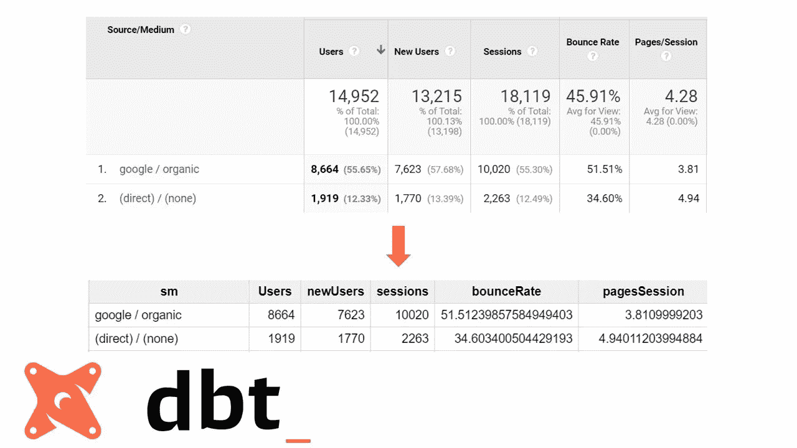

# 使用 dbt 在 BigQuery 中重新创建您的 Google 分析报告

> 原文：<https://medium.com/analytics-vidhya/recreate-your-google-analytics-reports-in-bigquery-using-dbt-part-ii-deep-dive-6f2a35a3706f?source=collection_archive---------3----------------------->

## 第二部分——深潜


在 [Unsplash](https://unsplash.com?utm_source=medium&utm_medium=referral) 上由 [Carlos Muza](https://unsplash.com/@kmuza?utm_source=medium&utm_medium=referral) 拍摄的照片

数据建模是一个巨大的话题。

为了用我有限的英语恰当地强调这一点，我可能应该写**巨大的**来代替。

如果你想知道它有多大，你可以看看 Olivier Dupuis 的这个 [**帖子中的有向无环图。或者在#measure Slack 信道中发布的一些 Dag。转换大量原始的、不清楚的、杂乱的数据是一项乏味的工作，通常需要多个相互关联的步骤。但是每个能够访问 SQL 数据库的分析师通常每天都会在较小的范围内这样做。使用一个 SQL 查询创建一个视图，另一个查询从这个视图创建一个表，另一个查询将它与一些其他数据连接起来…**](https://www.lantrns.co/post/my-journey-introducing-the-data-build-tool-dbt-in-projects-analytical-stacks/)

在这个小系列的前一篇文章中，我一直试图展示数据构建工具(dbt)的概念，它旨在使数据转换更容易。**我向您展示了一个工作 dbt 模型，它应该使用 GA 导出数据在 BigQuery 中重新创建一些 Google 分析模型。我也试着给你一些如何操作的指导。**

“迷你”应该是这篇文章的一个关键词。在 BigQuery 中重新创建一些谷歌分析报告的整个想法是“迷你”转换的一个例子，许多网络分析师可能会不时地这样做，然后就忘记了。这可以通过使用具有大量 cte 或子查询的大型查询或使用一系列预定查询来完成。

不太好，效率不高，可能会坏。这篇文章的目标是探索使用 dbt 使这些小的转换更容易、更可靠，最重要的是——可重用的可能性。

一部分我几乎是摸不着头脑，这一次我们将尝试提供一些肉。我们将挖掘一些使 dbt 对我们小小的网络分析世界如此有趣的特性。准备好了吗？

# 基础知识



让我们先回顾一下。

我们在做什么？使用 Google Analytics 导出数据在 BigQuery 中重新创建 3 个 Google Analytics 报告(源/媒体、产品性能、所有页面)。

[**在这里你会发现第一部分**](/@Buczynski/recreate-your-ga-reports-in-bigquery-using-data-build-tool-part-i-magic-a4610cf5631c) ，展示了如何安装 dbt 和运行模型。

[**在这里你会找到模型库**](https://github.com/patbuczynski/dbt-ga-bq-replicate) **。**它包含两个文件夹和 dbt_project.yml 文件。dbt_project.yml 存储所有与模型相关的设置，如文件夹路径和变量。说到文件夹，这并不奇怪:“macros”文件夹包含了模型中使用的所有宏。

“model”文件夹分为两个子文件夹: **Staging** ，包含唯一不会具体化为表的子查询；以及 **Production** ，包含将成为 BigQuery 中的表的最终查询。

如果您独立分析每个查询，您会发现它们只是普通的 SQL，带有一些奇怪的附加公式。这是正确的。经过大量的简化，dbt 可以被定义为由 Jinja 模板框架支持的 SQL 查询的集合。但是 dbt 的强大之处在于关系:模型与其他模型、模型与宏、宏与变量等等。

# dbt 和关系的力量

现在，我们正进入 dbt 成为下一个热门事物的核心。这可能是一个非常空泛的陈述，但在**更简单的情况下，大多数数据构建工具的能力来自于使 SQL 动态化的能力**，基于其他值(如变量或宏)填充一个模型中的值。那是什么意思？数据构建工具如何做到这一点？

*   **确定执行顺序**

dbt 基于查询之间的关系和引用来实现这一点。当你在一个有限的 BigQuery 环境中工作，并且不熟悉其他云工作流自动化工具(比如我)时，这一点超级重要。**如果您曾经尝试使用 BigQuery 调度查询来编排多个相互依赖的查询，您就会知道这不是最可靠的解决方案**。数据构建工具解决了这个问题，它基于你的查询构建一个 DAG(有向无环图)。它检查模型的哪个元素依赖于其他元素，并在此基础上构建队列。

让我们检查模型中的示例。

```
{{config(materialized = ‘table’)}}SELECT *,
sum(revenue/quantity) avgPrice, 
sum(quantity/transactions) avgQuantity 
**FROM {{ref(‘stg_revenue’)}}**
GROUP BY 1,2,3,4 
ORDER BY 2 DESC
```

这是一个简单的[查询](https://github.com/patbuczynski/dbt-ga-bq-replicate/blob/master/models/Production/productPerformance.sql)，它重新创建了一个产品性能报告，从 stg_revenue 表(可以在 [Staging 文件夹](https://github.com/patbuczynski/dbt-ga-bq-replicate/blob/master/models/Staging/stg_revenue.sql)中找到)中获取所有指标，并在它们的基础上进行一些计算。这

```
FROM {{ref(‘stg_revenue’)}}
```

命令告诉 dbt，它需要首先解析 stg_revenue 查询，以便能够完成这个查询。因此，最简单的 Dag 正在创建:

**stg_revenue - >产品性能**

简单到不需要那些花哨的 DAG 图形:)

*   **金佳**

在我们模型的上下文中(可能还有 BQ 中的 GA 数据),这是 dbt 最重要的特性。Jinja 是 Python 的一个模板框架，它在编写枯燥的(不要重复)SQL 时有惊人的用途。让我们试着用一些例子来理解它。

这是 s[ource media . SQL](https://github.com/patbuczynski/dbt-ga-bq-replicate/blob/master/models/Production/sourceMedium.sql)的一个片段:

```
with s as ({{getSessions(‘concat(trafficSource.source, “ / “, trafficSource.medium)’, ‘sm’)}}),
```

在 allPages 模型中，您会发现一些非常相似的内容:

```
JOIN ({{ getSessions(‘h.page.pagePath’, ‘page’) }}) as s 
```

你在上面看到的是一个在两个不同模型中重用的 Jinja 宏。它获得会话的数量，但基于不同的维度。

如果您编译并运行第一条语句，您将获得按流量来源和媒介划分的会话数量(在 Google Analytics 中显示为“来源/媒介”形式)。

如果您编译并运行第二条语句，您将获得按页面划分的会话数量。这就像改变谷歌分析定制报告中的维度。下面是实现这一点的代码:

```


	SELECT 
 **{{ alias }}**  , sum(CASE WHEN hitNumber = first_hit THEN visits ELSE null END) AS sessions
  FROM (SELECT
 **{{ field }} {{ alias }}**        , MIN(h.hitNumber) OVER (PARTITION BY fullVisitorId, visitStartTime) AS first_hit
        , h.hitNumber
        , totals.visits
        FROM {{var('tableName')}}, {{ unnest('hits', 'h') }}
	WHERE {{tableRange()}}
        GROUP BY 1, h.hitNumber, fullVisitorId, visitStartTime, totals.visits, visitId
        ORDER BY 2 DESC)
      {{ group_by(1) }}
      ORDER BY 2 DESC


```

Jinja 宏类似于编程语言中的函数逻辑。它们是用一组参数定义的(在我们的例子中是'**字段**和'**别名**')，然后可以用这些参数调用。SQL 查询是用参数值编译的。所以，基本上如果你用:

```
{{ getSessions(‘**h.page.pagePath**’, ‘**page**’) }}
```

编译后的 SQL 如下所示:

```
SELECT 
    **page**
  , sum(CASE WHEN hitNumber = first_hit THEN visits ELSE null END) AS sessions
  FROM (SELECT
        **h.page.pagePath page**
        , MIN(h.hitNumber) OVER (PARTITION BY fullVisitorId, visitStartTime) AS first_hit
```

宏试图抽象 GA 会话逻辑，以便能够获得任意维度的会话数。第二个宏(getBounces)做了完全相同的事情，但是获得了反弹次数(不是反弹率)指标。

在 **utility.sql** 文件夹中，您会发现一些小的宏，它们可能会让您的生活变得更加轻松，还有一些冗余的宏(比如 unnest 宏，它需要的代码量与它所替换的语句相同)。在下一节中，我们将更深入地了解其中的一些。

*   **变量**

另一件美好的事。Google Analytics big query export schema 让你大量重复小事情。表名就是一个很好的例子。

如果您有很多 Google Analytics 属性，并且数据导出到 BigQuery，您可能习惯于在所有这些属性之间周旋`duggly-muggly.819301803.ga_sessions_`这不是世界上最耗时的任务，但是复制和粘贴不同的表名可能有点烦人。Dbt 变量解决了这个问题——你可以在 dbt_project.yml 文件中定义表名(还记得“项目设置”一节中的 **tableName** 变量吗？)然后使用`{{var(‘variable_name’)}}`引用它们

就像 allPages 模型一样:

```
(SELECT 
  h.page.pagePath Page
  , count(*) Pageviews
  , count(distinct concat(fullVisitorId, cast(visitID as string))) uniquePageviews
  , sum(CASE when h.isEntrance is not null then 1 end) Entraces
  , sum(CASE when h.isExit is not null then 1 end) Exits
 **FROM {{var('tableName')}}**, unnest(hits) as h
```

这将简单地编译成

```
FROM `table_name_that_you_specified_in_dbt_project.yml file`
```

您可以在您创建的每个新模型中重用该设置。

在我们的模型中，我们还有两个变量: **rangeStart** 和 **rangeEnd。**定义查询的时间范围，不直接在模型中使用。相反，你会在 **tableRange()** 宏中找到它，放置在**宏**文件夹中的 [**utility.sql**](https://github.com/patbuczynski/dbt-ga-bq-replicate/blob/master/macros/bq-ga/utility.sql) 文件中:

```
_table_suffix between '**{{var("rangeStart")}}**' and '**{{var("rangeEnd")}}**'
```

该宏用您在 **dbt_project.yml** 文件中指定的变量填充 _table_suffix 语句(在 BQ 中大量使用 GA 数据)。因此，为了在我们的模型中使用时间范围，我们只需要调用宏:

```
(SELECT 
          concat(trafficSource.source, " / ", trafficSource.medium) sm ,
          sum(totals.transactions) transactions,
          sum(totals.totalTransactionRevenue / 1000000) revenue
          FROM {{var('tableName')}}
 **WHERE {{ tableRange() }}**
```

它将编译成:

```
WHERE _table_suffix between *'rangeStart value'* and *'rangeEnd value'*
```

这样，当您想要更改日期范围时，不必每次都更改每个查询中的值。

更是得心应手。运行模型( [dbt run](/@Buczynski/recreate-your-ga-reports-in-bigquery-using-data-build-tool-part-i-magic-a4610cf5631c#b8c4) )时，您可以使用

```
dbt run --vars '{key: value}'
```

旗帜。你只需要做一次，而不是在多次查询中改变范围。这是最干燥的了。你可以在 dbt 网站上找到更多相关信息。

## 还有什么？

这只是在小型建模任务中可能最有用的选定特征的一小部分。如果您决定更深入地挖掘，您将会发现诸如物化处理、调度(显然)以及最令人兴奋的东西:自动化测试。但是这些特性在我们的模型中并没有用到(或者没有用到很大程度上)。

# dbt 在网络分析领域的下一步是什么？

即使只了解 dbt 最基本的特性，它也会让您觉得值得花时间去研究。我不打算把数据建模作为我的日常业务，但可以把它看作是我的工具箱中一个有价值的补充。特别是当考虑到我们的行业带来的挑战时，比如将历史谷歌分析数据与新的网络和应用属性/扫雪机合并，或者为营销建立真正的仓库，拥有数十亿的谷歌广告表……:)

**可行的数据建模慢慢成为一种需求，而不是 web 分析中的一个选项**。至少在一些比较大的公司是这样。

然而，让我重复我的话 dbt 承诺的最大优势不是技术上的。都是关于 [**心态转变。**](/@Buczynski/recreate-your-ga-reports-in-bigquery-using-data-build-tool-part-i-magic-a4610cf5631c#b813) **它让你把你的 SQL 当做一个可重用的资源，而不是一有数据就可以忘记的东西。**

现在开始构建您的 SQL-dbt 代码库可能是一个不错的举措。即使这仅仅意味着在 BigQuery 中重新创建一些谷歌分析数据。