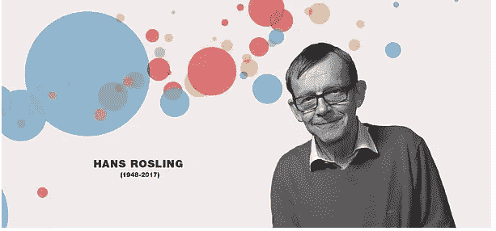

# 在画面中重现 Gapminder:向汉斯·罗斯林致敬

> 原文：<https://medium.com/analytics-vidhya/recreating-gapminder-in-tableau-a-humble-tribute-to-hans-rosling-53de74b18ec?source=collection_archive---------2----------------------->

> “我感兴趣的不是数据，而是世界。你可以从数字中看到世界发展的一部分。”—汉斯·罗斯林

汉斯·罗斯林是一个有远见的人。他对数字很有一套。作为一名医生、教师和统计学家，他挑战了数百万人对基本问题的偏见