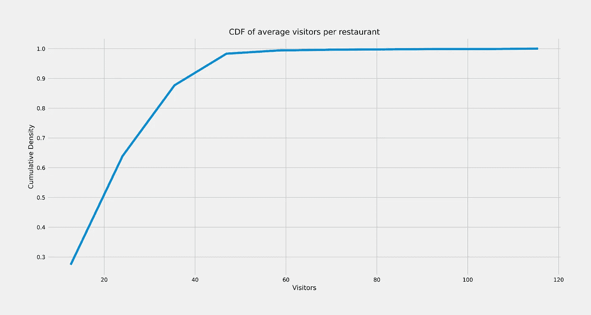

# 招聘餐厅游客预测

> 原文：<https://medium.com/analytics-vidhya/recruit-restaurant-visitor-forecasting-f9ef87ba1073?source=collection_archive---------12----------------------->

## 预测一家餐厅未来会接待多少游客

# 商业问题

经营一家生意兴隆的当地餐馆并不总是像第一印象那样迷人。经常会有各种意想不到的麻烦出现，可能会损害业务。

一个常见的困境是，餐馆需要知道每天有多少顾客会有效地购买食材和安排员工。这种预测并不容易，因为许多不可预测的因素会影响餐厅的上座率，比如天气和当地的竞争。对于历史数据很少的新餐馆来说就更难了。

[Recruit Holdings](http://www.recruit-rgf.com/meet_recruit/) 拥有对关键数据集的独特访问权，这使得自动化的未来客户预测成为可能。具体来说，Recruit Holdings 拥有 Hot Pepper Gourmet(一种餐厅评论服务)、AirREGI(一种餐厅销售服务点)和 Restaurant Board(预订日志管理软件)。

在这场比赛中，我们面临的挑战是使用预订和访问数据来预测未来几天餐厅的访客总数。这些信息将有助于餐厅提高效率，让他们专注于为顾客创造愉快的用餐体验。

## **接下来要讨论什么！！**

因为这是一篇详细的文章，所以最好列出这篇文章中涉及的要点。

1.  **机器学习/深度学习的使用:-** 讨论了如何将这个问题提出来作为机器学习或深度学习的问题。
2.  **数据来源:-** 提供了数据来源和对每个文件内容的深入解释。
3.  **评估指标:-** 解释了评估指标&对于给定问题的重要性。
4.  **探索性数据分析:-** 对数据进行分析，直观了解其广度&深度。
5.  **现有方法:-** 解释了此问题的现有解决方案。
6.  **改进:-** 解释了我对现有解决方案的进一步改进。
7.  **首次切割方法:-** 讨论了我解决这个问题的首次切割方法。
8.  **模型解释:-** 给出了每个模型及其优化超参数的解释。
9.  **车型对比:-** 根据性能给出各车型的对比。
10.  **Kaggle 提交:-** 讨论了公开的&每个模型获得的私有 Kaggle 分数。
11.  未来的工作:- 讨论了为了更好地解决这个问题，我们可以做的未来工作。
12.  **Github Repo:-** 提供了到 Github 仓库的链接，可以访问全部代码。

# 机器学习/深度学习的使用

我们面临的挑战是使用预订和访问数据**来预测未来日期餐厅的游客总数**，这解释了这是一个**回归问题**的事实，因此通过对数据进行适当的预处理和特征工程，并将其输入机器学习或深度学习模型，我们可以解决这一预测问题。

# 数据来源

在这场比赛中，我们面临一个以餐馆游客为中心的时间序列预测问题。数据来自两个独立的站点:

*   辣椒美食(hpg):类似于 Yelp，用户可以搜索餐馆，也可以在线预订([下载](https://www.kaggle.com/c/recruit-restaurant-visitor-forecasting/data))
*   AirREGI / Restaurant Board (air):类似于 Square，一个预订控制和收银系统([下载](https://www.kaggle.com/c/recruit-restaurant-visitor-forecasting/data))

除了上述两个来源，我们还有来自日本气象站的数据，这些数据可以根据餐厅的经度和纬度来使用([下载](https://www.kaggle.com/huntermcgushion/rrv-weather-data))

我们必须使用来自这些网站的预订、访问和其他信息来预测给定日期的未来餐厅访客总数。训练数据涵盖了从 2016 年到 2017 年 4 月的日期。测试集覆盖 2017 年 4 月和 5 月的最后一周。测试集是根据时间划分的，覆盖了空中餐厅的一个选定子集。请注意，测试集有意跨越了日本的一个称为“黄金周”的假日周

在测试集中，有些日子餐馆关门了，没有客人。这些在评分中被忽略。训练集省略了餐馆关门的日子。

## 文件描述

这是来自两个系统的关系数据集。每个文件都以源文件(air_ 或 hpg_)开头，以表明其来源。每个餐厅都有独特的`air_store_id`和`hpg_store_id`。请注意，这两个系统并没有覆盖所有的餐厅，我们已经获得了我们必须预测的餐厅之外的数据。纬度和经度并不能准确地阻止餐馆的去标识化。

***air _ reserve . CSV***

该文件包含在 air 系统中进行的预订。请注意，`reserve_datetime`表示创建预订的时间，而`visit_datetime`则是将来访问发生的时间。

*   `air_store_id` -空中系统中餐厅的 id
*   `visit_datetime` -预订的时间
*   `reserve_datetime` -预订的时间
*   `reserve_visitors` -该预订的访客数量

***hpg _ reserve . CSV***

该文件包含在 hpg 系统中进行的预订。

*   `hpg_store_id`-hpg 系统中餐厅的 id
*   `visit_datetime` -预订的时间
*   `reserve_datetime` -预订的时间
*   `reserve_visitors` -该预订的访客数量

***air _ store _ info . CSV***

该文件包含有关精选航空餐厅的信息。列名和内容是不言自明的。

*   `air_store_id`
*   `air_genre_name`
*   `air_area_name`
*   `latitude`
*   `longitude`

注:经纬度为店铺所属*区域*的经纬度

***hpg _ store _ info . CSV***

此文件包含有关选择 hpg 餐厅的信息。列名和内容是不言自明的。

*   `hpg_store_id`
*   `hpg_genre_name`
*   `hpg_area_name`
*   `latitude`
*   `longitude`

注:经纬度是店铺所属的*区域*的经纬度

***store _ id _ relation . CSV***

该文件允许您加入既有空气系统又有 hpg 系统的精选餐厅。

*   `hpg_store_id`
*   `air_store_id`

***air _ visit _ data . CSV***

该文件包含空中餐厅的历史访问数据。

*   `air_store_id`
*   `visit_date` -日期
*   `visitors` -当日餐厅的访客数量

***sample _ submission . CSV***

该文件以正确的格式显示提交，包括您必须预测的日期。

*   `id`-id 是通过用下划线连接`air_store_id`和`visit_date`形成的
*   `visitors` -商店和日期组合的预测访客数量

## 日期信息. csv

该文件给出了数据集中日历日期的基本信息。

*   `calendar_date`
*   `day_of_week`
*   这一天是日本的假日吗

# 评估指标

评估指标为**均方根对数** **误差**，计算如下:

*其中:* ***n****是观察总数* ***p _ I****是我们预测的访客数* ***a _ I****是实际访客数* ***log(x)****是*

***问)为什么是 RMSLE 为什么不是 RMSE？
→在预测不足的情况下，小餐馆不会亏损，但在预测过度的情况下，小餐馆会遭受损失，因为很多食物材料被浪费了，而大餐馆对预测过度和预测不足都有容忍度，RMSLE 对预测过度的惩罚比对预测不足的惩罚更重，这对小餐馆来说是一个加分点，因为日本有很多小餐馆。
→ RMSLE 相对于数字的大小进行处罚*→**

# 探索性数据分析

## 每家餐厅平均访客的 PDF

每家餐厅平均访客的 PDF

> **观察:-**
> 
> 每家餐厅平均访客的 PDF 几乎是正常的(大约),平均访客为 20.97，有轻微的右偏。
> 
> 我们可以使用 68–95–99.7 规则来剔除基于标准差的极端异常值。
> 
> 有许多餐厅的容量不到 20 人。

## 每家餐厅的平均访客 CDF

每家餐厅的平均访客 CDF

> **观察:-**
> 
> 在上面的 CDF 中，我们可以观察到几乎 99%的餐厅的平均访客人数少于 47 人(大约)。
> 
> 几乎 90%的餐厅每天接待的游客不到 40 人。
> 
> 它解释了在日本有大量小餐馆的事实。
> 
> 只有极少数餐馆的平均接待人数超过 100 人。

## 每家餐厅的平均访客箱线图

每家餐厅的平均访客箱线图

> **观察:-**
> 
> 我们能从这个地块上观察到的最低游客数量几乎为零。
> 
> 参观者的平均人数是 20 人左右。
> 
> 访客的最大数量在 55-60 之间。
> 
> 我们观察到某些非常高的值(异常值)大于 60，甚至大于 100 个访问者。
> 
> 第 25 百分位和第 75 百分位的值分别为 13(近似值)和 30(近似值)。

## 每家餐厅平均访客预订的 PDF

每家餐厅平均访客预订的 PDF

> **观察:**
> 
> 航空预订的分布高于 HPG 预订。
> 
> 在 HPG 有很多游客人数在 5 到 10 之间的预订。
> 
> 在 HPG，游客数量超过 20 人甚至达到 40 人的保留地很少。
> 
> 即使在空中，登记的游客人数最多为 40 人，但登记人数比 HPG 多。
> 
> 在空中，注册的最大数量的访客计数在 8 到 13 之间(大约)。
> 
> 未注册访客的数量远远多于注册访客的数量。

## 每家餐厅平均游客预订的 CDF

每家餐厅平均游客预订的 CDF

> **观察:-**
> 
> 从上面的 CDF 可以看出，在空中，几乎 99%的每家餐厅的预订都少于 40 英镑。
> 
> 在空中，大于 60 的预留数量可以忽略不计。
> 
> 在 HPG，几乎所有的预订数都小于 40。
> 
> 在 HPG，大约 99%的预订数量小于 20。
> 
> 在 HPG，几乎 90%的预订都小于或等于 10 英镑。

## 每个餐厅的平均游客预订箱线图

每个餐厅的平均游客预订箱线图

> **观察:-**
> 
> 从上面的箱线图中，我们可以观察到平均预留计数不超过 10。
> 
> 在航空公司，平均预订数量为 10 个(大约)，在 HPG 平均预订数量为 6 个(大约)。
> 
> 空中第 25 和第 75 百分位预留计数分别是 7 和 15。
> 
> 在 HPG，第 25 和第 75 百分位的预订计数分别是 4 和 8。
> 
> 在空气中，我们在 40 到 100 的范围内看到某些高值(异常值)。
> 
> 在 HPG，我们在 13 到 4 的范围内看到某些高值(异常值)。

## 流派明智的餐厅市场份额

流派明智的餐厅市场份额

> **观察:-**
> 
> 日本的餐馆被细分为 14 种食物类型。
> 
> 居酒屋是日本最受欢迎的类型，几乎 23.8%的餐厅都属于居酒屋类型。
> 
> 日本第二受欢迎的类型是咖啡馆/糖果，占据了将近 21.8%的市场份额。
> 
> **国际美食**、**亚洲、**T21 和**卡拉 ok/派对**是最不受欢迎的流派，每个流派只有 **0.2%** 的市场份额。
> 
> 甚至西餐和韩餐在日本也根本不受欢迎。
> 
> 在日本开餐馆，选择食物种类将是最重要的决定。

## 唯一商店的数量

唯一商店的数量

> **观察:-**
> 
> 上面的图描述了这样一个事实，2016 年年中，餐馆的数量增加了近 150%。
> 
> 此次上调背后的原因是，2016 年年中，AIR 数据库中新增了 500 家(大约)餐厅。
> 
> 我们看到的起伏可能是由于工作日和周末造成的。
> 
> 1 月 1 日的紧急法令是由于新年前夕，因为大多数餐馆在新年当天都不营业。
> 
> 我们总共有将近 800 家日本餐馆的记录。

## 访客和预订

访客和预订

> **观察:-**
> 
> 2016 年中期的突然上涨是由于新餐馆的增加(如前面的情节所解释的)。
> 
> 很容易观察到，非注册访问者的数量远远多于注册访问者的数量。
> 
> 由于大多数餐馆在除夕夜仍然关门，因此除夕夜的顾客数量急剧下降。
> 
> 空中登记的数量比 HPG 多。
> 
> 游客数量最多的月份是 12 月，因为我们知道 12 月有很多节日。

## 访问者与流派

访问者与流派

> **观察:-**
> 
> 日本餐馆提供大约 14 种食物。
> 
> 最受欢迎和最受喜欢的类型是**居酒屋**，其次是受到最多人喜欢的**咖啡馆/糖果**。
> 
> 亚洲、卡拉 ok/派对和国际美食是日本顾客最少的新兴菜系。
> 
> 甚至西餐在日本也不太受欢迎。
> 
> 食物种类是日本餐饮业增长的最重要因素。

## 预订与流派

按类型预约访问者

> **观察:-**
> 
> 即使对于预订趋势来说，居酒屋也是最受欢迎的流派。
> 
> 在未注册游客趋势中，我们观察到**咖啡馆/糖果**是第二受欢迎的类型，但在这里**意大利/法国**是第二受欢迎的类型。
> 
> **亚洲**和**国际美食**在之前的剧情中我们已经看到是最不受欢迎的。
> 
> 令人惊讶的是，日本料理在日本排名第四。

## 按星期几划分的游客年度趋势

一周中每天的访客

> **观察结果:-**
> 
> 周六是大多数人喜欢出去吃饭的一天，因为是周末，所以一年中有最多的游客。
> 
> 周六之后，甚至周日，都是游客的高峰。
> 
> 星期一，出去吃饭的人最少。
> 
> 其他工作日有几乎相似的游客趋势。
> 
> 第 51 周之后的大幅下跌是因为之前解释过的除夕。

## 每周每天的平均访客数

每周每天的平均访客数

> **观察结果:-**
> 
> 即使是每天，餐馆观察到周六的游客数量最多。
> 
> 第二高的游客数量是在周日
> 
> 周一和周二，游客最少。
> 
> 周四和周三有几乎相同的游客趋势。

## 每月每天的平均访客数

每月每天的平均访客数

> **观察:-**
> 
> 我们在两者之间看到的游客高峰是由于上一个图中解释的周六效应。
> 
> 我们可以在月底观察到持续的上涨，也许月底的工资信贷是上涨背后的原因。
> 
> 在这个月的第 6、13、20 和 31 天观察到持续下降。
> 
> 在每月的第 3 天、第 10 天和第 22 天观察到一个恒定的峰值。

## 月平均访客数

月平均访客数

> **观察:-**
> 
> 我们可以观察到游客在 12 月徒步旅行。
> 
> 由于 12 月是一个喜庆的月份，也许这就是游客远足的原因。
> 
> 在十二月之后，三月是游客最多的月份。
> 
> 八月和十一月的平均游客量最少。

## 节假日和非节假日的平均游客量

节假日和非节假日的平均游客量

> **观察:-**
> 
> 从图中观察到，节假日的游客明显多于工作日。
> 
> 即使这样，由于周末效应，节假日和工作日的游客数量差别也不大。
> 
> 从上面的图中还可以观察到，在大多数节假日，餐馆都是营业的。
> 
> 在处理数据时，我们必须考虑到周末的假期，这种假期只应被视为周末，而不是仅仅为了考虑周末的影响而被视为假期。

## 每小时访客行为

每小时访客行为

> **观察:-**
> 
> 已经观察到空气中的登记数量多于 HPG。
> 
> 上午 10 点后有一次小远足，因为那是人们去办公室的时间。
> 
> 晚上的时间很忙。
> 
> 参观人数最多的时间是下午 5:30 到 7:00(大约)。
> 
> 晚上 7 点以后，游客数量急剧下降。
> 
> 在上午 12:00 到 7:00(大约)之间没有(几乎为零)访客，这可能是因为餐馆在晚上关门了。

## 探索性数据分析的总体观察结果:-

1.  训练数据集概述:-

*   独特空中餐厅总数:- 829
*   在航空和 HPG 常见的餐馆总数:- 150
*   空中餐厅的独特风格总数:- 14
*   空中餐厅的位置总数:- 103
*   平均每天的访问者:-20 . 48486483646
*   训练数据持续时间:-2016 年 1 月 1 日至 2017 年 4 月 22 日

2.测试数据集概述:-

*   独特餐厅总数:- 821
*   测试数据持续时间:- 2017 年 4 月 23 日至 2017 年 5 月 31 日

3.有许多餐厅的容量不到 20 人。

4.几乎 90%的餐厅每天接待的游客不到 40 人。

5.航空预订的分布高于 HPG 预订。

6.即使在空中，登记的游客人数最多为 40 人，但登记人数比 HPG 多。

7.未注册访客的数量远远多于注册访客的数量。

8.居酒屋是日本最受欢迎的类型，几乎 23.8%的餐厅都是居酒屋类型。

9.日本第二大受欢迎的类型是咖啡馆/糖果，拥有近 21.8%的餐厅市场份额。

10.国际美食、亚洲美食和卡拉 ok/派对是最不受欢迎的类型，各占 0.2%的市场份额。

11.2016 年年中，餐馆数量增长了近 150%。

12.此次上调背后的原因是，2016 年年中，AIR 数据库中新增了 500 家(大约)餐厅。

13.由于大多数餐馆在除夕夜仍然关门，因此除夕夜的客流量急剧下降。

14.游客数量最多的月份是 12 月，因为我们知道 12 月有很多节日。

15.周六是大多数人喜欢出去吃饭的一天，因为是周末，所以一年中有最多的游客。

16.我们可以在月底观察到持续的上涨，也许月底的工资信贷是上涨背后的原因。

17.节假日游客明显比工作日多。

18.晚上的时间很忙。

19.参观人数最多的时间是下午 5:30 到 7:00(大约)。

# 现有方法

## 第六名 Kaggle 解决方案(团队:-云峰和 Ankit):-

1.  除了比赛中给出的数据集，还使用了 Recruit Restaurant 比赛的天气数据。
2.  从日历信息中，使用了一个称为 hour_gap 的特征，该特征给出了预定餐馆和访问餐馆之间的间隔时间(以小时计),该间隔时间又根据间隔长度细分为 5 个类别(即< 12 小时、12 至 37 小时、37 至 59 小时、59 至 86 小时以及大于 85 小时)
3.  工作日和非工作日分别考虑每家餐厅的平均、中值、最大和最小访客数。
4.  区域方面的餐馆总数也计算在内。
5.  从天气信息来看，这里也使用了温度和降水信息，但是温度被细分为低、平均和高。
6.  还计算了所有餐馆所有 7 天的游客计数的周平均值。
7.  还计算每个餐厅所有 12 个月的月平均访客数。
8.  XGBoost(GBDT 的优化实现)被训练为具有总共 5000 个历元的最终模型。此外，在预测过程中，还会预测访问者的日志。

## 第八名 Kaggle Solution(团队:- Max Halford):-

1.  除了比赛中给出的数据集，还使用了 Recruit Restaurant 比赛的天气数据。
2.  它不是按原样获取访问数据，而是按天进行重新采样，因此对于没有数据点(没有访问者)的日子，访问次数为 0，跟踪数据点是否由于重新采样而被添加。
3.  从日历信息中，除了“星期几”和“是周末”之外，还使用了两个附加特征来指示前一天或第二天是假日。
4.  至于商店信息，使用来自天气数据的预处理版本，而不是“官方”Kaggle 版本。因为预处理版本包含对于连接天气特征很重要的气象站数据。
5.  从天气信息中，仅使用降水和温度特征，其中缺失值通过用全球日平均值替换它们来处理。
6.  通过将访问视为正态分布，值 2.4 被视为正态分布的高分位数值，方差大于 2.4 *标准差的值被视为异常值。一旦检测到异常值，就会使用一个名为 visitors_capped 的新特性，用非异常值的最大值替换异常值。
7.  还使用了一个称为“一个月中的某一天”的特征，这非常有趣，因为它可以被视为人们在一个月中何时获得工资的代理，假设他们按月获得工资。
8.  指数加权平均(EWM)是一种捕捉时间序列趋势的方法，使用各种数值特征的 EWM，其中 alpha 值使用差分进化进行优化。
9.  平均值、中值、标准偏差、数值数量、最小值、最大值也可用于按就诊日期对数据进行分组。
10.  所有的分类变量都是标签编码的。
11.  必须删除数据集中的一些列，因为它们是无用的。在预测期间，预测访问者的日志，并且简单地将指数函数应用于预测，以回到原始量级。这是可行的，因为 exp(log(x)) = x .因为它有助于决策树将值打包到叶子中，因为这些值彼此“更接近”。总共 98 个最终特征用于训练最终模型。
12.  LightGBM(基于树的梯度推进)用作最终模型，其中在数据集的随机样本上训练 6 个模型。采样是在没有替换的情况下完成的，这就是所谓的粘贴。所有 6 个模型预测的平均值被认为是最终预测。自超参数调谐是在不使用网格搜索或随机搜索的情况下完成的。

# 丰富

## 使用 VIF(方差膨胀因子)检测多重共线性

*   当回归模型中的两个或多个独立变量高度相关时，就会出现多重共线性。
*   VIF 决定了自变量之间相关性的强度。它是通过取一个变量并将其与其他变量进行回归来预测的。
*   自变量的 VIF 分数代表该变量被其他自变量解释的程度。
*   为了找出每个特征的 VIF 分数，我们使用了以下函数

计算 VIF 的函数

*   计算 VIF 后，我们得到的输出如下

各种功能的 VIF

*   通过迭代地计算 VIF 分数并移除高 VIF 分数特征，直到所有特征都在可接受的范围内，我们可以移除多共线性特征，从而通过保留信息来降低维度。

## 奇异值分解中奇异值的最优收缩

*   我们使用地区名称和流派名称计算 TF-IDF 向量。
*   然后，我们对获得的 TF-IDF 值执行奇异值分解。
*   但是奇异值分解的最优收缩对于在保持最小维数的同时保留最大信息量是很重要的。
*   我们使用了[加维什&多诺霍](https://arxiv.org/pdf/1305.5870.pdf)规定的方法，用于奇异值分解中奇异值的最佳收缩，实现如下

奇异值分解中奇异值的最优收缩

## 使用递归特征消除的特征选择

*   特征选择是指为数据集选择最相关的特征(列)的子集的技术。更少的特征可以允许机器学习算法更高效地运行(更少的空间或时间复杂度)并且更有效。一些机器学习算法会被不相关的输入特征误导，导致预测性能更差。
*   使用递归特征消除交叉验证找出最佳选择:-

使用递归特征消除的特征选择

*   我们从递归特征消除交叉验证中得到的结果是:-

递归特征消除

*   从上面的图中，我们可以观察到最佳特征的数量= 56，得分=0.602

# 首次切割方法

*   由于这是一个时间序列预测问题，基于时间的预订数据和访问数据分组将有利于提取餐厅的访问行为，这就是为什么我们提出了许多使用基于时间的分组的功能。
*   预约数据由注册时间和访问时间组成，我们使用这些数据计算注册和访问之间的小时间隔，然后根据间隔持续时间细分小时间隔。
*   餐馆根据每个区域的类型进行分组，这就给出了给定区域中给定类型餐馆的数量。
*   类似地，我们根据区域对餐馆进行分组，这给出了给定区域中餐馆的数量。
*   使用日历数据，我们找出了考虑假期和周末以及假期前一天的非工作日。
*   我们在工作日和非工作日的基础上计算访客统计数据，因为它让我们直观地了解工作日和非工作日的访客数量，因为我们从 EDA 中观察到，假日的访客数量更多。
*   使用数据，我们还计算了星期几、月几、一年几和一年几。
*   我们还计算了每天、每周、每月和每年的访问者统计数据。
*   每月和平日明智的游客平均也计算在内。
*   来自每个餐馆的地区名称和流派名称的文本数据被用于计算 TF-IDF 向量，在该向量上使用如上所述的 [Gavish & Donoho 的](https://arxiv.org/pdf/1305.5870.pdf)方法应用 SVD。
*   使用递归特征消除技术选择最终特征。
*   我们调整和训练的超参数`KNeighborsRegressor`、`SGDRegression`、`DecisionTreeRegressor`、`RandomForestRegressor` 、`XGBoost` 、【GBDT】、&、`XGBoost` 结果是最好的。

# 模型解释

## KneighborsRegressor

*   关于超参数调谐`KneighborsRegressor`，我们发现`n_neighbors` = 19 是最好的。
*   在拟合时，我们使用`log(y)`来消除异常值的影响，以保证数值的稳定性。
*   `KneighborsRegressor`模型训练&预测:-

KneighborsRegressor

*   我们得到的`KneighborsRegressor`的 RMSLE 是 **0.52** 。

## SGDRegressor

*   在将数据输入模型之前，我们首先将数据标准化，因为`SGDRegressor`最适合标准化数据。
*   关于超参数调谐，我们发现最好的`alpha=0.0001`。
*   `SGDRegressor`模型训练&预测:-

SGDRegressor

*   我们得到的`SGDRegressor`的 RMSLE 是 **0.53** 。

## 决策树回归器

*   关于超参数调谐，我们发现了`max_depth=10`、`min_sample_split=500`
*   这里我们也使用了`log(y)`,因为它有助于决策树将值打包到一个叶子中，因为这些值彼此“更接近”。
*   `DecisionTreeRegressor`模型训练&预测:-

决策树回归器

*   我们得到的`DecisionTreeRegressor`的 RMSLE 是 **0.49** 。

## 随机森林回归量

*   关于超参数调谐，我们找出了`max_depth=50`、`n_estimators=500`。
*   `RandomForestRegressor`模型训练&预测:-

随机森林回归量

*   我们为`RandomForestRegressor`得到的 RMSLE 是 **0.47** 。

## XGBRegressor

*   由于这是一个回归问题，我们使用目标作为`reg: squarederror`。
*   训练时，我们使用均方根误差作为评估指标。
*   关于超参数调优，我们发现`learning_rate=0.01`、`min_child_weight=0.8`、`subsample=0.7`、`colsample_bytree=0.5`、&、`max_depth=8`。
*   用于 GPU 优化训练的参数`tree_hist=’gpu_hist’`。
*   `XGBRegressor`模型训练&预测。

XGBoost

*   我们得到的`XGBRegressor`的 RMSLE 是 **0.45** 。

# 模型比较

*   所有型号的比较如下

模型比较

*   从上表我们可以得出结论`XGBRegressor` 是最好的型号。

# Kaggle 提交

*   每个模型的 Kaggle 公共和私人分数如下

Kaggle 提交

*   从 Kaggle 的公共和私人分数中，我们可以得出结论，对于这个问题，性能最好的模型是`XGBRegressor`。

# 未来的工作

*   现在访问者的数据是每天可用的，但如果它是每小时可用的，那么我们可以进一步降低预测的粒度到下一个小时的访问者预测。
*   这将使餐馆在为下一个高峰时间做准备方面有更多的控制，从而进一步提高生产率和食品交付时间。

# Github 回购

*   如果您对这个案例研究感兴趣，或者想进一步改进它，那么包含完整代码的 Jupyter Notebook 可以在我的以下 repo 中找到:-

 [## junaidnasirkhan/餐厅-游客-预测

### permalink dissolve GitHub 是超过 5000 万开发人员的家园，他们一起工作来托管和审查代码，管理…

github.com](https://github.com/junaidnasirkhan/Restaurant-Visitor-Forecasting/blob/master/Restaurant%20Visitor%20Forecasting.ipynb) 

# 参考

1.  [https://www.kaggle.com/asindico/a-japanese-journey)](https://www.kaggle.com/faizalabdkadir/recruit-visual-eda-itadakimasu)
2.  [https://github . com/anki 1909/Recruit-Restaurant-Visitor-prediction](https://github.com/anki1909/Recruit-Restaurant-Visitor-Forecasting)
3.  [https://medium.com/r/?URL = https % 3A % 2F % 2 farxiv . org % 2 fpdf % 2f 1305.5870 . pdf](https://arxiv.org/pdf/1305.5870.pdf)
4.  [https://www.appliedaicourse.com/](https://www.appliedaicourse.com/)

*在*[***LinkedIn***](https://www.linkedin.com/in/junaidnasirkhan/)*或*[***GitHub***](https://github.com/junaidnasirkhan/)上与我联系