# 递归神经网络及其变体。

> 原文：<https://medium.com/analytics-vidhya/recurrent-neural-network-and-its-variants-de75f9ee063?source=collection_archive---------7----------------------->

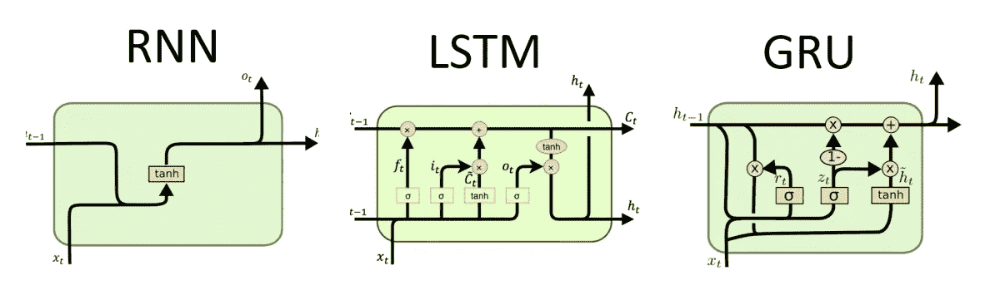

RNN 及其变体。([d 程序员洛佩兹](http://dprogrammer.org/))

*人类在阅读的时候，基于他们之前对单词的理解来理解每个单词。我们不会忘记所有的信息，从零开始思考。RNN 的工作也是如此，通过保存先前的时间信息并预测下一个时间。*

**在本帖中，我们将从了解 RNN 是什么以及它是如何工作的开始。我们将讨论 LSTM 和 GRU，它们是 RNN 的其他变体。我们将了解标准 RNN 有什么问题:爆炸梯度，消失梯度等，以及如何克服这一切。**

S ***标准递归神经网络:***

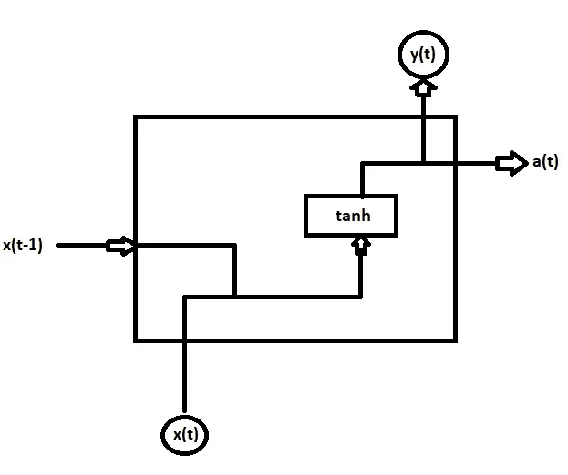

典型的 RNN 街区

让我们首先了解 RNN 的一个街区。如上图所示，我们有一个 RNN 区块。不同于神经网络，RNN 具有两个输入 ***xt*** 和 ***x(t-1)*** ，其中 ***xt*** 是当前时间步长输入，其可以是句子的单词、单词的字符、音频的赫兹等。***【x(t-1)***是先前的时间步长输入，这不过是先前的 RNN 块激活。每个输入都有自己的权重，这里我们用权重 ***Wx*** 为 ***xt*** 和 ***Wa*** 为***【x【t-1】***。这里，我们有上面讨论的块的以下两个等式:

***方程一:a(t)= tanh(wx . x(t)+wa . x(t-1)+ba)
方程二:y(t)= soft max(wy . a(t)+by)***

从上面的等式 1 中可以看出，我们对两个不同时间步长的权重和输入的点积求和，并添加偏差。然后，线性方程通过激活函数‘tanh’挤压-1 和 1 之间的值，得到 ***a(t)*** 。在第二个等式中，激活输出 ***a(t)*** 被传递给 softmax 函数，如图所示。

现在，我们了解了 RNN 的单个块操作，将这些块组合起来，我们将得到如下所示的 RNN 模型:

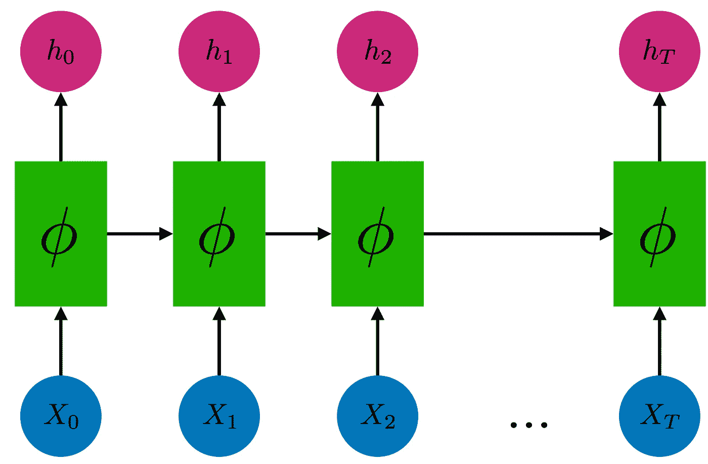

RNN 模型

为了计算模型的损耗，计算单个块的损耗并求和，得到总损耗。以下等式表示 RNN 的损失:

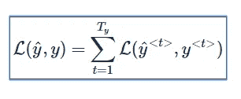

**反向传播**:针对 RNN 的反向传播在每个时间点完成。在时间步长***【T】***，损失 ***L*** 相对于权重矩阵 ***W*** 的导数表示为:

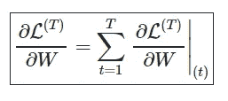

现在我们已经了解了什么是 RNN，它是如何工作的，让我们看看这些模型有什么问题，以及如何克服这些问题。RNN 的一个问题是在反向传播步骤中的爆炸/消失梯度，发生的原因是因为 RNN 被限制在大约十个时间步骤的时间内回顾。因为在返回信号梯度变得非常小的过程中，时间向后推移会导致梯度消失。

为了解决消失梯度的问题，RNN 使用了不同的门，这给了我们一些不同的版本:LSTM 和格鲁。让我们讨论这两个:

**LSTM:**

为了理解 LSTM，让我们看看框图:

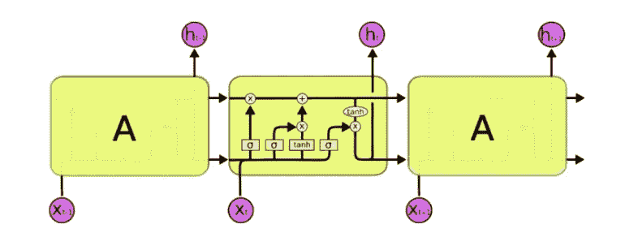

[来源](http://colah.github.io/posts/2015-08-Understanding-LSTMs/)

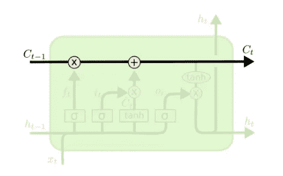

LSTMs 的关键是单元状态，即穿过上图顶部的水平线。

细胞状态有点像传送带。它沿着整个链条直线向下，只有一些微小的线性相互作用。信息很容易不加改变地沿着它流动。LSTM 确实有能力删除或添加细胞状态的信息，由称为门的结构仔细调节。

LSTM 有三个不同的门忘记门，输入门和输出门。下面将逐一讨论:

## 忘记大门

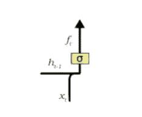

遗忘门负责从单元状态中移除信息。LSTM 理解事物不再需要的信息或者不太重要的信息通过滤波器的乘法被移除。这是优化 LSTM 网络性能所必需的。

这需要两个输入；h_t-1 和 x_t。

h_t-1 是前一个单元的隐藏状态或前一个单元的输出，x_t 是该特定时间步长的输入。给定的输入乘以权重矩阵，并添加偏差。随后，sigmoid 函数应用于该值。sigmoid 函数输出一个向量，值的范围从 0 到 1，对应于单元格状态中的每个数字。基本上，sigmoid 函数负责决定保留哪些值，丢弃哪些值。如果单元状态中的特定值输出“0 ”,则意味着遗忘门希望单元状态完全遗忘该信息。类似地，1 表示遗忘门想要记住整个信息。sigmoid 函数的矢量输出乘以单元状态。

## 输入门

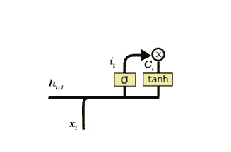

输入门负责向单元状态添加信息。如上图所示，添加信息基本上分为三步。

1.  通过使用 sigmoid 函数来调节需要添加到单元状态的值。这基本上非常类似于遗忘门，并充当来自 h_t-1 和 x_t 的所有信息的过滤器。
2.  创建一个包含所有可能值的向量，这些值可以被添加到(如从 h_t-1 和 x_t 所感知的)单元状态中。这是使用 **tanh** 函数完成的，该函数输出从-1 到+1 的值。
3.  将调节滤波器(sigmoid gate)的值乘以创建的向量(tanh 函数),然后通过加法运算将该有用信息添加到单元状态。

一旦这三个步骤的过程完成，我们确保只有那个信息被添加到单元状态，是*重要的*，而不是*多余的。*

## 输出门

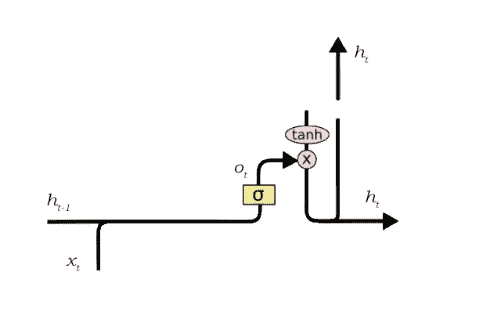

输出门的功能又可以分为三步:

1.  在将 **tanh** 函数应用于单元格状态后创建一个向量，从而将值缩放到范围-1 到+1。
2.  使用 h_t-1 和 x_t 的值制作过滤器，使得它可以调节需要从上面创建的向量输出的值。该滤波器再次采用了 sigmoid 函数。
3.  将此调节过滤器的值乘以步骤 1 中创建的向量，并将其作为输出发送出去，还发送到下一个单元的隐藏状态。

**GRU:**

GRU 是 LSTM 递归神经网络的变体。

这里，GRU 网络有一个重置和更新“门”,帮助确保其内存不会被跟踪短期依赖性所接管。网络学会如何使用它的门来保护它的记忆，这样它就能够进行长期预测。

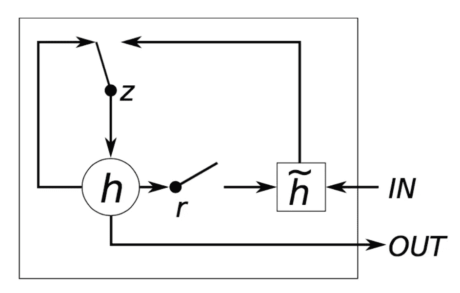

直观地说，重置门决定了如何将新的输入与先前的存储器相结合，而更新门定义了要保留多少先前的存储器。如果我们将 reset 设置为全 1，将 update gate 设置为全 0，我们又会得到简单的 RNN 模型。使用门控机制来学习长期依赖性的基本思想与 LSTM 中的相同，但是有几个关键的区别:

*   GRU 有两个门，LSTM 有三个门。
*   GRUs 不具备与暴露隐藏状态不同的内存( *ct* )。它们没有 LSTMs 中的输出门。
*   输入门和遗忘门通过更新门 ***z*** 耦合，复位门 ***r*** 直接应用于先前的隐藏状态。因此，LSTM 中的复位门的责任实际上被分成了*和*两部分**
*   **当计算输出时，我们不应用第二非线性。**

**请分享，如果你觉得帖子有帮助，请鼓掌。**

****来源:****

 **[## 理解 LSTM——长短期记忆递归神经网络教程

### 长短期记忆递归神经网络(LSTM-RNN)是最强大的动态分类器之一

arxiv.org](https://arxiv.org/abs/1909.09586)**  **[## 了解 LSTM 网络

### 2015 年 8 月 27 日发布人类不是每秒钟都从零开始思考。当你读这篇文章时，你…

colah.github.io](http://colah.github.io/posts/2015-08-Understanding-LSTMs/)**