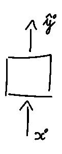
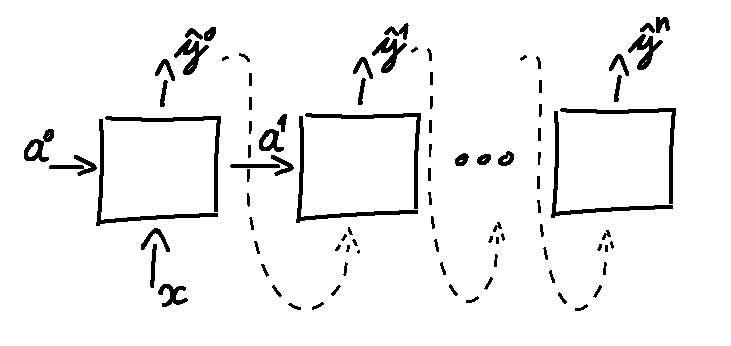
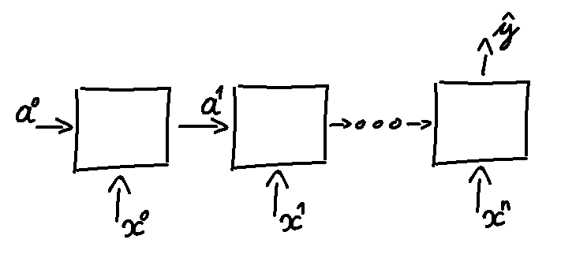
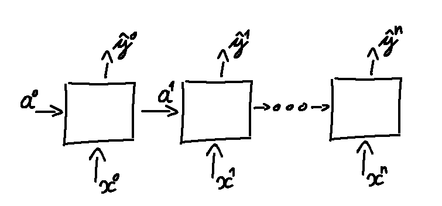
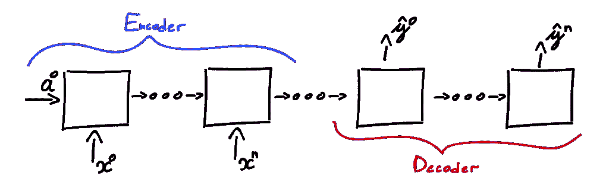

# 递归神经网络(RNN) —架构视角

> 原文：<https://medium.com/analytics-vidhya/recurrent-neural-networks-rnn-architecture-perspective-529489c73915?source=collection_archive---------11----------------------->

André Sanano 在 [Unsplash](https://unsplash.com/s/photos/architecture?utm_source=unsplash&utm_medium=referral&utm_content=creditCopyText) 上拍摄的照片。

本文解释了什么是递归神经网络，展示了最常见的模型架构以及流行的现实世界的应用。此外，读完这篇文章后，你将有关于 RNNs 的重要知识，以及你想要的项目需要哪个 RNN 网络。

*通过阅读这篇文章，我们假设你对什么是* [*人工智能*](https://www.nvukobrat.com/engineering/artificial-intelligence/artificial-intelligence-introduction/) *以及* [*神经网络*](https://en.wikipedia.org/wiki/Artificial_neural_network) *如何工作有了基本的了解。如果不是这种情况，请在提供的链接中阅读更多信息。*

首先，递归神经网络(RNN)代表了专用于解决与序列数据相关的挑战的一般人工神经网络的子类。为了能够做到这一点，rnn 使用它们的递归属性来很好地管理这类数据。关于 RNN 如何工作的更多细节将在以后的帖子中提供。

# RNN 应用

为了解决关于序列数据的许多挑战，我们使用递归神经网络(RNN)。序列数据有多种类型，但最常见的有:

*   音频(音乐、对话声音等。)
*   文本(文章、书籍等。)
*   生物序列(DNA、基因组等。)
*   视频(体育、监控等。)

此外，利用 RNN 模型和序列数据集(如上所述)，您可以解决许多困难，例如(但不限于):

*   语音识别
*   音乐一代
*   情感分析
*   自动化翻译
*   视频动作分析
*   基因组和 DNA 序列分析

神经网络通常具有不同的输入和输出数据。例如，在 RNNs 的情况下，语音识别需要音频数据作为输入，然后输出文本数据。此外，输入和输出可以是相同的。例如，自动翻译可以有双向音频 dana(或文本数据)。这实际上取决于您拥有的用例，以及您正在解决的挑战。

# RNN 建筑

根据您所解决的挑战，RNN 架构会有所不同。从有单个输入和输出的到有多个输入和输出的(其间有变化)。为了更好地解决这个问题，下面是一些常见的 RNN 架构的例子。

## 一对一

该模型类似于标准感知器(单层神经网络)。今天，它没有多少用处，因为它只提供线性预测。

这是一个简单的模型，因为它由单输入 *x* 和输出 *y* 组成。

一对一架构。

## 一对多

通常在只有单个输入流(如音频流)时使用。在输出上，它可以根据情况生成文本或事件新的音频流。在某些情况下，它将输出 *y_{0…n}* 传播到下一个 RNN 单元，如下图所示。

它由单个输入 *x* (例如作为音频流)、激活 *a、*和多个输出 *y* (可以代表生成的音乐的新音调)组成。

一对多架构。

## 多对一

当这种架构出现时，一些常见的情况是情感分析、文本质量评分等。它的工作方式是通过网络累积和处理输入，并生成单一输出作为结果。

它由多个输入 *x* (类似句子中的单词)、激活 *a、*和最后的单个输出 *y* (例如，该输出可以是情感类型)组成。

多对一架构。

## 多对多(相同的输入和输出)

当这种架构有用时，其中一个用例是视频分类。更准确地说，当我们试图对视频的每一帧进行分类时。这里，每个 RNN 单位的输入是单个帧，而输出可以是图像的对象坐标或标签。

如上面视频示例中所述，视频帧代表多个 *x* 输入，激活 *a* 通过网络单元传播，输出 *y* 是每帧的分类结果。

具有相同数量输入和输出的多对多架构。

## 多对多(不同的输入和输出)

这种架构非常方便，因为没有相同输入和输出大小的限制。该架构由两部分组成:编码器和解码器。这里，编码器聚集输入，解码器生成网络的输出。这种模式通常用于机器翻译(如 Google Translate ),不同的语言不是逐字翻译，而是以更自然(语义)的方式翻译。

除了不同的输入和输出单元之外，另一个区别是编码器和解码器部分是分开的。这意味着，在加载完整个输入之前，输出不会生成想要的结果。

具有不同数量输入和输出的多对多架构。

# 摘要

通过阅读本文，您现在已经有了必要的知识来决定哪种架构适合您未来的项目。请记住，所展示的架构之间存在许多差异，以及与其他模型的混合，但所展示的架构都是关于 rnn 的最通用架构。

敬请关注未来的帖子，以深入了解 RNN 如何工作，不同的图层类型，如何建立它们等细节。

*原载于 2020 年 4 月 3 日*[*【https://www.nvukobrat.com】*](https://www.nvukobrat.com/engineering/recurrent-neural-networks-rnn-architecture-perspective/)*。*