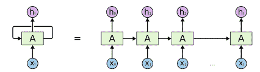
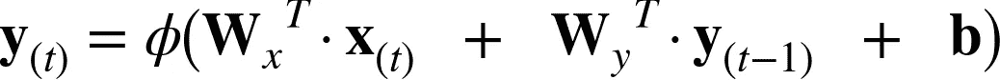
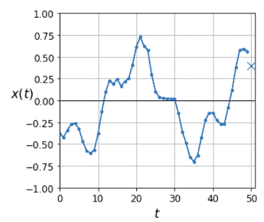
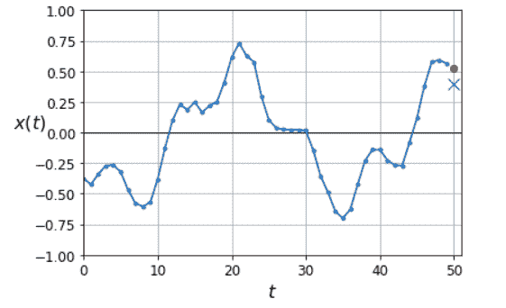
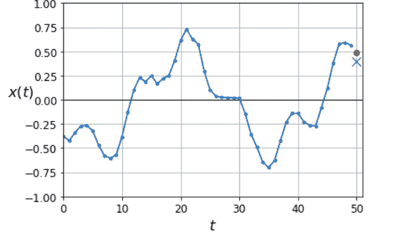

# 递归神经网络(RNN)和时间序列预测

> 原文：<https://medium.com/analytics-vidhya/recurrent-neural-networks-rnns-and-time-series-forecasting-d9ea933426b3?source=collection_archive---------3----------------------->

## **动机**

普通神经网络非常适合于许多简单的任务，如输入被分配一个类别或标签的分类问题，给定一组输入参数预测实数值的回归问题。这类网络的主要问题是它们不记得它们所学的东西，也就是说，在训练网络的每一次迭代之后，它会重新开始，而不记得它在之前的迭代中所学的任何东西。当数据是连续的时，这一特性使它们处于不利地位。

顺序数据意味着数据点是相互依赖的(时间 t 的数据依赖于时间 t-1 的数据)。例如时间序列数据，如股票价格、会话等。因此，RNNs(递归神经网络)出现了。你可以想象 rnn 有一种记忆感，这种记忆感有助于他们跟踪序列数据中早期发生的事情，从而帮助他们获得上下文并识别相关性和模式。

## **建筑**



RNN 看起来非常像前馈神经网络，唯一的区别是它有向后指向的连接。在每个时间步长 t，递归层接收输入 x(t)以及来自前一时间步长的输出。上图显示了最简单的 RNN，由单个神经元接收输入、计算输出并将其发送回自身组成

每个递归神经元有 2 组权重，一组用于当前时间步长的输入(wx)，另一组用于先前时间步长的输出(wy)。当考虑一层这样的神经元时，我们将每个权重放在矩阵 Wx 和 Wy 中。

整个循环层的输出可以计算如下



训练 rnn 的方法是将它们在时间上展开(就像我们在示例图像中所做的那样)，然后使用常规反向传播。这个过程被称为穿越时间的反向传播(BPTT)。

## **实际实施(时间序列预测)**

为简单起见，我们将使用下面给出的函数生成我们自己的时间序列数据。

```
import numpy as np
def generate_time_series(batch_size, n_steps):
    freq1, freq2, offsets1, offsets2 = np.random.rand(4, batch_size, 1)
    time = np.linspace(0, 1, n_steps)
    series = 0.5 * np.sin((time - offsets1) * (freq1 * 10 + 10))    # +wave 1
    series += 0.2 * np.sin((time - offsets2) * (freq2 * 20 + 20))            # +wave 2
    series += 0.1 * (np.random.rand(batch_size, n_steps) - 0.5)     # +noise
    return series[..., np.newaxis].astype(np.float32)
```

此函数通过 batch_size 参数根据需要创建尽可能多的单变量(每个时间步长一个值)时间序列。该函数返回一个 NumPy 数组，它是两个固定振幅、随机相位和频率的正弦波加上一点噪声的和。



上图显示了由我们的函数生成的单变量时间序列，它有 50 个时间步长。我们的目标是预测下一时间步的值(用 X 表示)

现在，我们将根据上述数据创建一个训练集、一个验证集和一个测试集。

```
n_steps = 50
series = generate_time_series(10000, n_steps + 1)
X_train, y_train = series[:7000, :n_steps], series[:7000, -1]
X_valid, y_valid = series[7000:9000, :n_steps], series[7000:9000, -1]
X_test, y_test = series[9000:, :n_steps], series[9000:, -1]
```

我们将构建两个模型，一个具有单个 RNN 层和单个神经元，另一个是具有多层的深度 RNN
为了编译我们的模型，我们将使用默认的 adam 优化器和 MSE 损失，使其适合我们 20 个时期的训练数据，并在我们的验证集上对其进行评估

**简单的 RNN**

```
import tensorflow as tf
from tensorflow import kerasmodel = keras.models.Sequential([
    keras.layers.SimpleRNN(1, input_shape=[None, 1])
])optimizer = keras.optimizers.Adam(lr=0.005)
model.compile(loss="mse", optimizer=optimizer)
history = model.fit(X_train, y_train, epochs=20,
                    validation_data=(X_valid, y_valid))
model.evaluate(X_valid, y_valid)
```

*请注意，RNN 图层使用的默认激活函数是双曲正切(tanh)

对于简单的 RNN，我们得到的损耗为 0.0108，这很好，但我们可以做得更好



**深 RNN**

```
model = keras.models.Sequential([
    keras.layers.SimpleRNN(10, return_sequences=True, input_shape=[None, 1]),
    keras.layers.SimpleRNN(10, return_sequences=True),
    keras.layers.SimpleRNN(1)
])model.compile(loss="mse", optimizer="adam")
history = model.fit(X_train, y_train, epochs=20,
                    validation_data=(X_valid, y_valid))model.evaluate(X_valid, y_valid)
```

在我们的前 2 层中，我们已经将返回序列参数设置为 True，因为默认情况下，RNN 层仅返回最终输出，但是对于我们的深层 rnn 层(除了最后一层，我们只关心最终预测)，我们需要处理每个时间步的输出。

我们的深度 RNN 模型达到 0.0026 的 mse，这比我们的简单 RNN 几乎好 10 倍。



在这篇博客中，我们只使用了简单的递归层，但在实践中，我们通常使用其他类型的递归层，如 LSTM 或 GRU，这有助于缓解像消失梯度的问题。我希望你们都觉得 rnn 很有趣，并且很想了解更多。我将为任何想更深入了解 rnn 及其用途的人添加参考资料和链接。请在评论区自由发表你的意见或任何关于博客的问题。

## **参考资料/进一步阅读**

*   [http://web . Stanford . edu/class/cs 224n/readings/cs 224n-2019-notes 05-LM _ rnn . pdf](http://web.stanford.edu/class/cs224n/readings/cs224n-2019-notes05-LM_RNN.pdf)
*   [https://www.youtube.com/watch?v=iWea12EAu6U&list = ploromvodv 4 rohcuxmzknm 7j 3 fvwbby 42 z&index = 7&t = 3633s](https://www.youtube.com/watch?v=iWea12EAu6U&list=PLoROMvodv4rOhcuXMZkNm7j3fVwBBY42z&index=7&t=3633s)
*   第 15 章，使用 Scikit-Learn、Keras 和 TensorFlow 进行机器学习:构建智能系统的概念、工具和技术