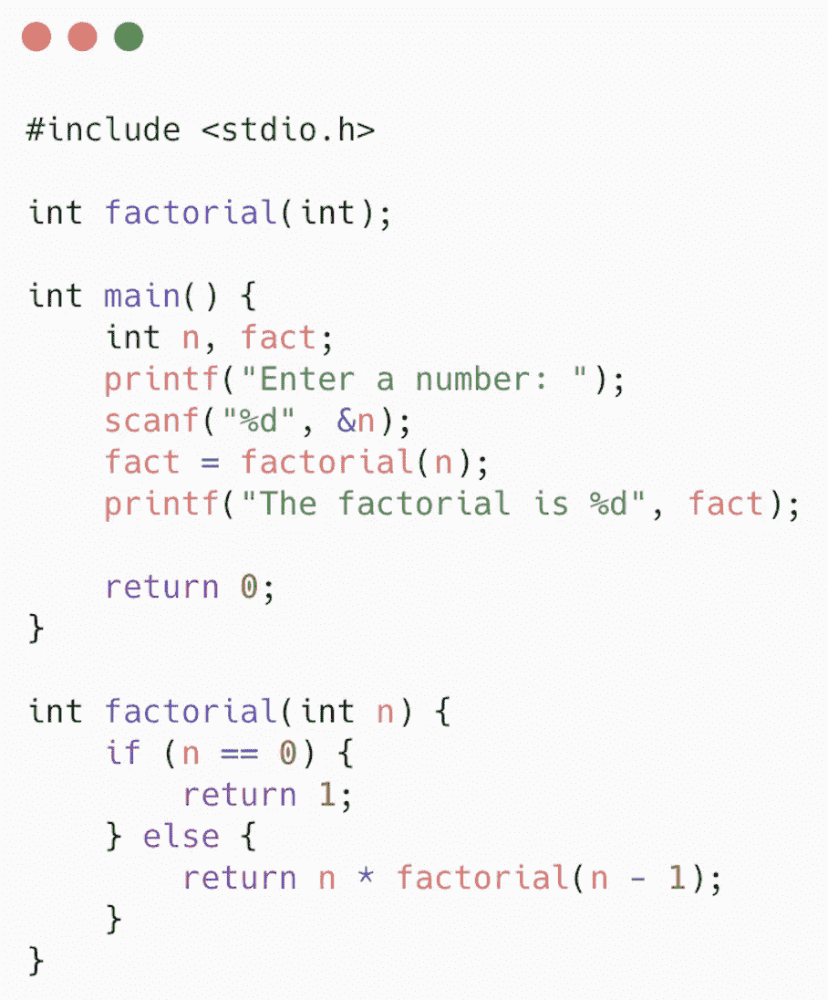

# 递归

> 原文：<https://medium.com/analytics-vidhya/recursion-37b6e6660623?source=collection_archive---------22----------------------->

递归是函数调用自身的特殊情况。

让我们用一个简单的例子来说明这一点。

main()函数调用自身。

当执行时，这个程序将产生类似如下的输出:

这是递归的一个例子

这是递归的一个例子

这是递归的一个例子

这是一个前

执行突然终止，否则，执行将无限期继续。这就是递归吗？这里 main()函数调用自己，而函数调用自己被称为递归函数。递归的一个最好的例子是计算一个数的阶乘。

对于要递归的函数，函数应该总是有两种情况:

*   **基础案例**
*   **一般或递归情况**

基础案例是已知的案例，即我们将放置已经固定或定义的结果。它只是有一些带有已知或预定义结果的 if 语句。类似地，一般情况或递归情况是将有函数调用的情况。迷茫？？👀让我给你看一个例子。

**一个数的阶乘** **(！)**

一个数的阶乘是从该数到 1 的所有数的乘积。例如，如果我们想计算一个数字 5 的阶乘，那么它等于从 5 到 1 的所有数字的乘积，即 5 x 4 x 3 x 2 x 1，等于 120。

在处理一个数的阶乘问题时，我们已知的情况是值为 0！即 1。这基本上是我们的基本情况。现在我们来推导一些有趣的东西。

从上图可以清楚地看出，为了计算一项的值，我们应该知道前一项的值，所以这里将连续调用该函数，直到它到达终点。

因此公式**n x(n-1)**的阶乘是我们的递归情况。

在上面的示例中，我创建了一个整数类型的函数 factorial，其中传递了一个整数类型的参数，该参数简单地表示用户将输入的数字，其中有一个 if 语句，该语句包含一个已知的 case，该 case 仅在用户输入数字 0 时才有效，它将返回 1，如果用户输入的数字不是 0，则将执行一般情况的条件。

这是整个程序的样子

计算阶乘的 c 程序

这个程序的输出会是这样的:

