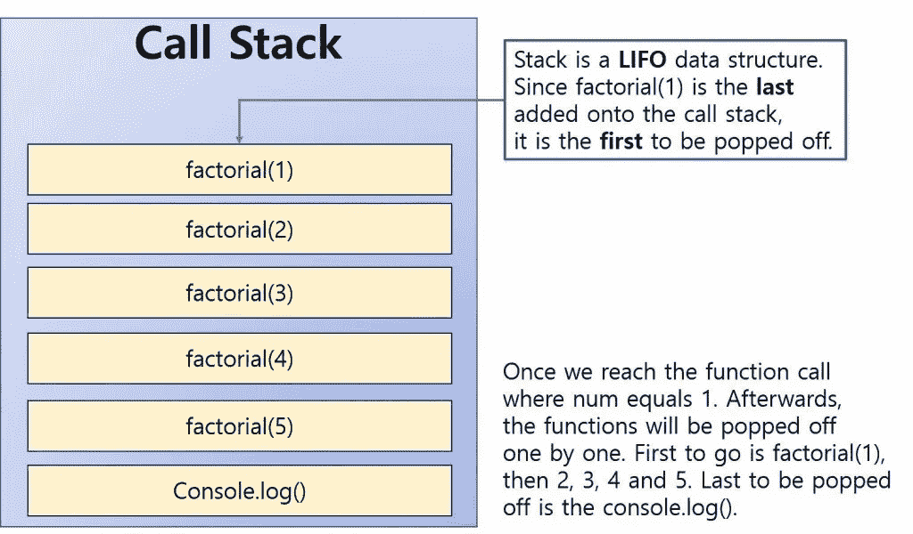

# 递归与显式堆栈

> 原文：<https://medium.com/analytics-vidhya/recursion-vs-explicit-stacks-44d9bd14cb0a?source=collection_archive---------3----------------------->

前几天，我试图解决一个与树数据结构相关的问题。通常，大多数与树/图相关的问题的解决方案本质上都是递归的。

递归涉及到隐式堆栈的使用。这是由用来编译代码的编译器在后台实现的。

这个由编译器创建的后台栈被称为一个' [**调用栈**](https://en.wikipedia.org/wiki/Call_stack) **'。**维基百科将调用栈定义为[栈](https://en.wikipedia.org/wiki/Stack_(abstract_data_type)) [数据结构](https://en.wikipedia.org/wiki/Data_structure)，它存储关于[计算机程序](https://en.wikipedia.org/wiki/Computer_program)的活动[子例程](https://en.wikipedia.org/wiki/Subroutine)的信息。它还有其他名称，如运行时堆栈，但这是最常见的名称。

每个函数/子程序调用都使用调用堆栈内的一个框架，称为**堆栈框架**。当一个函数返回值时，它的堆栈框架被弹出调用堆栈。

这让我想到，如果我实现自己的显式堆栈来解决问题，而不是使用递归来完成任务，会怎么样？有哪些权衡？

# 堆栈溢出

这两个堆栈的根本区别在于，编译器为程序调用堆栈分配的空间是固定的。这意味着，如果你不确定递归函数调用的最大次数，就会出现堆栈溢出，而且在给定的时间点，调用的次数远远超过分配给堆栈的空间所能处理的。

另一方面，如果你定义了一个显式堆栈，它是在运行时编译器分配给程序的**堆**空间上实现的。您猜怎么着，堆大小不是固定的，可以在运行时根据需要动态增加。您实际上不必担心显式堆栈溢出。这对于可伸缩性和管理存在深度递归调用的不可避免的极端情况是有益的。

# 空间和时间

对于给定的情况，哪一个会更快？

在不支持递归相关优化(如针对尾部递归的尾部调用优化)的语言中，在显式堆栈上迭代可能比递归更快。

什么是全部递归？

尾递归是递归的一种特殊情况，其中递归函数在递归函数调用后不再进行任何计算，即函数的最后一步是对递归函数的调用。

什么是**尾音优化(TCO)** ？

尾调用优化是您能够避免为函数分配新的堆栈帧的地方，因为调用函数将简单地返回它从被调用函数获得的值。

因此，支持尾部调用优化的编译器/语言在调用栈中只使用一个**栈帧**来实现对递归函数的调用。如果你的编译器/语言不支持这一点，那么使用显式堆栈将会节省你大量的空间和时间。

Python 不支持尾部调用优化。这样做的主要原因是为了有一个完整而清晰的堆栈跟踪，从而实现高效的调试。

几乎所有的 C/C++编译器都支持尾部调用优化。

# 直觉

对于一些人来说，很难理解递归解决方案。它只是不符合认知。当使用多个参数时，有时显式控制堆栈有助于简化事情。

另一方面，递归解决方案使源代码的大小变得更小，更易于维护。

# 结论

最后，没有固定的答案。对于特定的场景，需要考虑许多因素，例如可伸缩性、代码可维护性、使用的语言/编译器等。

最好的方法是使用这两种方法实现解决方案，在将它部署到生产环境之前，对输入集上的两个解决方案进行计时，并分析峰值空间利用率。