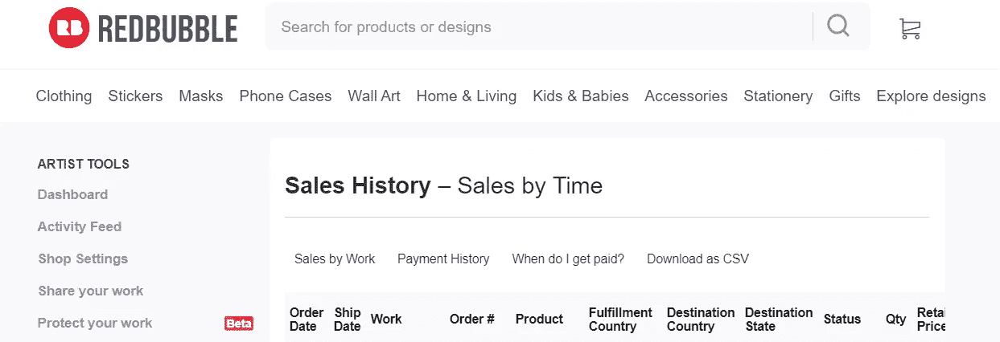
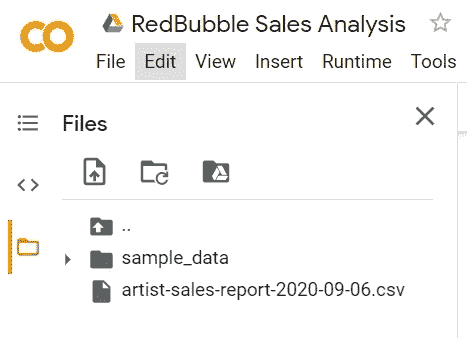
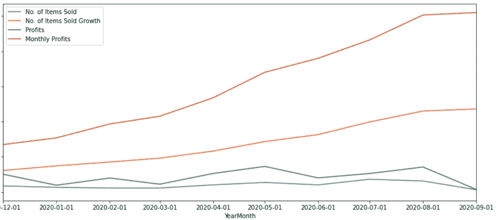
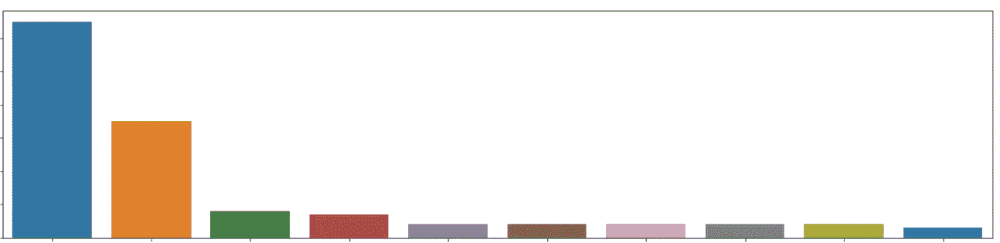
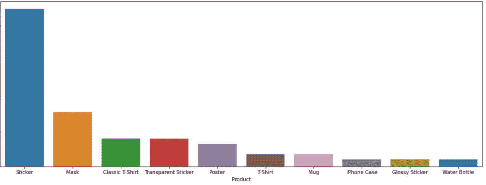
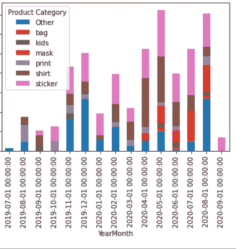

# 使用 Python 进行 RedBubble 销售分析

> 原文：<https://medium.com/analytics-vidhya/redbubble-sales-analysis-using-python-916a2070d8a3?source=collection_archive---------15----------------------->

我已经创建了一个[笔记本](https://colab.research.google.com/drive/1PLGv6oEfCS0cvPFkJBiKpZhLcbkta1dC?usp=sharing)，它将允许 RedBubble 艺术家从他们的 RedBubble 页面对销售数据进行基本分析。

RedBubble 是一种按需印刷服务，它为你做所有艰苦的工作，作为回报，你可以在他们的网站上托管你的设计，并接受每笔销售的小额佣金。他们为你做印刷和营销，让你腾出时间专注于做出好的设计，并帮助人们找到它们。

RedBubble 通过提供人们如何访问他们的页面的仪表板，帮助他们的创意人员跟踪他们的进度。如果这还不够好，艺术家可以下载销售历史，自己做进一步的分析。

**为什么不用 Excel 做这个呢？**

Excel 非常适合手动移动数据，如果你有必要的技能，你可以在 Excel 中做任何事情。Python 的好处是可以更容易地自动化数据的拖放

**这个笔记本能做什么？**

目的是能够简单地从 RedBubble(销售历史)上传一个 CSV，并批量运行所有功能，产生对您个人重要的有用见解。

**为什么使用 Google Colab？**

它是与 Kaggle 和 Jupyter Notebook 并列的最容易使用的 Python 笔记本应用程序。你只需要一个谷歌账户，就可以下载一份拷贝到你的谷歌硬盘上。

```
If you’re here, you’re probably looking to learn Python — can I recommend [DataCamp which have interactive courses and more Python notebook templates like this](https://datacamp.pxf.io/QO67VP) to allow you to explore datasets and perform machine learning tasks with ease.On another note, where do you design your merchandise and have you heard of [Canva](https://partner.canva.com/e4AYyD) or [Placeit](https://1.envato.market/jWOYxv)? Combining these two will allow you to create new, unique designs that appeal to your niche audiences.
```

## 从 RedBubble 下载您的销售历史记录:

转到[https://www.redbubble.com/account/sales/by_sale](https://www.redbubble.com/account/sales/by_sale)



## 将下载的 CSV 文件上传到您的 Google Colab 文件副本中



将文件路径复制到笔记本中显示的所需代码框中，并运行每个代码块以查看您的见解。

笔记本中的主要部分包括:

*   **上传销售历史 CSV**
*   **将销售日期转换为正确的格式**
*   **汇总表**
*   **趋势和模式图**

## 这些图表对艺术家来说最有价值，包括:

*   按月统计的总销售额增长折线图
*   销量最高的设计(作品)条形图
*   最高销售产品条形图
*   最高销售额和最高利润类别的堆积条形图



每月总销售额增长

你可能想看看你是否没有利润，但你卖更多的低价值单位，或反之亦然。这样你可以调整你的策略。



最畅销的作品

我觉得很多人都会有类似的销售分割，你主要通过小部分产品进行销售。



销量最高的产品

我不介意给你看我卖的产品的比例:)



每月产品类别的利润

这里的[谷歌 Colab 笔记本](https://colab.research.google.com/drive/1PLGv6oEfCS0cvPFkJBiKpZhLcbkta1dC?usp=sharing)。复制一份，并通过它运行您自己的销售历史。