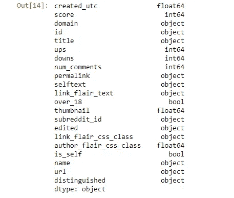

# Reddit:魅力之门。

> 原文：<https://medium.com/analytics-vidhya/reddit-a-gateway-to-fascination-af854b317f77?source=collection_archive---------19----------------------->

从建造雅典卫城的石头到你邻居早上 5 点的想法，你几乎可以在网上找到任何东西。你可能同意不同意，但在 21 世纪，互联网是娱乐丰富的主食，人类不能没有它。Reddit 是世界上最受欢迎的门户网站之一。

查看 reddit 就像阅读日报一样，只是 Reddit 是交互式的、个性化的、参与式的、匿名的和民主的。Reddit 的独特之处在于，它为我们提供了一个人类认为有趣的视角。由于没有编辑，Reddit 链接会根据一个评分机制移动到顶部，该机制基本上是一个链接收到的向上投票和向下投票的差异(得分)。我们对这种信息共享的民主模式非常好奇，所以我们决定探索一个子 reddit 数据集，并对我们的中心问题进行推理:**一篇 Reddit 帖子进入每个子 Reddit 的前 1000 篇帖子(基于分数)需要什么？**

subreddit 是一个人们可以参与的主题。我们有一个包含 18 个子数据集的数据集，是由 Ammar Alyousfi 上传到 Kaggle 上的。其中一些包括书籍、世界新闻和生活类节目。

我们数据集中的子编辑列表。

该数据收集于 2013 年 8 月 15 日至 20 日之间。每个子编辑中的列如下:

原始数据集中的列。

我们删除了列:“distinguished”、“is_self”、“author_flair_css_class”、“link_flair_css_class”、“link_flair_text”、“subreddit_id”和“edited”，因为这些列包含的信息与我们对成功帖子的分析无关。(我们将一篇文章的成功定义为它位于前 1000 名。)

由于帖子创建的时间是以 UTC 格式给出的，我们将其转换为一个日期，添加了时间、日期、月份和年份列，以便更好地了解这些帖子是如何随着时间的推移而发展的。还增加了一个“反应”栏，它是在添加了一篇帖子的评论数、投票数和投票数之后创建的。

为了更好地理解中心问题，我们决定对数据集中各种变量之间的关系引入一些子分析。以下是我们考虑的一些关系和问题:

1.  在排名前 1000 的帖子中，reddit 帖子的标题长度是最常见的？
2.  媒体附件与反应数量的关系。
3.  超过 18 个帖子更有可能出现在前 1000 名的列表中吗？
4.  哪些子歌曲比其他歌曲更受欢迎？
5.  一个帖子的评论数量影响成功吗？
6.  在排名前 1000 的帖子中，有哪些经常被重复的词？
7.  一天中什么时候是成功发布帖子的最佳时间？
8.  使用统计推断的媒体和分数的相关性。
9.  机器学习模型可以使用某些特征预测给定帖子的分数吗？

在排名前 1000 的帖子中，reddit 帖子最常见的标题长度是多少？

为了了解标题长度是否会影响一篇文章是否能进入前 1000 名，我们为每个子主题绘制了一个直方图，并为所有子主题的比较绘制了一个直方图。这些图表比较了不同标题长度的文章数量。总的来说，我们观察到的趋势是，标题长度较短(大约 20-40 个字符)的帖子在所有子主题中最常见。然而，在一些类别中观察到了一些差异，即在“今天我学到了”中，相对较长的标题进入了前 1000 名。在“获得动力”、“像我 5 岁一样解释”和“笑话”中，几乎所有的帖子都有很短的标题，表明人们喜欢在幽默和动力方面保持简洁。虽然我们最初想确定标题长度是否影响帖子获得的参与次数，但我们的 EDA 发现相关矩阵表明标题长度和反应之间存在微弱的正相关关系。

两个子主题的直方图:“笑话”和“今日学习”

文章数量与标题长度。

**有媒体的帖子比没有媒体的帖子有更多的参与度吗？**

在这个上下文中，我们将媒体定义为图片、gif、视频和链接。有媒体和没有媒体的帖子的反应比较仅限于三个子主题，“生活专业建议”，“书籍”和“今天我学到了”，因为这些是唯一在媒体方面具有可比帖子差异的子主题。数据集中的其他子编辑要么包含所有媒体帖子，如“Aww”和“Food”，要么包含所有文本，如“淋浴想法”和“询问 Reddit”。一些包含两种类型帖子的类别(“电影”和“搞笑”)在数量上差别很小，因此无法进行比较。

在所有子主题中，我们发现媒体和分数之间存在中度正相关，媒体和反应之间存在弱正相关。最有趣的是，媒体和帖子的评论数量之间存在微弱的负相关。

我们将两个子主题放在显微镜下进行分析:“生活小贴士”和“书籍”在“生活专业小贴士”中，有 361 个帖子有媒体，639 个没有。我们观察到在包含媒体的帖子上有 1.53%以上的反应，但是当有媒体时，分数下降了-1.02%。在“书籍”中，有 849 个帖子有媒体，151 个帖子没有媒体。在有媒体的情况下，一个帖子被观察到有 7%以上的反应和 9.3%的分数增加。

我们可以将这些差异归因于可供比较的职位数量的差异，毫无疑问，如果差异为 50-50，将会得出更准确的结论。

有媒体和没有媒体的帖子在“书籍”中的平均反应。

有媒体和没有媒体的帖子在“生活专业建议”中的平均反应。

**超过 18 个帖子更有可能进入前 1000 名吗？**

由于 Reddit 比其他社交媒体平台允许更大的匿名性，我们很好奇是否超过 18 篇帖子有更高的机会进入前 1000 名。我们首先画了一些数字，以了解每个子编辑中超过 18 个帖子的比例。

每个分区超过 18 个职位的比例。

如以上所示，帖子在子栏中的分布各不相同。AskReddit 拥有超过 18 个帖子的最高数量。现在让我们比较一下 18 岁以上职位与正常职位(非 18 岁以上职位)的竞争情况。

比较所有子主题中正常帖子和超过 18 个帖子的平均分数。

我们看到，除了“LifeProTip”、“explainlikeimfive”和“todayilearned”等少数例外，18 分以上的平均分数与正常帖子没有实质性的区别。这一分析揭示了一个事实，即无论是否超过 18 岁，都不会影响帖子的成功几率。

哪些子歌曲比其他歌曲更受欢迎？

我们根据帖子的反响来定义帖子的受欢迎程度。出于这个目的，我们从每个有替换的子编辑中抽取了 500 篇帖子，计算了所有回复的总和并计算了平均值。这一过程重复了 100 次，以考虑可能影响每个子区域内雇佣代表值的异常值。

对每个子区域内交战的分析。

是的，没错，人们通常喜欢有趣的东西。这是对人类行为的有力洞察。我们意识到，一个能让你发笑的帖子比一个谈论书籍或淋浴想法的帖子更有吸引力。

**帖子的评论数量会影响成功吗？**

接下来，我们发现一个帖子的评论数量是否决定了它进入前 1000 名的前景。我们创建了一些散点图和等高线图来理解这种关系。

子编辑的等高线图:“书籍”和“AskReddit”

子编辑的散点图:“图书”和“AskReddit”

从这些可视化的所有子编辑中的一般观察是，评论的数量聚集在特定的区域周围。等高线图中的深蓝色区域显示大多数帖子都有这样的评论和分数范围。对于一些子编辑，帖子的分数不会随着评论数量的增加而改变。而对于其他人，评论的数量并不随着分数的增加而改变。这可以通过在垂直
或水平方向流动的蓝色阴影所代表的轮廓密度看出。
我们的结论是，评论数量和帖子成功之间的关系并不明确，因此我们不能说评论是帖子达到前 1000 的决定性因素。

**前 1000 篇帖子中有哪些经常重复出现的单词？**

分析的直观部分来了。我们试图通过利用 Python 单词云来模拟主题在所有子编辑中的流行程度。首先，我们使用词干分析器功能将单词缩减为它们的词根/基本单词。接下来，我们计算了这些词在文章标题中出现的频率。最后，我们通过删除常用词，如 why、the、where、for 等，清理了最终的单词列表。最终结果是一个单词云，每个单词的相对大小代表了它在标题中出现的频率。

出现在“aww”子编辑中的帖子标题中的最流行的词。

不出所料，我们发现了猫、狗、小狗，偶尔还发现了一个人们在可爱的“aww”subredit 中谈论最多的家伙。人类觉得其他物种比自己可爱。这让我们有点受宠若惊。或者等等，也许我们的分析走得太远了？

为了找出所有子编辑中的热门词，我们计算了每个子编辑中使用的前 25 个词，然后将它们映射到 reddit 掩码中。

在所有子主题的标题中出现的最流行的单词。

一天中发布成功帖子的最佳时间是什么时候？

最后，我们查看了《时代》杂志子栏目中排名前 1000 的帖子。我们使用 Python datetime 库将数据集中的 UTC 时间转换为一天中的小时。然后，我们汇总了一天中所有子街道每小时的帖子数量。

一天中所有子街道每小时发布的帖子数量。

我们发现，前 1000 篇帖子中的大部分都是在白天发布的。上午 11 点至下午 3 点有上升趋势。这给了我们一个想法，大多数成功的帖子都是在白天发布的。原因可能在于用户可能会在午休时使用 Reddit 来查看世界各地发生的事情。

**利用统计推断探索与媒体的相关性和帖子的评分**

我们采用了 A/B 测试来测试一篇文章的成功是否依赖于媒体附件，并在两个子领域进行了假设测试:生活小贴士和书籍。之所以选择这两个类别，是因为它们在有媒体和没有媒体的情况下，帖子数量相当。

**零假设**:在子编辑中，有媒体的帖子数量与无媒体的帖子数量来自相同的分布。

**替代假设**:子编辑中有媒体的帖子平均比没有媒体的帖子得分高。

**A 组:**跟媒体的帖子。

**B 组:**无媒体的岗位。

我们对媒体为“A”的帖子的平均分数和没有媒体为“B”的帖子的平均分数(即“A-B ”)进行了比较。较大的差异表明数据支持替代假设。为了测试零假设，我们打乱了这些子数据中的所有分数。换句话说，如果零假设是真的，两组分数的所有排列都是同样可能的。

“书籍”子编辑中分数差异的分布直方图。

由于这个分布的 p 值是 0.001，这意味着在“图书”子编辑中，包括媒体是重要的。因此，我们拒绝零假设。有媒体和没有媒体的帖子的平均得分之间的差异很大，这意味着在图书子编辑中的帖子中添加媒体更有可能进入前 1000 名。

“LifeProTips”子编辑中分数差异的分布直方图。

由于该分布的 p 值为 0.769，这意味着在“LifeProTips”子编辑中，包括媒体并不重要。因此，我们接受零假设。有媒体和没有媒体的帖子的平均得分之间的差异并不显著，这意味着在 LifeProTips 子编辑中的帖子中添加媒体并不会使其更有可能进入前 1000 名。

**用于分数预测的机器学习模型**

我们对我们的机器学习模型使用多元线性回归来预测给定某些特征的值的子编辑中的帖子的分数。为了实现这一点，我们采用了所有 18 个子网格的数据。

我们关注的功能如下:

**定量:**

1.  评论数量
2.  标题长度
3.  起伏不定

**布尔/一键编码:**

1.  超过 _18(布尔型)
2.  媒体(布尔值)
3.  子编辑(18 个子编辑)
4.  一天中的小时(24 小时)

**定性:**

1.  标题(单词袋/二元/三元模型)

基础数据框。

我们首先将来自所有子编辑的帖子组合在一起，然后为每个帖子定义子编辑。对于我们的培训和测试，我们使用我们数据的 **10%** 进行测试，使用 **90%** 进行培训，即我们在 **17999** 中的 **1800** 个岗位上进行测试。我们的训练集被**分成五份**以获得交叉验证集。我们计算了三种类型的误差进行比较，训练误差告诉我们模型在训练数据集上的表现如何，测试误差显示模型在未知测试数据上的表现如何，交叉验证误差允许我们更好地估计回归模型的测试误差并选择最佳模型。

单个定性特征，标题，通过单词包编码和一次从标题中分组两个(二元)或三个(三元)单词来建模。其他布尔或一键编码特性有 subreddit、over 18、media 和 hour of the day(包含在 model 5 及以后的版本中)。最初固定的数量特征是评论数量和标题长度。所有型号中的固定功能如下:

*   标题
*   子编辑
*   18 岁以上
*   媒体
*   标题长度
*   评论数量

前三个模型用于决定起伏是否应该包括在特征列表中。在**的第一个模型**中，我们排除了起伏，并观察到验证和测试误差很高，很可能是因为我们的模型缺乏复杂性。另一方面，训练误差很低。对于我们的**第二个型号**，只包括 ups，因此增加了型号的复杂性。可以看到验证和测试误差显著减少，这可能是由于与模型 1 相比复杂性增加。在**的第三款**中，只包括了羽绒以增加模型的复杂性。第二个和第三个模型具有可比较的差异，因此我们得出结论，仅包括这些特征中的一个就足以进行预测。

第四个模型验证了我们的预期，即如果同时使用上升和下降，误差将为零。由于分数是上升和下降的线性组合，如果我们在模型中包括这两个特征，误差应该为零。

由于模型 2 显示出最少的误差，后续的模型包括 Ups 作为一个固定的定量特征。

我们的第五款**车型**将一天中的一个小时作为一个功能与其他车型并列。这一增加的特征进一步增加了模型的复杂性，因为验证和测试误差较低。然而，训练误差仍然与以前的模型相似。由于这种准确性的提高，在随后的模型中，一天中的时间成为固定的热编码特征。从**第六款**开始，在标题上实现了双字母编码。与以前的模型相比，训练、验证和测试错误显著减少，这可归因于复杂性的增加。最后，在**第七个模型**中，与模型 6 相比，标题上三元模型编码的实现显示误差略有减少。我们再次将这种下降归因于复杂性的增加，但错误的减少是微小的，所以我们没有继续使用 n-gram 编码。

所有 7 个模型的训练、测试和交叉验证错误。

我们的目标是减少基本模型的标准误差，以提高从我们数据集的 18 个子数据中预测任意 reddit 帖子得分的准确性。**模型 7** 是最准确的，即它具有最低的误差，因此我们继续使用岭回归对其进行正则化，以增强我们的结果。

第一步是确定在我们的岭回归中使用什么样的α值。Alpha 决定了模型中特定特征的重要性。我们试图通过对从 0.5 到 20 的阿尔法值进行岭回归来计算 RMSE，在这个范围内取 30 个阿尔法值。输出结果显示，最小化验证和测试误差的最佳 alpha 是 20，因为这是图形到达转折点的地方。

来自具有多个α值的岭回归的 RMSEs。

使用**模型 7** 作为默认模型，我们可以在分析中增加三个模型。前两个通过应用 alphas 为 0.5 和 20 的岭回归。这两个模型描绘了相似的结果，但是误差稍微减少了，α值为 20，这被称为最佳α值。

在最终的模型中，**模型 8，**我们使用套索回归进行正则化。由于硬件限制和模型的更高复杂性，我们只能用 1 的 alpha 值运行一次，但结果证明这是我们验证和测试错误最少的最佳模型。

所有 10 个模型的训练、测试和交叉验证错误。

**总结…**

总之，最佳模型给出了大约 700 的 RMSE。虽然这看起来很高，但它与从 2000 到 5800 的分数范围相匹配。对于最好的情况，即最大分数 5800，有大约 12%的误差，对于最差的情况，即最小分数 2000，有大约 35%的误差。因此，我们意识到，使用正确的特征，模型可以在某种程度上预测帖子的分数。这意味着给定一个帖子，我们可以预测它的分数，并查看它在前 1000 个帖子中的排名。

在这个分析的最后，我们获得了一些有价值的见解，这些见解是关于影响帖子在 Reddit 上成功的变量的。我们看到，短标题长度，谈论标题中的某些主题，附上媒体，白天发布并在帖子中添加幽默可以增加进入前 1000 名的可能性。

我们希望您发现这个分析很有趣！

这一分析得益于以下人士的贡献:阿德南·阿巴斯、阿卜杜勒·穆隆姆、马沙尔·阿巴斯、穆罕默德·阿希尔、努鲁莱恩·雅各布和沙赫帕尔·汗。