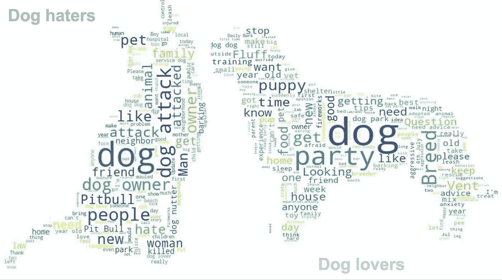
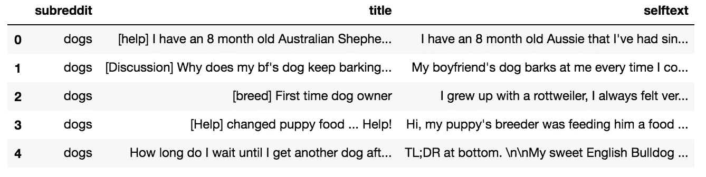
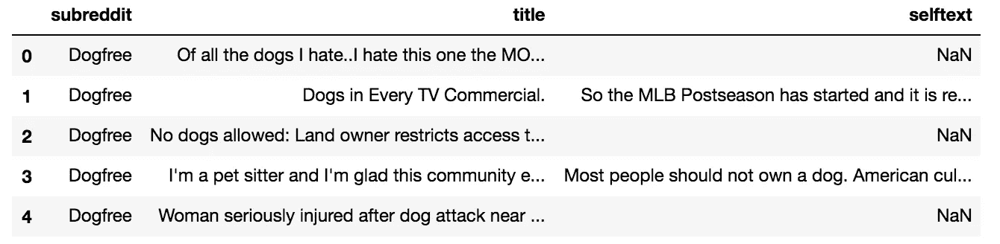
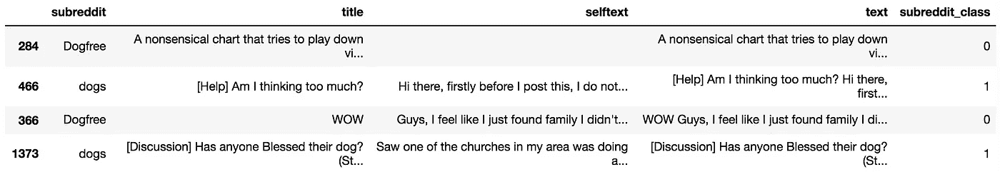
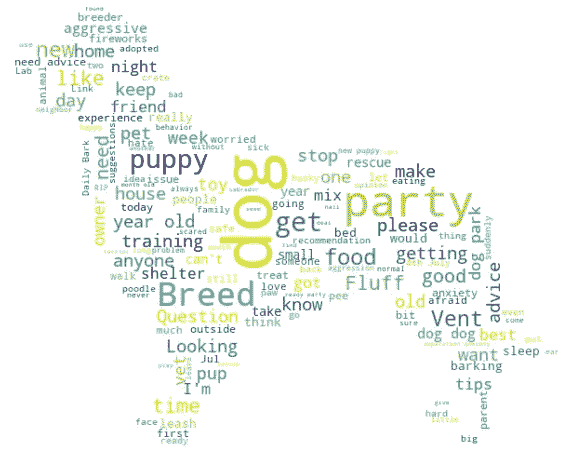
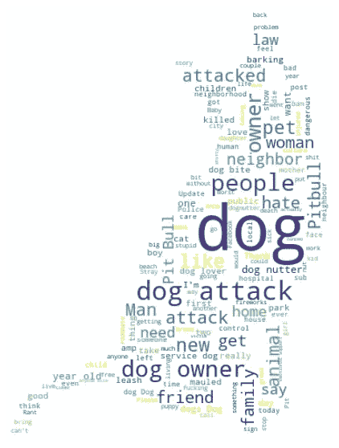

# Reddit 发布了使用自然语言处理、熊猫和 S3 的分类

> 原文：<https://medium.com/analytics-vidhya/reddit-posts-classification-using-nlp-pandas-and-s3-68045246a90e?source=collection_archive---------12----------------------->

在我的上一篇[帖子](/@tonya.chernyshova/loading-reddit-posts-using-aws-lambda-and-cloudwatch-events-7e58cbddd000)中，我使用 AWS lambda 和 CloudWatch 事件自动收集了 S3 的 reddit 帖子。在这篇文章中，我们将从两个子编辑中提取文章，并构建一个 ML 分类模型来识别给定文章属于哪个子编辑。



对于这个项目，我选择了高度相关的子编辑:

*   爱狗人士 subreddit—【https://www.reddit.com/r/dogs/ 
*   憎恨狗的人 subreddit—【https://www.reddit.com/r/Dogfree 

让我们打开 Jupyter 笔记本，从加载两个子编辑的帖子开始。熊猫有一个从 S3 读取文件的便捷方法。

```
**import** pandas **as** pd
**import** numpy **as** np#name of the bucket with reddit posts
bucket_name = 'nlp-reddit-posts'df_dogs = pd.**read_csv**('s3://' + bucket_name + '/dogs.csv')
df_dogs = df_dogs[['subreddit', 'title', 'selftext']]
df_dogs.**head**()
```



```
df_dogfree = pd.**read_csv**('s3://' + bucket_name + '/Dogfree.csv')
df_dogfree = df_dogfree[['subreddit','title','text']]
df_dogfree.**head**()
```



正如我们所看到的，有些帖子没有文字。这样的帖子由标题和一些外部资源的链接组成。让我们连接两个数据帧，并查看一些统计数据:

```
df = pd.**concat**([df_dogs, df_dogfree]) 
df.**shape** (2245, 3)df.**isnull**().sum().sort_values(ascending=**False**)
selftext     618
title        0  
subreddit    0  
dtype: int64df['subreddit'].**value_counts**()
dogs       1127
Dogfree    1118
Name: subreddit, dtype: int64
```

让我们用空文本替换空值，并将标题和自文本连接起来。同样，让我们创建一个列 subreddit_class，它将 subreddit 表示为二进制值 0 或 1。

```
df.**replace**(np.nan, '', inplace=**True**)
df['text'] = df['title']  + ' ' + df['selftext']df['subreddit_class'] = [1 **if** i == 'dogs' **else** 0 **for** i **in** df['subreddit']]df.sample(frac=1)
```



让我们以一只狗和一只猫的形状创建漂亮的单词云:

```
**from** wordcloud **import** WordCloud, STOPWORDS, ImageColorGenerator
**from** nltk.corpus **import** stopwords# exclude stop words from the cloud
stop_words = stopwords.**words**('english') + ['help', 'discussion']**def** world_cloud(text, filename, mask=**None**):
    wordcloud = WordCloud(max_font_size=72, max_words=150,
                      background_color="white",
                      stopwords = stop_words,
                      mask=mask).**generate**(text)
    plt.**figure**(figsize=(10,10))
    plt.**imshow**(wordcloud, interpolation="bilinear");
    plt.**axis**("off");
    plt.**show**();
```

爱狗人士云可以这样创建:

```
# break down titles of "dogs" subreddit and concatenate them
text_dogs = " ".**join**(text **for** text **in** df['title'][(df['subreddit']=='dogs')]) # image with a shape of a dog
url_dog='https://render.fineartamerica.com/images/rendered/default/print/8.000/6.375/break/images-medium-5/golden-retriever-dog-vector-silhouette-helgamariah.jpg'mask_dog=np.**array**(Image.**open**(requests.**get**(url_dog,stream=**True**).**raw**))world_cloud(text_dogs, 'dogs', mask_dog)
```



类似地，憎恨狗的云可以这样创建:

```
# break down titles of "dogfree" subreddit and concatenate them
text_dogfree = " ".**join**(text **for** text **in** df['title'][(df['subreddit'] == 'Dogfree')]) # image with a shape of a cat
url_cat='[https://images-na.ssl-images-amazon.com/images/I/31CaLdDFlKL.jpg'](https://images-na.ssl-images-amazon.com/images/I/31CaLdDFlKL.jpg')mask_cat=np.**array**(Image.**open**(requests.**get**(url_cat,stream=True).**raw**))
world_cloud(text_dogfree, 'dog_free_shape', mask_cat)
```



让我们使用[自然语言工具包](https://www.nltk.org/)对帖子中的文本进行分词和词干处理:

```
**from** nltk.tokenize **import** RegexpTokenizer 
**from** nltk.stem.porter **import** PorterStemmer**def** steam_text(text):    
    stemmer = PorterStemmer()
    tokenizer = RegexpTokenizer(r'\w+')
    text_token = tokenizer.**tokenize**(text.**lower**())  
    **return** ' '.**join**(map(**lambda** x: stemmer.**stem**(x), text_token))df['stemmed_text'] = df['text'].**apply**(steam_text)
```

创建我们的特征矩阵(X)和目标向量(y ),并分割成训练和测试数据集:

```
X = df['stemmed_text'] 
y = df['subreddit_class']
X_train, X_test, y_train, y_test = train_test_split(X, y, 
                                                    stratify=y, 
                                                    random_state=42)
```

对于基线估计量，让我们取具有最多观察值的类，并使用该类作为所有预测的结果。在这种情况下，我们的基线模型精度将为 0.5018 或 50.18%:

```
y_test.**value_counts**(normalize=True)
1    0.501779
0    0.498221
Name: subreddit_class, dtype: float64
```

让我们使用 Gridsearch 为超参数调整训练 3 个模型。首先是逻辑回归:

```
pipe_lr_tf = Pipeline([
    ('tf', TfidfVectorizer()),
    ('lr', LogisticRegression())
])

params_lr_tf = {
    'tf__stop_words':   [None, 'english'],
    'tf__max_features': [1000, 2000, 3000, 4000], 
    'tf__ngram_range':  [(1, 1), (1, 2), (1, 3)], 
    'lr__penalty':      ['l2', 'l1'],
    'lr__C':            [.5, .01, 1],
    'lr__random_state': [42] 
}
gs_lr_tf = GridSearchCV(pipe_lr_tf, 
                        param_grid=params_lr_tf,
                        cv=5,
                        n_jobs=2,
                        verbose=1)

gs_lr_tf.fit(X_train, y_train)

**print**(f'GridSearch Best Params: **{gs_lr_tf.best_params_}**')
**print**('Train Score:', gs_lr_tf.**score**(X_train, y_train))
**print**('Test Score:', gs_lr_tf.**score**(X_test, y_test))

GridSearch Best Params: {'lr__C': 1, 'lr__penalty': 'l2', 'lr__random_state': 42, 'tf__max_features': 1000, 'tf__ngram_range': (1, 2), 'tf__stop_words': 'english'}
Train Score: 0.976232917409388
Test Score: 0.9537366548042705
```

接下来让我们试试朴素贝叶斯:

```
pipe_multinomial_nb_cvec = Pipeline([
    ('cvec', CountVectorizer()),
    ('multinomial_nb', MultinomialNB())
])

params_multinomial_nb_cvec = {
    'cvec__stop_words':           [None, 'english'],
    'cvec__max_features':         [100, 500, 1000, 2000, 3000, 4000], 
    'cvec__ngram_range':          [(1, 1), (1, 2), (1, 3)],
    'multinomial_nb__alpha':     [0], *# 2, 5, .5, 1*
    'multinomial_nb__fit_prior': [**True**, **False**]
}

gs_multinomial_nb_cvec = GridSearchCV(pipe_multinomial_nb_cvec, 
                        param_grid=params_multinomial_nb_cvec,
                        cv=5,
                        n_jobs=2,
                        verbose=1)

gs_multinomial_nb_cvec.**fit**(X_train, y_train)

**print**(f'GridSearch Best Params:{gs_multinomial_nb_cvec.best_params_}')
**print**('Train Score:', gs_multinomial_nb_cvec.**score**(X_train, y_train))
**print**('Test Score:', gs_multinomial_nb_cvec.**score**(X_test, y_test))GridSearch Best Params: {'cvec__max_features': 1000, 'cvec__ngram_range': (1, 1), 'cvec__stop_words': 'english', 'multinomial_nb__alpha': 0, 'multinomial_nb__fit_prior': False}
Train Score: 0.9477124183006536
Test Score: 0.9234875444839857
```

最后，随机森林:

```
pipe_rf_tf = Pipeline([
    ('tf', TfidfVectorizer()),
    ('rf', RandomForestClassifier())
])

params_rf_tf={
    'tf__stop_words':   [None, 'english'],
    'tf__max_features': [1000, 2000, 3000],
    'tf__ngram_range':  [(1,1), (1, 2)],
    'tf__smooth_idf':   [**True**, **False**],
    'rf__n_estimators': [25, 50, 100], 
    'rf__criterion':    ['gini'], *#'entropy',*
    'rf__max_depth':    [3, 5], 
    'rf__random_state': [42]
}
gs_rf_tf = GridSearchCV(pipe_rf_tf,
                        param_grid=params_rf_tf, 
                        cv=5,
                        n_jobs=2,
                        verbose=1)

gs_rf_tf.**fit**(X_train, y_train)

**print**(f'GridSearch Best Params: {gs_rf_tf.best_params_}')
**print**('Train Score:', gs_rf_tf.**score**(X_train, y_train))
**print**('Test Score:', gs_rf_tf.**score**(X_test, y_test))GridSearch Best Params: {'rf__criterion': 'gini', 'rf__max_depth': 5, 'rf__n_estimators': 100, 'rf__random_state': 42, 'tf__max_features': 1000, 'tf__ngram_range': (1, 1), 'tf__smooth_idf': False, 'tf__stop_words': 'english'}
Train Score: 0.9548425430778372
Test Score: 0.9199288256227758
```

让我们使用以下方法评估我们的模型:

```
**def** conf_matrix(model, X_test, y_test):
    y_hat = model.predict(X_test) 
    *# get confusion matrix data*
    cm = confusion_matrix(y_test, y_hat)  
    *# extract elements of confusion matrix*
    tn, fp, fn, tp = cm.ravel()           

    *# Convert Confusion Matrix to DataFrame*
    cm_df = pd.DataFrame(cm, columns = ['Predict Dog Haters (y=0)', 'Predict Dog Lovers (y=1)'], index = ['Actual Dog Haters (y=0)', 'Actual Dog Lovers (y=1)'])
    **return** cm_df

**def** conf_matrix_metrics(model, X_test, y_test):
    y_hat = model.predict(X_test) 
    cm = confusion_matrix(y_test, y_hat)  
    tn, fp, fn, tp = cm.ravel()           

    *#calculate metrics* 
    accuracy = (tp + tn) / (tn + fp + fn + tp)
    sensitivity = tp / (tp + fn)
    specificity = tn/ (tn + fp)
    precision = tp /(tp + fp)

    **return** {'accuracy': np.round(accuracy,3),
            'sensitivity': np.round(sensitivity,3),
            'specificity': np.round(specificity,3),
            'precision': np.round(precision,3)}
```

逻辑回归:

```
**print**(conf_matrix_metrics(gs_lr_tf, X_test, y_test))
**conf_matrix**(gs_lr_tf, X_test, y_test){'accuracy': 0.954, 'sensitivity': 0.961, 'specificity': 0.946, 'precision': 0.948}+-------------------+---------------------+--------------------+
|                   | Predict Dog Haters  | Predict Dog Lovers |
|                   | (y=0)               | (y=1)              |
+-------------------+---------------------+--------------------+
| Actual Dog Haters |                 265 |                 15 |(y=0)
| (y=0)             |                     |                    |      
| Actual Dog Lovers |                  11 |                271 |
| (y=1)             |                     |                    |
+-------------------+---------------------+--------------------+
```

朴素贝叶斯:

```
**print**(conf_matrix_metrics(gs_multinominal_nb_cvec, X_test, y_test))
**conf_matrix**(gs_multinominal_nb_cvec, X_test, y_test){'accuracy': 0.923, 'sensitivity': 0.947, 'specificity': 0.9, 'precision': 0.905}+-------------------+---------------------+--------------------+
|                   | Predict Dog Haters  | Predict Dog Lovers |
|                   | (y=0)               | (y=1)              |
+-------------------+---------------------+--------------------+
| Actual Dog Haters |                 252 |                 28 |
| (y=0)             |                     |                    |      
| Actual Dog Lovers |                  15 |                267 |
| (y=1)             |                     |                    |
+-------------------+---------------------+--------------------+
```

随机森林:

```
**print**(conf_matrix_metrics(gs_rf_tf, X_test, y_test))
**conf_matrix**(gs_rf_tf, X_test, y_test){'accuracy': 0.92, 'sensitivity': 0.901, 'specificity': 0.939, 'precision': 0.937}+-------------------+---------------------+--------------------+
|                   | Predict Dog Haters  | Predict Dog Lovers |
|                   | (y=0)               | (y=1)              |
+-------------------+---------------------+--------------------+
| Actual Dog Haters |                 263 |                 17 |
| (y=0)             |                     |                    |      
| Actual Dog Lovers |                  28 |                254 |
| (y=1)             |                     |                    |
+-------------------+---------------------+--------------------+
```

尽管我选择了高度相关的子数据集，但所有三个模型(逻辑回归、朴素贝叶斯和随机森林)都显示出比基线至少高 1.7 倍的准确度。

在这个实验中，我们用逻辑回归得到了最好的结果。我们可以以大约 95.4%的准确率预测一个给定的帖子来自哪里。让我们看看模型的特征重要性。对于爱狗人士，我们将系数降序排列:

```
pd.DataFrame(
list(zip(gs_lr_tf.best_estimator_[0].**get_feature_names**(),(gs_lr_tf.best_estimator_[1].coef_[0]))),
columns=['word','coef']).**sort_values**('coef',ascending=**False**).**head**(5)+---------+----------+
|  Word   |   Coef   |
+---------+----------+
| help    | 5.765303 |
| parti   | 4.812514 |
| discuss | 4.729457 |
| vet     | 2.615551 |
| ani     | 2.071909 |
+---------+----------+
```

对于讨厌狗的人，我们将系数升序排列:

```
pd.DataFrame(
list(zip(gs_lr_tf.best_estimator_[0].**get_feature_names**(),(gs_lr_tf.best_estimator_[1].coef_[0]))),
 columns=['word','coef']).sort_values('coef',ascending=**True**).**head**(5)+--------+-----------+
|  Word  |   Coef    |
+--------+-----------+
| attack | -2.942621 |
| dog    | -2.639061 |
| anim   | -2.497448 |
| hate   | -2.313820 |
| shit   | -1.950404 |
+--------+-----------+
```

我们的顶级 stem 预测工具:

*   对于爱狗人士:帮助，参与，讨论，兽医，肛门
*   对于讨厌狗的人:攻击，狗，动画，仇恨，狗屎