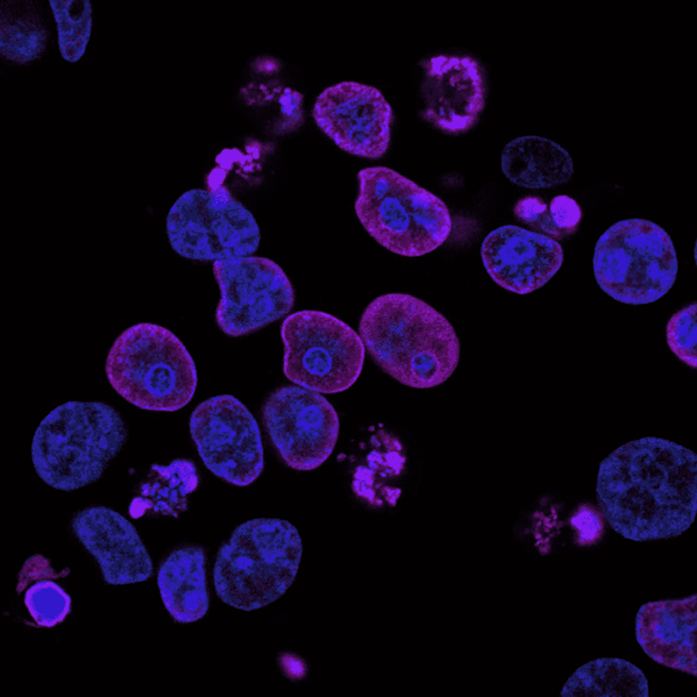
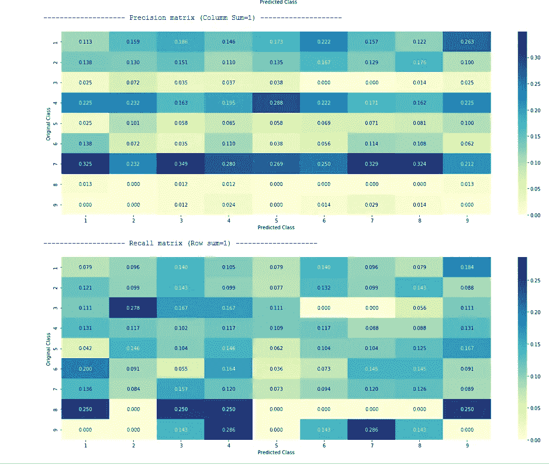

# 用机器学习重新定义癌症治疗

> 原文：<https://medium.com/analytics-vidhya/redefining-cancer-treatment-with-machine-learning-aea74fa9ba07?source=collection_archive---------14----------------------->



照片由国家癌症研究所提供

# **简介**

在过去的几十年里，癌症治疗不断取得进展。科学家们应用不同的技术在癌症引起症状之前发现它们的类型。近年来，医学领域取得了许多突破，医学研究人员也可以获得大量数据，因为可以获得更多数据。医学研究人员已经使用机器学习来识别复杂数据中的隐藏模式，以尝试预测癌症类型的有效未来结果。

鉴于个体化医学的重要性和 ML 技术应用的增长趋势，我们将尝试解决一个这样的问题，其中的挑战是区分导致肿瘤生长的突变(驱动者)和中性突变(过客)。

目前，这种对基因突变的解释是手工完成的。这是一项非常耗时的任务，临床病理学家必须根据基于文本的临床文献中的证据，对每一个基因突变进行人工审查和分类。我们需要开发一种机器学习算法，使用这个知识库作为基线，自动对基因变异进行分类。

# **数据概述**

给定**基因**、**变异**和**文本**作为特征，我们需要预测**类**变量的类(**目标变量**)。这是一个**多类分类**问题，我们将用**多类对数损失**度量来衡量我们模型的性能。

# **未来路线图**

我们将读取数据，执行文本预处理，将数据分为训练、测试和交叉验证，训练随机模型，训练不同的 ML 模型，计算日志损失以及错误分类点的百分比，然后比较并找出最佳模型。

*查理耶舒如卡特(开始编码吧！！)*

```
import pandas as pd
import matplotlib.pyplot as plt
import re
import warnings
import numpy as np
from nltk.corpus import stopwords
from sklearn.preprocessing import normalize
from sklearn.feature_extraction.text import CountVectorizer
import seaborn as sns
from sklearn.neighbors import KNeighborsClassifier
from sklearn.metrics import confusion_matrix,accuracy_score,log_loss 
from sklearn.feature_extraction.text import TfidfVectorizer
from sklearn.linear_model import SGDClassifier,LogisticRegression
from scipy.sparse import hstack
from sklearn.multiclass import OneVsRestClassifier
from sklearn.svm import SVC
from collections import Counter, defaultdict
from sklearn.calibration import CalibratedClassifierCV
from sklearn.naive_bayes import MultinomialNB, GaussianNB
from sklearn.model_selection import train_test_split,GridSearchCV
from sklearn.metrics import normalized_mutual_info_score
from sklearn.ensemble import RandomForestClassifier
warnings.filterwarnings("ignore")
from mlxtend.classifier import StackingClassifier
```

所以我们首先导入各种库 [**熊猫**](https://pandas.pydata.org/) **，** [**numpy**](https://numpy.org/) 用于数据操作，**[**matplotlib**](https://matplotlib.org/)和 [**seaborn**](https://seaborn.pydata.org/) 用于绘图， [**sklearn**](https://scikit-learn.org/stable/) 包用于建模。**

****读取数据****

**我们的数据存在于具有不同分隔符的两个不同文件中，因此将分别读取每个文件，然后使用**“ID”**列将两个文件合并。**

****

****文本预处理和特征工程****

**在读取数据后，我们将进行文本预处理，包括清理文本，如*停用词移除*，移除*特殊字符*，如果有的话，*规范化*文本并将所有单词转换为*小写*。在此过程中，我们发现有些行没有文本，因此我们将用 ***基因*** + ***变异*** 值替换 ***NaN*** 值。**

## ****将数据分为训练、测试和交叉验证****

**现在，我们将数据分为训练、测试和交叉验证数据，以检查我们的目标值在所有三个数据中的分布是否相同。**

****为什么分销需要相同？**我们的目标值的分布应该相同，以便在训练期间，我们的模型应该遇到数据集中存在的所有类值。**

****

**目标变量的分布**

# ****训练****

**我们将首先训练一个随机模型，以便我们可以比较我们的其他模型及其性能和效率。**

***如何在多类别设置中对随机模型执行对数丢失？*我们将为测试中的每个点随机生成与我们的类数量(在我们的问题中为 10)相等的数字，并交叉验证数据，然后将它们归一化，使其总和为 1。**

```
test_data_len = test_df.shape[0]
cv_data_len = cv_df.shape[0]# we create a output array that has exactly same size as the CV datacv_predicted_y = np.zeros((cv_data_len,9))
#for every value in our CV data we create a array of all zeros with #size 9for i in range(cv_data_len):#iterating to each value in cv data(row)
    rand_probs = np.random.rand(1,9) #generating randoms form 1 to 9
    cv_predicted_y[i] = ((rand_probs/sum(sum(rand_probs)))[0]) #normalizing to sum to 1print("Log loss on Cross Validation Data using Random Model",log_loss(y_cv,cv_predicted_y, eps=1e-15))# Test-Set error.
#we create a output array that has exactly same as the test datatest_predicted_y = np.zeros((test_data_len,9))
for i in range(test_data_len):
    rand_probs = np.random.rand(1,9)
    test_predicted_y[i] = ((rand_probs/sum(sum(rand_probs)))[0])
print("Log loss on Test Data using Random Model",log_loss(y_test,test_predicted_y, eps=1e-15))predicted_y =np.argmax(test_predicted_y, axis=1)
plot_confusion_matrix(y_test, predicted_y+1)
```

**在上面，我们首先为每个类别标签创建一个大小为 9 的空数组，然后为每个类别标签随机生成概率，并绘制混淆矩阵和计算对数损失。**

****

**对数损失为 2.4 的混淆矩阵**

**我们可以看到，我们的随机模型在交叉验证和测试数据中的*对数损失为* ***2.4*** ，因此我们需要我们的模型表现得比这更好，让我们检查一下这个模型的*精度并召回*。**

****

**随机模型的精度和召回率**

*****如何解读上面的精准召回矩阵？*****

****精度**
1。以单元格(1x1)为例，其值为**0.127**；它说在所有被预测为第 1 类*的点中，只有 **12.7%** 的值实际上是第 1 类*的**

***2.对于原始的*第 4 类*和*预测的* *第 2 类*我们可以说，在我们的模型预测到的*第 2 类*的值中， **23.6%** 的值*实际上*属于*第 4 类****

*****召回*****

***1.检查像元(1X1)它的值为 0.079，这意味着对于实际属于类别 1 的所有点，我们的模型预测只有 7%的值属于类别 1***

***2.对于原始的*第 8 类*和*预测的第 5 类*值为 **0.250** 意味着所有实际为*第 8 类*的值都是模型*预测的* **25%** 值为*第 5 类****

***在进行了一些探索性的数据分析之后，我们现在将对我们的模型进行训练，同时还将进行特征编码，你可以在我的[笔记本](https://github.com/akshayakn13/CancerDiagnosis)上查看。我们训练了多个模型，其中**逻辑回归和支持向量机**脱颖而出。***

******逻辑回归******

******

***逻辑回归在交叉验证中的表现***

******

***逻辑回归模型的混淆矩阵***

******支持向量机******

******

***SVM 在交叉验证方面的表现***

******

***SVM 模型的混淆矩阵***

*****所有车型对比*****

******

***我们可以看到，逻辑回归和支持向量机在*对数损失*和*误分类点百分比方面都比其他方法表现更好。****

***完整的代码和数据可以查看我的 [GitHub](https://github.com/akshayakn13/CancerDiagnosis) 。***

***请随时在任何平台上与我联系。***

***也可以看看我的其他文章***

***[](/analytics-vidhya/fine-grained-sentiment-analysis-of-smartphone-review-d9f502a40c36) [## 智能手机评论的细粒度情感分析

### 情感分析或观点挖掘是通过使用自然语言处理来分析词语背后的情感…

medium.com](/analytics-vidhya/fine-grained-sentiment-analysis-of-smartphone-review-d9f502a40c36) [](/analytics-vidhya/k-nearest-neighbor-k-nn-f4418a55b74f) [## k-最近邻

### K-最近邻(K-NN)算法是一种简单、易于实现的有监督机器学习算法。那个“K”…

medium.com](/analytics-vidhya/k-nearest-neighbor-k-nn-f4418a55b74f) [](/analytics-vidhya/support-vector-machines-805a24507f) [## 支持向量机

### 这是一篇两部分的文章，第一部分我将讨论硬边际支持向量机，下一部分我将…

medium.com](/analytics-vidhya/support-vector-machines-805a24507f)***