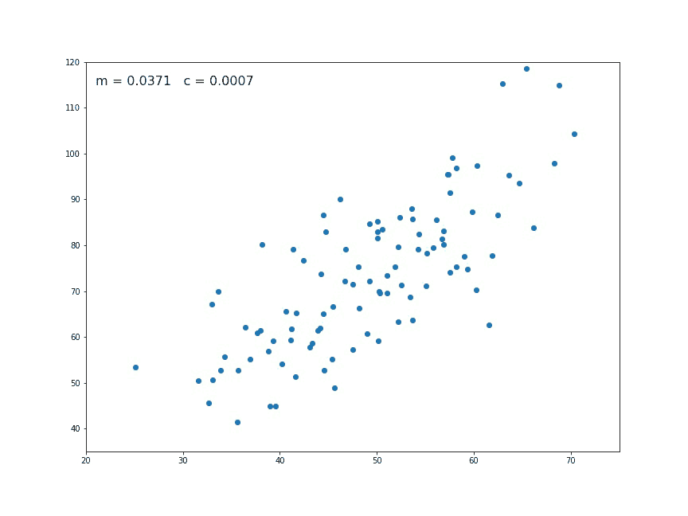
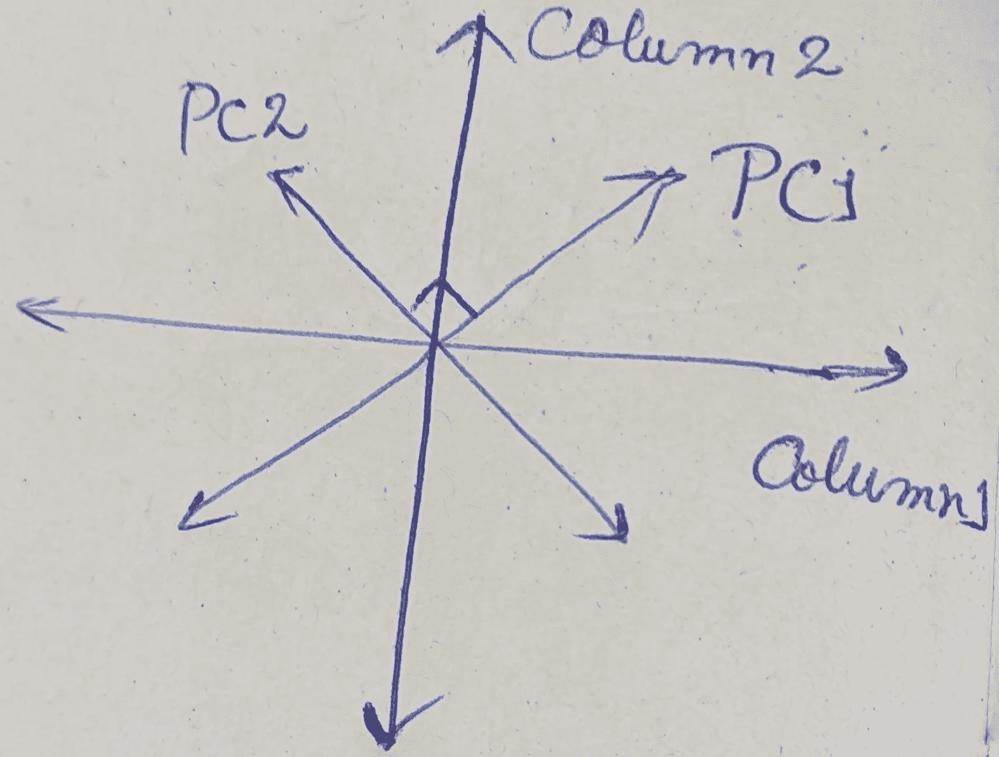

# 把(n × n)的诅咒简化为(我们的选择×我们的选择)

> 原文：<https://medium.com/analytics-vidhya/reduce-the-curse-of-n-n-to-our-choice-our-choice-71c0322405cd?source=collection_archive---------18----------------------->

在这篇博客中，我将讨论 PCA( **主成分分析**)如何帮助将(n × n)的任何数据集的维度降低到我们自己选择的维度。

让我们从 UCI 机器学习库中的 [**哈伯曼**](https://archive.ics.uci.edu/ml/machine-learning-databases/haberman/haberman.data) 的数据集中取几个行和列的例子。因此，在取出几个示例后，我们会收到这样一个数据集:

由于 PCA 是一种**无监督学习技术**，我们不应该考虑输出列。

我们必须记住，如果我们有“n”个列，我们可以为数据集创建“n”个主成分。我们必须从中取长补短，这样才能准确预测我们的产出。

因此，首先我们将从数据集的前 2 列开始，然后我们将从第 3 列开始，并且将知道如何计算主成分(PC)以用于随后的列增加。

从前两列开始

我们将第一列的数据点视为 X1、X2、X3…等等。类似地，我们将第 2 列的数据点视为 Y1、Y2、Y3、…等等。

之后，我们将计算第一列的平均值，然后计算第二列的平均值。因此，列 1 =(31+31+33+38+41+42+42+62+62)/8 = 42.5 &列 2 =(59 = 65+58+69+60+69+65+62)/8 = 63.37

然后我们将在原点投影/移动这些平均点。我们将投影数据点(X1，Y1)，(X2，Y2)，……。相对于我们的新原点。**注意**:移动数据不会改变数据点相对于彼此的位置。

平均点到原点的投影

绘制了相对于原点的列 1 和列 2 数据点

在相对于原点画出点之后，我们将尝试相对于画出的点拟合一条线。我们将从绘制一条随机线开始，最终通过更新数据点，我们将在线性回归的帮助下形成一条线。我们可以通过 [**点击这里**](/@soumo.villa7/machine-learning-is-very-easy-to-understand-a2044c813999) 查看与线性回归相关的博客。

举例说明如何根据 2D 图上绘制的数据点拟合直线

**注意**:我们将生成的最佳拟合线有两个通过**原点**的重要特征

1.  每个数据点与其在最佳拟合线上的投影的距离必须最小为**最小**

2.从**原点**到**每个投影**(其数据点)的距离平方和必须是**最大值**。

因此，我们得到的第一条预测线将被称为穿过原点的**主分量 1** 。

考虑如果**主成分 1** ( **PC1** )的斜率为 0.75 那么，

这显示 PC1 由列 1 的 4 部分和列 2 的 3 部分组成

而列 2 与列 1 之间的这种 3:4 的比例称为“**线性组合**”。因此，如果我们在这里加入毕达哥拉斯定理的概念，那么，4 + 3 = 25，它的平方根是 5(斜边的长度)。如果我们借助斜边长度(即 5)来计算三角形的边长

所以，5/5 =**1**；3/5 =**0.6**；4/5 = **0.8。因此，PC1 的这 1 个单位由 0.6 个单位的 column2 和 0.8 个单位的 **column1** 组成，称为预测线 PC1 的**奇异**巡回**、**特征向量**

注意 : →现在，如果我们画一条穿过原点并垂直于两个 PC1 的直线。新的线将被称为 PC2，因此，如果有 3 列，那么第三个 PC 将垂直于通过原点的 PC1 和 PC2。类似地，PC4 将垂直于 PC1 和 PC2 的 PC3，如此继续下去。由此我们得知，数据集的*列数将给出 PC 的总数*。

PC1 垂直于 PC2

**Scree Plot :** →这是一种表示，表示每个主成分所占的百分比变化。为了计算 PC 的每个变化，我们将应用公式[(从**原点** ) **/** 列数-1 的**每个投影**(其数据点)的平方距离之和]。

计算偏差后，我们将它们相加，然后用每个 PC 偏差******除以总偏差****，得到每个 PC 的%偏差。**********

************

******相对于数据集的不同 PCs ,%变化的 Scree 图表示******

******因此，我们得出的结论是，代表数据集最大变化的 PCs 将仅用于数据集的进一步分析。因此，我们减少数据集维度的工作已经完成。******

******如果您对此有任何疑问或意见，请告诉我，在此之前，请享受学习的乐趣。******