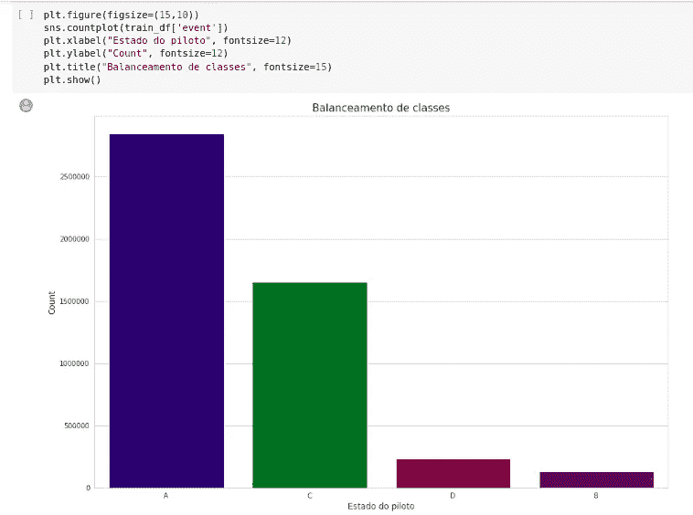
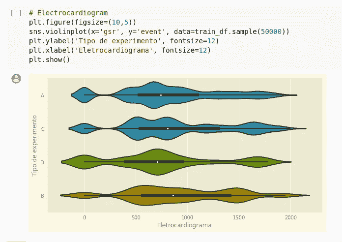
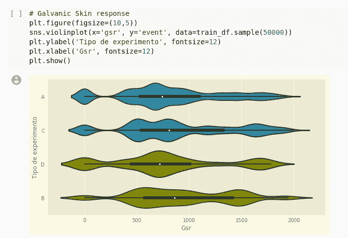
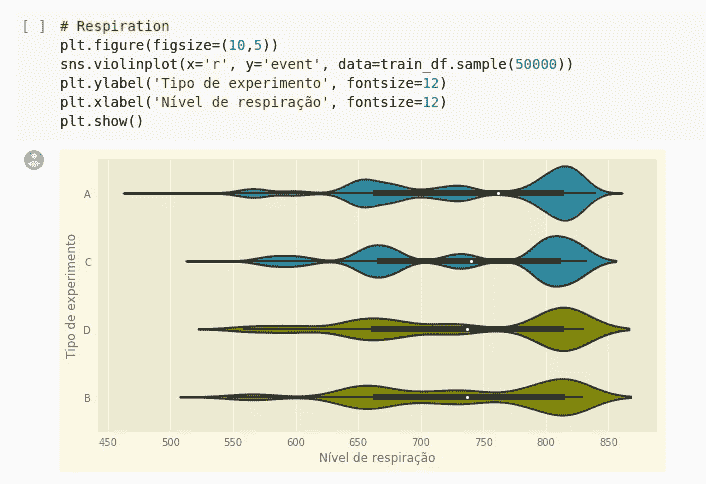
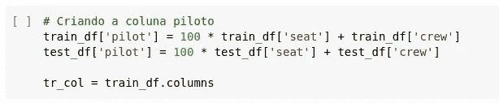
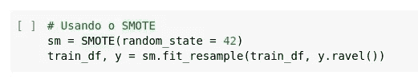
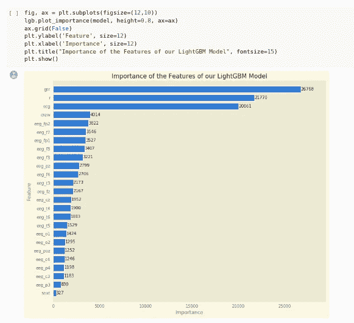
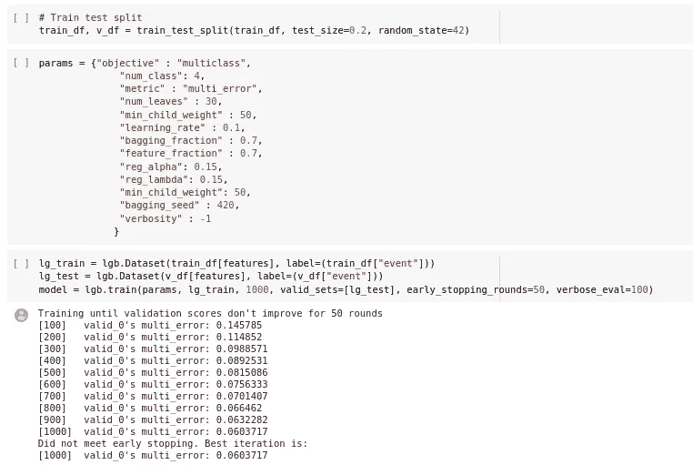
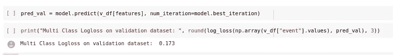

# “减少商业航空死亡事故”数据集管道

> 原文：<https://medium.com/analytics-vidhya/reducing-commercial-aviation-fatalities-dataset-pipeline-b835d06be423?source=collection_archive---------17----------------------->

# 关于数据集

我们在这个数据集中的目标是建立一个模型，从空勤人员的生理数据中检测令人不安的事件。大多数与飞行相关的死亡事故都源于“飞机状态意识”的丧失也就是说，可能注意力分散、困倦或处于其他危险认知状态的飞行员的注意力管理无效。

我们使用了在测试情况下从当前飞行员获得的数据，我们的模型执行实时计算来监控飞行员的认知状态。有了这个，飞行员就可以在进入麻烦状态时得到警告，防止事故发生，拯救生命。你可以从 Kaggle 网站[这里](https://www.kaggle.com/c/reducing-commercial-aviation-fatalities/overview)获取数据集。

# 管道描述

## 探索性数据分析

首先，我们用 pandas 加载数据集，并开始做 EDA(探索性数据分析)。首先要知道的一件重要事情是数据集是否有缺失数据。在这个数据集中我们没有，所以我们可以前进。另一个必不可少的检查是数据集是否不平衡，因为如果是这样，我们的结果可能会有偏差。当一个类的实例比另一个类的实例多得多时，就说数据是不平衡的。

> 检查不平衡

我们可以清楚地看到不平衡。我会提前解释我们如何解决这个问题。我进一步做的是检查一些测量对最终结果的影响。

> 检查财务测量对最终结果的影响

## 特征工程

在管道的这一步中，创建了一个名为“pilot”的新列，由座位和机组人员数据组成。

## 解决不平衡

为了解决不平衡问题，我们可以使用一种叫做 SMOTH 的技术。该技术为少数类生成合成数据，用线段连接少数类的点，然后在这些线上放置人工点。

## 特征重要性

因为这个数据集是一个非常大的数据集，如果你需要训练和做其他事情，像 SMOTH，更快，你可以减少列的数量。一种选择是记下最重要的:

## 选择车型和列车

我们测试了一些模型，结果最好的是 LightGBM 模型。由于问题的性质，几乎不可避免地要使用基于树的模型，如 LightGBM、RandomForest、Gradient Boost、XGBoost 等。LightGBM 是一个基于决策树算法的快速、分布式、高性能梯度推进框架，用于排序、分类和许多其他机器学习任务。您可以看到下面的培训步骤:

## 结果

为了计算模型的效率，我们使用了对数损失指标，因为这是在 Kaggle 竞赛中计算的指标。对数损失，也称为对数损失，通过惩罚错误分类来工作。并且获得的对数损失为 0.173。

