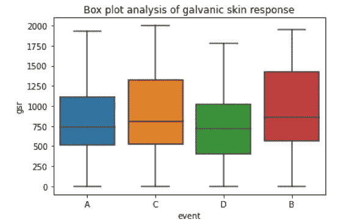

# 减少商业航空死亡事故

> 原文：<https://medium.com/analytics-vidhya/reducing-commercial-aviation-fatalities-ec338e37900c?source=collection_archive---------10----------------------->

# 目录

1.  概观
2.  商业问题
3.  数据集分析
4.  将实际问题映射成 ML 问题
5.  绩效指标
6.  探索性数据分析
7.  特征工程
8.  数据预处理
9.  建模
10.  未来的改进
11.  结果
12.  参考

# 概观

来源:[https://www . ka ggle . com/c/reducing-商业-航空-死亡人数](https://www.kaggle.com/c/reducing-commercial-aviation-fatalities)

这是由 Kaggle 举办的一场比赛，我们需要建立一个模型，从机组人员的生理数据中检测出令人不安的事件。

航空事故是指在飞行操作或任何其他涉及航空器的操作过程中，航空器、航天器或任何其他航空航天器内外的一人或多人死亡。这些死亡事故与飞机的运行直接相关，被称为航空事故。

这些航空事故最常见的原因包括:

1.  飞行员差错
2.  机械故障
3.  设计缺陷
4.  空中交通故障
5.  有缺陷的跑道

在这次比赛中，主要焦点是第一个原因，即飞行员失误导致的航空事故，以及避免这些事故的解决方案。

# 商业问题

给予飞行员的大部分训练涉及驾驶飞机时所需的生理方面。这一点很重要，因为飞行员需要的重要能力之一是多任务处理能力，集中注意力的能力，以及关注所有这些任务的能力。所有这些都有助于减少飞行员导致的飞行事故。

飞行员失误导致的大部分飞行死亡或飞行事故都是由于飞机状态意识的丧失。飞机状态意识(ASA)是飞行员的一种表现属性，飞行员应该能够意识到飞机状态的任何变化并做出快速反应。飞机状态意识的丧失可能导致许多危险情况，并且可能导致飞机失控，其中可能发生与预期飞行路径的极端偏离。ASA 的丧失主要是由于飞行员注意力的丧失，他们可能会分心、困倦或处于其他危险的认知状态。由于紧张的环境，在飞行时，失去意识的可能性是常见的。

在这场比赛中，我们获得了来自飞行员的真实生理数据，他们受到各种干扰事件的影响。飞行员经历了分心，并导致以下三种认知状态之一:

1.  通道化注意力(CA):当飞行员只专注于一项任务而不关注其他任务时，就会出现这种情况。
2.  转移注意力(DA):注意力被与决策相关的行为或思维过程转移的状态。这是通过让受试者执行显示监控任务来诱导的。
3.  惊吓/惊讶(SS):这是对突然的意外刺激的反应。在航空领域，这可以被定义为由于暴露于违反飞行员预期的突然强烈事件而导致的不可控的自动反射或反应。

目的是建立一个模型，可以使用给定的生理数据实时估计飞行员的精神状态。当飞行员进入上述任何一种危险的认知状态时，他/她应该被警告，从而防止任何可能的事故。

# 数据集分析

本次比赛提供了三个 CSV 文件。第一个是 train.csv，其中包含用于训练的所有数据。Test.csv 用于测试模型。Sample_submission.csv 用于以 csv 格式提交最终输出。

现在，让我们分析一下[数据集](https://www.kaggle.com/c/reducing-commercial-aviation-fatalities/data)中的每个属性。

训练数据由三个实验组成:CA、DA 和 SS。输出是四个标签之一:基线(无事件)、CA、DA 或 SS。例如，如果实验是 CA，则输出是 CA 或基线(无事件)。测试数据取自一个完整的飞行模拟器。这里的实验被称为 LOFT 或 Line Oriented 飞行训练，飞行员的训练是在飞行模拟器中进行的，它人为地创造了真实飞行的环境。在测试数据中，实验以 LOFT 形式给出，输出可以是给定时间的四种状态之一。为了预测飞行员的状态，需要生理数据。我们有来自四个传感器的数据——脑电图、心电图、呼吸、皮肤电反应。让我们分析数据集的每个属性。

*   Id:团队+时间组合的唯一标识符。使用 id 来表示进入实验的特定时间的飞行员。所以对于每个 id，我们需要预测状态
*   机组:一对或飞行员的唯一 id
*   实验:对于培训，它将是 CA 或 DA 或 SS。为了测试，它将是阁楼
*   时间:实验开始几秒钟
*   座位:飞行员的座位- 0 代表左边，1 代表右边

脑电图——这是大脑表面所有活动的总和。我们得到了 20 个电极的数据。每个电极导线被放置在大脑的特定部分(前额叶(fp)、颞(t)、额(f)、顶(p)、枕(o)、中央(c))附近。图示中奇数表示电极放置在大脑左侧，偶数表示右侧，z 表示中间区域。

下图给出了每个电极的位置。

图 1:电极在头皮中的位置

*   Eeg_f7:来自前额部分附近电极的数据—左侧
*   Eeg_f8:来自额区附近电极的数据—右侧
*   Eeg_t4:来自颞区附近电极的数据—右侧
*   Eeg_t6:来自颞区附近电极的数据—右侧
*   Eeg_t5:来自颞区附近电极的数据—左侧
*   Eeg_t3:来自颞区附近电极的数据—左侧
*   Eeg_fp2:来自前额区附近电极的数据—右侧
*   Eeg_o1:枕部附近电极的数据—左侧
*   Eeg_p3:来自顶部区域附近电极的数据—左侧
*   Eeg_pz:来自顶叶区附近电极的数据——中间区域
*   Eeg_f3:来自额区附近电极的数据——左侧
*   Eeg_fz:来自额区附近电极的数据——中间区域
*   Eeg_f4:来自额区附近电极的数据—右侧
*   Eeg_c4:来自中央区域附近电极的数据—右侧
*   Eeg_p4:来自右侧顶骨区附近电极的数据
*   Eeg_poz:来自顶枕结合部附近电极的数据——中间区域
*   Eeg_c3:来自中央区域附近电极的数据——左侧
*   Eeg_cz:来自靠近中心区域——中间区域的电极的数据
*   Eeg_o2:枕部附近电极的数据—右侧
*   Ecg:三点心电图(ECG)信号——它测量心脏的电活动(传感器输出以微伏为单位)
*   r:呼吸传感器——它测量胸部的起伏(传感器输出以微伏为单位)
*   Gsr:皮肤电反应——测量皮肤电活动(传感器输出以微伏为单位)
*   事件:要预测的输出——飞行员在给定时间的状态。它将是基线(无事件)或 SS(B)或 CA(C)或 DA(D)

# 将实际问题映射成 ML 问题

这是一个多类别分类问题，其中，对于每个 id(对于特定时间的特定机组人员)，我们需要预测飞行员属于四个给定类别之一的状态。给定所有属性，我们需要预测每个事件发生的概率。

# 绩效指标

我们正在处理的问题是一个多类分类问题，其中类的数量是 4

*   本次比赛使用的评估矩阵为[多类对数损失](https://scikit-learn.org/stable/modules/generated/sklearn.metrics.log_loss.html)

其中 N 是数据点的总数，M 是类的数量。

如果数据点 I 被预测为 j 类，则 yij 为 1，否则为 0。

pij 是数据点 I 属于 j 类的概率

*   我们还可以使用精度和召回矩阵来评估性能，我们可以检查我们能够预测和召回每个状态的程度。也就是说，对于每个“危险状态”类别，我们应该能够正确预测这些类别中的最大数据点，并且我们不应该将其错误分类为正常状态。

# 探索性数据分析

## 分析事件

首先，让我们分析一下每个事件发生的频率。为此，我们可以使用[计数图](https://seaborn.pydata.org/generated/seaborn.countplot.html)(粘贴链接)。

图 2:事件的频率

这里 A 表示基线(无事件)，B 表示惊吓/意外，C 表示 CA，D 表示 DA。从这个图来看，很明显数据是不平衡的。或者我们可以说，每个事件发生的频率是不同的。让我们更深入一层，分析每个事件。

让我们分别考虑每个实验，并考虑随机选择的工作人员，分析每个事件的频率。

图 3:分析 CA 事件的频率

图 4:分析 DA 事件的频率

图 5:分析 SS 事件的频率

所以从这些数字中，我们可以说所有的实验都是在相同的时间间隔内进行的，然而 SS 出现的频率非常低。这种频率不平衡在测试数据集中也是可能的，所以我们暂时保持这种不平衡，并在不平衡数据集的情况下检查性能。

## 每个特征的单变量分析

这里我们使用箱线图来分析每个特征在预测事件中的作用。

图 6:心电图数据的方框图

从上图可以看出，心电图数据存在一些异常值。但是我们不能简单地去除它们，因为这些极值可能对预测事件有用。当心电图值较高(超过 10000 微伏)时，飞行员更有可能进入 DA 状态。类似地，当该值太负时，飞行员很可能处于 CA 状态。还观察到单独的心电图不能简单地预测事件。但是它在预测方面有一定的作用

图 7:呼吸传感器输出数据的箱线图

类似于 ECG 数据，该数据也有一些异常值。但是我们不能简单地去除它们，因为这些极值可能对预测事件有用。呼吸信号应该对预测事件有一些影响，但是从上面的方框图中，我们可以看到该传感器输出根本没有将事件分开。这可能是因为数据中存在噪声。

图 GSR 传感器输出的箱线图

从 GSR 的箱线图中，我们可以说 GSR 在预测产量方面发挥了一些作用。GSR 数据在一定程度上分离了事件。

现在下一步是检查数据中的噪声。生物传感器容易受到噪声的影响，并且由于数据是从真实人的生理数据中获得的，因此来自这些传感器的输出将富含噪声。让我们检查心电图和 R 数据中的噪声。该数据是为实验和特定的机组人员分析的。

图 9:10 秒钟的 ECG 输出数据

图 10:10 秒钟的呼吸传感器数据

这些数据显然富含噪声，因此我们需要消除这种高频噪声。为此，我们使用低通[巴特沃斯滤波器](https://docs.scipy.org/doc/scipy/reference/generated/scipy.signal.butter.html)。

为了对 ECG 信号进行滤波，截止频率(w)被选择为 100，并且为了对呼吸信号进行滤波，w 的值被取为 0.7。过滤后的 ECG 和 r 信号如下所示。

图 11:滤波后的 ECG 数据

图 12:过滤后的呼吸数据

过滤后的数据比原始数据更干净、更有意义。因此，我们用相应的滤波信号替换 ECG 和 r 数据。

# 特征工程

现在让我们试着从现有的特性中派生出一些额外的特性。

## 来自 ECG 的心跳信息

*如果我们能从心电图信号中获取心跳会怎么样？*

心电图是显示心脏电活动随时间变化的图表。ECG 的输出单位为微伏。现在，除了这个电压，我们可以用这个数据得到心输出量或心率或每分钟心跳次数。Python 提供了一个强大的工具叫做 [Biosppy](https://biosppy.readthedocs.io/en/stable/biosppy.signals.html#biosppy-signals-ecg) ，可以进行生物信号处理。

正如您所看到的，使用该模块从 ECG 中获取所有必要的信息非常简单

## 来自 r 信号的呼吸率

*是胸部的起伏。它代表腹部和横膈膜的肌肉活动。因此，当一个人感到紧张或震惊时，呼吸频率会很高。*我们如何从呼吸传感器输出中获得呼吸率？**

与 ECG 的情况一样，这里我们也可以使用 [Biosppy](https://biosppy.readthedocs.io/en/stable/biosppy.signals.html#biosppy-signals-resp) 从 r 信号中导出呼吸率。

因此，我们从 Biosppy 模块中获得了特定时间点的心率和呼吸率。为了获得对应于我们数据集中所有时间戳的数据，我们可以使用[插值技术](https://docs.scipy.org/doc/scipy/reference/tutorial/interpolate.html)

## 脑电图电极之间的电位差

在这场比赛中，我们从放置在大脑不同部位的 20 个电极获得电压，如图 1 所示。出于临床目的，电极之间的电势差被认为是更重要的特征。这个电位差将会给我们一个关于那个大脑区域的电场和那个区域的状态的想法。

现在，在推导电位差时，我们可以使用图中所示的任何电极组合

图 13:寻找脑电图电极之间电位差的各种蒙太奇

这里我使用第二种组合，因为它主要用于临床

## 来自 EEG 信号的频带信息

当从头皮测量时，典型的成人 EEG 信号的幅度约为 10 V 至 100 V。如图所示，与每个电极相关联的波是具有不同振幅和频率的多个波的组合。

图 14:脑电图电极输出中的各种频率成分

ECG 的这些频带在确定人的精神状态中的重要性如下所述:

*   **Delta** (1 到 4Hz):这种节律在深度睡眠中被显著观察到。非常高的振幅表示脑损伤、学习问题、无法思考等。非常低的振幅表明不能使身体恢复活力，不能使大脑恢复活力，睡眠不好等。
*   **θ**(4 到 8Hz):这种节奏通常在困倦时以及睡眠早期被观察到。这也可能是由于情绪高涨引起的。非常高的振幅表示多动症、抑郁、多动症、注意力不集中等。非常低的幅度表示焦虑、情绪意识差、压力等。
*   **阿尔法** (8 到 12 Hz):这种节律通常在人清醒时的脑电图中观察到。这些波的振幅可能因不同的个体和个体的不同精神状态而不同。非常高的振幅表示白日做梦、无法集中注意力等。非常低的幅度表示焦虑、高度紧张、失眠、强迫症等。
*   **Beta** (12 到 30 Hz):这是成人和儿童最常观察到的节奏。β波的振幅通常在 10 到 20 微伏之间。非常高的振幅表示焦虑、高度兴奋、无法放松、紧张等。非常低的值表示多动症、白日做梦、抑郁、认知能力差等。
*   **伽马** ( > 30 Hz):高值表示焦虑、高度觉醒、压力等。非常低的值表示多动症、抑郁症、学习障碍等。

这里我们可以使用 [Biosppy](https://biosppy.readthedocs.io/en/stable/biosppy.signals.html#biosppy-signals-eeg) 来获取所有的频带信息

最后，我们删除所有冗余特征，如实验、座位、噪声 ECG 和噪声 r。我们还忽略了γ和β特征，因为当我们观察相关矩阵时，这些特征的贡献非常低。这些特征增加了数据的维度，但对预测没有太大贡献。

## 特征重要性

现在让我们来看看这些特性在预测输出中的重要性。我使用了[随机森林分类器](https://scikit-learn.org/stable/auto_examples/ensemble/plot_forest_importances.html)来获得特征的重要性。

图 15:使用随机森林计算的前 20 个特性的特性重要性

在这里，我分析了 20 个最重要的特性。这主要由衍生特征组成。所以我们可以得出结论，工程特征是重要的。

# 数据预处理

这里我使用了[标准定标器](https://scikit-learn.org/stable/modules/generated/sklearn.preprocessing.StandardScaler.html)来标准化数据。数据集的标准化是许多机器学习估算器的共同要求。如果单个要素或多或少看起来不像标准的正态分布数据，则模型可能表现不佳。

# 建模

考虑到可用功能的数量，基于树的模型预计性能会更好。最佳型号是 [LightGBM](https://lightgbm.readthedocs.io/en/latest/pythonapi/lightgbm.LGBMClassifier.html) 。使用适当的超参数调整获得的模型的最佳参数是:

训练数据被分成训练和交叉验证数据。在所有的特征化和预处理之后，数据被传递到模型中进行训练。

# 结果

从训练和交叉验证数据中获得的多级对数损失如下所示。

测试损失是在提交测试数据的结果后获得的。如下所示

您可以在我的 [**Github 资源库**](https://github.com/Vinithavn/MachineLearning/tree/master/Projects/Reducing%20Commercial%20Aviation%20Fatalities_Kaggle) 中找到我的完整解决方案，如果您有任何建议，请通过 [**Linkedin**](https://www.linkedin.com/in/vinitha-v-n-5a0560179/) 联系我

# 未来的改进

*   可以对脑电信号进行去噪处理，以获得更干净的脑电信号
*   从 ECG 数据中，可以获得关于 R 个峰值间隔的信息

# 参考

1.  [https://www.appliedaicourse.com/?gclid = CJ 0 kcqjw 9 b _ 4 brcmarisadmuiyqtepo-ZTr-z8 ylyoto 2 q 9 uds 76 ytco 9 b 6 gwu 1 uv 1 p 8 lpbg 5 _ _ lw4 aarwlealw _ wcB](https://www.appliedaicourse.com/?gclid=Cj0KCQjw9b_4BRCMARIsADMUIyqtEpo-ZTr-z8YlYOto2q9uds76YTcO9b6GwAu1uV1P8lPbg5__LW4aArwLEALw_wcB)
2.  [https://www . ka ggle . com/stuartbman/生理数据简介](https://www.kaggle.com/stuartbman/introduction-to-physiological-data)
3.  [https://www . ka ggle . com/shahafind/reducing-commercial-aviation-deadlines-11 日](https://www.kaggle.com/shahaffind/reducing-commercial-aviation-fatalities-11th)
4.  [https://medium . com/@ atharvamusale/reducing-商用-航空-死亡事故-c335757e8d01](/@atharvamusale/reducing-commercial-aviation-fatalities-c335757e8d01)