# 使用 Tensorflow 模型优化工具包在真实数据集上减少深度学习模型的大小，而不影响其原始性能和准确性

> 原文：<https://medium.com/analytics-vidhya/reducing-deep-learning-model-size-without-effecting-its-original-performance-and-accuracy-with-a809b49cf519?source=collection_archive---------1----------------------->

你只需要知道如何训练可扩展和高效的深度学习模型

目录:

㈠导言

㈡动机

(iii)没有修剪的模型训练

(四)修剪模型训练

(v)两种模型尺寸的比较

(六)两种模型性能的比较

(七)两种模型精度的比较

㈧结论

㈨参考资料

## **(一)简介:**

我们都知道，神经网络比经典的机器学习算法表现更好，因为权重在每个时期更新。但未知的事实是，当从神经网络中去除 90%的权重时，我们也可以匹配基线模型精度。

大多数神经网络的权值本质上是稀疏的，稀疏权值不会影响模型的性能，所以我们可以在不影响性能的情况下去除它。

从神经网络中去除稀疏权重的过程称为修剪。我使用 Tensorflow 模型优化工具包进行修剪。

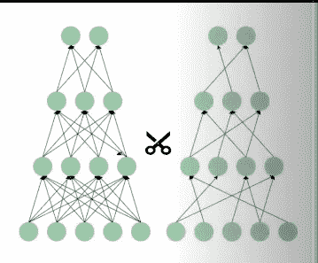

图片来源:【https://www.youtube.com/watch?v=KRlOEGtb3gk】T2&t = 1233s

修剪的优势:

模型尺寸减小而不影响模型性能。

准确性也类似于基线模型。

## **(二)动机:**

最近，我开发了一个检测患病棉花植株或棉花叶片的 web 应用程序，在开发 web 应用程序后，我试图在 Heroku 平台上部署该 web 应用程序，但由于我的模型大小，我无法部署该模型。

我的型号是 562MB，但是 Heroku 平台只支持 500MB

我训练的. h5 文件大小为 61MB

然后当时我不知道如何减少它，但昨天我得到了一个实习任务，其中模型修剪。

在探索这个话题时，我在 youtube 上看到了一个视频，这是 tensorflow 团队关于模型优化工具包[https://www.youtube.com/watch?v=3JWRVx1OKQQ&t = 2143s](https://www.youtube.com/watch?v=3JWRVx1OKQQ&t=2143s)的官方演示

从那个视频中，我找到了问题的解决方案。

MobileNet:移除 75%的稀疏权重，然后我们还可以在 ImageNet 数据集上匹配基线模型精度

ResNet50:移除 90%的稀疏权重，然后我们还可以在 ImageNet 数据集上匹配基线模型精度

这些信息激励我去解决我的问题

## 数据预处理:

这篇文章的主要目的是关于修剪，所以我不会深入研究数据预处理，如果你想要详细的解释，我已经发表了一篇文章，请关注这篇文章[https://medium . com/analytics-vid hya/agriculture-project-from-scratch-to-deployment-using-deep-learning-architecture-FCA 767 be 094 f](/analytics-vidhya/agriculture-project-from-scratch-to-deployment-using-deep-learning-architecture-fca767be094f)

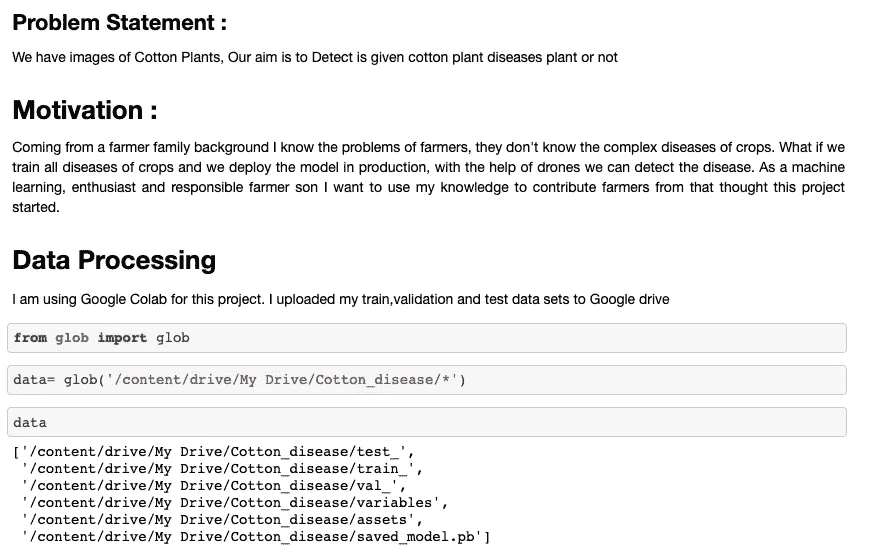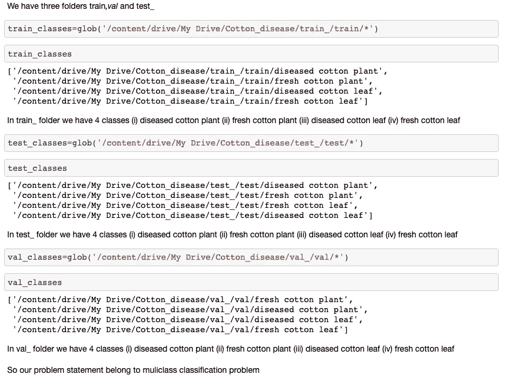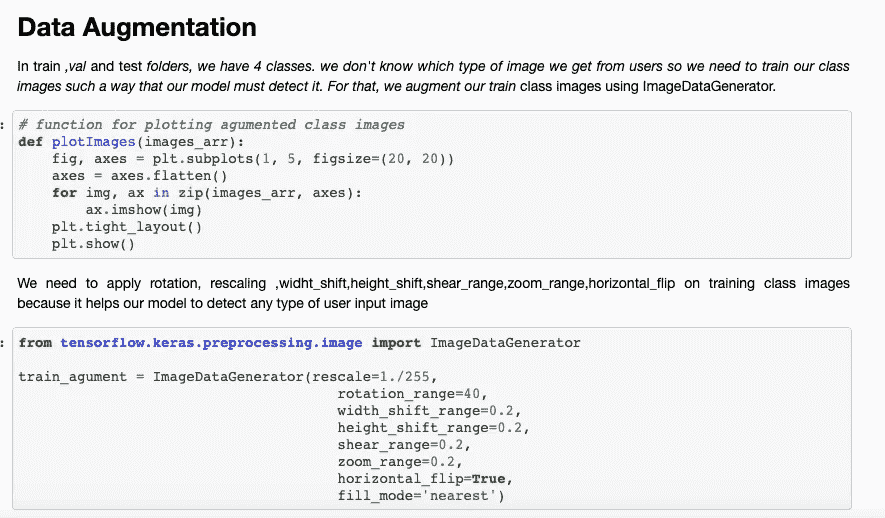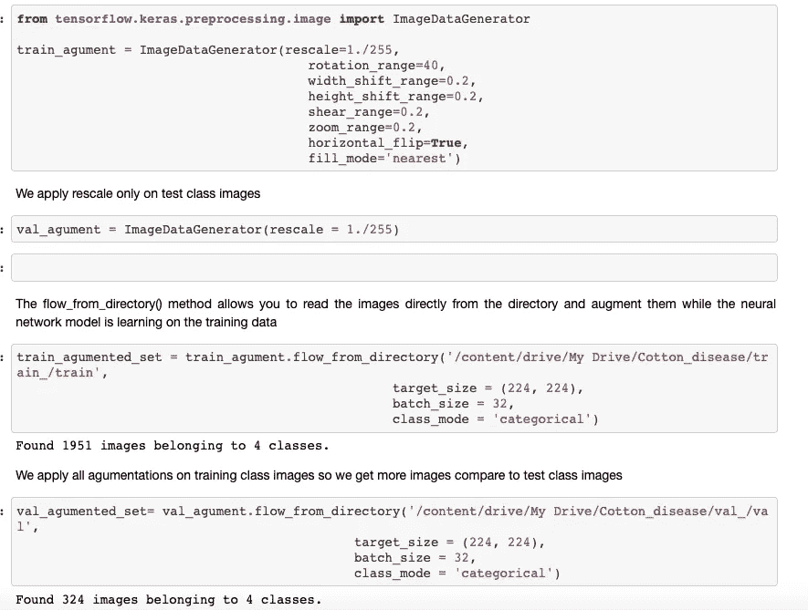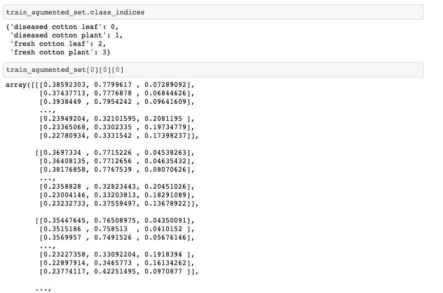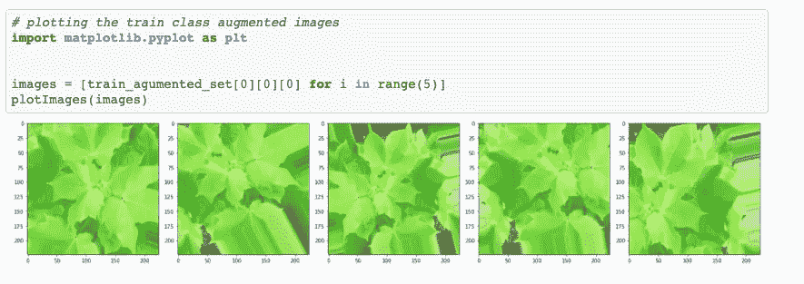

## (三)不修剪的模型训练:

我的问题陈述是多类分类

所以对这些图像进行分类，我从头开始建立一个 CNN

导入必要的模块

> 将张量流作为 tf 导入
> 
> 从 tensorflow 导入 keras
> 
> 从 tensorflow.keras.layers 导入输入，Lambda，密集，扁平 5
> 
> 从 tensorflow.keras.models 导入模型
> 
> 从 tensorflow.keras.models 导入序列
> 
> 将 numpy 作为 np 导入
> 
> 来自 tensorflow.keras .预处理导入图像
> 
> 优化程序导入 Adam
> 
> 导入操作系统
> 
> 导入临时文件
> 
> %load_ext 张量板
> 
> 进口冲浪板

构建 CNN 模型

4 Conv2D，4 MaxPooling2D，3 Dropout，3 Dense，1 Flatten 图层

Conv 2D 蛋鸡数量:32，64，128，256

内核大小=3x3

神经元密集层数:128，256

输出层最大神经元数量=4

激活功能:relu

> CNN _ model = keras . models . sequential([
> 
> keras.layers.Conv2D(filters=32，kernel_size=3，input_shape=[224，224，3])，
> 
> keras . layers . maxpooling2d(pool _ size =(2，2))，
> 
> keras.layers.Conv2D(filters=64，kernel_size=3)，
> 
> keras . layers . maxpooling2d(pool _ size =(2，2))，
> 
> keras . layers . conv 2d(filters = 128，kernel_size=3)，
> 
> keras . layers . maxpooling2d(pool _ size =(2，2))，
> 
> keras . layers . conv 2d(filters = 256，kernel_size=3)，
> 
> keras . layers . maxpooling2d(pool _ size =(2，2))，
> 
> 辍学(0.5)，
> 
> keras.layers.Flatten()，#神经网络构建
> 
> keras.layers.Dense(units=128，activation='relu ')，#输入层
> 
> 辍学(0.1)，
> 
> keras.layers.Dense(单位=256，激活='relu ')，
> 
> 辍学(0.25)，
> 
> keras.layers.Dense(units=4，activation='softmax') #输出图层
> 
> ])

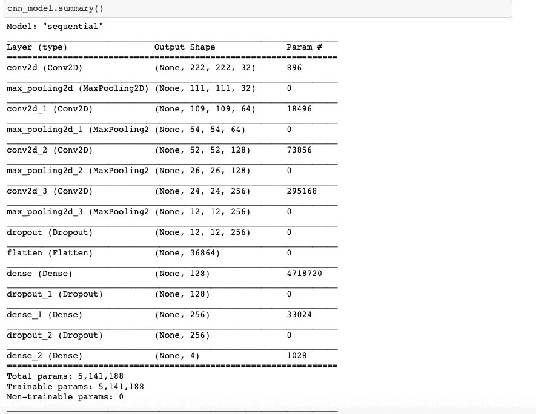

编译模型

> callbacks =[TF . keras . callbacks . tensor board(log _ dir = logdir，profile_batch=0)]
> 
> CNN _ model . compile(optimizer = Adam(lr = 0.0001)，loss = ' categorical _ crossentropy '，metrics=['accuracy'])

拟合模型

我只为 10 个时期训练模型，你可以为你想要的时期训练模型

> history = CNN _ model . fit(train _ agumented _ set，epochs=10，verbose=1，validation _ data = val _ agumented _ set，callbacks =回调)

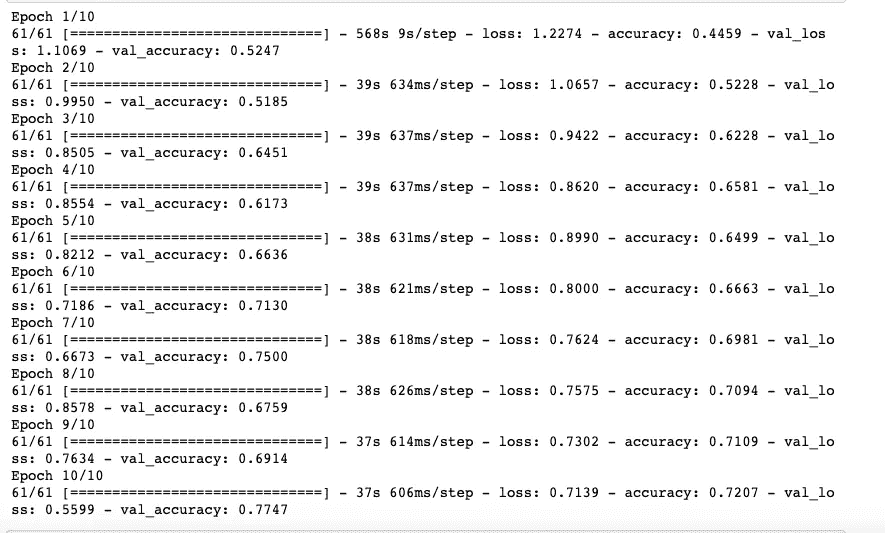

## (四)修剪模型训练:

修剪只不过是去除具有稀疏权重的神经元的连接

在剪枝的帮助下，我们可以减少神经网络的权值，同时我们的模型大小也减少了

因为规模更小，我们的模型响应时间也更短，通过修剪，我们间接地提高了我们的模型性能

为了修剪神经网络，我使用 Tensorflow 模型优化工具包

Tensoflow Toolkit 支持[训练后量化](https://www.tensorflow.org/model_optimization/guide/quantization/post_training)、[量化感知训练](https://www.tensorflow.org/model_optimization/guide/quantization/training)、[剪枝](https://www.tensorflow.org/model_optimization/guide/pruning/index)和[聚类](https://www.tensorflow.org/model_optimization/guide/clustering/index)。

对于修剪，我使用 Tensorflow 模型优化 API 中的多项式函数

ref:[https://www . tensor flow . org/model _ optimization/API _ docs/python/TF mot/sparsity/keras/polynomial decay](https://www.tensorflow.org/model_optimization/api_docs/python/tfmot/sparsity/keras/PolynomialDecay)

多项式函数包含参数

> `initial_sparsity:`修剪开始时的稀疏度(%)。
> 
> `final_sparsity`修剪结束时的稀疏度(%)。
> 
> `begin_step`开始修剪的步骤。
> 
> `end_step`结束修剪的步骤。
> 
> `power`稀疏函数中使用的指数。
> 
> `frequency`仅在每`frequency`步应用修剪。

导入必要的模块

> 从 tensor flow _ model _ optimization . sparsity 导入 keras 作为稀疏度
> 
> 将 numpy 作为 np 导入

我正在创建一个用于修剪参数的字典

> pruning_params = {
> 
> ' pruning_schedule ':稀疏性。多项式系数(initial_sparsity=0.85，
> 
> 最终稀疏度=0.95，
> 
> begin_step=2000，
> 
> end_step=5000，频率=100)}

我们以 85%的稀疏度(85%的权重为零)开始模型，以 95%的稀疏度结束。

一个`PruningSchedule`对象，在整个训练过程中控制剪枝率。

我导入 keras 作为稀疏

**sparsity . prune . low _ magnitude**:具有修剪功能的扭曲层，它在训练期间使层的权重变得稀疏。例如，使用 85%的稀疏度将确保 85%的层权重为零。

现在我们知道了所有对修剪神经网络有用的参数

用剪枝方法建立 CNN 模型

> pruned _ model = keras . models . sequential([
> 
> sparsity . prune _ low _ magnitude(keras . layers . conv 2d(filters = 32，kernel_size=3)，input_shape=[224，224，3]，**pruning_params)，
> 
> keras . layers . maxpooling2d(pool _ size =(2，2))，
> 
> sparsity . prune _ low _ magnitude(keras . layers . conv 2d(filters = 64，kernel_size=3)，**pruning_params)，
> 
> keras . layers . maxpooling2d(pool _ size =(2，2))，
> 
> sparsity . prune _ low _ magnitude(keras . layers . conv 2d(filters = 128，kernel_size=3)，**pruning_params)，
> 
> keras . layers . maxpooling2d(pool _ size =(2，2))，
> 
> sparsity . prune _ low _ magnitude(keras . layers . conv 2d(filters = 256，kernel_size=3)，**pruning_params)，
> 
> keras . layers . maxpooling2d(pool _ size =(2，2))，
> 
> 辍学(0.5)，
> 
> keras.layers.Flatten()，#神经网络建模
> 
> sparsity . prune _ low _ magnitude(keras . layers . dense(units = 128，activation='relu ')，**pruning_params)，#输入层
> 
> 辍学(0.1)，
> 
> sparsity . prune _ low _ magnitude(keras . layers . dense(units = 256，activation='relu ')，**pruning_params)，
> 
> 辍学(0.25)，
> 
> sparsity . prune _ low _ magnitude(keras . layers . dense(units = 4，activation='softmax ')，**pruning_params) #输出层
> 
> ])

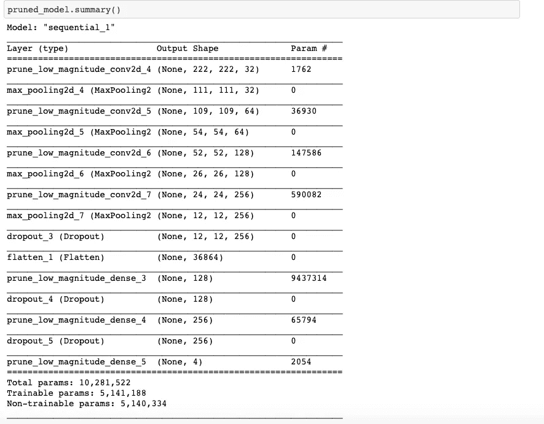

编译模型

> pruned _ model . compile(optimizer = Adam(lr = 0.0001)，loss = ' categorical _ crossentropy '，metrics=['accuracy'])

拟合模型

> 回调=[稀疏性。UpdatePruningStep()，稀疏性。pruning summaries(log _ dir = logdir，profile_batch=0)]
> 
> history _ prun = pruned _ model . fit(train _ agumented _ set，epochs=10，verbose=1，
> 
> validation _ data = val _ agumented _ set，callbacks=callbacks)

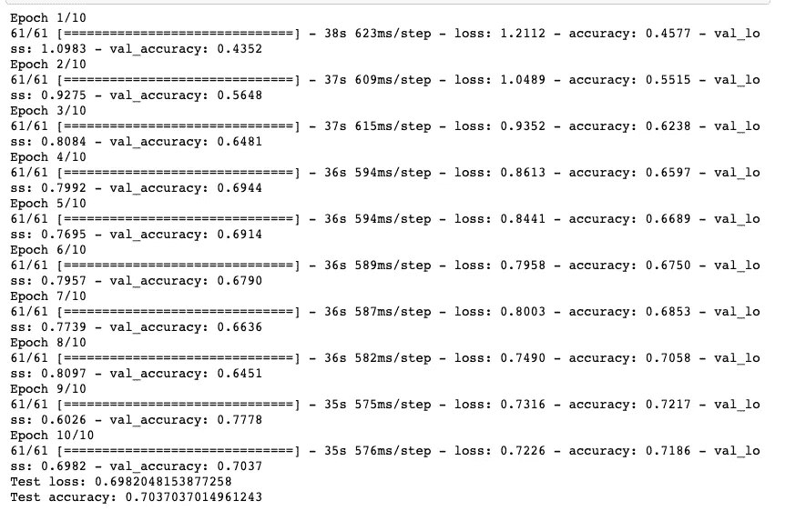

**sparsity.strip_pruning :** 一旦模型被修剪到所需的稀疏度，该方法可用于恢复具有稀疏权重的原始模型。

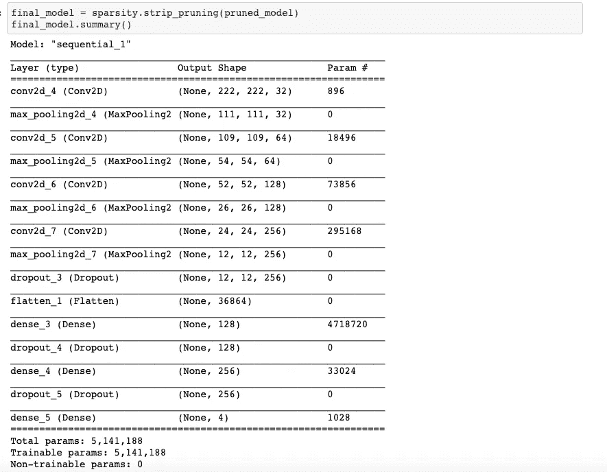

## (五)两种模型尺寸的比较:

训练模型(无修剪)

我们得到了. h5 文件大小 61MB

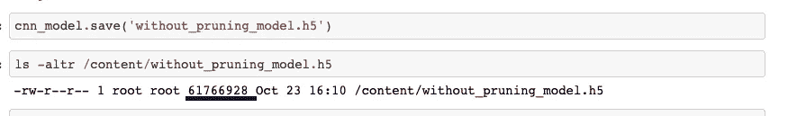

训练模型(带修剪)

我们得到了大小为 20MB 的. h5 文件

通过修剪减少了 3 倍的文件大小

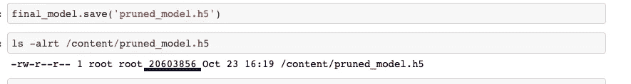

## (六)两种模型性能的比较:

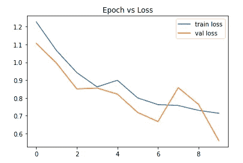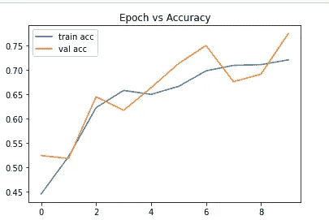

不修剪模型性能

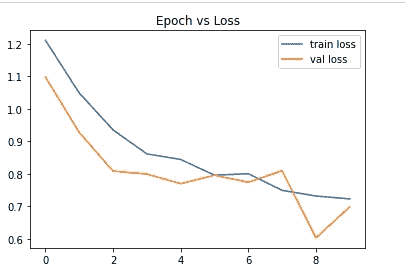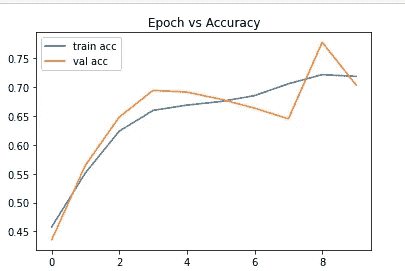

使用修剪模型性能

如果你比较这两个图，几乎两个模型表现相同的水平

## (七)模型精度的比较:

训练模型(无修剪)

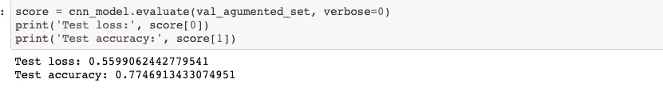

训练模型(带修剪)

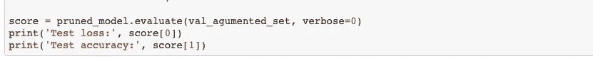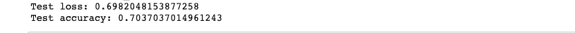

如果你观察上面的测试准确性

修剪和不修剪之间的差异仅为 7%

如果你想要一个更小的模型，那么我们需要牺牲一些精确度

## ㈧结论:

在剪枝的帮助下，我们的模型大小减少了 3 倍，性能也与原始模型相似，但精度损失了一些百分比。

现在我们可以很容易地在 Heroku 平台上部署剪枝模型。由于修剪，模型尺寸减小，模型响应也减小

## ㈨参考资料:

 [## TF mot . sparsity . keras . polynomial decay |张量流模型优化

### 用多项式函数修剪时间表。继承自:pruning schedule TF mot . sparsity . keras . polynomial decay(…

www.tensorflow.org](https://www.tensorflow.org/model_optimization/api_docs/python/tfmot/sparsity/keras/PolynomialDecay)  [## Keras 示例中的修剪|张量流模型优化

### 欢迎使用基于幅度的权重修剪的端到端示例。了解什么是修剪以及…

www.tensorflow.org](https://www.tensorflow.org/model_optimization/guide/pruning/pruning_with_keras)  [## TF mot . sparsity . keras . prune _ low _ magnitude

### 修改要在训练期间修剪的 tf.keras 层或模型。TF mot . sparsity . keras . prune _ low _ magnitude(to _ prune…

www.tensorflow.org](https://www.tensorflow.org/model_optimization/api_docs/python/tfmot/sparsity/keras/prune_low_magnitude)  [## TF mot . sparsity . keras . strip _ pruning | tensor flow 模型优化

### 从模型中去除包装。一旦一个模型被修剪成…

www.tensorflow.org](https://www.tensorflow.org/model_optimization/api_docs/python/tfmot/sparsity/keras/strip_pruning)