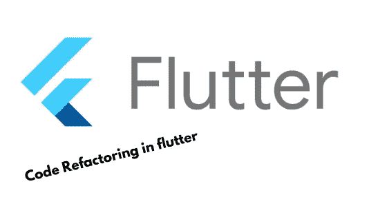
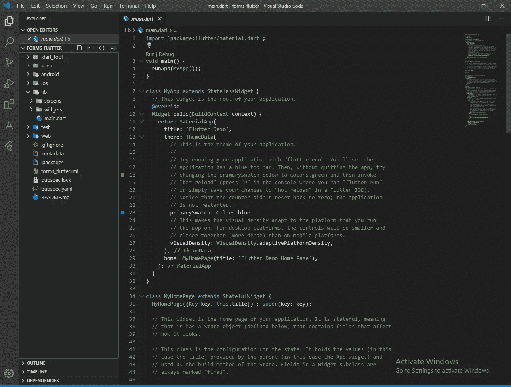
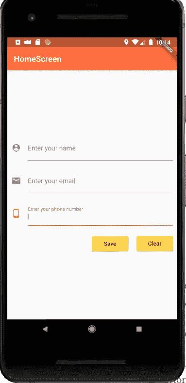

# 将 Flutter 小部件重构为子小部件

> 原文：<https://medium.com/analytics-vidhya/refactoring-flutter-widgets-into-sub-widgets-3cf0f1f29645?source=collection_archive---------5----------------------->



大家好，今天我将讨论构建一个 flutter 应用程序最重要的部分是代码重构。为了代码的可重用性，在每个编程中把你的代码分成子部分是非常有用的，也许你已经创建了一个按钮，你想在整个应用程序中使用同一个按钮，这样你就可以把它重构到一个单独的文件中。

步骤 1:创建一个名为“代码重构 flutter”的 flutter 项目。

步骤 2:创建一个项目结构，如下图所示:



步骤 3:在 screens 文件夹中创建 home_screen.dart，并复制粘贴以下代码:

```
**import 'package:flutter/material.dart'**;

**class** HomeScreen **extends** StatelessWidget {
  @override
  Widget build(BuildContext context) {
    **return** Scaffold(
      appBar: AppBar(
        title: Text(**'HomeScreen'**),
      ),
    );
  }
}
```

步骤 4:从 main.dart 中删除所有代码，并复制粘贴以下代码:

```
**import 'package:flutter/material.dart'**;
**import './screens/home_screen.dart'**;

**void** main() => runApp(MyApp());

**class** MyApp **extends** StatelessWidget {
  @override
  Widget build(BuildContext context) {
    **return** MaterialApp(
      home: HomeScreen(),
      theme: ThemeData(
        primaryColor: Colors.*deepOrangeAccent*,
        accentColor: Colors.*amberAccent*,
      ),
    );
  }
}
```

步骤 5:让我们创建 home_screen.dart 的一个 body 部分，复制粘贴以下代码:

```
**import 'package:flutter/material.dart'**;

**class** HomeScreen **extends** StatelessWidget {
  @override
  Widget build(BuildContext context) {
    **return** Scaffold(
      appBar: AppBar(
        title: Text(**'HomeScreen'**),
      ),
      body: Column(
        mainAxisAlignment: MainAxisAlignment.**center**,
        children: [
          Padding(
            padding: **const** EdgeInsets.all(8.0),
            child: TextField(
              keyboardType: TextInputType.*text*,
              decoration: InputDecoration(
                labelText: **'Enter your name'**,
                icon: Icon(Icons.*person_pin*),
              ),
            ),
          ),
          Padding(
            padding: **const** EdgeInsets.all(8.0),
            child: TextField(
              decoration: InputDecoration(
                labelText: **'Enter your email'**,
                icon: Icon(Icons.*email*),
              ),
              keyboardType: TextInputType.*emailAddress*,
            ),
          ),
          Padding(
            padding: **const** EdgeInsets.all(8.0),
            child: TextField(
              keyboardType: TextInputType.*number*,
              decoration: InputDecoration(
                labelText: **'Enter your number'**,
                icon: Icon(Icons.*phone_android*),
              ),
            ),
          ),
          Padding(
            padding: **const** EdgeInsets.all(8.0),
            child: Row(
              mainAxisAlignment: MainAxisAlignment.**end**,
              children: [
                RaisedButton(
                  color: Theme.*of*(context).**accentColor**,
                  onPressed: () {},
                  child: Text(**'Save'**),
                ),
                SizedBox(
                  width: 5,
                ),
                RaisedButton(
                  color: Theme.*of*(context).**accentColor**,
                  onPressed: () {},
                  child: Text(**'Clear'**),

                ),
              ],
            ),
          )
        ],
      ),
    );
  }
}
```

在上面的代码中，你可以清楚地看到窗口小部件的重复出现了几次，在上面的例子中多次使用同一个窗口小部件是不好的。 将这些小部件放在一个单独的文件中很好，这样我们就可以在我们的整个应用程序中使用它，或者在我们想要使用它的地方使用它，这样我们就可以避免一次又一次地重复多行代码，通过分离文件，我们可以更容易地导入该文件并在我们的文件中使用该小部件。

步骤 6:首先，让我们将文本字段重构为一个单独的文件，转到 lib 中的 widgets 文件夹，创建一个名为 app_text_field 的新文件，并复制粘贴以下代码:

```
**import 'package:flutter/material.dart'**;

**class** AppTextField **extends** StatelessWidget {
  **final** String **title**;
  **final inputType**;

  AppTextField({@required **this**.**title**, @required **this**.**inputType**});

  @override
  Widget build(BuildContext context) {
    **return** Padding(
      padding: EdgeInsets.all(10),
      child: TextField(
        keyboardType: **inputType**,
        decoration: InputDecoration(
          labelText: **title**,
          icon: Icon(Icons.*phone_android*),
        ),
      ),
    );
  }
}
```

当我们在文件中使用这个部件时，我们必须将标题和输入类型传递到它的构造函数中。

步骤 7:让我们将 app_text_field.dart 导入 home_screen.dart 并复制粘贴以下代码:

```
**import 'package:flutter/material.dart'**;
**import '../widgets/app_text_field.dart'**;

**class** HomeScreen **extends** StatelessWidget {
  @override
  Widget build(BuildContext context) {
    **return** Scaffold(
      appBar: AppBar(
        title: Text(**'HomeScreen'**),
      ),
      body: Column(
        mainAxisAlignment: MainAxisAlignment.**center**,
        children: [

          AppTextField(
            title: **'Enter your name'**,
            inputType: TextInputType.*text*,
            icon: Icon(Icons.*person_pin*),
          ),
          AppTextField(
            title: **'Enter your email'**,
            inputType: TextInputType.*emailAddress*,
            icon: Icon(Icons.*email*),
          ),
          AppTextField(
            title: **'Enter your phone number'**,
            inputType: TextInputType.*phone*,
            icon: Icon(Icons.*phone_android*),
          ),

          Padding(
            padding: **const** EdgeInsets.all(8.0),
            child: Row(
              mainAxisAlignment: MainAxisAlignment.**end**,
              children: [
                RaisedButton(
                  color: Theme.*of*(context).**accentColor**,
                  onPressed: () {},
                  child: Text(**'Save'**),
                ),
                SizedBox(
                  width: 5,
                ),
                RaisedButton(
                  color: Theme.*of*(context).**accentColor**,
                  onPressed: () {},
                  child: Text(**'Clear'**),
                ),
              ],
            ),
          )
        ],
      ),
    );
  }
}
```

如你所见，代码重构节省了许多代码行，代码重构使我们的主窗口小部件可读性更好，更容易理解。

步骤 8:现在来看凸起的按钮，你可以看到它们也是重复的，所以我们也可以将其重构为一个单独的文件，在 widgets 文件夹中创建一个名为“app_button.dart”的新文件，并复制粘贴以下代码:

```
**import 'package:flutter/material.dart'**;

**class** AppButton **extends** StatelessWidget {
  **final title**;
  AppButton(**this**.**title**);
  @override
  Widget build(BuildContext context) {
    **return** Padding(
      padding: **const** EdgeInsets.all(10.0),
      child: RaisedButton(
        color: Theme.*of*(context).**accentColor**,
        onPressed: () {},
        child: Text(**title**),
      ),
    );
  }
}
```

步骤 9:让我们将 app_button.dart 导入到我们的 home_screen.dart 中，并替换下面的行代码:

```
Row(
  mainAxisAlignment: MainAxisAlignment.**end**,
  children: [
    AppButton(**'Save'**),
    AppButton(**'Clear'**),
  ],
),
```

现在你可以看到我们的 home_screen.dart 小部件已经被完全重构，不仅对你，对其他开发者都是可读的、可理解的。为了代码的可重用性，将代码重构到一个单独的文件中总是好的。这节省了更多的代码行，也节省了您的时间。

这就是今天的全部内容，我希望你清楚这一点，因为重构代码是你的 flutter 应用程序的重要组成部分。

这将是我们刚刚创建的应用程序的输出。



如果你把这个最重要的概念变成简单易行的步骤，别忘了离开 clap，跟我来。❤

Github 回购链接:

[](https://github.com/Mashood97/Code-refactoring-in-flutter) [## mashood 97/代码重构

### 新的颤振应用。这个项目是颤振应用的起点。一些资源让你…

github.com](https://github.com/Mashood97/Code-refactoring-in-flutter) 

不要忘记开始回购，也请关注我，在 Github ❤获得更多精彩的回购。

下面提到了我的另外两篇文章，也可以看看:

1.  表单及其验证:

[https://medium . com/@ mashoodsidd 97/forms-and-its-validation-in-flutter-1c 2 B3 F9 c 985 c](/@mashoodsidd97/forms-and-its-validation-in-flutter-1c2b3f9c985c)

2.使用提供商包的 firebase 的 Flutter 电话认证:

[https://medium . com/@ mashoodsidd 97/flutter-phone-authentic ation-with-firebase-using-provider-package-55 ffbce 7c 361](/@mashoodsidd97/flutter-phone-authentication-with-firebase-using-provider-package-55ffbce7c361)