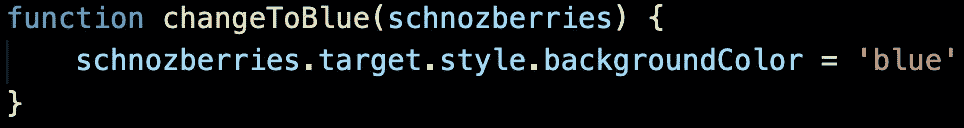

# 事件侦听器中的引用函数，不要调用

> 原文：<https://medium.com/analytics-vidhya/reference-functions-in-event-listeners-dont-call-53063b21d64a?source=collection_archive---------6----------------------->

鲁布·戈德堡机器

上面的装置被称为“鲁布·戈德堡机器”。它以非常复杂的方式执行简单的任务。典型的情况是，一个动作引发另一个动作，以此类推，直到这个简单的任务被序列中的最后一个动作完成。这些动作中的每一个都在等待着什么事情发生。轮子在等待曲柄转动，滑轮在等待轮子转动。每个动作*监听*前一个动作。在 Javascript 中，我们用“事件监听器”自己创建这些序列。我们用`addEventListener`创建事件监听器，`addEventListener`需要两个参数:1。要监听的事件和 2。“听到”事件时要执行的函数。如果我们以不正确的方式提供一个函数，我们可能会搞砸这个监听过程。这就是为什么使用函数引用**而不是函数调用**很重要。

乔纳·希尔欣赏一个好的参考，我们的事件听众也是。为了正常工作，事件侦听器需要函数引用，而不是函数调用。有什么区别？假设我的页面上有一个心形按钮，看起来像这样:

我决定当我的用户点击这个按钮时，我希望按钮变成蓝色，所以我在我的 Javascript 中创建了一个事件监听器。我们抓取元素，并使用`addEventListener`来确保这个按钮正在监听。下面，我声明了事件发生时将执行的函数。

正如您所看到的，这个函数需要一个参数“event ”,我们用它来访问它的目标的背景颜色，以便改变它。`event.target`是我们要换的按钮。如果我们`console.log(event)`，我们传递给这个参数的事件应该是这样的。

这里发生了很多事情，如果我们仔细研究，这个事件有很多属性。我们想特别关注它的一个特性。

这是我们想要在`changeToBlue`函数中访问的`event.target`。

假设我已经使用按钮元素的“id”获取了它，并将其设置为变量`hrtBtn`。现在我们可以向它添加一个事件侦听器。因为我们希望按钮在被点击时改变颜色，所以我将传递给侦听器的事件将是`'click'`。

现在，让我们假设我还没有声明这个函数。为什么？因为这将有助于解释为什么我会被函数调用而不是引用绊倒。如果我们不在事件侦听器外声明函数，我们可以在事件侦听器内声明一个匿名函数作为第二个参数，如下所示:

这工作非常好。附件 A:

注意，我们将`event`传递给了这个函数声明。我假设`addEventListener`给了我们`event`，我们可以将它传递给函数。这就是为什么我在尝试将我之前声明的`changeToBlue`函数添加到事件监听器时犯了下面的错误。(**请注意**:下一个例子**不正确**是为了向你展示我在哪里出错)

我们的`changeToBlue`函数需要一个事件参数，所以我像对待在事件监听器中声明的匿名函数一样传递事件给它。如果我们这样做，下面是我们在控制台上看到的内容。

显然我们在`changeToBlue(event)`中传递的`event`是未定义的。因此，事件侦听器没有给我们提供可以用关键字“event”传入的事件。

本文的重点:`addEventListener`将`event`隐式地传递给我们的函数**。**

**我们之前给事件侦听器的匿名函数只是声明一个事件将被传递，然后在函数声明中解释我们将对该事件做什么。实际上，在这两种情况下，我们都不需要称之为“事件”。**

****

**即使在用`schnozberries`替换`event`后，其工作原理也完全相同。让我们对之前声明的函数做同样的事情，只是为了证明我们不需要实际写出这个由事件监听器传递的神秘“事件”。**

****

**由于事件是隐式传递的**，不能作为名为`event`的变量使用，我的下一步是尝试将我的`changeToBlue`函数传递给事件监听器，就像这样(**注意**:我下一部分**又做错了**)****

********

****同样，按钮不起作用，这是控制台告诉我们的。****

********

****这与我们试图像这样传递事件参数时的错误相同。正在发生的事情是，通过在`()`末尾用括号写出我们的函数，我们在**调用**函数。“难道我们不想调用函数吗？”你可能会说。我们确实想调用它，但是我们只想在事件发生时调用它。当我们像这样在末尾加上括号时，程序一读完这一行，我们就执行这个函数。该函数将在脚本加载后立即执行，这是在用户可以单击按钮之前。因此，我们没有一个事件来隐式传递我们的函数，因此程序不能读取`schnozberries`的`target`，因为`schnozberries`是未定义的。这就把我们带到了功能**参考**。****

****如果我们写出函数的名字，后面没有括号，我们就没有调用它。我们只是告诉事件监听器在事件发生时找到那个函数，然后执行它(向事件监听器添加回调函数的正确方法)。****

********

****函数引用，正确的做法是****

****通过引用我们的`changeToBlue`函数，监听器在点击事件一发生就将其传递给函数，现在我们的`schnozberries`有了一些意义。****