# Python 中的正则表达式— A-Z

> 原文：<https://medium.com/analytics-vidhya/regex-in-python-a-z-88ebf1c8fed4?source=collection_archive---------3----------------------->

正则表达式是一个字符序列，它用正式的语法形成一个搜索模式。正则表达式通常用于涉及大量文本处理的应用程序中。

作为一名数据科学家/工程师，对 Regex 有扎实的理解可以帮助您非常容易地执行各种数据预处理。就我个人而言，我用它们做很多随机的事情，主要是当我必须处理文本数据或做自然语言处理项目时。

正则表达式有多种开源实现，每一种都共享一个通用的核心语法，但是对它们的高级特性有不同的扩展或修改。Python 有一个名为`re`的内置包，可以用来处理正则表达式。

导入`re`模块:

```
import re
```

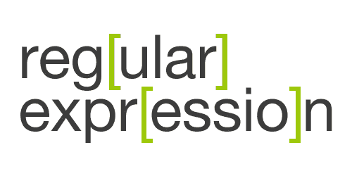

本教程非常独特，因为它不仅从理论上解释了正则表达式，还详细描述了正则表达式方法/属性在 Python 中是如何工作的。通过阅读本文，如果您以前从未做过其他事情，您将很快能够创建自己的正则表达式。

我们开始吧！

# 正则表达式函数

`re`模块提供了一组功能，允许我们在文本中进行搜索。

## 1.重新搜索()

`re.search()`将获取模式，扫描文本，然后返回一个**匹配**对象。让我们做一个简单的例子，使用 re 模块中的 search 方法来查找一些文本。

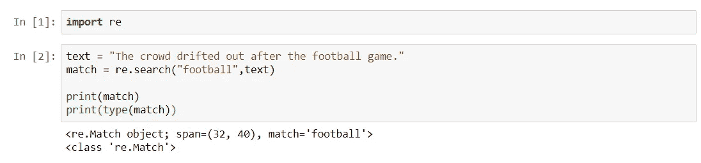

search()方法返回的这个 **Match** 对象不仅仅是一个 Boolean 或 None，它包含关于匹配的信息，包括原始输入字符串、使用的正则表达式和匹配的位置。

类型匹配。+ `tab`你可以看到所有你可以在匹配对象上使用的方法。

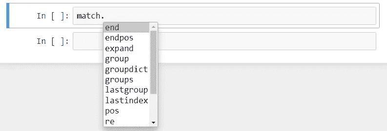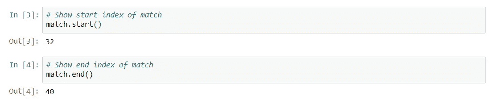

## 2.re.findall()

您可以使用`re.findall()`在一个字符串中查找一个模式的所有实例。例如:

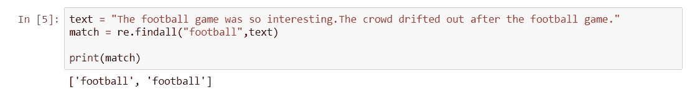

## 3.重新拆分()

让我们看看如何使用 re 语法进行拆分。这看起来类似于对字符串使用 split()方法。

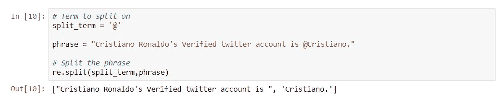

`re.split()`返回字符串在每次匹配时被拆分的列表。

## 4.re.sub()

英语有几个缩写。

例如:

```
can't -> can not
he's -> he is
```

如果你想替换一个匹配正则表达式而不是完全匹配的字符串，我们可以使用 **re** 模块的 **sub()** 。

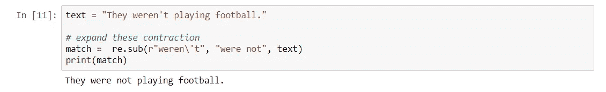

这将是本文中关于在 Python 中使用 re 的大部分内容。正则表达式支持多种多样的模式，不仅仅是简单地查找单个字符串出现的位置。

我们可以使用 ***元字符*** 和 ***特殊序列*** 以及 **re** 来查找特定类型的模式。

# ***元字符***

有五种方式来表达模式中的重复:

1.  元字符`*`后面的模式重复了零次或多次。
2.  用`+`替换`*`，图案必须至少出现一次。
3.  使用`?`表示图案出现零次或一次。
4.  对于特定的出现次数，在模式后使用`{n}`，其中 **n** 被替换为模式应该重复的次数。
5.  使用`{x,y}`，其中 **x** 为最小重复次数， **y** 为最大重复次数。省略**y**表示该值至少出现 **x** 次，没有最大值。

因为我们将测试多种 re 语法形式，所以让我们创建一个函数，在给定各种正则表达式列表和要解析的短语的情况下，它将打印出结果。

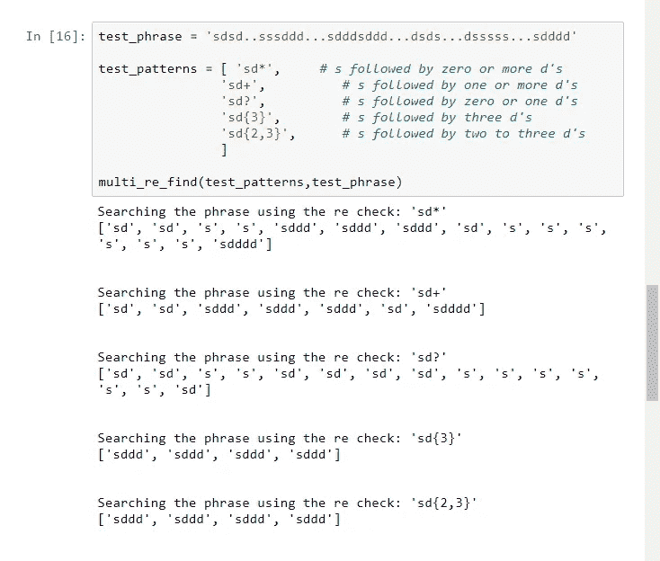

# *特殊序列*

您可以使用特殊的序列或转义码来查找数据中特定类型的模式，如数字、非数字、空格等等。

转义通过在字符前加上反斜杠`\`来表示。

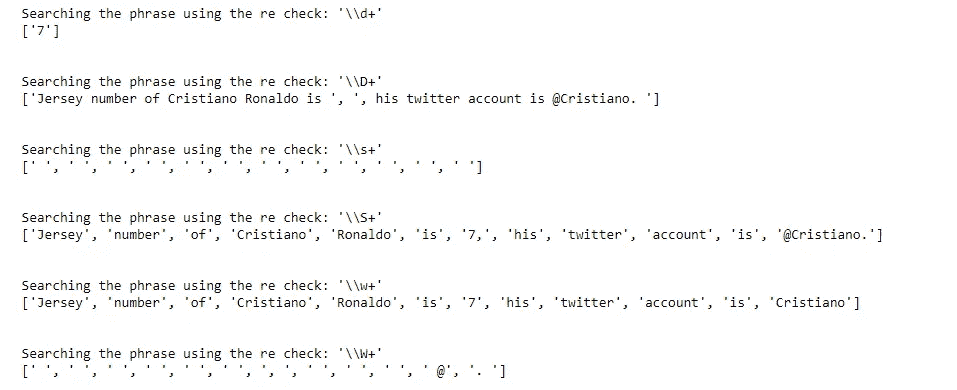

# 字符集

当您希望在输入中的某一点匹配一组字符中的任何一个时，可以使用字符集。括号用于构造字符集输入。

例如，输入`[ab]`搜索出现的 **a** 或 **b** 。

让我们看一些例子:

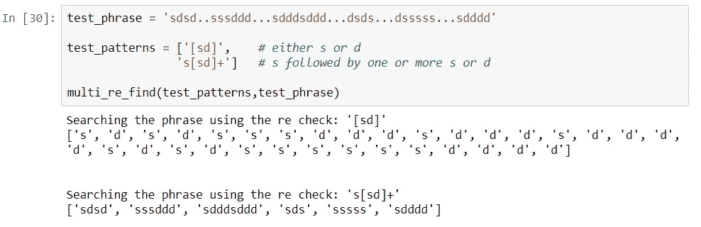

*   第一个输入`[sd]`返回 s 或 d 的每个实例是有意义的。
*   同样，第二个输入`s[sd]+`返回任何以 s 开始并以 s 或 d 字符继续的完整字符串，直到到达另一个字符。

# 排除

我们可以通过将`^`合并到括号语法符号中来排除术语。使用`[^!.? ]`检查不是 a 的匹配！,.,?，或者空间。

添加一个`+`来检查匹配是否至少出现一次。这基本上就是找到单词。

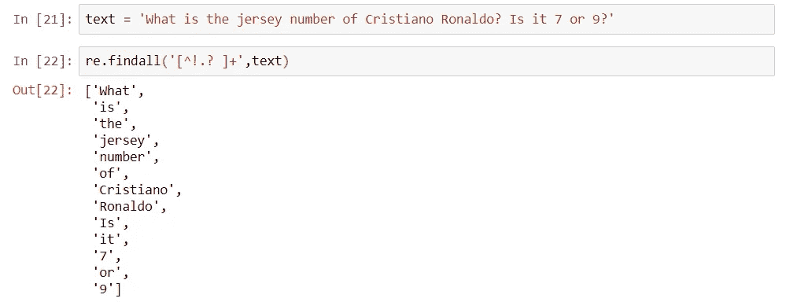

# 字符范围

随着字符集变得越来越大，键入每个应该(或不应该)匹配的字符会变得非常乏味。使用字符范围的一种更紧凑的格式允许您定义一个字符集，以包含起点和终点之间的所有连续字符。使用的格式是`[start-end]`。

常见的用例是在字母表中搜索特定范围的字母。例如，`[a-f]`将返回 a 和 f 之间出现的任何字母的匹配。

让我们看一个例子:

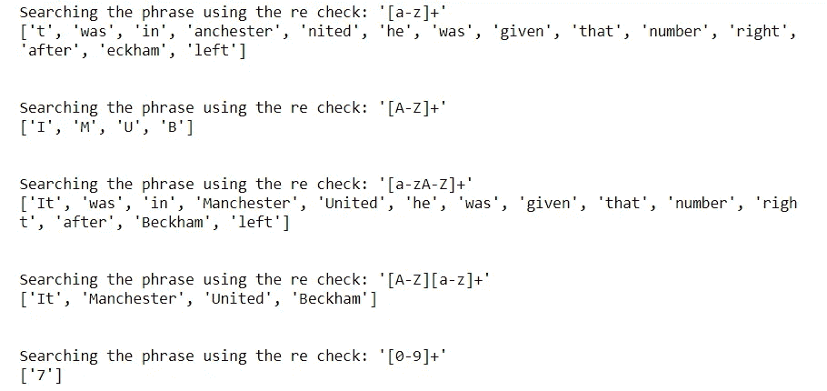

# 结论

现在，您应该对如何使用 Python 中的正则表达式模块有了深入的了解。还有很多更特殊的角色实例，但是逐一查看每个用例是不合理的。相反，如果你需要查找某个特定的模式，可以看一下完整的[文档](https://docs.python.org/3/library/re.html#regular-expression-syntax)。

你也可以在这个[源](http://www.tutorialspoint.com/python/python_reg_expressions.htm)查看漂亮的汇总表。

# [Regex101](https://regex101.com/)

[**Regex101.com**](https://regex101.com/)是一个交互式正则表达式控制台，让你实时调试你的表达式。

# 参考:

1.  Python 文档—[https://docs . python . org/3/library/re . html #正则表达式语法](https://docs.python.org/3/library/re.html#regular-expression-syntax)
2.  https://www.pieriandata.com/的何塞·马西亚尔·波尔蒂利亚
3.  维基—[https://en.wikipedia.org/wiki/Regular_expression](https://en.wikipedia.org/wiki/Regular_expression)