# 或如何方法论地设计有效的网络。

> 原文：<https://medium.com/analytics-vidhya/regnet-or-how-to-methodologically-design-effective-networks-c3560c1cf436?source=collection_archive---------3----------------------->

设计网络设计空间

一个新的 SoTA 网络已经发布，但是以一种非常轻率的方式。这是可以理解的，因为它是在一篇旨在推进一个更强大的想法的论文中介绍的。如果一个人仅仅从这份报纸上拿走“新索塔”，那将是一个巨大的损失。

这篇论文是《设计网络设计空间》，由脸书人工智能研究院(FAIR)发表。作者旨在深化“设计空间设计”的理念。他们的目标不是发现任何特定的网络，甚至不是找到某个网络家族。正如他们所说的，他们试图“发现通用的*设计原则*，这些原则描述了简单、运行良好、跨环境通用的网络”

# 设计空间设计

> 我们的重点是探索网络结构(例如，宽度、深度、群组等。)假设标准模型系列包括 VGG、雷斯耐特和雷斯耐特

从一个他们称为 AnyNet 的简单无约束 ResNet 类基础，他们进行基于群体的实验，以达到他们称为 **RegNet** 的设计空间。我认为，理解和探索他们如何进行实验是至关重要的，因为从这篇论文中可以得出比他们得出的 RegNet 更重要的结论。

尽管他们的 RegNet 设计空间是针对低计算、低纪元的体系，但他们表明它也适用于其他体系。最终，RegNet design 生成的模型可与之前的 SoTA EfficientNet 模型相媲美。

然而，我想强调的是，很明显，为了简洁和公平的比较，他们在桌面上留下了很多潜力。据我所知，他们的目的不是简单地推出另一款 SoTA 车型。更确切地说，是为了推进使他们的发现成为可能的基本原理。

> 我们研究模型群体的行为，而不是在特定的环境下设计或寻找单一的最佳模型。

他们的方法是从设计空间中抽取样本模型，并对其进行分析，以了解其中哪些工作得更好或更差，然后通过这种直觉开发新的设计空间。

## AnyNet 设计空间

他们开始设计过程的最初设计空间是 AnyNet。从根本上说，它是一个非常简化和无约束的 ResNet。它有一个输入图像的主干，完成大量计算的主体，以及完成分类的头部。主体具有 4 个阶段，并且每个阶段具有不同数量的相同块(除了跨距 2 用作“下采样”块的某些块)。

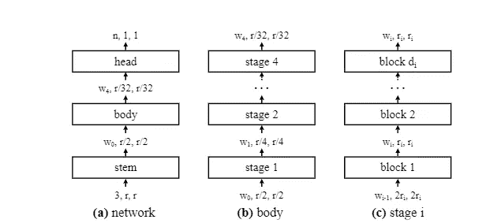

网络结构。

每个块有 3 个参数:宽度 w、瓶颈比率 b 和组宽度 g。分辨率 r 固定为 224。

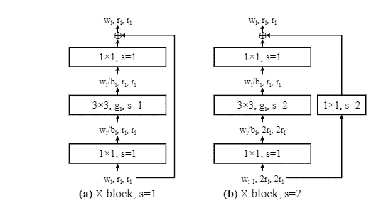

AnyNetX 的基本块 X 块。(b)描述了“下采样块”

> 虽然总体结构很简单，但 AnyNet 设计空间中可能的网络总数是巨大的。

这篇论文很好地总结了它们的参数空间:

AnyNetX 设计空间具有 16 个自由度，因为每个网络包括 4 个级，并且每个级 I 具有 4 个参数:块的数量 di、块宽度 wi、瓶颈比 bi 和组宽度 gi。除非另有说明，我们将输入分辨率固定为 r= 224。为了获得有效的模型，我们对 di≤16、wi≤ 1024 和可被 8 整除、bi∈ {1，2，4}和 gi∈ {1，2，...，进行对数均匀采样。。。,32 }.我们 ***重复采样，直到我们在我们的目标复杂度范围(360 毫伏到 400 毫伏)中获得 n= 500 个模型*** ，并且 ***训练每个模型 10 个时期***

> 为了**获得模型的分布**，我们从一个设计空间中取样并训练 n 个模型。为了提高效率，我们主要是在低计算量、低时期的训练体系中进行的。特别是，在本节中，我们在 ImageNet 数据集上使用 4 亿 flop (400MF)机制训练每个采样模型 10 个时期。我们注意到，虽然我们训练了许多模型，但每次训练运行都很快:在 400MF 下训练 100 个模型 10 个时期大致相当于在 flops 下训练单个 ResNet50 模型在 4GF 下 100 个时期(强调我的)

上面强调的部分描述了他们基于人群的方法，是本文的主要贡献之一。请注意，400 毫安的状态大致相当于 EfficientNet-B0

> 我们不是从 these∼10^18 配置中寻找单一的最佳模式，而是探索是否有通用的设计原则可以帮助我们理解和完善这个设计空间。

他们进行设计的基本目标如下

1.  为了简化设计空间的结构，
2.  为了提高设计空间的可解释性，
3.  为了提高或保持设计空间质量，
4.  为了保持设计空间中的模型多样性

这表明，他们不仅追求设计一个有效和高效的设计空间，他们这样做的方式是可以理解的。

前面提到的无约束设计空间，他们称之为 AnyNetXa。他们从这个空间取样，分析人口，设计一个新的空间，然后重复。

注意，大多数规范 ResNe(X)ts 不包含在 AnyNetX 中。这至少是由于杆层的差异以及杆和主体之间的中间最大池层。

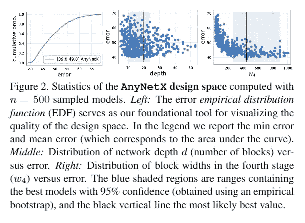

针对特定参数绘图可以提供对有效值范围的深入了解。

在 AnyNetXb 中，它们约束瓶颈参数在所有阶段都是相同的。在这种约束下采样的群体实际上显示了与 AnyNetXa 相同的分布。虽然这并没有 ***提高*** 任何客观的度量标准本身，但它简化了设计空间而没有任何害处。

在 AnyNetXc 中，它们将组参数固定在各个阶段之间。这意味着每个阶段共享相同的组宽度(要进一步理解组宽度，请参考[深度神经网络的聚合残差变换](https://arxiv.org/abs/1611.05431)中的基数)。

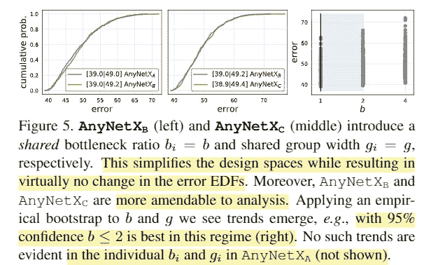

(强调我的)

在测试 b 和 c 变体的过程中，他们发现 b = 1(实际上没有瓶颈扩展)和组宽度为 2 或更大产生了最好的结果。

熟悉 ResNets 的人会记得，瓶颈比和扩展的存在是为了在不过度增加 FLOPs 的情况下增加通道宽度。还值得注意的是，有必要在 3x3 卷积之前和之后引入 1x1 卷积来匹配尺寸，这些 1x1 卷积*增加了内存访问成本，同时减少了触发器。*因此，这种“瓶颈”模块设计也导致基于它的网络在基于 GPU 的加速器上出现瓶颈(并非有意双关)。

包括移动网和高效网在内的 mnas 网广泛使用深度方向卷积来实现 SoTA 性能。这些卷积可以理解为组宽度为 1 的组卷积。AnyNetXb 群体表明 g >1 是最好的这一事实与这一事实并不冲突。毫无疑问，这样的网络能够并且确实表现出色。该论文*经验地显示了* ***、*** *，用统计支持来支持主张* ***、*** ，即作为**设计空间**，g = 1 可能是最好的避免，即使 MNAS 搜索已经 ***找到了特定的实例*** ，其中有良好的执行模型可以建立。

再次重申，我们应该关注的是统计工具和人口分析。

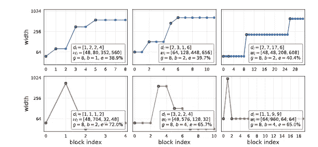

上面是一个宽度不断增加的良好网络的示例。下面是一张烂网。注意误差值显示为 e = %

接下来，作者检查了 AnyNetXc 的好网络和坏网络，发现好网络的宽度不断增加。AnyNetXD 封装了这个原理。

通过进一步的测试，他们得出结论，增加深度和宽度是良好网络的一个重要方面。这被集成为 AnyNetXe

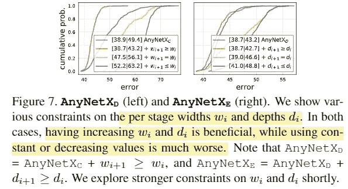

有趣的是，增加深度的条件不一定是最后一级所需要的。请记住，canonical ResNe(X)t 模型被设计为在第 4 阶段具有 3 个块，即使它从 50、101 和 152 深度模型扩展。

## 创意设计空间

概括来说，AnyNetXe 设计空间如下

*   一个非常基本的网状骨骼，由简单的茎、体和头组成。具有不同数量的相同块的 4 个阶段。
*   (AnyNetXb)跨阶段的相同瓶颈。优选 b = 1
*   (AnyNetXc)跨级的相同组宽度，优选 g > 1
*   (AnyNetXd，e)逐渐增加通道宽度和块深度，最后一级可能例外

在此基础上，作者确定并分析了最佳性能模型。

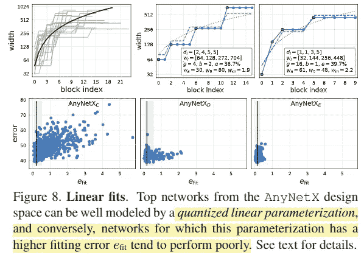

强调我的。右上方显示了两个具有 bet 线性拟合的模型

他们发现有可能找到线性拟合来 ***解释和预测*** 这个空间内的最佳模型。

根据他们发现的线性拟合，一个网络结构通过 6 个参数，d(深度)，w0(初始宽度)，wa，wm，b 和 g(后两个分别用于瓶颈和组宽度)。这些参数被拟合到以下方程中，以生成区块宽度和深度。

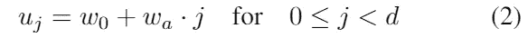

不同的块宽度 uj 为每个块 j < d. w0 初始宽度，wa 斜率，d 深度

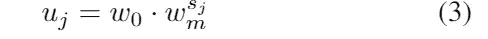

控制参数化的附加参数。计算每个块 j 的 sj，使以下等式成立

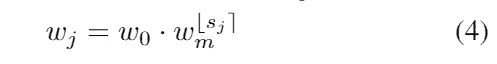

通过下式计算量化的每块宽度 wj

由此产生的设计空间被称为 RegNet。

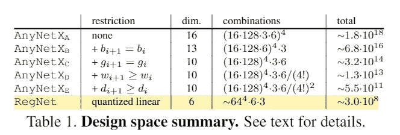

如上表所示，RegNet 不是一个单一的网络，甚至也不是像 EfficientNets 那样的一系列网络。它是一个被量化的线性规则所限制的设计空间，被期望包含好的模型。

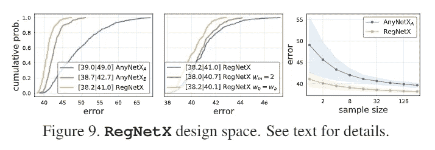

AnyNetXa、Xe 和 RegNetX 各自群体的 EDF 以及各种附加限制。(右)显示 RegNetX 的随机搜索效率要高得多

测试了进一步的限制，包括 wm = 2 或 w0 = wa。尽管这些附加条件可以提高性能，但作者决定不将它们纳入他们的 RegNetX 设计空间。作者的意图是允许读者根据他们自己的要求应用他们自己的限制，希望是以这样一种结构化和有纪律的方式。

还发现由 RegNetX 定义的设计空间也是网络体系结构搜索的良好候选。这表明这种设计空间工程并不排斥网络体系结构搜索方法。因此，可以想象一个包含两种方法的管道。

## 设计空间泛化

AnyNet 和随后的 RegNet 设计空间是为低计算量、低时期的训练体制设计的。这个目标本身是有用的，对于本文中显示的基于群体的方法也是有用的。值得注意的是，他们表明他们的设计空间对于更复杂的模型也是有用的。

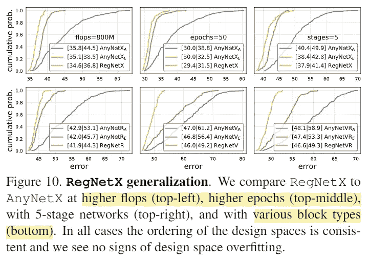

强调我的。在这种情况下，设计空间过拟合意味着由于对设计空间的特定限制而导致的性能衰退。

上面的 EDF 表明 RegNetX 在其初始设计之外的其他机制中是通用的

# **分析 RegNetX 设计空间**

作者的分析揭示了由经验数据支持的几个趋势，这些趋势与流行的设计选择不匹配。具体趋势和数据在文件中有很好的描述，并总结如下。

*   **最佳模型的深度在整个区域内保持稳定**，最佳深度为 20 个区块(60 层，因为每个区块有 3 层，依次由 1x1、3x3 和 1x1 卷积组成)
*   ***最好的型号使用 1.0 的瓶颈比 b，有效地消除了瓶颈*** 。虽然作者没有提到这一点，但我认为这是特别重要的一点。三层瓶颈块(具有 1x1 和 3x3 卷积)的全部要点是 ***引入通道宽度扩展(至少在原始论文中)*** 。如果它是不必要的或者有害的，那么重新访问基本的块结构本身将是有价值的。也许由具有两个连续 3×3 卷积的“基本块”组成的新设计空间会产生具有不同的更友好的 GPU 模型的不同设计空间。然而，这样的设计空间变化将保证额外的测试。
*   结果表明，好模型的宽度乘数是 2.5，这很好地反映了已有模型的设计选择，它趋向于增加 2 倍。这种差异是显著的，因为 2 v 的乘数 2.5 将导致最后(第 4 阶段)的宽度差异超过两倍

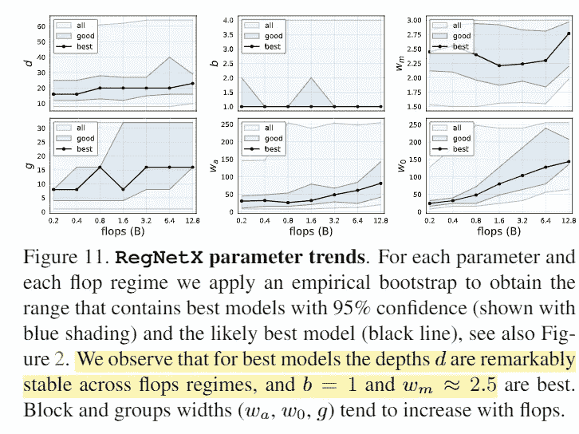

我想再次指出，尽管这些见解本身很有价值，但理解它们有效的约束条件以及导致这些见解的方法也很重要。

作者进行的一个有趣的分析途径是复杂性分析。处理架构的论文研究和发表关于参数和 FLOPs 的统计数据是很常见的。最近的论文包括选择硬件的推理时间。在这里，作者决定研究*网络激活*。这些会严重影响内存受限硬件(如 GPU)的运行时间。其他研究和现场经验表明，广泛利用深度方向可分离卷积和反向瓶颈的网络可以显著减少参数计数和触发器，但是它们显著增加了存储器访问成本。作者得出结论，最好的模型是那些激活随着触发器的平方根而增加，并且随着参数而线性增加的模型。

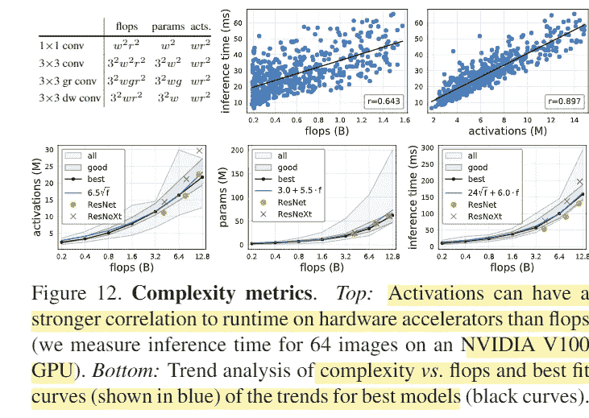

根据这些见解，RegNetX 设计空间进一步受到下列条件的约束。

*   瓶颈比(b) = 1，深度(d) ≤ 40，宽度乘数(wm) ≥ 2
*   参数和激活受到相应的限制

由于 RegNetX 最初是为低触发器、低时期(T1)状态而设计的，所以附加的约束条件确保了它们在所有触发器状态下，在保持高精度的同时也具有低存储成本(T2)。

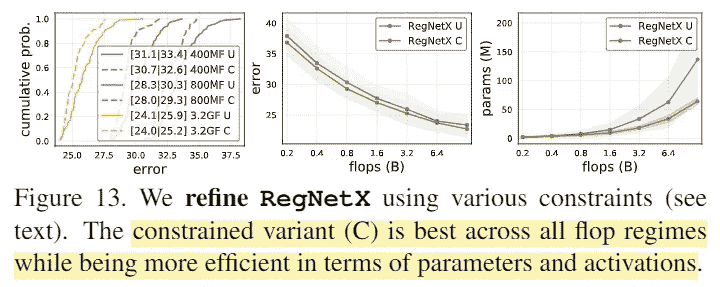

受约束的变体将瓶颈深度宽度和参数限制到激活

替代设计选择也得到了充分研究。低于 1 的瓶颈比率(b < 1) effectively signifies an inverted bottleneck. While this condition is fundamentally outside the original AnyNetX (where b is either 1,2, or 4) it is a very common choice found in many current SoTA models (such as MobileNet or EfficientNet). Also incorporated in such models is the depthwise convolution where g = 1\. Although this case has already been studied here as to be inferior, they conduct population analyses to understand their EDF further. At least within the RegNetX(which, if you allow for b < 1, is expansive enough to incorporate MNASnet like models, but not quite) design space, they are shown to have an inferior EDF. In other terms, selecting models from the RegNetX space under such constraints harm the distribution of the model performances.

It is important to fully and properly understand the implication. MNAS based networks such as **MobileNet 和 EfficientNets 确实是强大的模型**,具有各种优势和某些缺点。同样，这一点已经显示出来，并且没有受到质疑。MNAS 是一个强大的网络架构搜索工具，参与该模型的架构师使用了一个有效的工具来搜索特定的有效模型，并取得了成功*，在这种情况下*。本文的研究表明，作为一个设计空间，有一个更优越的方法和 RegNetX 设计空间作为一个整体，也许更富有成效地发现更有效的模式。

很容易想象研究人员在 RegNetX 搜索空间上使用 MNAS 或其他网络体系结构搜索方法来找到能够优于先前基于 MNAS 的模型或 RegNetX 模型的模型。

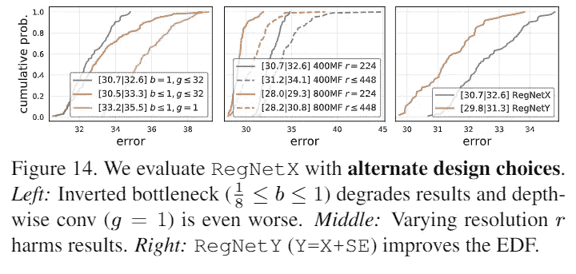

然而，这篇论文实际上与介绍 EfficientNet 的论文的研究直接矛盾。在“ [EfficientNet:反思卷积神经网络的模型缩放](https://arxiv.org/abs/1905.11946)”中，作者得出结论，模型缩放的原则方法应该综合所有宽度、深度和分辨率方面。

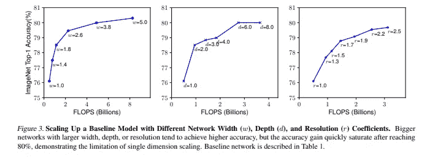

来自[https://arxiv.org/abs/1905.11946](https://arxiv.org/abs/1905.11946)

然而，这篇论文表明，即使对于较高的触发器状态，224 x 224 的固定分辨率也是最好的。我认为这种差异来自不同的设计约束。在不同的设计空间中，不同的约束可能会产生不同的缩放比例。

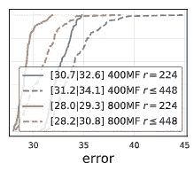

不同网络和分辨率下的 EDF 轴显示累积误差概率)

# 与现有网络的比较

为了比较设计空间中的模型，作者从 25 个随机设置中为每个翻牌制度选择了最佳模型，并在 100 个时期重新训练顶部模型 5 次。

在过去的几年中，网络训练和正则化方案取得了突飞猛进的发展。许多 SoTA 论文采用了各种增强和增加的时间表来代替某些架构改进。为了公平比较，他们尽可能严密地控制训练计划。

我认为他们实际上是在与绑在他们背后的一只胳膊进行比较，因为他们根据各自模型的原始文件进行报告，而他们只使用基本的 100 epoch 时间表训练 RegNet 模型，而没有合理和现代的训练时间改进(包括但不限于 Cutout、DropPath、Autoaugment)。

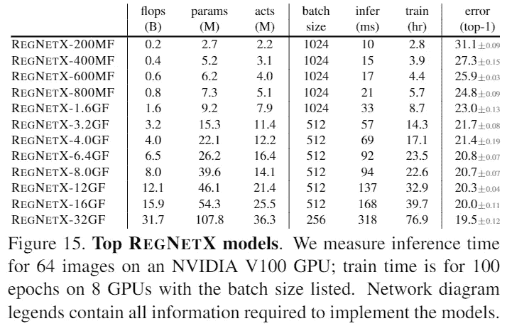

作为对比，ResNe(X)t-50 在 4.0GF 范围左右。

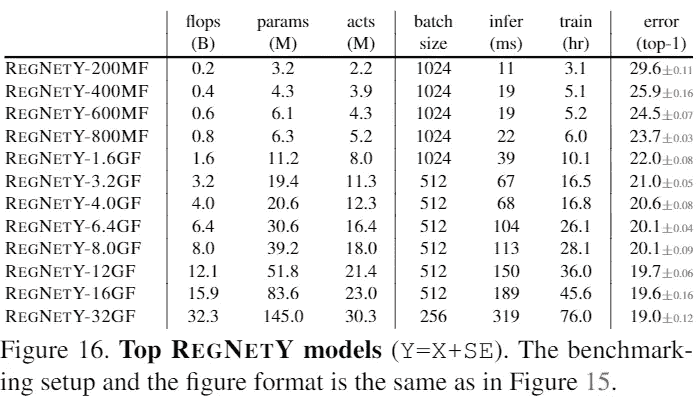

RegNet Y 包含挤压和激励块。EfficientNet -B4 大约在 4.0GF 范围内

## 流动政权

在高达 600MF 的移动范围内，其他类似的网络是 MobileNet、ShuffleNet 和某些其他 NAS 衍生模型。他们甚至没有努力就显示出了很好的结果**。**

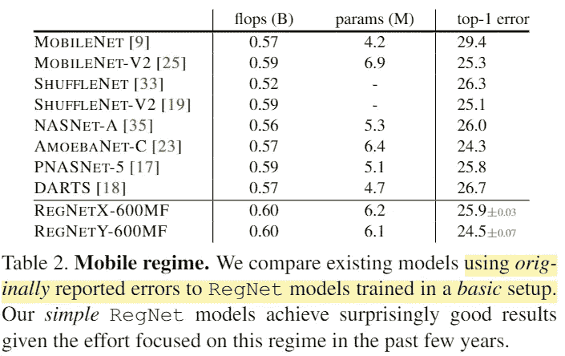

## 标准基线比较

另一个重要的基线模型家族是 ResNe(X)t 模型，它仍然是相关的，并且在 AnyNet 设计空间的最初阶段也是重要的。尽管这篇论文认为它们共享完全相同的设计空间，但我认为这并不完全正确。正如你在下面看到的，茎是不同的。令人惊讶的是，他们有一个共同的缺点。 “下采样”块具有残差连接，该残差连接在原始 ResNet 和 AnyNet 块设计中都具有核大小 1 和跨距 2。这经常被认为是一个缺陷，因为它浪费了整整 3/4 的输入空间。ResNet 的许多现代实现(如 ResNet-D、Assembled ResNet 等)通过合并一个池层来纠正这一点。

这些 SoTA 模型诞生于**相同的错误设计空间**的事实令我难以置信。

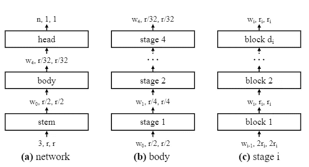

AnyNet:主干是一级 3x3，步幅 2

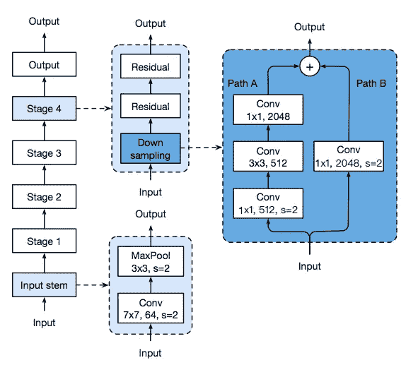

主干是一个阶段 7x7 步幅 2，后跟 Maxpool 3x3 步幅 2。请注意“错误的下采样块，其内核大小为 1，步幅为 2。资料来源:https://arxiv.org/pdf/1812.01187.pdf。

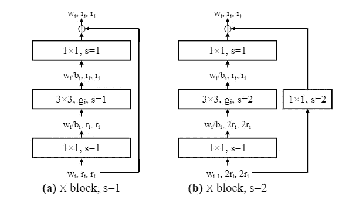

仅反映 1/4 输入空间的“有缺陷的”下采样块

无论你如何切割它，无论是根据激活还是失败，RegNetXs 都在上面。同样值得注意的是，在这种情况下，**作者没有根据他们的原始论文**报告 ResNe(X)t 性能。使用与 RegNetXs 相同的训练，ResNe(X)t 实际上比他们的原始论文有所改进(他们训练了 90 个纪元，而这里是 100 个纪元)

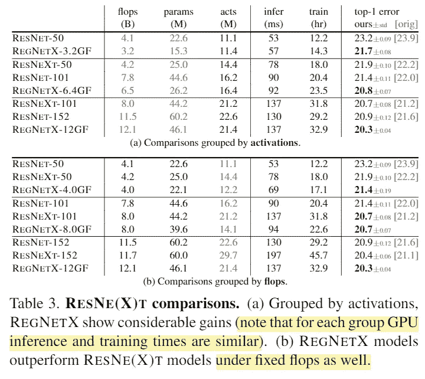

**最先进水平对比:全体制**

在所有体制中，图像分类的当前技术状态是 EfficientNet 系列。在 MobileNet-V3 的基础上，来自 google 的研究人员设计了(a)一个高性能的基线 EfficientNet-B0 (b)一个有效的扩展策略，将它们扩展到所有翻牌区，直到 EfficientNet-B7。(这种一致的扩展策略被其他研究人员用来开发 EfficientNet-B8，它是 B7 的自然演变)。这些模型在许多用例中非常有效，并且已经成为 Google(NoisyStudent、EfficientDet 等)和其他公司的许多项目的支柱。

在我看来，他们的主要缺点是很难用 GPU 训练。正如之前多次提到的，它们广泛利用深度方向卷积和反向瓶颈，这使得它们难以在 GPU 上以高吞吐量进行训练和推断。对于谷歌来说，这似乎不是一个问题，因为谷歌可以访问大量的云 ML 系统，并更关心移动端的推理时间。

与 ResNe(X)ts 一样，它们对 EfficientNets 和 RegNets 采用相同的 vanilla 100 epoch 训练进行以下比较。

RegNetXs 在低于 800MF 的情况下失败了，但在其他情况下却名列前茅。但是在所有的政权中，他们总是比 T4 更快地推断和训练。在 8.0GF 体系(B5)中，它们的速度快了 5 倍，同时表现出更好的性能。

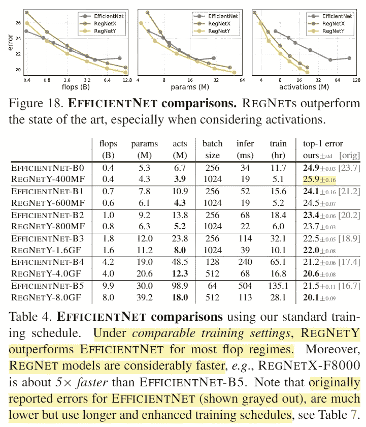

# 结论

我认为本文的基本贡献有三个方面。

1.  提出了设计空间的设计原则。
2.  根据这些原则，引入了有效的设计空间(RegNet)
3.  介绍了 SoTA 网络系列(RegNetX 和 RegNetY)。

很明显，他们希望世界关注第一和第二。如果其他人只是拿着第三条跑，作者会非常失望。再次请记住 RegNetX 被选中的过程。从 RegNet C 设计空间(仍有超过 10⁶的模型可供选择)中，他们从每个翻牌体系中随机选取 25 个**模型，选出最好的，并训练它们 100 个周期。很明显，即使是该领域中的简单 NAS 也会产生更好的模型，至少对于特定的用途来说相对容易。或者更好的是，人们将能够采用本文中描述的群体分析方法来进一步增加设计约束，从而产生更好的设计空间。**

即使你的目标仅仅是最新最好的，我也希望你花时间和精力去读这篇文章。