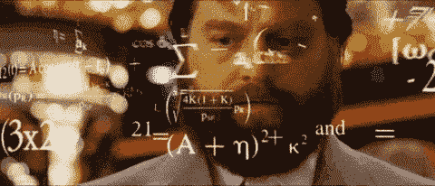

# 回归

> 原文：<https://medium.com/analytics-vidhya/regression-15cfaffe805a?source=collection_archive---------15----------------------->

机器学习算法不是我们可能习惯的常规算法，因为它们通常由一些复杂的统计和数学的组合来描述。由于理解你想要实现的任何算法的背景是非常重要的，这可能会对没有数学背景的人构成挑战，因为数学会通过减慢你的速度来削弱你的动力。

