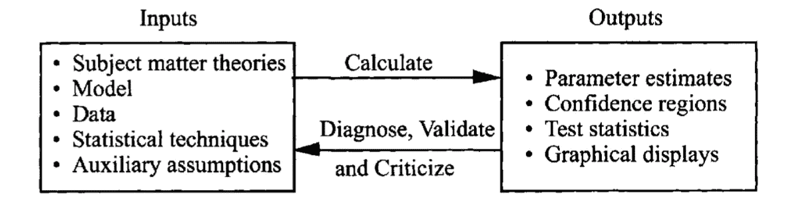

# 回归分析:简介

> 原文：<https://medium.com/analytics-vidhya/regression-analysis-1db56288d8c9?source=collection_archive---------19----------------------->

回归分析回答关于两个或多个变量之间关系的问题。有许多回归技术，但它们的核心都是调查一件事:一个或多个自变量对目标变量的影响。

> 回归是对依赖性的研究

回归分析的步骤
(举例回归分析，第 5 版，Samprit Chatterjee):

*   问题陈述
*   潜在相关变量的选择
*   数据收集
*   模型设定
*   拟合方法
*   模型拟合
*   模型验证
*   使用模型来解决提出的问题

**问题的陈述。**在开始任何分析之前，我们需要确定我们试图回答什么问题。这第一步定义了你研究的质量。设计糟糕的问题会导致错误的结果，浪费你的时间。问题陈述引出使用什么数据、什么变量、使用什么统计方法以及将使用什么模型。

**潜在相关变量的选择。**当问题被仔细地公式化后，我们将转移到哪一组变量将被用于分析。例如，预测芝加哥的房价。一组可能的相关变量是:房子的面积、卧室的数量、浴室的数量、邻居、邻居的犯罪率、建筑的年龄等等。

**数据收集。下一步是收集数据。**

**型号规格。**模型规格由变量之间的关系决定。关系可以是线性的，也可以是非线性的。

**拟合法。**模型定义好了，数据收集好了，下一步就是估计模型的参数。

**模型拟合。**下一步是根据收集的数据拟合模型。

**模型验证。**我们模型的有效性或准确性取决于我们的初始参数和假设。在使用模型进行预测或从分析中得出任何结论之前，我们必须检查并验证我们对数据和参数的假设。

回归过程的迭代性质的示意图(举例回归分析，Samprit Chattarjee)

回归分析是一个迭代的过程，它会重复进行，直到产生预期的结果。