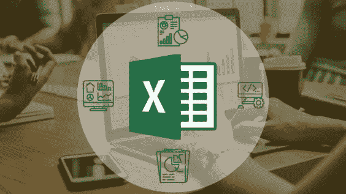
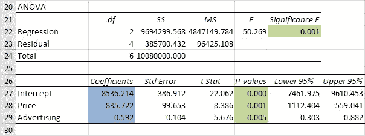

# 回归分析

> 原文：<https://medium.com/analytics-vidhya/regression-analysis-e49f5b55d79e?source=collection_archive---------11----------------------->

**什么是回归分析？**

这是一种使用数据记录中的观察值来量化变量之间关系的方法。例如，对于美国的一家玩具公司，使用回归分析来确定价格、广告支出和促销支出如何影响玩具的销售。

**回归**

统计学中的回归是对作为目标变量的一个变量的平均值与其他变量的相应值之间关系的度量。

**直线型**

线性有它自己的一般含义。“线性”这个词的字面意思是“一条线”，但在统计学中，线性关系意味着你可以用一条线来表示变量集之间的关系。

**线性回归**

线性回归试图拟合感兴趣的变量和可能与感兴趣的变量相关的一组变量之间的线性关系。它可以用来预测一段时间内事件的结果。我们有两种类型的回归:简单变量和多变量。

简单回归是只有一个解释值或 X 变量的回归，而多元回归是有两个或更多解释值或 Y 变量的回归。

图片来源:[https://www.codecademy.us/analysis-in-ms-excel-codecademy/](https://www.codecademy.us/analysis-in-ms-excel-codecademy/)

**线性回归方程**

Y=a+bX

在哪里，

“Y”是我们试图预测的值或感兴趣的变量

“a”代表 Y 轴截距

“b”是回归线的斜率

“X”是我们独立价值的值

回归方程简单地描述了因变量(y)和自变量(x)之间的关系

**如何计算线性回归**

线性回归线的方程形式为 Y = a + bX，其中 X 是解释变量，Y 是因变量。

线性回归是一种模拟两个变量之间关系的方法。

**回归概述及其计算方法**

回归有四个不同的要素，说明如何将它应用于数据

1.  建模—开发回归模型
2.  估计—使用软件来估计模型
3.  推断—解释估计的回归模型
4.  预测-对感兴趣的变量进行预测

这是线性回归多元变量 Y = β0 + β1X1 + β2X2 + β3X3 + …。+ βnXn

公式的解释可以在下面的例子中看到。

应用多变量公式的一个例子是美国的一家玩具公司，该公司希望找出价格、广告支出、促销支出之间的关系，以及这些因素的变化如何影响销售。这可以在 excel 表格上用下面的公式计算。

*   建模—单位销售额=β0+β1 价格+β2 广告支出+β3 促销支出

出于预测目的，对于因变量和自变量之间的强相关性，大多数或所有 P 值应小于 0.05

*   估计:在应用了建模公式之后，我们得到了要在第二个元素中应用的变量的系数。

销售额= β0(系数)，即截距+ β1(系数)*价格+ β2(系数)*广告支出+ β3(系数)*促销支出

*   推断——它是对估计金额的解释。也就是说，在保持所有其他特征不变的情况下，每个自变量增加一个单位，因变量随着每个自变量单位系数的增加而增加
*   预测——这是预测未来会发生什么，使用不同的价格来预测价格、广告支出和促销支出会如何影响玩具公司，以便知道做出最佳决策。

该公司决定尝试不同价格的不同方案，看看这些因素的变化如何影响价格。在创建一个数据场景以找出因素的变化如何影响价格之后，为了获得预测价格，我们将系数β0 +系数β1 *价格场景+系数β1 *广告支出场景+系数β3 *促销支出场景相加。该计算给出了未来六个月的预测价格

这是一个回归输出外观以及在输出中查看系数和 p 值的示例。

图片鸣谢:[https://www . excel-easy . com/examples/images/regression/ANOVA . png](https://www.excel-easy.com/examples/images/regression/anova.png)

**商业回归分析**

它帮助企业了解他们拥有的数据点并使用它们，特别是数据点之间的关系，以做出更好的决策，包括从预测销售到了解库存水平和供需的任何事情。

正如我们在上述玩具店公司的例子中所看到的(如 Sharad Borle 在商业分析课程中所引用的)，它清楚地说明了基于所述三个因素的销售预测，以便理解库存水平和供应与需求。

**结论**

总之，通过以上研究和给出的例子，我可以清楚地说明，回归分析是一种使用从数据记录中观察到的东西来量化数据中两个变量之间关系的方法。它还可以用于预测，这意味着它可以用于当前数据，以预测接下来会发生什么，或者建议采取行动以获得理想的结果。

**参考文献**

*   *迈克尔·c·弗莱明和约瑟夫·g·内利斯《应用统计学原理》第二版出版汤姆森学习(2002)*
*   *传令郎。《回归分析的要素》版权所有 KTH 数学，2016 年 7 月*