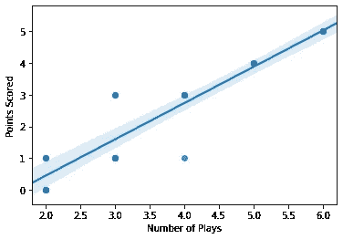
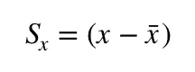
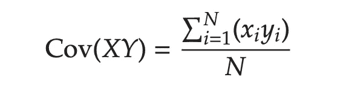
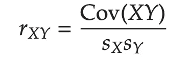
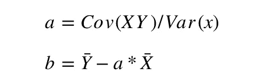

# 回归分析。第二部分。简单线性回归

> 原文：<https://medium.com/analytics-vidhya/regression-analysis-part-2-simple-linear-regression-45fbc3cc458f?source=collection_archive---------12----------------------->

如果您是回归分析新手，请查看以前的帖子:
[回归分析。介绍。](/@aabdygaziev/regression-analysis-1db56288d8c9)

线性回归是一种统计方法，通过将直线拟合到可观察数据集来模拟两个变量之间的关系。例如，工资和性别之间的关系。自变量是性别，因变量是工资。

在每一项研究中，在我们的研究中，性别和工资之间的关系，需要以某种方式说明第三个变量；这第三个变量叫做 ***一个是*** *。*在研究性别和工资之间的关系时，我们需要考虑教育水平作为协变量的一个例子。

线性回归线具有形式为
**Y = a + bX，**的方程，其中 ***X*** 是解释变量， ***Y*** 是因变量。直线的斜率为 ***b*** ， ***a*** 为截距(当 ***x*** = 0 时 ***y*** 的值)。

例如，在图的下方，拟合了高尔夫球员的回归线。x 代表一名球员打了多少次高尔夫，Y 是他们的成绩，或分数。

**如何找到回归线:**

回归线可以通过使用协方差来计算。同样，协方差对于计算回归系数*和 ***相关性*** 有用。*

*让我们将与平均值的偏差定义为 **S.***

*所以， **X** 的偏差写在下面。对于 **Y** ，计算方法相同。*

**

***X 和 Y** 的协方差是叉积的平均值。表示为 **COV(XY)。***

**

***方差**基本上是每个数据点相对于其平均值的分布。它表示为 Var(X)，Var(Y)。**标准差**是方差的平方根。*

> *r 是相关性的一种度量。*

**

*我们之所以写下这些，是因为通过使用这些统计方法，我们可以找到回归线。*

> ***y = a + bX***

**

*这就是这篇文章的内容。这篇博文的目的是展示线性函数中每个参数背后的数学原理，以及我们如何计算它们。*