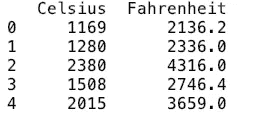
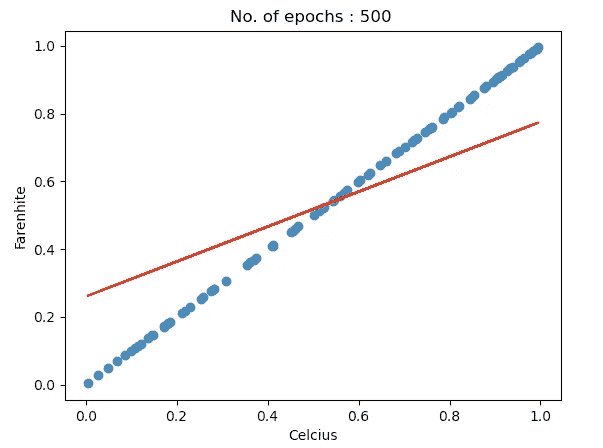
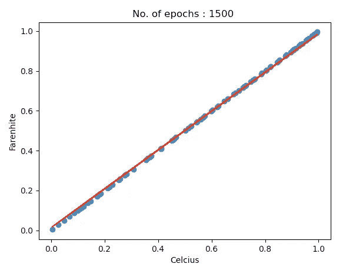
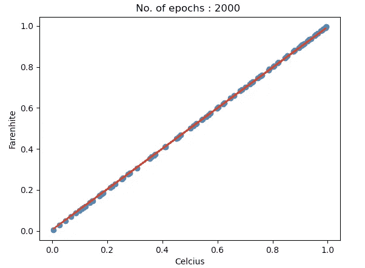

# PyTorch 回归分析

> 原文：<https://medium.com/analytics-vidhya/regression-analysis-with-pytorch-5f473ad5f3bb?source=collection_archive---------9----------------------->


[图片由](https://www.kdnuggets.com/2019/08/pytorch-cheat-sheet-beginners.html)提供

这可能是第一千篇讨论使用 PyTorch 实现回归分析的文章。那么有什么不同呢？

在我回答这个问题之前，让我先写一系列导致这篇文章的事件。所以，当我开始学习 PyTorch 时，我很兴奋，但我有太多的为什么和为什么不，我一度感到沮丧。所以，我想为什么不从头开始，更好地理解深度学习框架，然后深入研究复杂的概念，如 CNN，RNN，LSTM 等。最简单的方法是利用一个熟悉的数据集，尽可能多地探索，以便理解基本的构建模块和关键的工作原理。

我试图解释导入的模块，为什么某些步骤是强制性的，以及我们如何评估一个模型。

所以，人们，如果你像我一样刚刚开始或正在寻找答案，那么你绝对是在正确的地方。:)

好的，让我们先从进口开始:

## 进口

```
**import** torch
**import** torch.nn **as** nn 
```

torch.nn 模块帮助我们创建和训练神经网络。所以我们确实需要它。让我们继续:

```
**import** pandas **as** pd
**import** numpy **as** np
**import** matplotlib.pyplot **as** plt
**from** sklearn.preprocessing **import** MinMaxScaler
```

他们看起来很眼熟，对吧？我们需要它们，因为我们必须对将要使用的数据集进行一些预处理。

## 数据

我要使用的数据集是从**摄氏度**到**华氏度**的数据，可以在这里找到:[链接](https://www.kaggle.com/domnic/celsius-to-fahrenheit)



**数据预处理步骤 1:分离出特征和标签**

```
X_train = train_data.iloc[:,0].values
y_train = train_data.iloc[:,-1].values
```

**数据预处理步骤 2:由于数值非常大且变化多端，因此要对数据进行标准化。**因此，如果您在这种特殊情况下不这样做，那么稍后在训练模型时，您可能会获得 inf 或 nan 损失值，这意味着模型无法正确执行反向传播，并将导致错误的模型。

```
sc = MinMaxScaler()
sct = MinMaxScaler()
X_train=sc.fit_transform(X_train.reshape(-1,1))
y_train =sct.fit_transform(y_train.reshape(-1,1))
```

我们必须确保 X_train 和 y_train 是二维的。

好的，目前为止还不错。现在让我们进入张量的世界。

**数据预处理步骤 3:将 numpy 数组转换为张量**

```
X_train = torch.from_numpy(X_train.astype(np.float32)).view(-1,1)
y_train = torch.from_numpy(y_train.astype(np.float32)).view(-1,1)
```

view 会像在 numpy 中一样处理 tensor 中的 2d 内容。

## **模型构建**

```
input_size = 1
output_size = 1
```

输入=摄氏度

输出=华氏温度

**定义图层**

```
**class** LinearRegressionModel(torch.nn.Module):

    **def** __init__(self):
        super(LinearRegressionModel, self).__init__()
        self.linear = torch.nn.Linear(1, 1)  *# One in and one out* **def** forward(self, x):
        y_pred = self.linear(x)
        **return** y_pred
```

或者我们可以简单地这样做(因为它只是一个单层)

```
model = nn.Linear(input_size , output_size)
```

在这两种情况下，我们都使用 nn。线性为了创建我们的第一个线性图层，这基本上是对数据进行线性变换，比如说对于一条直线，它将简单到:y = w*x，其中 y 是标注，x 是要素。当然 w 是重量。在我们的数据中，摄氏温度和华氏温度遵循线性关系，因此我们对一个层感到满意，但在某些情况下，关系是非线性的，我们会添加额外的步骤来处理非线性，例如添加一个 sigmoid 函数。

**定义损失和优化器**

```
learning_rate = 0.0001
l = nn.MSELoss()
optimizer = torch.optim.SGD(model.parameters(), lr =learning_rate )
```

可以看到，这种情况下的损失函数是“ **mse** 或“**均方误差**”。我们的目标是减少损失，这可以通过使用优化器来实现，在这种情况下，**随机梯度下降**。SGD 需要一个初始模型参数或权重以及一个学习率。

好的，现在我们开始训练。

## 培养

```
num_epochs = 100**for** epoch **in** range(num_epochs):
    *#forward feed* y_pred = model(X_train.requires_grad_())

    *#calculate the loss* loss= l(y_pred, y_train)

    *#backward propagation: calculate gradients* loss.backward()

    *#update the weights* optimizer.step()

    *#clear out the gradients from the last step loss.backward()* optimizer.zero_grad()
    print(**'epoch {}, loss {}'**.format(epoch, loss.item()))
```

**前馈**:在这个阶段，我们只是通过使用一些初始权重和特征值来计算 y_pred。

**损失阶段**:在 y_pred 之后，我们需要衡量发生了多大的预测误差。我们用 **mse** 来衡量。

**反向传播**:在此阶段计算梯度。

**步骤**:权重现已更新。

**zero_grad** :最后，清除上一步的渐变，为新的渐变腾出空间。

## 估价

```
predicted = model(X_train).detach().numpy()
```

detach()是说我们不再需要存储梯度，所以从张量中分离出来。现在，让我们用前 100 个数据点来可视化模型质量。

```
plt.scatter(X_train.detach().numpy()[:100] , y_train.detach().numpy()[:100])
plt.plot(X_train.detach().numpy()[:100] , predicted[:100] , **"red"**)
plt.xlabel(**"Celcius"**)
plt.ylabel(**"Farenhite"**)
plt.show()
```



注意，随着时代数量的增加，预测变得越来越好。有多种其他策略来优化网络，例如改变学习速率、权重初始化技术等等。

最后，尝试使用已知的摄氏温度值，看看该模型是否能够正确预测华氏温度值。这些值是经过转换的，所以请确保执行 sc.inverse_transform()和 sct.inverse_transform()来获取实际值。

感谢您阅读这篇文章。请留下您的评论或分享您的反馈。:)

*参考文献:*

[https://pytorch.org/tutorials/beginner/nn_tutorial.html](https://pytorch.org/tutorials/beginner/nn_tutorial.html)

[](https://www.geeksforgeeks.org/linear-regression-using-pytorch/) [## 使用 PyTorch - GeeksforGeeks 进行线性回归

### 线性回归是一种非常常用的统计方法，它允许我们确定和研究…

www.geeksforgeeks.org](https://www.geeksforgeeks.org/linear-regression-using-pytorch/) [](https://stackoverflow.com/questions/54916135/what-is-the-class-definition-of-nn-linear-in-pytorch) [## nn 的类定义是什么？pytorch 线性

### nn 的类定义是什么？pytorch 中的线性？来自文档:CLASS torch . nn . linear(in _ features…

stackoverflow.com](https://stackoverflow.com/questions/54916135/what-is-the-class-definition-of-nn-linear-in-pytorch) 

[https://towards data science . com/logistic-regression-on-Mn ist-with-py torch-b 048327 f8d 19](https://towardsdatascience.com/logistic-regression-on-mnist-with-pytorch-b048327f8d19)