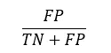

# 回归和性能指标——准确度、精确度、RMSE 等等！

> 原文：<https://medium.com/analytics-vidhya/regression-and-performance-metrics-accuracy-precision-rmse-and-what-not-223348cfcafe?source=collection_archive---------4----------------------->

在前一篇博客中，我们讨论了线性回归和逻辑回归。

好吧，好吧，我知道我已经很久没写博客了…

去复习吧！([点击这里](/@uk1992.me/linear-regression-logistic-regression-basics-e0ed4c9e9abb)

就个人而言，我很抱歉。我正忙于其他一些事情。

啪！回到正题…

*我如何检查一个模型的性能？*

你肯定听说过，没有一个模型是正确的。所以模型越好，就越符合数据。就这么简单。方法有很多。这个帖子会定期更新(至少，我是这么认为的)。

# 线性/多元回归

首先，让我们讨论一下线性/多元线性回归

回归方程式

在上述回归方程中，“E”表示当模型实际上不符合数据时引入的误差。一个好的模型的目标是最小化这个误差。

以下是我们比较不同模型的方式:

1.  *R 平方*

*2。调整后的 R 平方*

*3。MSE*

*4。RMSE*

**R 平方**

根据自变量预测的因变量的方差比例。该值的范围从 0 到 1。

1 表示回归完美地解释了关系。0 相反。

如果上述回归方程的 *R2* (读作 R 平方)= 0.43，那么就意味着 *y* 中 43%的可变性是由变量 *x1* 和 *x2* 来解释的。

但是有一个缺陷。随着术语数量的增加， *R2* 可能会保持不变或增加(这有统计证据——这里不讨论)。即使变量和因变量之间没有良好的关系，也会发生这种情况。

*那么现在怎么办？*调整一下！

**调整后的 R 平方**

考虑变量之间关系的调整值。它将减少不能改善现有模型的变量的值。

虽然很简单。你有更多的变量，选择形容词-R2。

好吗？

**RMSE**

均方误差只不过是观测值和预测值之差的平方的平均值。

均方误差

n ->项数。y(i)表示第 I 项的观测值，y(^表示该特定项的预测值。区别在于误差项。将所有误差项的平方相加，然后除以自由度(独立变量的数量)。

为什么是方形的，伙计？这样误差会累积而不是相互抵消。

*好吧！但这和 RMSE 有什么关系？这是 MSE 的根源。*

均方根误差

哦哦哦……等等！！你先求平方，再求根号。*嗯，你一定是疯了？*晴。听着。平方后，你需要缩小到原来的单位。

美元广场没有意义。美元可以。

从所有这些，你现在必须有一些关于如何在回归中比较模型的想法。

# Logistic 回归呢？

为了测试分类模型的性能，可以使用混淆矩阵。

耶！！不要被迷惑

简而言之，它是一个由预测事件和实际事件组成的矩阵。

相同的表示:

混淆矩阵

以下四个术语是主要术语:

**真阳性**——任何被正确预测的阳性事件。例如:通过检查(阳性事件)并且预测正确。

**真实否定** —任何被正确预测的负面事件。例如:未通过检查(负面事件),并且被正确预测为“失败”。

**假阳性** —任何被预测为阳性的阴性事件。这个病人没有任何疾病。但是测试结果显示这个人被感染了。这可能会产生“不必要的不必要的”医疗的副作用。

**假阴性** —任何被预测为阴性的阳性事件。例如:公共场所存在威胁，而情报团队未能识别，即报告其不构成威胁。这可能是一个严重的问题。

这些术语明确地或含蓄地谈论了关于实际事件的预测。

> (真的/假的)预测这个事件为(肯定的/否定的)。

如果它是真的，实际事件与预测相同，如果它是假的，实际事件则相反。

还有其他一些常用术语(在面试中经常被问到):

**I 类错误** —误报。

**第二类错误** —假阴性。

**灵敏度** = **回忆** = **真阳性率** =模型正确预测阳性事件的频率。正确预测的阳性事件与全部阳性事件的比率。

在科学上，敏感性是正确识别阳性病例的能力。

**特异性** = **真阴性率** =模型正确预测阴性事件的频率。正确预测的负面事件与总负面事件的比率。

**假阳性率** = **1-特异性** =模型将阴性事件分类为阳性的频率。不正确描述的积极事件与消极事件总数的比率。

**Precision** =模型多长时间预测一次事件是积极的，而事实证明是正确的。它是真实阳性病例与预测阳性病例的比率。

**准确度** =模型预测正确的频率。真实案例与所有案例的比率。

你还困惑吗？可能介于精度和灵敏度之间。

请记住:

**敏感度**是从**所有实际正面**事件**中预测正面**事件**有多好。**

**精确**是从**所有积极预测**事件**如何**多**正确**你**预测**。

准确性是你预测所有事件的正确程度。

特异性是指你对负面事件的预测能力。

现在怎么办？

我们怎么知道该选哪一个？好吧，如果你对假阳性病例更感兴趣，那就去找精确的。如果假阴性的情况是你正在寻找的，那么回忆是一个很好的措施。

如果你有一个有偏见的场景，准确性会更好。如果是无偏的——精确和召回。

如果你对这两个值都感到困扰，F1 值会有所帮助。F1 —一级方程式赛车？？

不要！！这是一个调和平均值，换句话说，是精确度和召回率的加权平均值。

记住逻辑回归结果类的概率。必须有一些决定性因素(或价值)来决定，“嘿，伙计！你还不到 0.5，你去那里。”这个决定因素，0.5(默认值)是阈值。这个阈值有助于逻辑回归分类。分类后计算四大项。并构造混淆矩阵。

受试者操作者特征曲线有助于确定最佳阈值。我来说一个更熟悉的名字——ROC 曲线。哦耶！

ROC 曲线基本上是绘制在真阳性率和假阳性率之间的图。所以，这是一个模型预测积极事件的频率和预测消极事件的频率之间的图表。

受试者工作特征曲线

沿着虚线的模型将是最差的分类器。它不能区分阶级。在这种情况下，曲线下面积(AUC)为 0.5。沿着顶部平行于 x 轴的绿线的模型是最好的模型。AUC 将是 1。它完美地将正面和负面事件分类。

这两者之间的任何模型(曲线)的面积将大于 0.5 且小于 1。这导致了类的重叠，因此引入了类型 1 和类型 2 错误。

对于不同的阈值，计算灵敏度和 FPR (1-特异性)。低 FP 意味着更高的真阴性。绘制一条曲线。根据接受多少假阳性，选择阈值。

对于比较模型，具有较大 AUC 的模型给你最好的结果。在上图中，红色的比蓝色的好。

就这些吗？

在某些情况下，例如当你有太多的阴性病例时，你可能会追求精确以防假阳性。你必须首先知道你的目标是什么。

这就是现在所有的人！

