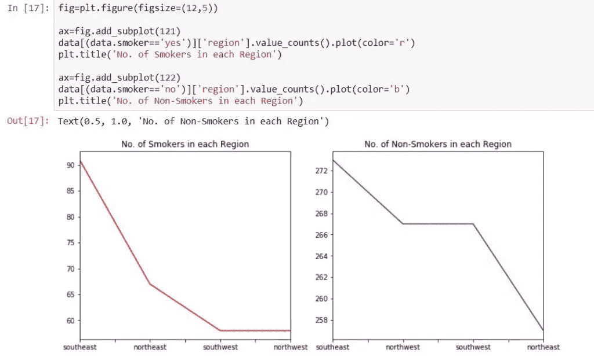

# 回归模型

> 原文：<https://medium.com/analytics-vidhya/regression-model-e3ecc0823857?source=collection_archive---------8----------------------->

在本文中，我们将看到如何在 Python 中构建回归模型。首先，让我们谈谈回归分析实际上意味着什么..

***回归分析*** 关注因变量与一个或多个自变量之间的关系，而 ***线性回归*** 只关注两个变量之间的关系。

让我们看看一元线性回归和多元线性回归的方程。

这里，y 是因变量，xi 是自变量。b0 是截距或常数，当所有自变量都设置为零时，定义为因变量的平均值。

我们将应用多元线性回归的概念来预测健康保险费用。让我们看看用 python 构建模型的步骤。

1)导入 python 库

2)导入数据

3)缺失值处理

4)类别变量的虚拟创建

5)选择变量的相关性

6)数据分割(训练和测试)

7)建立模型

8)递减分析和误差测试

您将在这里看到的数据是 ***健康保险成本*** 。建立该模型的主要目的是预测健康保险的成本，同时考虑一些因素。所以，没有任何进一步的拖延，让我们开始吧。

数据有 7 列:

1.  年龄:主要受益人的年龄。
2.  性别:性别
3.  身体质量指数:身体质量指数
4.  儿童:健康保险覆盖的儿童人数/受抚养人人数
5.  吸烟者
6.  地区:受益人在美国的居住区，东北，东南，西南，西北
7.  费用:由健康保险支付的个人医疗费用

需要导入的重要 Python 库有:

现在我们导入健康保险费用数据，并查看数据。下图显示了前五行数据。

我们的下一步将是探索数据。我们需要看看是否需要进行缺失值处理或异常值处理。幸运的是，我们这里没有任何缺失值，我们的数据是干净的。

现在，让我们看看可以从这些数据中得出的可视化结果。

上图显示了男性和女性的总保险费用。

**各地区吸烟人数**

上图显示男性吸烟者比女性吸烟者多。

这些是对吸烟者和非吸烟者的收费。

现在我们将看到 18 岁男性和女性吸烟者的人数。

令人惊讶的是，我们看到 18 岁也有吸烟习惯。

我们有一栏是关于人们有多少孩子的。所以，让我们看看分布。

我们可以看到只有少数人有 5 个孩子，许多人没有孩子。

现在让我们看看数据的另一个重要栏目，那就是 ***【身体质量指数】*** 。嗯，身体质量指数低于 18.5 的人被称为*体重过轻*。18.5 到 24.9 之间的身体质量指数是理想的。在 25 到 29.9 之间的一个**身体质量指数**是*超重*和一个超过 30 的**身体质量指数**表明*肥胖*。

下图显示了对患有不同身体质量指数病和有吸烟习惯的人收取的费用。

现在让我们来看看有吸烟习惯的人的数量，他们属于身体质量指数的不同类别。

我们观察到，与任何其他类别相比，超重类别中吸烟者的人数更多。

现在，我们已经将数据可视化到最大程度，是时候构建模型了。我们首先制作分类变量的虚拟模型。当假人被制作时，分类变量看起来像这样:

在把数字变量串联起来之后，我们得到了最终的数据。看起来像这样:

现在来看多元线性回归的定义。这里我们的“Y”是*费用*，因为我们需要预测保险费用和其他代表自变量的列(“xi”)。我们在这里取 Y 的对数，以便得到正态分布曲线。在构建模型时，我们将数据分为测试数据和训练数据。这意味着我们将 70%的数据作为训练数据，30%作为测试数据。

分割数据后，我们需要添加常数(b0 ),正如多元线性回归的定义所说。完成这些后，我们拟合我们的模型并得到 ***【普通最小二乘法】*** 回归结果。这里的变量较少，因为与其他变量相比，这些变量的特征重要性较高。

现在我们检查数据中的错误。

平均绝对误差

MSE:均方差

RMSE:均方根误差

对于训练数据，我们得到:

对于测试数据，我们得到:

如果训练数据的均方误差小于测试数据的均方误差，我们就说模型过拟合。

因此，我们的模型既不过度拟合也不欠拟合，可用于预测保险成本。

我们已经从 OLS 回归结果中得到 xi 系数。因此，我们需要把它放入等式中，以便预测保险成本。

***例如:***

对于 35 岁有吸烟习惯且身体质量指数为 24 岁的人，健康保险费用为:

y = B0+(coef _ age)*年龄+(coef _ BMI)* BMI+(coef _ smoker _ yes)*吸烟者

解完方程后，我们得到的值是 23784。因此，这将是上述人员的健康保险费用。同样，我们可以得到其他人的数量。

因此，这就是如何使用 ***多元回归模型*** 进行预测。

感谢阅读:)