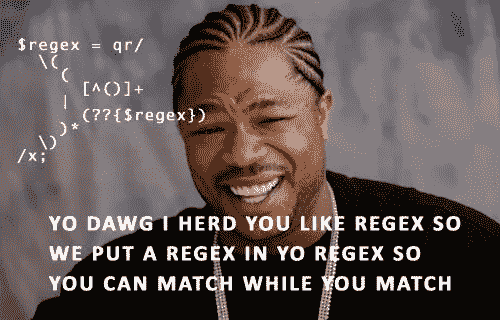

# 正则表达式

> 原文：<https://medium.com/analytics-vidhya/regular-expression-regex-b9ed6b6a989f?source=collection_archive---------12----------------------->



图片来源:[https://www.quotemaster.org/](https://www.quotemaster.org/)

> 每个人都在谈论正则表达式，但每个人都讨厌正则表达式，却最终使用正则表达式！

那么什么是正则表达式呢？嗯，我们需要更深入？所以，让我们通过一个简短的介绍来深入了解`regex`的构建模块..

## 正则表达式:

正则表达式或有理表达式本身是一个对象，描述一种字符模式。它允许我们搜索特定的文本模式，也有助于匹配、定位和管理文本。虽然它们看起来很复杂，但是它们非常强大，你完全可以为你认为的几乎任何文本模式创建一个`regex`。

**正则表达式的构建模块:**

元字符是正则表达式的构建块。`regex`中的字符被理解为带有`special meaning`的元字符或带有 `literal meaning`的常规字符。

**保留元字符:**

保留并需要转义的元字符:

`**.[{()\^$|?*+**`

我们稍后会看到`escaping`的例子。

其他常见的元字符有:

**脱字符号(^):**

`(^)`匹配字符串的开头，并且在`**multiline**`模式下也匹配每个换行符的后面。

**例如:**

```
^\d{3} will match with patterns like "456" in "456-112-112".
```

**美元($):**

`($)`匹配字符串的末尾或字符串末尾换行符之前，在`**multiline**`模式下也匹配换行符之前。

**例如:**

```
\d{3}$  will match with patterns like "112" in "456-112-112".
```

**\d:**

`\d`匹配整数或数字 `(0–9)`。这里的数字`\d`决定了我们的`regex`将匹配的位数。即:`\d`表示个位数`\d\d = double digits`以此类推。

**例如:**

`\d\d\d`将匹配`327 , 123, 787 but not 1223`，因为“1223”中有 4 个数字，而我们的`regex`是 3 个数字的匹配。

`\d =1`

`\d\d = 12`

`\d\d\d ≠ 473847`返回 3 位数，而`473847`包含 6 位数。

`\d\d\d ≠ cat`因为它只匹配数字，而`cat`包含字母。

**\D:**

与\d 相反。匹配除数字以外的任何内容。

**例如:**

`\D\D = AB`

`\D\D = xy`

因为它不匹配数字字符。

**\w:**

匹配任何字母数字(单词)字符。

**例如:**

`\w\w\w = 467`

`\w\w\w\w = Crow`

`\w\w\w ≠ python`

`\w\w\w`不返回`python`，因为`python`包含 6 个字符。

**\W:**

与`\D`相似的是`\W`与`\w`相反，即:匹配除字母数字字符之外的任何字符

**举例:**

`\W\W = ,, or !! or @#`

`\W\W\W = !@#`

因为每个字符都是字母数字。

**\s** :

匹配任何空白字符，如空格和制表符。

例如，在上面的 example_text 中，`regex` `\s`将只匹配两个单词之间的空格，而忽略其他所有内容。

**\S** :

匹配任何非空白字符，不像`\s`

**复读机:**

***、+和{ }** 被称为重复符，因为它们表示前面的字符将被多次使用。

**星号(* ):**

当`*`前面的字符与`0 or more times`匹配时，星号匹配。即:它告诉计算机匹配`0 or more times`(直到无限)的前一个字符(或字符集)。

**举例:**

`Gre*n = Green(e is found 2 times), Grn(e is found 0 time), Greeeeen (e is found 5 times)`以此类推..

因为“ee”后面有“s”。

**加号(+ ):**

`(+)`当`‘+’`前面的字符匹配至少一次或多次(最多无限次)时，符号匹配。

**示例**:

`Gre+n = Green, Greeeen, Gren`以此类推..

`Gre+n != Grn`因为这里没有“e”。

**圆点(。):**

句点匹配任何字母数字字符或符号。有趣的是，它可以代替任何其他符号，因此被称为**通配符**。

**例如:**

`Gre. = Gree, Gren, Gre1`等等

`Gre. != Green` as。本身只匹配一个字符，在这里，在第四个位置的术语。`n`是第五个字符，不在正则表达式中。

但是`Gre.*`将匹配绿色，因为它告诉匹配任何字符
使用任何次数。

**交替(|):**

允许交替匹配。|的作用类似于布尔 OR。

**例如:**

`A|B`创建匹配 A 或 B 的正则表达式

`H(i!|ey!)`将匹配任一`Hi! or Hey!`

`M(s|r|rs)\.?\s[A-Z]\w+`将匹配任何以`Ms, Mr or Mrs`开头的名字。

**问号(？):**

当`?`前面的字符只出现 0 次或 1 次时匹配，使字符匹配可选。

**示例:**

`Favou?rite = Favourite` (u 被发现 1 次)

`Favou?rite = Favorite` (u 被发现 0 次)

**字符集([]):**

`[]`用来表示一组字符。一套中:

1.  字符可以单独列出，例如`[cat]`将匹配`'c'`、`'a'`或`'t'`。
2.  字符范围可以通过给出两个字符并用`'-'`分隔来表示，

**示例**:

`[A-Z]`将匹配任何大写的 ASCII 字母，

`[0–9]`将匹配`0 to 9`中的任何数字。

`[0-3][0-3]`将匹配从`00`到`33`的所有两位数字

`[0-9A-Fa-f]`将匹配任何十六进制数字。

如果`-`被转义(如`[A\-Z]`)或被放置为第一个或最后一个字符(如`[A-]`)，它将匹配一个文字`'-'`。

3.字符的顺序无关紧要。

4.特殊字符在集合中失去了它们的特殊意义。例如，`[(+*)]`将匹配任何文字字符`'('`、`'+'`、`'*'`或`')'`。

5.要匹配集合中的文字`'{'`，在它前面加一个反斜杠，或者把它放在集合的开始。例如，`[()[\]{}]`和`[]()[{}]`都将匹配一个括号。

**字符组():**

由`()`指示的字符组按照精确的顺序匹配字符。

**例如:**

`(abc) = abc`不是 `acb`

`(123) = 123`不是`321`

`https?://(www\.)?(\w+)(\.\w+)`将匹配任何`url`。这里有 3 组。

第一组:可选`www.`

第二组:域名`google, facebook etc`

第三组:顶级域名`.com, .net, .org`

还有另一个隐式组`group 0`组 0 是我们捕获的所有内容，在我们的例子中是整个 url。

**量词:**

`regex`使用量词来表示搜索字符串的范围。我们可以在搜索字符串中使用多个量词。量词是:

**{n}:**

当前面的字符或字符组恰好出现 n 次时匹配。

**例子:**

`\d{3}=123`

`fed[ora]{2} = fedar, fedoo`

`fed[ora]{2} ≠ fedora`作为量词`{2}`只允许字符集`[ora]`中的 2 个字母。

**{n，m}:**

当前一个字符或字符组至少出现 n 次，最多出现 m 次时匹配。

**示例**:

`\d{2,6} = 430973, 4303, 38238`

`\d{2, 6} ≠ 3` 3 不匹配，因为它是 1 位数，所以在字符范围之外。

# 转义元字符:

为了搜索一个保留元字符的字符(任何一个`**.[{()\^$|?*+**`)，我们可以使用反斜杠`\`来转义该字符，这样它就可以被识别。

**举例:**

下面的`regex`将匹配任何有效的邮件 id。这里我们使用了`\` 来转义保留字符。

`^([a-zA-Z0–9_\-\.]+)@([a-zA-Z0–9_\-\.]+)\.([a-zA-Z]{2,5})$`

恭喜你！现在你已经知道了`regex`的基本原理，而且一天已经太多了！

在我即将发表的文章中，我们将使用`python`来练习`regex`。