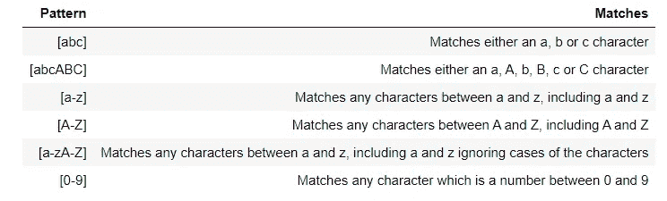
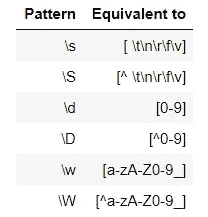

# 正则表达式——文本分析或 NLP 的优秀工具

> 原文：<https://medium.com/analytics-vidhya/regular-expressions-an-excellent-tool-for-text-analysis-or-nlp-d1fa7d666cb9?source=collection_archive---------1----------------------->


大多数编程语言中都有一个迷人的编程工具——**正则表达式**也称为**正则表达式。**这是一个非常强大的编程工具，用于各种目的，如从文本中提取特征、字符串替换和其他字符串操作。正则表达式是一组字符，或一个**模式**，用于在给定的字符串中查找子字符串。为了前任。从推文中提取所有标签，获取电子邮件 id 或电话号码等..从大量的非结构化文本内容中。

简而言之，如果任何字符串中有一个模式，您可以使用正则表达式轻松地提取、替换和进行各种其他字符串操作。正则表达式本身就是一种语言，因为它们有自己的编译器，而且几乎所有流行的编程语言都支持使用正则表达式。

毫不夸张地说，如果不理解正则表达式，就不可能真正构建基于自然语言处理的系统，比如聊天机器人、对话式用户界面等..Regex 有许多重要的元素和特性，有助于构建一个有用的、适合字符串提取或操作的表达式解决方案。

让我们在接下来的几节中逐一了解一下。

**常用正则表达式函数**

1.  re.search() —检测给定的正则表达式模式是否存在于给定的输入字符串中。如果在字符串中找到该模式，则返回 Regexobject，否则返回 None 对象。

*   *重新搜索(模式，文本)*

在搜索功能中，可以使用不同的标志来执行特定的操作。例如

*   *木牌。' I' —忽略文本的大小写*
*   *关于。M —允许多行搜索*
*   *re.search(模式，字符串，标志=re。我| re。M)*

2.match.start()和 match . end()-分别返回找到的匹配项的起始和结束位置的索引。

3.re.match() —仅当模式出现在字符串的最开始时，匹配函数才会匹配。

*   *重新匹配(模式，文本)*

4.re.sub() —用于用另一个子字符串替换一个子字符串。例如，用“颜色”替换“颜色”。

*   *re sub(模式、替代、输入文本)*

5.finditer()或 find all()—find all()函数的结果是所有匹配项的列表，finditer()函数在“for”循环中用于逐个遍历每个单独的匹配项。

6.re.compile() —该函数将正则表达式模式存储在高速缓存中，以加快搜索速度。您需要将 regex 模式传递给 re.compile()函数。

```
# without re.compile() function
result = re.search(“a+”, “abc”)# using the re.compile() function
pattern = re.compile(“a+”)
result = pattern.search(“abc”)
```

**数量词—** 允许提及并控制特定字符模式在给定文本中出现的次数。为了前任。在某些给定的数据中，含有“程序”一词的变体。为了前任。程序'，'编程'，'程序员'。如果要求只找到在单词‘Program’中出现一次或多次‘e’的那些单词。您可以使用以下任何量词来表示特定字符的存在

*   '?'—零次或一次匹配前面的字符。它通常用于标记字符的可选存在。
*   *-量词用于标记前面的字符出现了零次或多次。
*   +'-量词匹配前面的字符一次或多次。这意味着前面的字符必须至少出现一次，模式才能匹配字符串。
*   {m，n}量词—该量词有四种变体
*   {m，n}:匹配前面的字符' m '次到' n '次。
*   {m，}:匹配前面的字符“m”次到无限次，即前面字符的出现次数没有上限。
*   {，n}:从零到“n”次匹配前面的字符，即对于前面的字符的出现次数，上限是固定的。
*   {n}:如果前面的字符恰好出现“n”次，则匹配。

前面提到的每个量词都可以写成{m，n}量词的形式—

*   '?'相当于零或一次，或{0，1}
*   * '相当于零次或多次，或者{0，}
*   +'相当于一次或多次，或{1，}

**空白—** 空白由单个空格、多个空格、制表符或换行符(也称为垂直空格)组成。这些空格将匹配字符串中相应的空格。例如，模式“+”，即一个空格后跟一个加号，将匹配一个或多个空格。类似地，您可以在模式中使用空格和其他字符。“Sachin Tendulkar”模式将允许您在任何给定的字符串中查找名称“Sachin Tendulkar”。

**括号—** 在一些字符周围使用括号将有助于重复一组字符，而不仅仅是重复前面的字符。这个概念在正则表达式中称为分组。为了前任。模式'(xyz){1，3} '将匹配以下字符串:

*   xyz
*   xyz
*   xyzxyzxyz

当您需要从更大的模式中提取子模式时，使用括号也很有帮助。为了前任。如果您有包含日期的文本数据，并且您只想从日期中提取年份。您可以使用带有分组的正则表达式模式来匹配日期，然后您可以提取任何元素，如日、月或年。使用括号运算符可以实现分组。为了前任。10/03/1985".要从该字符串中提取日期，您可以使用以下模式—“d { 1，2}\/\d{1，2}\/\d{4}”。现在要提取年份，可以在模式的年份部分加上括号。图案是:“^\d{1,2}/\d{1,2}/(\d{4})$".

**管道运算符—** 用“|”表示。管道运算符用作 or 运算符。您需要在括号内使用它。例如，模式“(play|walk)ed”将匹配两个字符串—“played”和“walk”。管道操作符告诉我们括号内的位置可以是字符串或字符。

**特殊字符**——上面作为量词提到的字符，如“？”、' * '、+'、'('、')'、' { '等。也可以出现在输入文本中。在这种情况下，要提取这些特定的字符，您需要使用转义序列。由反斜杠“\”表示的转义序列用于转义特殊字符的特殊含义。要匹配一个问号，需要用' \？'(这称为转义字符)或者为了匹配一个“+”号，需要在正则表达式中提供“\+”。' \ '本身是一个特殊字符，为了匹配' \ '字符，您需要使用模式' \\ '来转义反斜杠。

**锚点—** 这些是特殊字符，用于在文本输入的开头和结尾执行字符串操作。

*   克拉 character'^' —指定字符串的开头。模式中'^'后面的字符应该是字符串的第一个字符，这样字符串才能匹配模式。
*   美元字符' $ '-指定字符串的结尾。模式中' $ '之前的字符应该是字符串中的最后一个字符，以便字符串与模式匹配。

两个锚点都可以在一个正则表达式中指定。例如，正则表达式模式'^ 01+2$ '将匹配任何以 0 开头，以 2 结尾，中间出现 1 的字符串。它将匹配“012”、“0112”、“01111111112”。

**通配符—** 中的“.”(点)字符也称为通配符。它充当占位符，可以匹配任何字符。例如，如果一个字符串以四个字符开头，后面是三个 0 和两个 1，后面是任意两个字符。有效字符串可以是 cghj00011op、kghj00011pk 等。满足这种条件的模式应该是。{4}0{3}1{2}.{2}'.你也可以用“….00011 ..”其中点充当占位符，这意味着任何东西都可以放在点的位置上。

**字符集** —字符集比仅仅键入通配符或文字字符提供了更多的灵活性。这些是方括号中指定的一组字符。字符集可以用量词指定，也可以不用量词指定。如果字符集后面没有量词，则它只匹配一个字符，并且只有当字符串中的字符是字符集内的字符之一时，匹配才成功。例如，模式“[a-z]ed”将匹配诸如“ted”、“bed”、“red”等字符串，因为每个字符串的第一个字符“t”、“b”和“r”出现在字符集的范围内。另一方面，当我们使用带量词的字符集时，比如在这种情况下— '[a-z]+ed '，它会匹配任何以' ed '结尾的单词，比如' watched '，' baked '，' jammed '，' educated '等等。本质上，当量词出现在字符集中时，它就失去了特殊的意义，被当作普通字符对待。

'^'有两个用例。在字符集之外，它作为一个锚点，但是在字符集之内使用时，它作为一个补码运算符，也就是说，它指定它将匹配字符集之内提到的字符之外的任何字符。为了前任。模式[0–9]匹配任何一位数。另一方面，模式'[^ 0-9 '匹配任何不是数字的单个数字字符。



**元序列**——这些基本上是在正则表达式中编写常用字符集的简写方式。这些是常用的元序列。



您可以以两种方式使用元序列——或者使用不带方括号的元序列。例如，模式' \w+'将匹配任何字母数字字符。或者你可以把它们写在方括号里。例如，模式“[\w]+”与“\w+”相同。

总之，正则表达式可以作为一种方便的工具用于许多实际应用中，并且是实现 NLP 的基础。除了在 NLP 中的应用，正则表达式还可以用于各种其他应用，例如检查用户在表单中输入的内容是否满足最低标准等..以及类似的许多其他可能性。