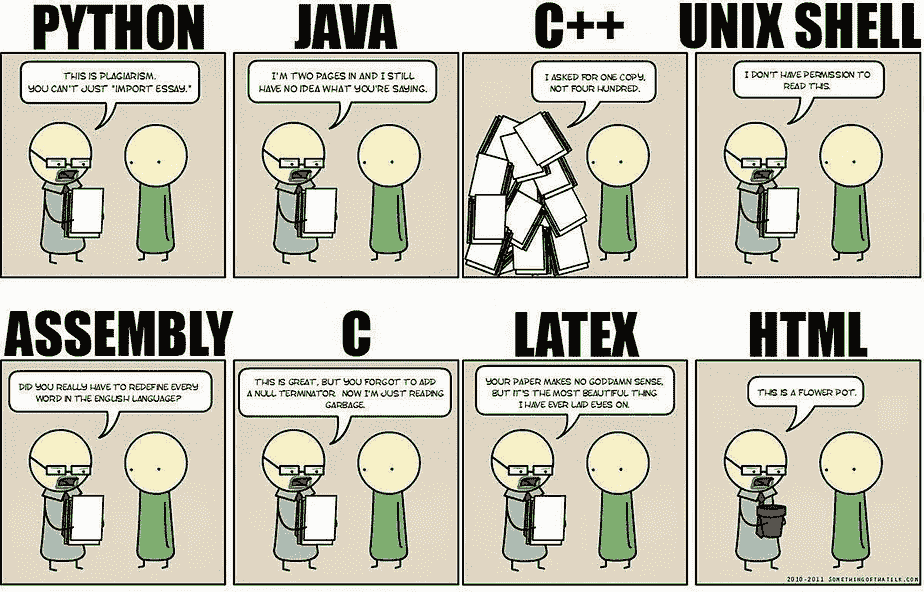
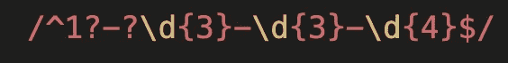
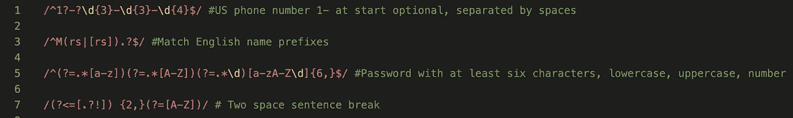
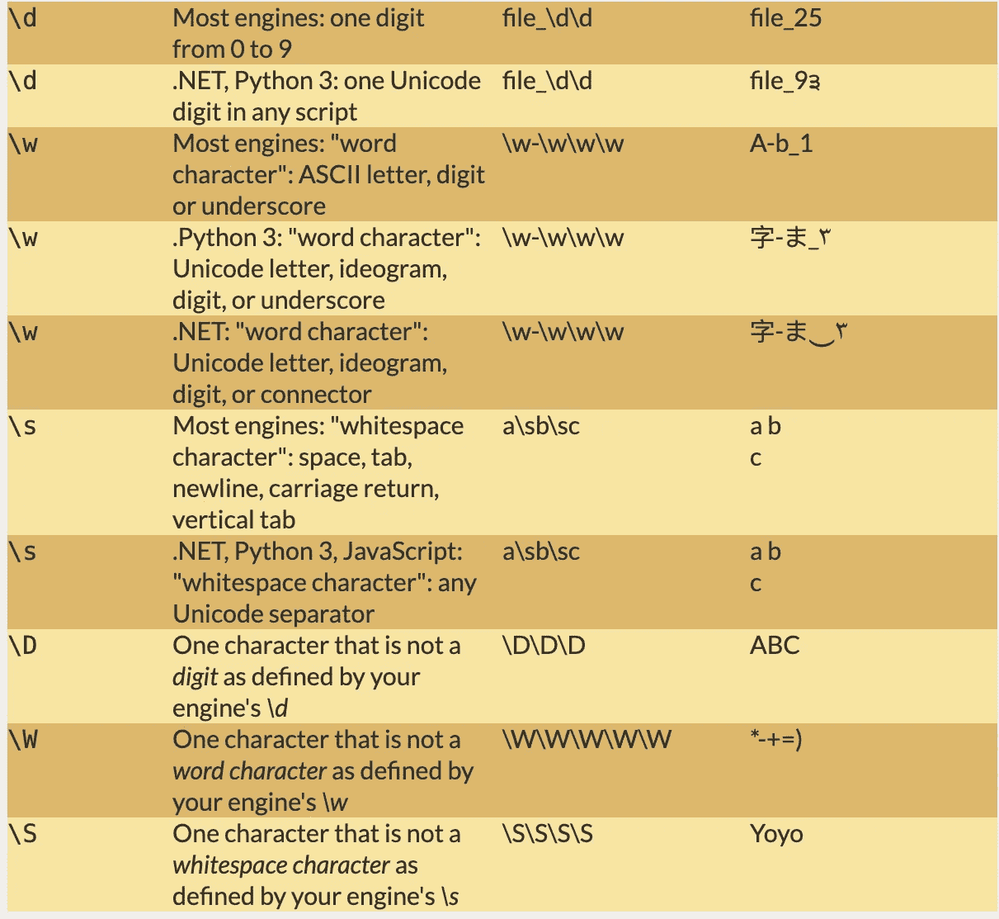
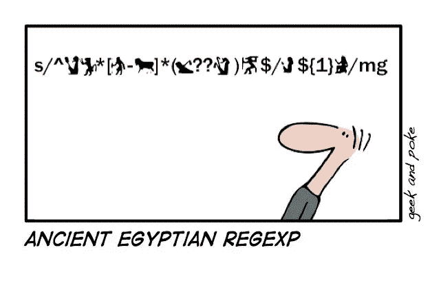
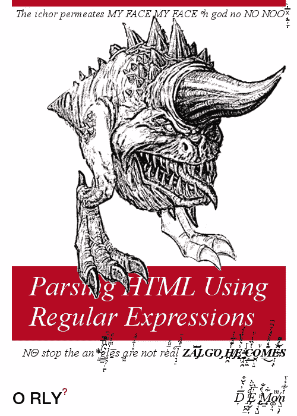

# 正则表达式:让你的生活更简单，让你的代码更难阅读！

> 原文：<https://medium.com/analytics-vidhya/regular-expressions-making-your-life-easier-and-your-code-harder-to-read-e171cabe2997?source=collection_archive---------8----------------------->

一个不幸的事实是，我通过一条不太传统的途径遇到了我的 CS 和编码知识中不太令人愉快的部分。在罗格斯大学的本科阶段，我选修了一学期的计算机科学导论，在这门课中，我学习了 Java 作为我的第一语言，然后在数据结构方面做了一点尝试，然后放弃了它，专注于完成我的主要论文。然而，那时我已经交了几个计算机专业的朋友，也正是在这个时候，我接触到了计算机术语和自学的主要资源。我的非传统来源？内部笑话，和漫画…

左图:类似的网络漫画:右图:xkcd，一个关于浪漫、讽刺、数学和语言的网络漫画[https://xkcd.com/](https://xkcd.com/)

很自然，作为一个完全的业余爱好者，大多数编码笑话都让我摸不着头脑(现在仍然如此)，但令人惊讶的是，它们竟然是我自己查找和研究术语和概念的极好资源。与计算机科学领域的人对话，并努力教育自己在这个圈子里做出贡献，是我继续钻研这个领域并最终发现自己热爱其逻辑和语言的主要原因之一。

能够*读到一个概念或语言*(幽默或其他)*一个字也不懂*，但是*明白*这些未知的概念现在*不再遥不可及*在我早期的编码中是一个意想不到的动力和教育来源。

现在，关于遇到令人生畏的未知材料，回到这篇文章的主题…

# 正则表达式！

如果您以前从未遇到或听说过正则表达式(简称 regex)，我在这里提供了一个正则表达式示例的简短片段，以帮助阐明它们的用途。

电话号码正则表达式

容易理解对吗？不，不是的。乍一看，正则表达式是我遇到过的语法上最不友好的代码片段。它们看起来属于机器和汇编语言的领域，但几乎更糟([汇编语言](https://upload.wikimedia.org/wikipedia/commons/f/f3/Motorola_6800_Assembly_Language.png))。我第一次遇到正则表达式是在几年前，与我之前的故事类似——通过漫画。

又一部心爱的 xkcd 漫画，来看看吧！[https://xkcd.com/](https://xkcd.com/)

我第一次读到这一点时，从这一点中我收集到的是，正则表达式可能是整理否则难以处理的数据的强大工具，而且考虑到自我描述的英雄主义，即只需点击几下鼠标就能冲进并解析 200MB 的电子邮件，这可能很难。

我们神奇的正则表达式专家多么勇敢，用这样一个强大的利基工具集来为我们增光，我们真的很谦卑！这就是我在网上查找正则表达式示例时的过程。然后，我迅速关上窗户，再也没有回去过，直到两年后我开始在熨斗学校的学期。我终于下定决心，决定学习它们。学会了这些，我可以自信地说:

> 正则表达式看起来比实际困难得多
> 
> 如果你学会了它们，它们几乎不会比其他工具更重要
> 
> 但是如果你了解它们，你会不断地发现它们适用的情况，它们会使许多问题变得简单得多

那么，它们是如何工作的呢？

# 他们做什么

正则表达式是一种擅长在字符串中寻找模式的语言/工具，通常用于搜索/解析字符串。这是它们的主要目的，也是我们可能使用它们的唯一目的。但是他们非常非常擅长他们的工作。它们是这样工作的:

在某些语言和引擎之间，正则表达式的格式会稍有不同，但是在它们出现的大多数编码语言中，它们是非常一致的。

这是编码语言识别一系列被解释为正则表达式的字符的最常见方式之一。例如:

> /在此插入您的正则表达式代码/

现在，在一个正则表达式中，您定义了您正在寻找的字符串块的细节(例如，您要寻找的正则表达式的规格)。所以如果我输入:

> /a/

这个正则表达式将在我比较的字符串中查找任何“a”。正则表达式也是从左向右读，所以:

> /ab/

会在我的字符串中寻找 ab。很简单，但不是很有用。那么它们为什么如此强大呢？正则表达式有特殊的字符，可以概括和改变我们的搜索。比方说，我想找出连续的十个 a。我可以做:

> /aaaaaaaaaa/

或者，更有可能的是，我会这样做:

> /a{10}/

现在我们有进展了。那么这些是如何相互作用的呢？一天结束时，正则表达式仍然总是从左向右读。比方说，我只想要十个 a 后面跟着三个 w，如果它以一个数字结尾，我也想可选地包括这个数字:

> /a{10}w{3}\d？/

嘣。现在谁知道我们为什么要搜索这个，但这意味着“给我找到正好有十个 a 的子字符串，紧接着是正好三个 w，然后可能是一个数字(\d 是所有的数字)，但那是可选的(the？表示它前面有一个字符或没有任何字符)"

最后，请耐心听我说，如果我想找到所有的例子，其中一个数字后面跟一个空格，一个或多个单词，然后是逗号和空格，然后是更多的单词，然后是逗号和空格，然后是两个大写字母的某种组合，一个空格，然后是正好五位数。这是一口，但深呼吸…

> /\d+ (([a-zA-Z]+ )*[a-zA-Z]+，){2}[A-Z]{2} \d{5}/
> 
> 宾夕法尼亚州曼彻斯特新法院路 27 号，邮编 90625

我的天啊，这太恶心了，但是我们刚刚用正则表达式工具创建了一行，它将匹配每个美国地址的格式，如上图所示。这是非常强大的。

regex 强大的秘密，以及它令人生畏的一面，来自于大量的特殊字符和表达式，您可以在查询中插入这些字符和表达式来编辑您的搜索。然而，在大多数情况下，一旦你开始学习它们，它们是非常直观的，而且它们总是可以在网上查到。

您将使用的一些最常见的特殊字符包括:

> \d = >位数
> 
> \w = >个字符
> 
> \s = >空白
> 
> + = >一个或多个
> 
> * = >没有或更多
> 
> ？= >一次或无
> 
> {} = >出现的次数或范围
> 
> 。= >除换行符以外的任何字符
> 
> [] = >字符的集合/范围
> 
> ()= >排他性选项组
> 
> (?=something) = >正向前瞻
> 
> (?<=something) =>正面回望

因此，正则表达式的力量可能开始变得清晰，但是一些真实世界的例子可能也会有所帮助。下面我写了一些真实应用程序正则表达式的例子:

电话号码、英文姓名前缀、密码验证(没有很好地使用正则表达式)、段落中的两个空格断句

> /^1?-?\ d { 3 }-\ d { 3 }-\ d { 4 } $/~电话号码
> 
> /^M(rs|[rs]).？$/~匹配英文姓名前缀
> 
> /^(?=.*[a-z])(？=.*[A-Z])(？=.*\d)[a-zA-Z\d]{6，} $/~密码值
> 
> /(?<=[.?!]) {2,}(?=[A-Z])/ ~Two space sentence break

I won’t breakdown the logic of all of these, but the list above is a handful of the examples I’ve practiced within the first week of learning Regex: some from videos, some from articles, mostly from Codewars challenges and course assignments. Regex expressions can be used to check for existing matches. They can be passed into a split method to provide flexibility to large string splits, and they can be used to scare rubyists. Their power is substantial and real.

And the big secret is that you don’t have to be an expert to start using them quickly and easily; there are many online tutorials and references that can be accessed to learn their basic syntax and refer back to some ambiguous special character that you can’t remember.

A subset of the regex expression tables at [https://www.rexegg.com/regex-quickstart.html](https://www.rexegg.com/regex-quickstart.html)我的一个参考正则表达式语法的网站，一定要使用它们。

正则表达式看起来很粗糙，它们也很粗糙，因为它们非常有用:d .但说真的，我后悔没有尽快开始学习它们，因为从逻辑上讲，它们并不比任何编码语言更难，从语法上讲，它们非常直观，易于查找。如果你想要最快最简单的方式来拿起东西，我强烈推荐科里·斯查费的这个 youtube 视频。

不要害怕正则表达式及其令人生畏的语法——要对它作为编码腰带上的另一个工具的能力和潜力感兴趣。此外，尽管我们的任何编码知识库的来源(有时是有问题的),我们都学会了写代码和开发，因为我们不害怕陷入我们不理解的丑陋和新的东西。通过努力工作和谷歌，也许我们能少一点理解困难的事情。

