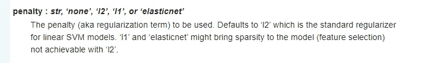

# 机器学习和深度学习中的正则化技术

> 原文：<https://medium.com/analytics-vidhya/regularisation-techniques-in-machine-learning-and-deep-learning-8102312e1ef3?source=collection_archive---------4----------------------->

克里斯·利维拉尼在 [Unsplash](https://unsplash.com?utm_source=medium&utm_medium=referral) 上的照片

机器学习和深度学习从业者在构建 ML 模型时面临的一个最常见的问题就是“**过拟合 *g*** ”。

## ***什么是过度拟合？***

当机器学习模型在训练数据集上表现良好时，它被称为“过拟合”，但在测试/不可见数据集上的性能相对较差。

让我们通过一个有趣而简单的例子来了解过度拟合背后的直觉。

考虑两个学生通过学习同一本书来准备考试。学生 1 试图记住书中的问题和答案，而不是试图理解书中不同主题的潜在概念。学生 2 试图抓住每个主题背后的概念，而不是像学生 1 那样死记硬背。

试卷包含一半数量的问题，与书本中的问题相同，而其余的问题类似，但很难测试学生的理解。

在上面的场景中，学生 1 不能在考试中表现得很好，因为他只能回答书中提出的简单问题，而对于其余有点棘手的问题，他不能回答得很好。相比之下，学生 2 在测试中的每个问题上都表现得很好，因为他对从那本书中学到的概念有了更好的理解。

*我们总是希望我们的机器学习(ML)模型更像学生 2，而不是学生 1。*

## ***什么是欠拟合？***

这是过度拟合的对应，也是每当我们谈论过度拟合时出现的一个重要概念。

如果 ML 模型在训练和测试数据集上都表现不好，则称其为欠拟合。

例如，一个学生既没有记住书中的任何问题，也没有试图理解书中的任何概念。因此，他在考试中既不能很好地回答简单的问题，也不能很好地回答复杂的问题。

下面是过度拟合、欠拟合和最佳/合适拟合的图示。

*图片来源:谷歌*

ML 和 DL 模型在训练阶段很容易过度拟合。出现这种情况的一些原因可能是数据集的数据点数量较少，但要素数量较多。该模型可能最终记忆关于每个特征的输入和输出之间的关系，因为随着数据点的数量减少，该模型在训练期间可能在数据集中找不到这样的重要模式。

过度拟合的另一个原因可能是非线性机器学习算法，如决策树，因为这些算法在基于可用数据集构建模型时具有更大的自由度，其中其分支和节点可能最终构建非常深的决策树，与测试数据相比，该决策树最终在训练数据上表现非常好。

ML 和 DL 中有许多正则化技术可以帮助我们防止模型的过度拟合。不同类型的正则化技术将在下面详细讨论。

# **(I) L1 和 L2 正规化:-**

在 L1 和 L2 正则化中，模型因过度拟合训练数据而受到惩罚，即每当模型试图正确预测训练数据点上的一切时，就模型的系数而言，损失函数会增加一些惩罚。

在许多机器学习技术中，如逻辑回归、支持向量机等。以及在深度学习技术中，我们将正则化项(惩罚)添加到“损失函数”中，以便对于训练数据，损失项不会变为零或接近零。

下面是“逻辑损失”函数，它是“逻辑回归”情况下的损失函数:

图片来源:-stackoverflow.com

在上图中，损失函数没有正则化项。

ML 模型将试图将对数损失减少到接近于零的非常小的值。

如果损失函数没有正则化项，那么 ML 模型将把权重参数“ *x* ”增加到一个非常高的值(理想的是无穷大)，以使总损失接近于零。但这将导致 ML 模型的过度拟合，因为它在训练集上表现非常好，这是我们想要避免的。

## ***【L2】正规化(山脊):-***

为了避免过度拟合，我们添加了一个正则项，如下所示:

图片来源:-stackoverflow.com

损失函数中的第二项是“L2”正则化项。这里将 ***【权重参数的平方值】*** 与***λ***(建立模型时要调整的超参数)一起添加到逻辑损失函数中。

L2 正则化是最广泛使用和被验证的正则化技术之一，由 ML 从业者使用，帮助我们建立健壮的 ML 模型，能够很好地概括。

如果使权重系数“ *x* ”变高，以将损失函数中的第一项减小到接近零，则第二项将增加，从而避免总损失函数值变为零。这样，正则化项会对试图对训练数据集点进行非常精确预测的模型造成不利影响。

*L2 正规化的特点:-*

*   L2 正则化，也称为“岭回归”，在大多数情况下比 L1 正则化表现更好。
*   不太重要的特征被缩小到低值，但不为零。

## ***【L1 规则化】(套索):-***

下面是添加了 L1 正则化项的损失函数:

图片来源:-stackoverflow.com

这里，将 ***【权重参数绝对值】*** 与***λ***(超参数)一起添加到损失函数中。

类似于 L2 正则化，如果使权重系数“ *x* ”变高，以将损失函数中第一项的值减小到接近零，则第二项，即 L1 正则化项将增加，从而避免总损失函数变为零。

与 L2 正则化相比，L1 正则化对模型的惩罚更少，因为它在损失函数中使用绝对值而不是权重参数的平方值。

*L1 正规化的特点:-*

*   L1 正则化，也称为套索回归，与 L2 正则化不同，将不太重要的特征归零。
*   因此，L1 执行内部特征选择。正因为如此，在我们对可以使用的功能数量有某种硬性限制的应用程序中，它是首选。

## ***弹力网正规化:-***

弹性网正则化是 L1 正则化和 L2 正则化的结合。它可以表示如下:

资料来源:stats.stactexchange.com

***α***上式中的术语***λ***与 L1 和 L2 正则化公式中使用的术语相同。

与 L1 和 L2 正则化相比，应用于 ML 模型以惩罚过度拟合的总体惩罚更多地是在弹性网正则化中。

*弹性网规化的特点:-*

*   弹性网是 L1 和 L2 正则化之间的一种妥协，试图同时收缩和进行稀疏选择。

SKLearn 对不同 ML 算法的实现有一个术语叫做***【penalty】***，其中我们可以指定上面提到的 3 种正则化技术中的一种，我们希望在训练模型时使用。下面是 SKLearn 的 SGD 分类器文档中的一些图像，这些图像代表了“惩罚”项的默认值以及可用选项。

图片来源:-[https://scikit-learn.org/stable/modules](https://scikit-learn.org/stable/modules)

图片来源:-【https://scikit-learn.org/stable/modules 

Sklearn 的*线性模型*模块还有 Lasso(L1)、Ridge(L2)和 Elastic-Net 回归和分类子模块，可以直接在数据集上使用，如下所示。

**示例:-** 以下是对非常著名的波士顿房屋预测数据集应用的上述 3 种正则化技术的示例，以及从其中每一个获得的系数:

**1。在 Pandas 数据框中加载数据集**

**2。列车测试分割**

㈠岭回归(L2):

**3。应用岭回归**

正如我们所观察到的，在岭回归的情况下，不太重要的特征的权重减小了，但是没有变为零。

㈡拉索回归(L1):

**4。应用套索回归**

正如我们可以观察到的，L1 正则化或套索，使不太重要的特征为零，从而执行内部特征选择。

㈢弹性网正规化:

**5。应用弹性网回归**

# **(二)数据扩充:-**

尽管在正则化的情况下，与其他技术相比，数据扩充没有被广泛讨论，但它可以帮助我们减少过拟合。

数据点数量较少但要素数量较多的数据集更容易过度拟合。数据扩充指的是在训练集中添加更多的相关数据，使得用于训练模型的数据点的总数增加，并且足以让模型理解数据中的潜在模式，以便它可以很好地概括。

然而，收集数据的过程既费钱又费时。此外，找到与我们正在解决的问题相关的数据并不总是容易获得的。

深度学习库 **Keras** 有一个模块叫做***imagedata generator***用于数据扩充。DL 模型包括非常多的权重参数，因此如果训练数据点的总数较少，则容易过拟合。因此，我们使用数据扩充技术，通过对现有数据点执行各种变换，例如像缩放、翻转、旋转图像等操作，从现有数据点集生成新的数据点。由 ***图像数据生成器*** 模块对现有的训练数据图像执行，以开发用于训练 DL 模型的新数据图像。

第 2(a)条。正在加载 CIFAR 数据集

第 2 条(b)款。使用 Keras 中的 ***图像数据生成器*** *模块对 CIFAR 列车数据进行数据扩充*

# **(三)辍学:-**

辍学是深度学习中使用最广泛的正则化技术之一。

Dropout，顾名思义，是基于一个神经网络中***【随机丢弃节点】*** 的过程。我们为 dropout 指定了一个概率值，它表示在每次迭代中一个节点被丢弃的概率。

图片来源:维基百科

假设，我们将一个节点被丢弃的概率指定为 0.5(即抛硬币)。在每次迭代中，来自输入层和隐藏层的一些节点被丢弃，从而产生一个更简单的神经网络，该网络仅基于可用节点做出决策。由于在应用丢弃后，每次迭代中可用的节点数量减少，因此每次迭代的计算时间减少。

因此，在每次迭代中使用具有不同节点集的神经网络可以帮助我们捕捉数据中更多的随机性，并且通常比使用单个完全连接的神经网络执行得更好。

图片来源:researchgate.net

这类似于 ML 中的*集合模型*(像随机森林和 GBDT)使用多个学习器来预测输出。

**参考**:[https://machine learning mastery . com/dropout-regulation-deep-learning-models-keras/](https://machinelearningmastery.com/dropout-regularization-deep-learning-models-keras/)

I 上图，Dropout 中的值“0.2”代表每个节点被丢弃的 ***概率值*** 。概率值是一个超参数，必须进行调整，以便我们可以获得最佳的退出概率值，这将有助于我们获得最佳结果。

下面是一个在 MNIST 数据集上应用 *CNN 和*CNN 的例子。

***(1) CNN 同辍:-***

**加载数据**

**压差=0.5 的 CNN**

**根据训练数据拟合模型，并指定优化器和指标**

**退出 CNN 的结果**

通过使用具有 Dropout 的 CNN，在测试数据上实现了接近 99.5%的准确度。

***(2) CNN 无辍:-***

***CNN 无辍***

**CNN 没有退出的结果**

通过使用 CNN，测试数据的准确率接近 99%。

尽管两种情况下的准确性几乎相同，但我们可以看到，使用 dropout 会产生一个能够很好地概括的模型。

# **(IV)提前停止:-**

早期停止是另一种非常广泛使用的正则化技术，以避免在建立 ML 和深度学习模型时过度拟合。顾名思义，在模型开始过度适应训练数据集之前，我们在训练阶段*【提前停止】*。

这里，我们将验证集与训练集一起使用，并且在决定模型何时停止进一步训练之前，我们监视验证错误/丢失。

资料来源:-四年. eu

在上图中，模型将在**【蓝线】**处停止训练，因为在蓝线之后，CV 误差开始增加，而训练误差继续减小，导致过度拟合。

来源:-[https://machinelearningmastery.com](https://machinelearningmastery.com/)

在上图中，“***【monitor】***值表示在训练阶段将被监控的指标，以决定模型何时停止进一步训练。这里，我们在训练阶段监控 ***【验证损失】*** 。 ***【耐心】*** 的值表示经过多少次迭代后，模型将停止训练，因为它在*“验证错误”中没有发现进一步的改进。*

一些最大似然算法包括一个提前停止参数，我们必须指定提前停止值。

下面是一个 XGBoost 模型的示例，该模型应用于 early_stopping=20 的施主选择数据集。

**1。加载和读取数据集**

**2。列车测试分割**

**3。应用模型。**

**4。提前停止的 XG boost = 20**

根据图 4，提前停车轮数= 20。*“验证错误”*是被监控的性能指标。训练模型，直到 20 轮验证误差没有改善。这也有助于我们节省总的训练时间，因为如果指定的时期数是 100，早期停止轮次= 20，但是在训练时，在第 50 个时期之后，如果模型在接下来的 20 个时期中没有显示任何改进，那么它将进一步停止训练，从而避免过度拟合。

**本帖中讨论的规范化技术列表。**

这篇关于 ML 和 DL 中的正则化技术的博客到此结束，其中包括一些 ML 和 DL 中最广泛使用的正则化技术，这些技术帮助 ML 从业者建立了能够很好地概括的健壮 ML 模型。

我的下一篇博客将是关于***“ML 和 DL 中的性能指标”*** 我们将深入探讨一些最常用的性能指标的细节，并讨论它们各自的优缺点。

请分享您的必要反馈和问题。