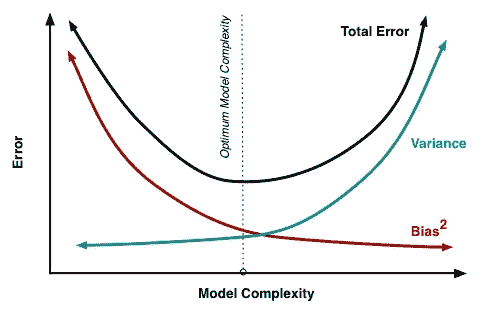

# 机器学习中的正则化

> 原文：<https://medium.com/analytics-vidhya/regularization-in-machine-learning-19640386d7a1?source=collection_archive---------20----------------------->

## 解决过度拟合问题

过拟合是人们在训练机器学习模型时面临的主要问题之一，它导致对其进行训练的数据具有极好的准确性，而对模型从未见过的*测试数据*具有最差的准确性。**过拟合是因为模型从训练数据中学习细节和噪声，对模型产生负面影响，从而影响模型的准确性。**

*过度拟合的模型具有低偏差和高方差，好的模型具有低偏差和低方差。*

图一。偏差与方差权衡

有许多处理过度拟合的方法，

*   交叉验证
*   移除功能
*   使用更多数据进行培训
*   组装
*   提前停止
*   正规化

在本帖中，我们将重点关注**正规化**。

## **什么是正规化？**

正则化是一种通过将特征的系数值向零最小化来拯救回归模型免于过度拟合的方法。

图二。红色曲线是正则化之前，蓝色曲线是正则化之后。

让我们考虑以下线性表达式:

这里，h(x)是目标值*，θ*是系数，x 是特征，n 是特征的数量。

**成本函数:**

多元线性回归的成本函数

在上面的成本函数等式中,“m”是文件中存在的数据数量。

正则化将带有正则化参数(λ)的惩罚添加到成本函数中，以有效的方式最小化成本函数。因此，成本函数的等式变成如下:

岭回归的成本函数

> **正则化通过缩小系数的值来工作。**

有三种不同类型的正则化技术，

*   岭回归(L2 正则化)
*   套索回归(L1 正则化)
*   弹性网络回归(L1/L2 正则化)

## **岭回归(L2 回归)**

岭回归的成本函数是，

通过增加等于系数大小的平方的惩罚来改变成本函数。正则化参数(λ)确定惩罚的严重性，即λ正则化系数，使得如果系数取大值，优化函数被惩罚。岭回归的工作原理是使系数变小，从而降低模型的灵活性和复杂性。

当λ= 0 时，罚值没有影响，岭回归的成本函数将表现为简单线性回归模型的成本函数。随着λ值的增加，罚值增加，系数将接近零，但不会变为零。**因此，岭回归把系数渐近地缩小到接近于零。**

> 当大多数特征都有用时，岭回归效果最好。
> 
> 岭回归也可以应用于逻辑回归。

## **拉索回归(L1 正则化)**

Lasso 回归的成本函数可以写成:

通过增加等于系数模的惩罚来改变成本函数。

套索回归与岭回归有些相似，因为作为岭回归，当λ= 0 时，罚函数没有影响，套索回归的成本函数将表现为简单线性模型的成本函数。岭回归和套索回归的主要区别在于，在岭回归中，我们取系数的平方，在套索回归中，我们取系数的大小，这是套索比岭回归的主要作用和优势，因为套索回归中的**系数可能为零，因此，某些特征可以完全忽略。**

> 套索回归也有助于特征选择。

## **弹性网回归(L1/L2 正则化)**

弹性网回归是岭回归和套索回归的结合。它结合了岭回归罚函数和套索回归罚函数。

> 当我们有大量的特征时，使用弹性网络回归。

弹性网回归有两个不同值的λ**，可以通过使用*交叉验证*来获取λ的正确值。如果两个λ都等于零，那么我们将得到简单线性回归模型的成本函数。**

> ****弹性网回归是岭回归和套索回归的混合。****

## ****结论****

**在这篇文章中，我们学习了正则化，这是一种解决线性模型过度拟合的方法。我们还学习了三种不同类型的正则化，即岭回归、套索回归和弹性网回归，以及这些正则化技术之间的差异。**