# 机器学习和深度学习中的正则化

> 原文：<https://medium.com/analytics-vidhya/regularization-in-machine-learning-and-deep-learning-f5fa06a3e58a?source=collection_archive---------2----------------------->

## 机器学习具有有限的训练数据和无限数量的假设，因此选择正确的假设是一个巨大的挑战。

模型拟合场景

在开始正则化之前，让我们试着理解什么是模型拟合。

这张图片显示了偏差-方差权衡的必要性，这就像是甜蜜点，在进入技术术语之前，让我们试着从外行的角度理解这些概念。

你的任务是抚养孩子，你的目标是把他抚养好。在孩子的成长过程中，你希望给孩子多大程度的灵活性？

目标功能:儿童的全面发展。

如果你只是让孩子为考试而学习，或者试图通过让他没有任何放松或缓冲时间来让他成为运动员，那么你就太适合了，这意味着你的孩子只能做特定类型的任务，某种程度上是某方面的专业，除了那一项任务，你无法对生活中的其他事情有一个概括的理解。

一般来说，孩子们想玩手机，吃巧克力和冰淇淋，过充满阳光和彩虹的生活。

**介绍正规化:在这种情况下，你试图找到最佳时机**

*   如果你想要巧克力，就平均分配给你的朋友和家人
*   如果你想玩游戏，完成作业。

这些是我们日常育儿中的一些常规。

> 偏差-方差权衡是过度拟合和欠拟合之间的拉锯战。过度健康就像通过复习前一年的问题来为考试做准备，而不健康就像阅读章节摘要并回答考试。在一般的测试案例中，这两种情况都会失败。为了解决这个问题，我们有了正规化。

# **机器学习的正规化**

正则化是“我们对学习算法进行的任何修改，目的是减少其泛化误差，而不是训练误差。”

如果模型在训练数据集中表现良好，则不能保证它在新数据集中表现良好。但通常来说，当我们使用网络时，网络遇到的是看不见的数据。最直接的策略是增加数据集，但这在大多数时候是不现实的。修改主要是一些数学上的改进，比如一个更合适的损失函数，提前停止，退出等等

在这一节中，我们将研究 L1 和 L2 正则化。使用 L1 和 L2 范数进行的正则化。术语方面经常会出现混淆，因此下面是相同术语的等效术语:

**线性模型中的正则化**

这里提到的正则化类型是线性模型中使用的正则化类型，即分类器或回归变量可以表示为直线或超平面，如线性回归、逻辑回归和支持向量机。

`Euclidean norm == Euclidean length == L2 norm == L2 distance`

`Manhattan norm == Manhattan length == L1 norm == L1 distance`

https://medium.com/@kolwalkaramod96/hello-f4a9317ad[你可以通过这个链接查看距离度量。](/@kolwalkaramod96/hello-f4a9317ad)

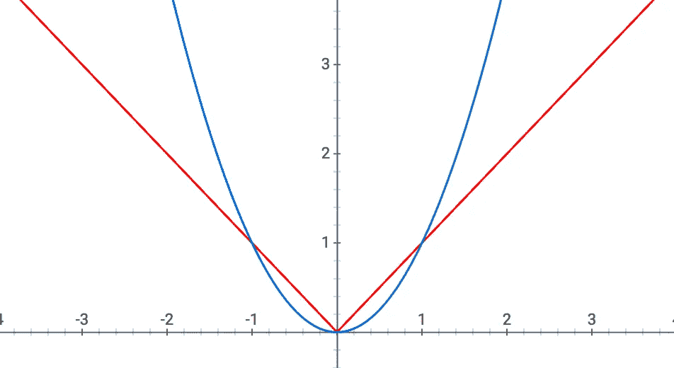

L2 vs L1 情节

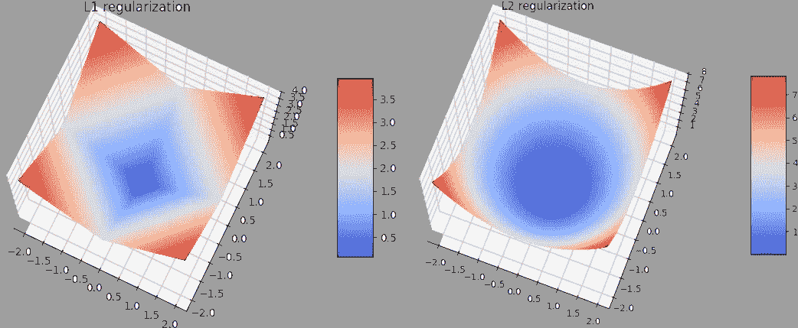

相同的三维等高线图

这个情节有助于区分 L1 和 L2 诺姆。蓝色曲线是 L2 范数，在零点不连续的红线是 L1 范数。L1 范数是不连续的，因此它产生稀疏，L2 是可微的，因此我们可以使用像随机梯度下降的技术。

一般学习模型方程

*优化函数=损失+正则项*

如果模型是逻辑回归，则损失是对数损失，如果模型是支持向量机，则损失是铰链损失。

如果模型是神经网络，那么它将是某种形式的交叉熵损失。

L1 和 L2 范数也适用于深度学习模型。

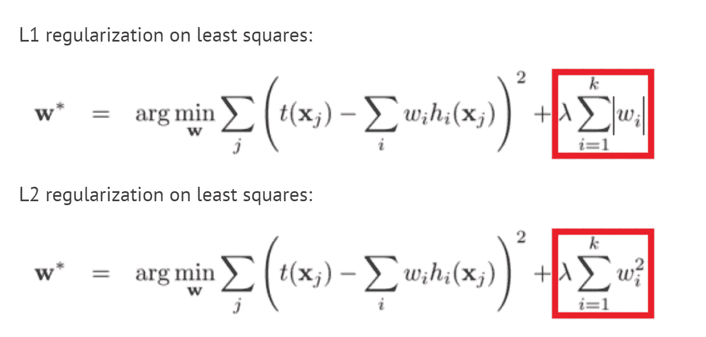

L1 和 L2 一般优化方程

这里，**λ**是正则化参数。它是超参数，其值被优化以获得更好的结果。L2 正则化也被称为*权重衰减*，因为它迫使权重向零衰减(但不完全为零)。

如果λ= 0，该模型将倾向于过度拟合，因为优化方程将仅仅是损失函数。如果 lambda =无穷大或某个较大的值，该模型将趋于不适合。我们可以通过模型的超参数调整来获得最佳λ。

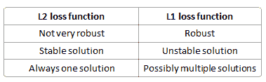

L1 正则化与 L2 正则化的比较

如果你想两全其美，你可以使用弹性网，它在目标函数中使用 L1 和 L2 正则化子。

为了获得正则化的最佳结果，最好对正则化使用交叉验证。下面的链接是交叉验证的介绍。

[https://machinelearningmastery.com/k-fold-cross-validation/](http://Link for Cross Validation)

让我们看看 SVM 的正则化，因为它是一个更广义的逻辑回归，具有边际最大化策略。

正则化参数(λ)用作给予错误分类的重要程度。SVM 提出了一个二次优化问题，该问题寻求最大化两个类之间的间隔并最小化错误分类的数量。然而，对于不可分离的问题，为了找到解决方案，必须放松误分类约束，并且这是通过设置提到的“正则化”来完成的。

因此，直觉上，随着λ变大，允许的错误分类的例子越少(或者损失函数中付出的代价越高)。然后，当λ趋于无穷大时，解趋于硬边界(不允许错误分类)。当λ趋于 0(不为 0)时，允许的错误分类越多。

这两者之间肯定有一个权衡，通常较小的 lambdas，但不是太小，概括得很好。以下是线性 SVM 分类(二元)的三个示例。

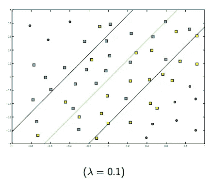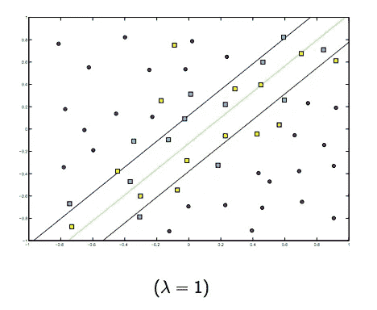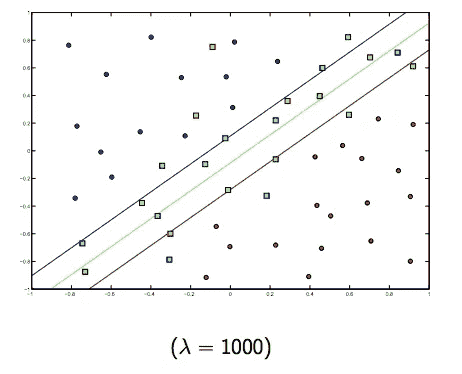

对于非线性核 SVM，想法是相似的。鉴于此，对于较高的λ值，过度拟合的可能性较高，而对于较低的λ值，欠拟合的可能性较高。

下图显示了 RBF 内核的行为，将 sigma 参数固定为 1，并尝试λ= 0.01 和λ= 10

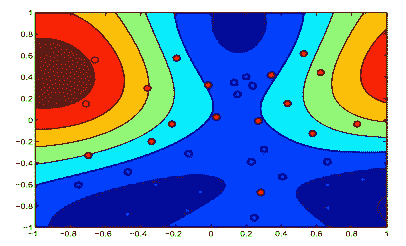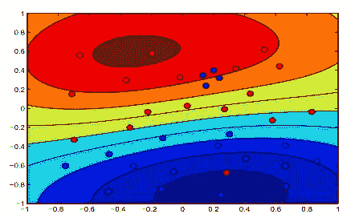

你可以说，lambda 较低的第一个数字比数据更精确拟合的第二个数字更“宽松”。

**基于树的模型中的正则化**

基于树的模型是诸如决策树、随机森林等模型

除了 L1 和 L2 正则化，还有特定的正则化技术用于树模型，树模型通常过拟合，因此 L1 和 L2 可能不是这些模型的最佳正则化。

1.  限制树的最大深度
2.  对何时进一步分割节点设置更严格的停止标准(例如，最小增益、样本数量等。)
3.  超参数调整用于训练和交叉验证的模型和图
4.  如果你使用决策树作为基础模型，你可以使用一个像随机森林一样的集合

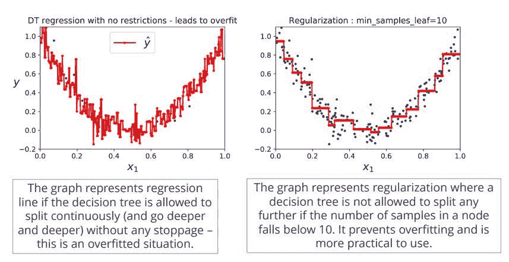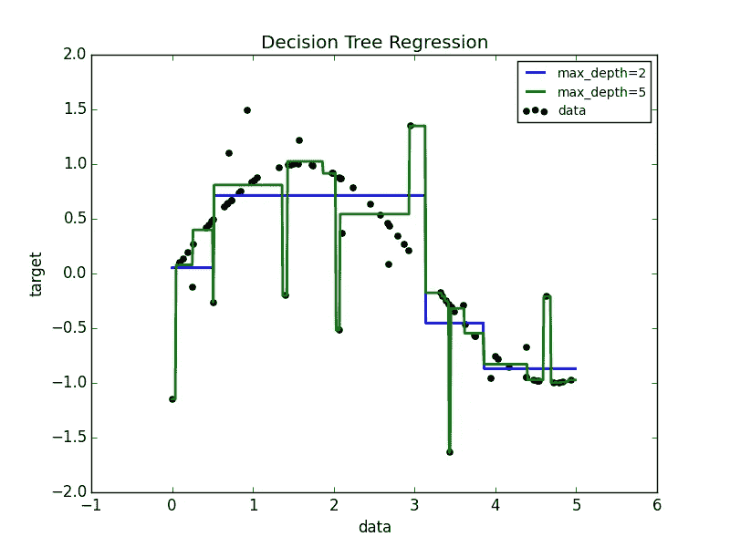

**梯度提升决策树**

这是一个使用决策树作为基础模型的集成模型，boosting 是一种集成技术，但与 random Forrest 相比，它的工作方式有所不同。

关于这方面的更多细节，请参考这个[https://stats . stack exchange . com/questions/173390/gradient-boosting-tree-vs-random-forest](https://stats.stackexchange.com/questions/173390/gradient-boosting-tree-vs-random-forest)

梯度增强中使用的一些技术有:

1.  超参数调整-一个自然正则化参数是梯度推进迭代次数 *M* (即当基学习器是决策树时模型中的树的数量)。增加 *M* 会减少训练集的误差，但将其设置得太高可能会导致过度拟合。 *M* 的最佳值通常是通过监控独立验证数据集的预测误差来选择的。除了控制 *M* 之外，还使用了其他几种正则化技术。
2.  另一个正则化参数是树的深度。该值越高，模型越有可能过度拟合训练数据。
3.  **收缩**-梯度推进方法的一个重要部分是收缩正则化，包括修改更新规则如下:

f m(x)= f m1(x)+ν⋅γm h m(x)，0 < ν ≤ 1 ,

where parameter ν

is called the “learning rate”.

Empirically it has been found that using small learning rates (such as ν <0.1) yields dramatic improvements in models’ generalization ability over gradient boosting without shrinking ( ν = 1). However, it comes at the price of increasing computational time both during training and querying: lower learning rate requires more iterations.

Similar methods of limiting max-depth and tree pruning can be used

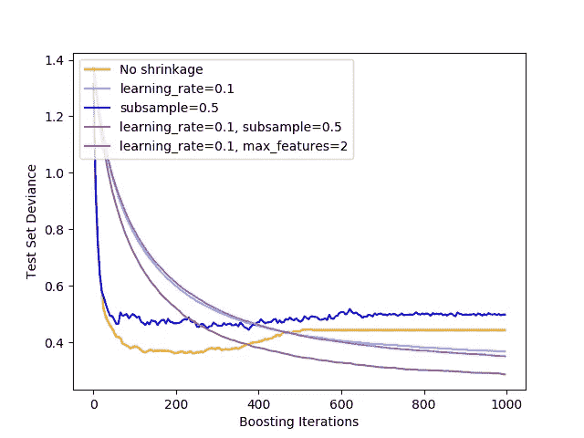

**朴素贝叶斯中的正则化**

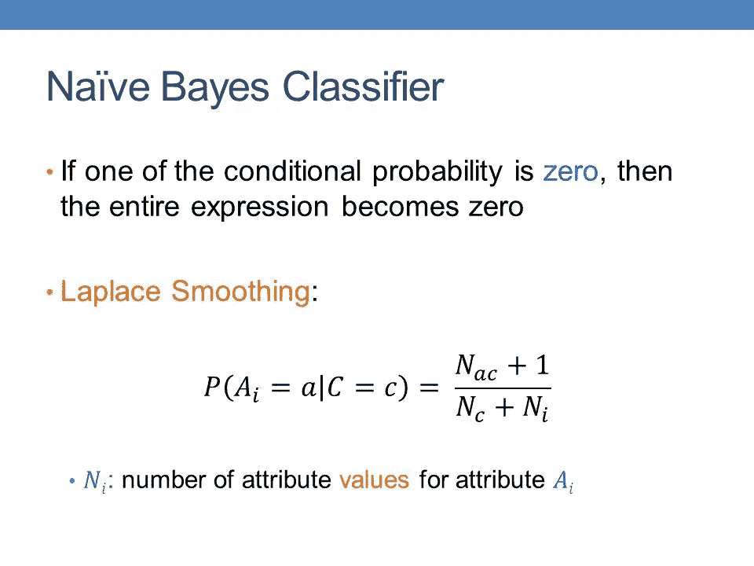

拉普拉斯平滑或加法平滑

这是一种用于平滑分类数据的技术。给定一个观察值 x =⟨x ^ 1，x ^ 2，…，x ^ d⟩

根据具有 N 次试验的多项式分布，数据的“平滑”版本给出估计量:

θ ^ i = x i + α N + α d ( i = 1，…，d)，

其中“伪计数” *α* > 0 是平滑参数。 *α* = 0 对应无平滑。加法平滑是一种收缩估计，因为得到的估计介于经验概率(相对频率)x i N 和均匀分布 1/ d 之间。

你总是需要这种“万无一失”的概率。

要了解原因，请考虑最坏的情况，即训练样本中的单词没有一个出现在测试句子中。在这种情况下，根据你的模型，我们会得出结论，这个句子是不可能的，但它显然存在，造成了矛盾。

另一个极端的例子是测试句子“亚历克斯遇见了史蒂夫。”其中“met”在训练样本中出现了几次，但“Alex”和“Steve”没有出现。你的模型会得出结论，这种说法很可能是不正确的。

# 深度学习中的正则化

L1 和 L2 正则化也适用于深度学习，但是还有更多方法，例如

*   拒绝传统社会的人
*   数据扩充
*   提前停止

## **辍学**

为了理解什么是辍学，让我们看看一个经典的神经网络。

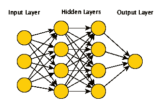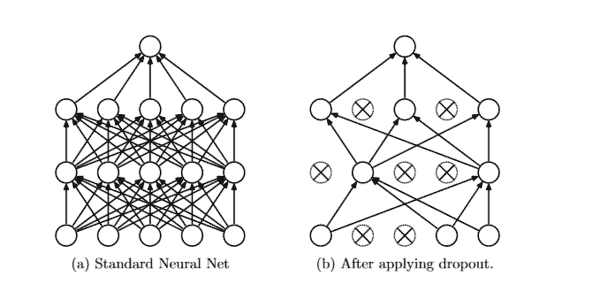

**Dropout** 是一种[正则化](https://en.wikipedia.org/wiki/Regularization_(mathematics))技术，由 Google[【1】](https://en.wikipedia.org/wiki/Dropout_(neural_networks)#cite_note-pat-1)申请专利，用于通过防止训练数据上的复杂协同适应来减少[神经网络](https://en.wikipedia.org/wiki/Neural_networks)中的[过拟合](https://en.wikipedia.org/wiki/Overfitting)。这是用神经网络进行模型平均的一种非常有效的方法。[【2】](https://en.wikipedia.org/wiki/Dropout_(neural_networks)#cite_note-MyUser_Arxiv.org_July_26_2015c-2)术语“丢失”指的是在神经网络中丢失单元(隐藏的和可见的)。[【3】](https://en.wikipedia.org/wiki/Dropout_(neural_networks)#cite_note-MyUser_Jmlr.org_July_26_2015c-3)[【4】](https://en.wikipedia.org/wiki/Dropout_(neural_networks)#cite_note-4)

## 数据扩充

减少过度拟合的最简单方法是增加训练数据的大小。在机器学习中，我们无法增加训练数据的大小，因为标记的数据太昂贵了。

但是，现在让我们考虑我们正在处理的图像。在这种情况下，有几种方法可以增加训练数据的大小-旋转图像、翻转、缩放、移动等。在下图中，手写数字数据集已经进行了一些转换。

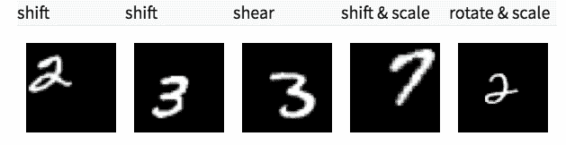

# 提前停止

早期停止是一种交叉验证策略，我们将训练集的一部分作为验证集。当我们看到验证集上的性能越来越差时，我们会立即停止对模型的训练。这就是所谓的提前停止。

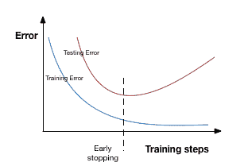

# 代码片段

既然我们知道了一些理论，让我们从一组数据开始。我们正在考虑的数据集是疟疾细胞图像数据。[https://www . ka ggle . com/iarunava/cell-images-for-detecting-malaria](https://www.kaggle.com/iarunava/cell-images-for-detecting-malaria)

有两类图像感染疟疾和未感染疟疾的图像。

**L1 和 L2 正规化**

在 keras 中，我们可以使用正则化直接将正则化应用于任何图层。我在有 100 个神经元和 relu 激活函数的密集层上应用了正则化。

**辍学**

因此，每次迭代都有不同的节点集，这导致不同的输出集。它也可以被认为是机器学习中的一种集成技术。

集成模型通常比单一模型表现更好，因为它们捕捉更多的随机性。类似地，dropout 也比正常的神经网络模型表现得更好。

选择应该丢弃多少节点的概率是丢弃函数的超参数。

由于这些原因，当我们有一个大的神经网络结构时，为了引入更多的**随机性，辍学通常是首选。**

在 keras 中，我们可以使用 **keras 层**实现 dropout。下面是 Dropout 实现。在我的神经网络架构中，在具有 64 个核的最后一个隐藏层之后和具有 500 个神经元的第一个密集层之后，我引入了 0.2 的丢弃率作为丢弃的概率。

**数据扩充**

在 keras 中，我们可以使用 **ImageDataGenerator** 来执行所有这些转换。它有一个很大的参数列表，你可以用它来预处理你的训练数据。

**提前停止**

在 keras 中，我们可以使用**回调**函数来应用提前停止。下面是它的实现代码。我已经应用了提前停止，这样如果验证错误在 3 个时期后没有减少，它将立即停止。

结合所有这些元素

我们得到的图像细胞是否含有疟疾的分类准确率约为 95%+

# 参考

 [## 深度学习中的正则化技术概述(带 Python 代码)

### 简介数据科学专业人员面临的最常见问题之一是避免过度拟合。你来了吗…

www.analyticsvidhya.com](https://www.analyticsvidhya.com/blog/2018/04/fundamentals-deep-learning-regularization-techniques/)