# 机器学习中的正则化

> 原文：<https://medium.com/analytics-vidhya/regularization-in-machine-learning-d5a867fd6fc?source=collection_archive---------9----------------------->

让我们从训练一个线性回归机器学习模型开始&它在我们的训练数据上报告得很好，准确率为 98%，但在测试数据上却没有做到这一点，准确率为 36%。这对于任何要部署的机器学习模型来说都不是一个好兆头！对吗？？？

> 发生了什么事？
> 
> 为什么模型会失败？
> 
> 所选指标中是否有错误？
> 
> 很多问题都是对的！！！

**我们来解码吧！！！**机器学习模型从给定的训练数据(可用)中学习&根据模式拟合模型。看不见的数据(测试数据)将具有不同的模式。这导致我们对模型的过度拟合(完全盲目)。

哦哦哦哦！！！

为了更好地理解，我们举一个具有过度拟合条件的数据的例子。

***注:我们使用的是线性回归又名普通最小二乘法。***

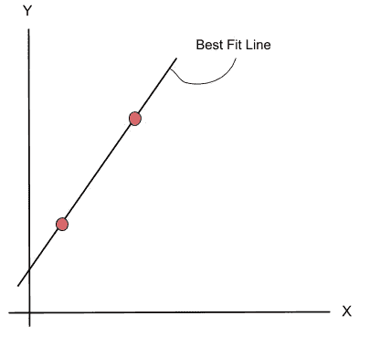

上面的图说明了模型对训练数据的拟合具有 100%的精度，残差和为 0。完全正确，我们的机器学习模型处于完美状态。

让我们把它带到模型上进行测试(检查测试数据)。

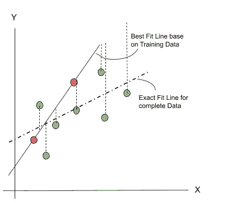

我们的测试乘坐了一个巨大的转移&结果是完全错误的，残差的总和是更多的&精度已经急剧下降！！！

再来一次。

这代表模型的过度拟合。

# 什么是过适和欠适？

**过拟合:**在训练数据上表现良好，在其他数据(测试数据)上表现差/差。

**欠拟合:**训练数据性能差，其他数据(测试数据)性能差。

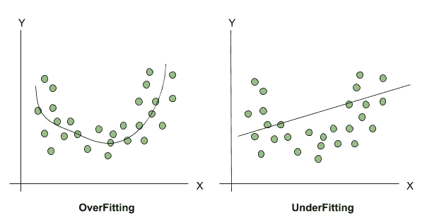

回归示例

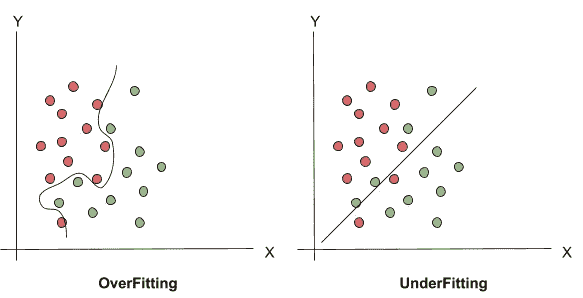

分类示例

# 我们如何减少这种过度拟合？

如题所示，我们将使用正则化方法。这意味着通过添加一些额外的值来将系数调整或缩小到零，以防止数据过度拟合。

让我们看看上面例子(线性回归)的一般成本函数公式。

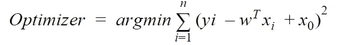

现在让我们在成本函数中引入少量的偏差。因此，修改后的公式看起来像:

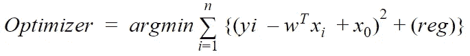

术语(Reg)表示通过某种正则化模型向数据集引入偏差。

# 什么是正规化？有哪些不同的正则化模型？

正则化是一种通过在给定的训练数据集上适当地拟合函数来减少误差的技术&以避免噪声和过拟合问题。

## 岭回归又名 L2 正则化

岭回归(也称为 Tikhonov 正则化)是线性回归的正则化版本&一种用于分析存在多重共线性的多重回归数据(要素)的技术。多重共线性使我们得到无偏的数据&方差很大，与真实值相差很大。向数据引入偏差将会减少方差和标准误差，因此我们可以得到一个最佳模型。

**注册术语:**

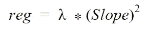

这里的 Lambda 是一个超参数，可以根据最佳拟合进行调整。斜率是平方的，用于获得朝向零点(朝向 X 轴)的最佳拟合线。因为它可以通过少量增加偏差和减少方差来为我们提供最佳拟合。

**最终公式:**

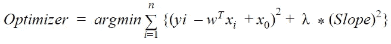

## 拉索回归又名 L1 正则化

套索回归(也称为最小绝对收缩)是线性回归的另一个正则化版本。类似于岭回归，它将正则化项添加到成本函数中。Lasso 回归的重要特征是它倾向于消除最不重要的特征的权重。

**Reg 术语:**

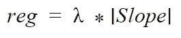

这里是 Lasso 使用相同的超参数λ&斜率的大小，这里斜率的大小只是|M1 + M2 + M2 …..Mn|。

使用斜率大小的主要目的是避免零拟合的要素。因为这对预测没有影响。

**最终配方:**

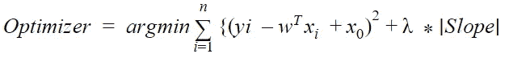

## 弹性网络回归又名 L1 和 L2 正则化

弹性网回归介于岭型回归和套索回归之间。作为一个规范化的术语，我们增加了山脊和套索惩罚术语的组合。

**最终配方:**

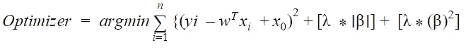

总体概括正则化减少了线性模型的过度拟合。为了减少这种情况的发生，我们使用 L1 或 L2 或 L1+L2 的正则化方法。

感谢阅读。

**查看关于** [**线性回归**](/analytics-vidhya/linear-regression-math-geometrical-intuition-bad9a73cdcaa)**[**逻辑回归**](/analytics-vidhya/logistic-regression-math-geometrical-intuition-with-example-8a0cb8860f8a)**&**[**分类绩效指标**](/analytics-vidhya/performance-metrics-in-classification-models-with-geometrical-explanation-619341dea62f) **更多类似博客****

**你可以在 LinkedIn 上找到我**

**[https://www.linkedin.com/in/shashikiranc/](https://www.linkedin.com/in/shashikiranc/)**