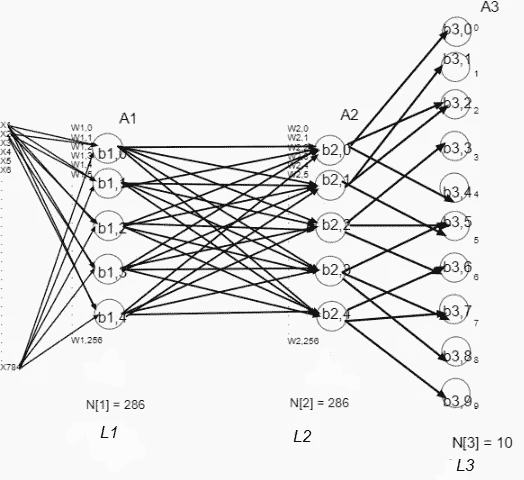
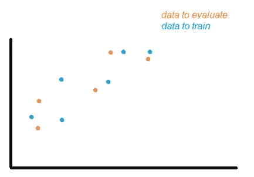
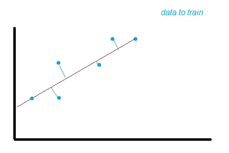
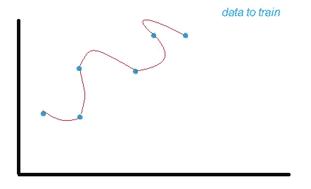
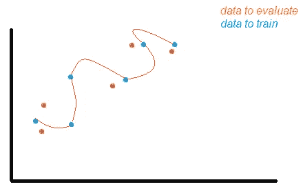
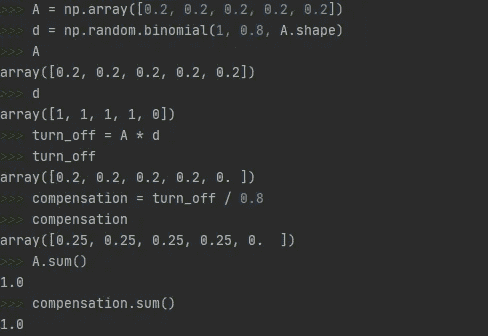
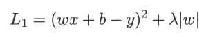
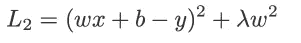
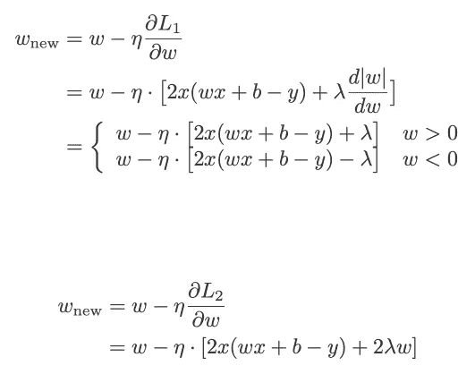
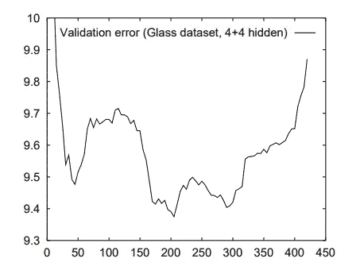

# 正则化技术

> 原文：<https://medium.com/analytics-vidhya/regularization-techniques-8ff8b74950c3?source=collection_archive---------22----------------------->

深度神经网络

这篇短文讨论了正则化技术，优势，意义，应用它们的方法，以及为什么是必要的。在本文中，我不打算解释如何设计或神经网络如何与正向或反向传播、权重、偏差(阈值)、标准化有关，但也许在下一篇文章中，我会转换这些主题。然而，您需要这些概念来理解正则化技术。

首先，我们需要了解神经网络的问题是什么。当我们设计和创建一个神经网络时，我们有一个应用它们的目标，例如，如果我想识别 0 到 9 之间的数字(我的目标)，我应该明白我需要使用具有许多方式来编写这些数字(0-9)的样本来训练模型，还需要使用样本来测试模型。这一点非常重要，因为正如你所知，我们有不同的方式来书写数字，线条和/或圆圈在某些情况下可能是完美的，也可能不是，这可能是由许多因素造成的，如年龄、疾病、血液中的酒精含量、焦虑、书写技巧等。你对医生的写作有什么看法？是的，这是另一个话题，回到我们需要很好地选择样本的问题，试图获得代表未来可能数据集的数据，我们会有许多问题，但在这种情况下，我们将只谈论“过度拟合”。

为了理解过度拟合，有必要知道偏差和方差的含义。我推荐这个视频，因为它是一个很好的解释[https://www.youtube.com/watch?v=EuBBz3bI-aA](https://www.youtube.com/watch?v=EuBBz3bI-aA)

但是如果你不想看视频，我创建这些图片来看这些术语:

测试和训练轴中的数据

图为我们展示了两组样本(训练和测试样本)，
试着为这些数据设想一个案例(可能是体重对身高，冬装价格对季节，这只是为了你的理解)，现在我们将使用训练数据集训练一个模型，例如使用线性回归，我们将得到这样的结果:

线性回归(红色)可能的预测

偏差将是我们的蓝色点与预测值(红色直线)之间的差异(所有平方距离的总和(见绿线))。这是一个问题，因为就像我们在图片中看到的那样，所有的点值都不会用我们的模型预测来表示，我们将这种偏差称为偏差(我们可以有高偏差或低偏差(如本例所示)，这种问题称为欠拟合)。如果我们有一个较小的偏差，我们可以看到我们将得到正确的预测，因为我们将非常接近我们的训练值(听起来不错，对不对？)因此，我们应该设想我们创建了一个具有预测功能的模型来获得这些值，如下所示:

获取定型数据集值的预测函数

在这种情况下，我们可能会返回相同的训练数据值，我们可以认为我们做得非常好，但如果我们试图记住测试数据(样本，以查看我们的模型是否对我们的目标有好处)是的，在这一点上，您可能会认为我们不会返回这种情况下的非常好的答案，但我们可以在图片中看到这一点:

使用预测训练和测试数据

我们可以看到，我们不会为测试数据返回非常好的值，因为预测远远不是所有的橙色点。在这种情况下， 我们有一个问题叫做高方差(我们可以有低或高方差) 也许这就像如果你想赢得力量挑战，有人告诉你最好的训练健身房是“腿部健身房”，你做了练习来训练你的腿，几个月后你可以做很多高重量的重复练习，你非常自信，因为你感觉到了你腿部的力量，但挑战日就在现在，你看到资格考试是一个简单的二头肌弯曲练习， 因为这个原因你没有锻炼肌肉，结果可能是你在第一轮就被取消资格。 这个问题，数据集之间的差异将被称为方差，当我们有高方差时，我们说我们过拟合我们训练了很多训练数据集，我们不能有效地进行未来预测。为此，我们需要应用一些方法来解决这个问题，其中一个方法就是使用正则化。用简单的话来说，这种方法避免了我们的神经元保持相同的值(权重，偏差(阈值，不是我在本文中谈到的同一偏差))来生成趋势输出。

拒绝传统社会的人

这种方法是一种关闭一些神经元(在概念词中)的方法，以避免像所有正则化方法一样“记忆我们的权重和偏差(阈值)”，但其思想是，在没有所有神经元(仅在隐藏层中)的情况下训练模型，用随机方法关闭神经元并进行补偿，我们将在 python 中看到一个关于这种方法如何工作的示例。请记住，您应该在正向和反向传播中使用它(正向输出，反向输出)

理解辍学的例子

我们可以看到一种随机二项式方法，在这种情况下，可以获得一个概率为 0 和 1 的随机向量(0.8)，我们将乘以输出以模拟神经元关闭，稍后我们会看到，我们需要进行补偿，以将神经元中的值分配给层中的其他神经元(除以我们希望保留在层中的概率)。我们知道结果将等于 1 (100%)。

L1 和 L2 正规化

这些方法在成本中增加了一个超参数(交叉熵函数)，它们之间的区别在于这些参数的功效。L2 被称为权重衰减和岭回归，因为它是欧几里得范数，由网络中权重的平方和乘以参数λ(正则化参数)组成。L1 也叫拉索回归，是网络中权重的绝对值之和乘以λ。接下来的图片是损失公式以及如何更新权重:

所有的公式都来自于这个对 L1 和 L2 正则化的很好的解释

摘自[https://towards data science . com/intuitions-on-L1-and-L2-regularization-235 F2 db 4c 261 # 15 C2](https://towardsdatascience.com/intuitions-on-l1-and-l2-regularisation-235f2db4c261#15c2)

摘自[https://towards data science . com/intuitions-on-L1-and-L2-regularization-235 F2 db 4c 261 # 15 C2](https://towardsdatascience.com/intuitions-on-l1-and-l2-regularisation-235f2db4c261#15c2)

摘自[https://towards data science . com/intuitions-on-L1-and-L2-regularization-235 F2 db 4c 261 # 15 C2](https://towardsdatascience.com/intuitions-on-l1-and-l2-regularisation-235f2db4c261#15c2)

这是一个实现 L2 [的 python 示例 https://github . com/PauloMorillo/holbertonschool-machine _ learning/blob/master/supervised _ learning/0x 05-regulation/0-L2 _ reg _ cost . py](https://github.com/PauloMorillo/holbertonschool-machine_learning/blob/master/supervised_learning/0x05-regularization/0-l2_reg_cost.py)

L1 和 L2 两种方法都在每次迭代中减小权值。它们之间的区别在于，当值较高时，L2 减小值的速度较快，但当值较小时，减小量相等，而 L1 在值较小时速度较快。

总之，这些方法避免了在训练数据集中没有偏差的回归，它们如何做到这一点是有惩罚的，这种惩罚将是一个由独立项“lambda”控制的值，为此，我们在回归函数中添加了一个“偏差”(改变斜率)，增加了偏差并减少了高方差。此外，我们应该知道，如果我们使用 L2，我们增加λ，我们可以有一个接近 0 的斜率，但使用 L1，我们可以得到 0。这个视频很有意思，看看这个[https://www.youtube.com/watch?v=NGf0voTMlcs](https://www.youtube.com/watch?v=NGf0voTMlcs)(分 4:55)

提前停止

该方法在于同时评估训练和验证数据，在两种情况下都得到误差。当我们有这些值时，我们可以看到值将非常接近，但在某个点上，验证成本将增加，直到这种情况发生，我们应该停止，用这个简单的方法，我们可以避免过度拟合。在这幅图中我们可以看到这种行为:

摘自[https://srdas . github . io/dl book/improving model generalization . html # over fitting](https://srdas.github.io/DLBook/ImprovingModelGeneralization.html#Overfitting)图 8.6

现在，我们应该知道这是查看训练和验证错误行为的理想方式，但在现实生活中，我们会有一个类似这样的错误函数:

摘自[https://page . mi . fu-Berlin . de/pre chelt/Biblio/stop _ tricks 1997 . pdf](https://page.mi.fu-berlin.de/prechelt/Biblio/stop_tricks1997.pdf)

在这种情况下，如果我们想获得最小值，我们可以使用耐心等技术来等待一些时期，看看我们是否可以有一个最小值，例如，如果我们在 30 次训练中可能有 9.5 次误差，而我们对其他值一无所知，我们可以说这是最小误差，因此我们提前停止，但如果你看到可能在 40 次训练后， 我们有 9.4，如果我们看到一个直到 50 秒，这个误差将会减少，因此，如果我们只训练到 50 秒，我们可以定义大约 10 个训练或时期的耐心(我们将训练所有数据集的时间)，我们将等待 10 个时期来选择最低值。
想一想两辆车，也许是卡车，这些卡车想去同一个镇(也许是一个叫预测镇的送货地点)，但他们不知道路。这条道路可以有很多方式到达预测城镇或另一个城镇(像不是预测城镇、非常远的预测城镇和道路终点城镇)，为此他们必须注意路标，这两辆卡车在同一时间以相同的速度行驶，但是驾驶员看到的是道路的不同部分， 假设这些车在一条车道上，其中一辆可以更好地看到车道的左侧，另一辆可以更好地看到右侧，在道路的某一点，右侧有一个标志，显示预测镇在下一个出口，是的，右侧的卡车看到了标志，但另一辆卡车(左侧)什么也没看到， 当右边的卡车驶出出口时，其他卡车沿着道路前往“非预测镇”，“非常远的预测镇”，现在我们知道左边的卡车非常靠近预测镇，这一点将会提前停止，因为如果卡车不停止，将会到达其他城镇，结束。

数据扩充
导致过度拟合的另一个麻烦是当我们没有足够的数据来获得正确的预测时，例如，试着想一个关于一个失去成员的案例，有人给你看一张照片，你在黑白照片中看到一个年轻女子，而配偶，一个老人问你见过我的妻子吗？如果发生这种事，也许你不能笑，但可能你会告诉他，如果你能看到她最近的照片。总之，如果你没有足够的数据，就很难确定或预测某事。现在你想帮忙，你要求更多的数据，年龄，头发怎么样(长，灰，黑)，她穿什么，等等。很可能，如果你有更多的数据，你会认出这位老太太。
现在，我们如何获得更多数据来增加我们的数据集，我们应该考虑我们可能的验证数据，并查看与训练数据的差异，颜色、形状、事物的方向，以及我们希望从训练数据中获得的所有东西。

例如，认为我们需要创建一个模型，可以预测你是否在微笑。我们只有一张你微笑的照片。但是我们有 30 张验证数据的图片，这些图片有不同的滤镜，黑色和白色，只有图片的红色，绿色和蓝色成分，也许你把训练的相同图片放在了错误的位置，此时图片在垂直方向翻转。
如你所知，这可能很难识别，因此我们应该考虑这些情况，并增加我们的数据(数据扩充)，为此，我们将为我们的训练图片添加一些过滤器(黑白、红色、绿色、蓝色组件)，并保存它们以获得更多的训练数据。

缩放、调整大小、改变亮度、颜色、旋转都是增加训练数据集的方法。

结论

使用正则化技术来避免过度拟合是非常重要的，但是注意要使用的参数也是非常重要的，例如:

辍学，我们应该注意关闭神经元的百分比，这种解决方案可能是预测中的一个问题，一些书籍指出 0.8 或更大可能是一个很好的应用值(在这种情况下，20%或更少的神经元将像 0 输出)在其他情况下，我们可能会影响正确的预测

L2——L1 至少我们想要达到 0 或接近 0，我们应该注意λ的值，因为如果λ很大，我们将得到 L1 的 0 值或 L2 的接近 0 值。

对于早期停止方法，有必要选择一个好的耐心参数，因为如果我们使用小耐心，我们不会得到最低的值，正如我们在该方法的描述中看到的。选择该参数的方法是实验性的。

数据扩充，在某些情况下，我们可以添加大量可能对我们的预测不利的图像，我们应该考虑未来可能的情况，并尝试在我们的训练数据集中不产生噪声。

是的，就这些。谢谢。
参考书目

*   纸张提前停止[https://page . mi . fu-Berlin . de/pre chelt/Biblio/stop _ tricks 1997 . pdf](https://page.mi.fu-berlin.de/prechelt/Biblio/stop_tricks1997.pdf)
*   [https://srdas . github . io/dl book/improving model generalization . html # over fitting](https://srdas.github.io/DLBook/ImprovingModelGeneralization.html#Overfitting)
*   [https://www.youtube.com/watch?v=NGf0voTMlcs](https://www.youtube.com/watch?v=NGf0voTMlcs)
*   [https://towards data science . com/intuitions-on-L1-and-L2-regular ization-235 F2 db 4c 261 # 15 C2](https://towardsdatascience.com/intuitions-on-l1-and-l2-regularisation-235f2db4c261#15c2)
*   [https://www.youtube.com/watch?v=EuBBz3bI-aA](https://www.youtube.com/watch?v=EuBBz3bI-aA)