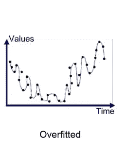
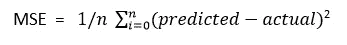
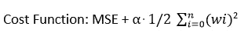
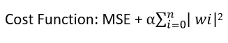
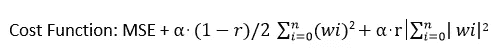

# 正则化线性模型

> 原文：<https://medium.com/analytics-vidhya/regularized-linear-models-in-machine-learning-d2a01a26a46?source=collection_archive---------10----------------------->

在机器学习中，当我们的模型在训练数据上表现良好，但在测试数据上表现很差时，我们经常会面临这个问题。当模型紧密跟随训练数据时，即[过拟合](/analytics-vidhya/bias-variance-trade-off-in-machine-learning-ae6fc6e326ba)数据时，就会发生这种情况。

来源:谷歌

正则化是一种减少过度拟合的技术。规则化一词指的是使统一的行为。

复杂的模型可以检测数据中的微妙模式，但如果数据有噪声(包含不相关的信息)或数据集太小，模型将最终检测到噪声本身中的模式。当我们用这个模型来预测我们的结果时，结果会不准确，误差会比预期误差大。

在线性回归中，最终输出是特征变量的加权和，由下式表示。

> y = w1x1+w2x2+w3x3+…+wn xn+w₀

这里，权重 w1，w2，…，wn 表示特征(x1，x2，..xn)。如果一个特征具有与其相关联的大权重，则该特征将具有高重要性。

线性回归中的误差将是均方误差，如下所示:

为了改进模型或减少模型中噪声的影响，我们需要减少与噪声相关的权重。与噪声相关联的权重越小，它对预测输出的贡献就越小。

对于线性模型，通过约束模型的权重来实现正则化。为了约束权重，我们首先需要了解这些权重是如何计算的。根据成本函数计算权重，对于线性回归，成本函数是均方误差。每次调整权重并计算 MSE，具有最小 MSE 的集合将被视为最终输出。

为了正则化模型，正则化项将被添加到成本函数中。

> 正则化代价函数= MSE+正则化项

这里我们将看到三个不同的正则化项来约束模型的权重，因此有三个不同的正则化线性回归算法:

1.  里脊回归
2.  套索回归
3.  弹性网

**岭回归:**

在岭回归中，正则项是模型权重的平方和。在统计学中，这个正则项被称为 L2 范数。它迫使模型保持尽可能小的重量。

这里需要注意的是，正则化只应用于我们的训练数据，我们保持测试数据完整，因为我们希望我们的测试集尽可能接近最终目标。

在上面的等式中，alpha 是一个超参数，它控制着我们想要正则化回归模型的程度。如果我们选择一个非常大的α，那么学习算法将试图保持权重尽可能小，因为大的权重将增加成本函数，因此结果将是一条穿过数据平均值的扁平线。如果α为 0，那么岭回归就是线性回归。为了选择最佳超参数值，我们进行**超参数调谐**。

这里需要注意的另一件重要事情是，每当我们应用此技术时，我们首先缩放数据，因为岭回归对输入要素的比例很敏感。对于大多数正则化模型来说都是如此。

**拉索回归:**

最小绝对收缩和选择算子回归(Lasso)使用 L1 范数进行正则化，即模型权重的绝对和。

套索回归的一个重要特征是，它倾向于通过将权重缩小到零来消除不太重要的特征，因此它也用于特征选择。

**弹力网:**

弹性网是脊和套索回归的混合，你想混合多少取决于' r '的值。例如，如果 r 设置为零，那么它将等于 lasso，如果它是 1，那么它将成为岭回归。

重要的问题是，我们将如何决定我们应该遵循哪个回归。答案是，我们应该始终倾向于进行一些正则化，因此我们默认使用岭回归，但当您认为某些要素比其他要素更重要时，请使用套索回归或弹性网，但当数据集包含大量要素时，则更倾向于弹性网。当数据集包含大量要素时，弹性网的表现要比 lasso 好得多。

感谢阅读！