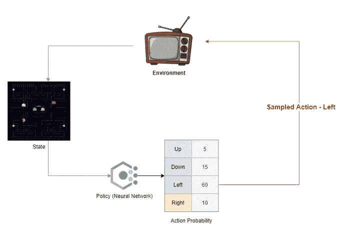
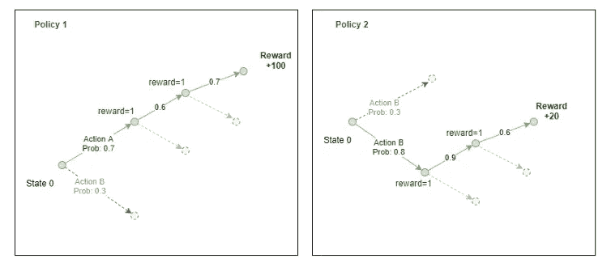
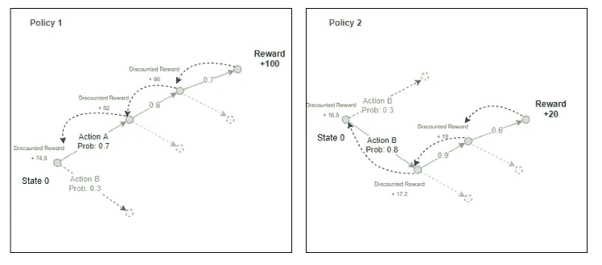
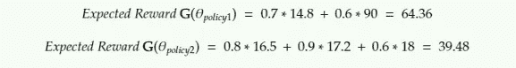
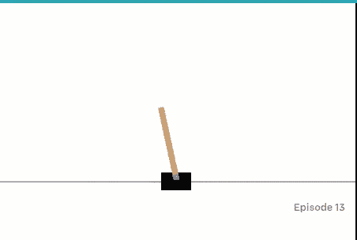
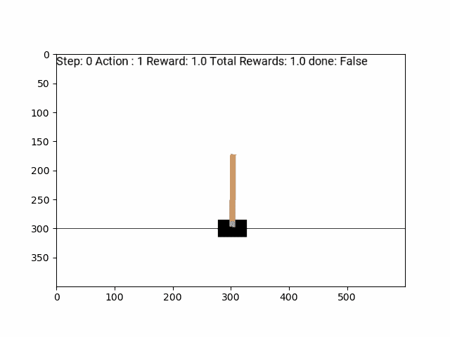
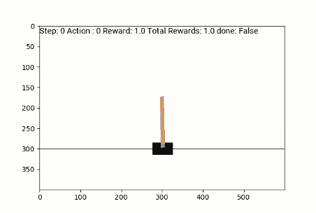
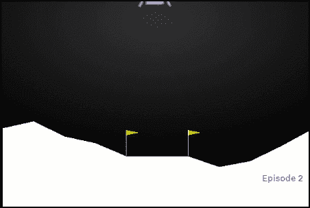
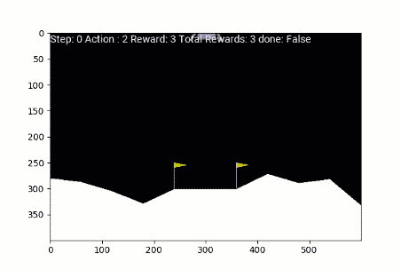
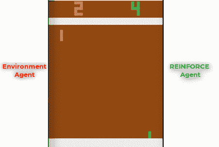

# 强化算法:在强化学习中迈出小步

> 原文：<https://medium.com/analytics-vidhya/reinforce-algorithm-taking-baby-steps-in-reinforcement-learning-ebb1048419e9?source=collection_archive---------8----------------------->

用增强算法求解 OpenAI 的 Cartpole、Lunar Lander 和 Pong 环境。

强化学习可以说是人工智能中最酷的分支。它已经证明了自己的实力:震惊世界，击败了国际象棋、围棋甚至 DotA 2 的世界冠军。

在本文中，我将介绍一个相当基本的算法，并展示它如何在某些游戏中达到超人的性能水平。

强化学习处理设计与*【环境】*互动的*【代理】*，并通过系统的试错法自学如何*【解决】*环境。一个环境可以是一个游戏，比如国际象棋或赛车，或者甚至可以是一个任务，比如解决一个迷宫或实现一个目标。代理是执行活动的机器人。

代理人通过与环境互动获得“回报”。代理人学习执行所需的“行动”,以最大化它从环境中获得的回报。如果代理累积了某个预定义的奖励阈值，则认为环境已解决。这种书呆子式的谈话是我们如何教机器人玩超人象棋或双足机器人走路的。

# 强化算法

强化属于一种特殊的强化学习算法，称为策略梯度算法。该算法的一个简单实现包括创建一个**策略**:一个将状态作为输入并生成采取行动的概率作为输出的模型。策略本质上是代理的指南或备忘单，告诉它在每个状态下采取什么行动。然后，在每一步，该策略都被反复执行和微调，直到我们得到一个解决环境问题的策略。

策略通常是一个神经网络，它将状态作为输入，并生成跨动作空间的概率分布作为输出。

策略:示例

该政策的目标是最大化*“预期报酬”。*

每个策略生成在环境的每个站中采取行动的概率。

政策 1 与政策 2——不同的轨迹

代理从这些概率中进行采样，并选择要在环境中执行的操作。在一集的结尾，我们知道代理人如果遵循这个政策可以得到的总回报。我们通过代理人采取的路径反向传播奖励，以估计给定政策在每个州的“预期奖励”。

在这里，折扣奖励是代理人在未来收到的所有奖励的总和乘以系数γ。

任何一个阶段的折扣奖励都是它在下一步得到的奖励+该代理在未来得到的所有奖励的折扣总和。

通过反向传播奖励来计算每个州的折扣因子。

对于上面的等式，我们是这样计算预期回报的:

按照增强算法的最初实现，预期奖励是概率对数和折扣奖励的乘积之和。

# 算法步骤

实施加强的步骤如下:

1.  *初始化随机策略(将状态作为输入并返回动作概率的神经网络)*
2.  *使用策略玩游戏的 N 个步骤——记录行动概率——来自策略、奖励——来自环境、行动——由代理取样*
3.  *通过反向传播*计算每一步的折扣奖励
4.  *计算预期报酬 G*
5.  *调整策略的权重(NN 中的反向传播误差)以增加 G*
6.  *从 2* 开始重复

在我的 [Github](https://github.com/kvsnoufal/reinforce) 上使用 Pytorch 检查实现。

# 民众

我已经在 Pong，CartPole 和月球着陆器上测试了这个算法。在 Pong 和月球着陆器上进行训练需要花费很长时间——在云 GPU 上分别进行超过 96 小时的训练。这个算法有几个更新可以让它收敛得更快，我在这里没有讨论或者实现。如果有兴趣进一步学习，请查看行动者-批评家模型和最近的政策优化。

**翻筋斗**

**状态:状态:**

水平位置，水平速度，极点角度，角速度

***动作:***

向左推车，向右推车

**随机政策玩法:**

随机游戏-总奖励 18

**经过强化训练的代理策略:**

训练有素的代理-总奖励 434

# 月球着陆器

随机播放代理

***状态:***

状态是 8 个向量的数组。我不确定它们代表什么。

***动作:***

0:不执行任何操作

1:点燃左侧发动机

2:关闭发动机

3:点燃右侧发动机

**经过强化训练的代理策略:**

经过强化训练的月球着陆器

# 恶臭

这很难训练。在 GPU 云服务器上训练了几天。

**状态:状态:**图像

***动作:*** 向左移动桨，向右移动桨

受过训练的代理人

强化学习取得了超越强化的飞跃性进展。我在这篇文章中的目标是 1。学习强化学习和 2 的基础知识。展示如此简单的方法在解决复杂问题时是多么的强大。我很想在一些赚钱的“游戏”上试试这些，比如股票交易……我猜这是数据科学家的圣杯。

[**Github 回购**](https://github.com/kvsnoufal/):【https://github.com/kvsnoufal/reinforce】T4

**巨人的肩膀:**

1.  策略梯度算法([https://lilian Weng . github . io/lil-log/2018/04/08/policy-Gradient-Algorithms . html](https://lilianweng.github.io/lil-log/2018/04/08/policy-gradient-algorithms.html))
2.  派生增强([https://medium . com/@ thechrisyoon/derivating-policy-gradients-and-implementing-REINFORCE-f 887949 BD 63](/@thechrisyoon/deriving-policy-gradients-and-implementing-reinforce-f887949bd63))
3.  Udacity 的强化学习课程([https://github.com/udacity/deep-reinforcement-learning](https://github.com/udacity/deep-reinforcement-learning))

**关于作者**

> 我在阿联酋迪拜控股公司工作，是一名数据科学家。你可以通过[【邮件保护】](https://www.analyticsvidhya.com/cdn-cgi/l/email-protection)或[https://www.linkedin.com/in/kvsnoufal/](https://www.linkedin.com/in/kvsnoufal/)联系我

您也可以在我们的移动应用程序上阅读这篇文章

*原载于 2020 年 11 月 24 日 https://www.analyticsvidhya.com**的* [*。*](https://www.analyticsvidhya.com/blog/2020/11/reinforce-algorithm-taking-baby-steps-in-reinforcement-learning/)