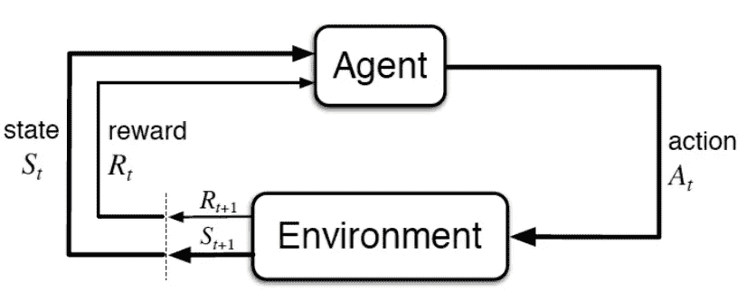
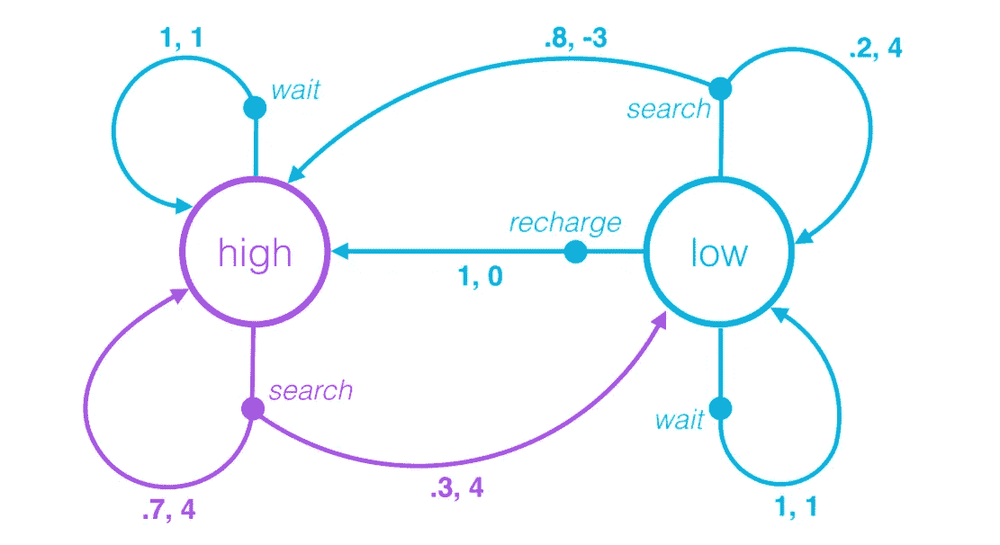
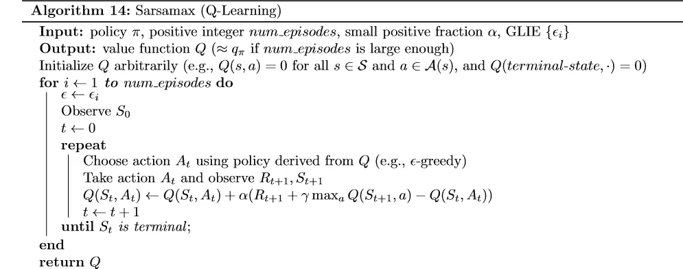
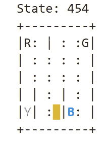

# 强化学习 101

> 原文：<https://medium.com/analytics-vidhya/reinforcement-learning-101-bf42523fd6ad?source=collection_archive---------12----------------------->

为了学习强化学习，我必须努力。主要的问题是我不知道从哪里开始，做什么。所以，这篇文章是在开放人工智能健身房的 Taxi-V3 环境中实现的 Sarsa-Max 或 Q-learning 算法。

理解这个算法主要需要的先决条件只是 python 和 numpy 基础知识。所以，加入进来，准备好你的第一个强化学习项目。

# 什么是强化学习

强化学习是一种无监督学习的形式，其中代理通过随机试验学习探索环境，并学习执行一些任务。

这意味着代理探索所有可能的结果，并试图选择最好的结果。定义最佳可能结果的实体称为**策略**。

因此，为了理解环境，我们将它分为**状态**，并且环境有一组**可能的动作**。

同样，每个状态都与一个**奖励**相关联，这是代理的主要动机。

*** RL 代理总是试图最大化累积回报，这是任何 RL 算法背后的核心原则*。**

上图描述了 RL 的代理环境交互的高级视图。

让我们考虑一个简单的例子。下图是一个状态图，对于理解环境要素之间的关系非常有用。

上面的例子是一个清洁机器人的状态图。这个机器人有三种可能的行动，搜索，等待，充电。每个状态的可能操作通过箭头标记表示。在这些线的顶端是奖励和代理人从当前状态选择一个特定的可能行动的概率。

# 工作

RL 代理随机穿越环境收集奖励，并试图最大化**累积奖励**。环境中的每个循环被称为**事件**。但是，如果我们希望我们的代理人最大限度地达到目的，这将是一个非常缓慢的过程。我们等到一集结束，然后最大化所有集中每一集的回报的 RL 方法被称为蒙特卡罗方法。

但是在我们的 Taxi -v3 案例中，我们将使用一种更高级的算法，可以在每个时间步长更新参数。

但是我们要更新的参数到底是什么呢？

这个参数叫做 Q 值。当使用有限的 MDP 时，我们可以在一个称为 **Q 表的表中估计对应于一个策略的动作值函数。**

Q 表中的值称为 Q 值。

# **Q-Learning / Sarsa Max**

蒙特卡罗(MC)预测方法必须等到一集结束时才更新价值函数估计，时间差分(TD)方法在每个时间步长后更新价值函数。

Sarsa Max / Q-Learning 是一种 TD 方法。

以上是 Q 学习的算法。如果你想尝试自己实现这个算法，你可以或者我在下面附了一个 git repo，里面有这个算法的 python 实现。

我已经在报告中描述了环境、安装程序和运行程序。

自己尝试一下，试着改变 alpha 和 gamma 参数，看看奖励会有什么变化。

出租车 v3

# 密码

 [## srimanthtenneti/Taxi-v3-解决方案

### 这项任务是在[Dietterich2000]中介绍的，以说明分层强化学习中的一些问题。那里…

github.com](https://github.com/srimanthtenneti/Taxi-v3-Solution) 

如果你需要任何帮助，请随时通过 LinkedIn 联系我。

# 接触

 [## Srimanth Tenneti -自由职业者-自由职业者| LinkedIn

### 我是 Srimanth Tenneti，一名 20 岁的硬件设计师和软件开发人员。目前就读于北京理工大学二年级…

www.linkedin.com](https://www.linkedin.com/in/srimanth-tenneti-662b7117b/?originalSubdomain=in)