# 强化学习

> 原文：<https://medium.com/analytics-vidhya/reinforcement-learning-4dcd139f82bc?source=collection_archive---------10----------------------->

强化学习是机器学习的一个领域，在这个领域中，一个代理在动作和它们的回报的帮助下自己学习。在这种方法中，不需要对代理所做的工作进行监督，相反，在这种方法中，代理在环境中执行一个动作，作为结果，代理的状态被改变，出现一个新的状态，并且每个状态都有一个奖励。

通过在环境中做不同的动作，在获得奖励后，代理人了解到他应该做什么和不应该做什么。我们希望代理人完成的工作，对于这项工作，我们给予他积极的回报，反之亦然。

**强化学习的工作:**

有一些基本概念:

**S** 是代表状态

**a** 代表行动

R 代表奖励

**ɣ** 代表贴现因子

假设我们有一个迷宫，其中引入了一个代理。在这个迷宫中，有一种状态有正回报，另一种状态有负回报。代理人采取了不同的行动，达到了正奖励状态或负奖励状态。所以，现在应该有某种方法在代理人的帮助下可以提醒他从采纳哪条路径到达了那个奖励状态。所以，下一次他可以再次达到给予他积极回报的状态，并可以避免导致他消极回报的路径。

为此，使用**贝尔曼方程:**

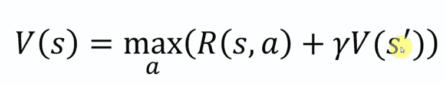

在这个等式的帮助下，我们给迷宫的每个状态分配了一个特定的值，每个值显示了选择那个状态以达到积极奖励状态的重要性。

在上面的迷宫中绿色方框会给我们一个积极的奖励，红色方框提供一个消极的奖励。代理想要到达绿色的盒子并避开红色的盒子。在贝尔曼方程的帮助下，我们首先设置值为 1 的绿盒的更多密盒的值。则第二个框中的值小于第一个框中的值。这表明与第一种状态相比，这种状态对于达到回报状态重要性较小。所以，假设代理 as 处于值 0.66 的状态。现在，代理将倾向于向其值大于其自身状态值的状态移动。因此，在这些值的帮助下，代理将学习移动。因此，所有框的值如下所示。

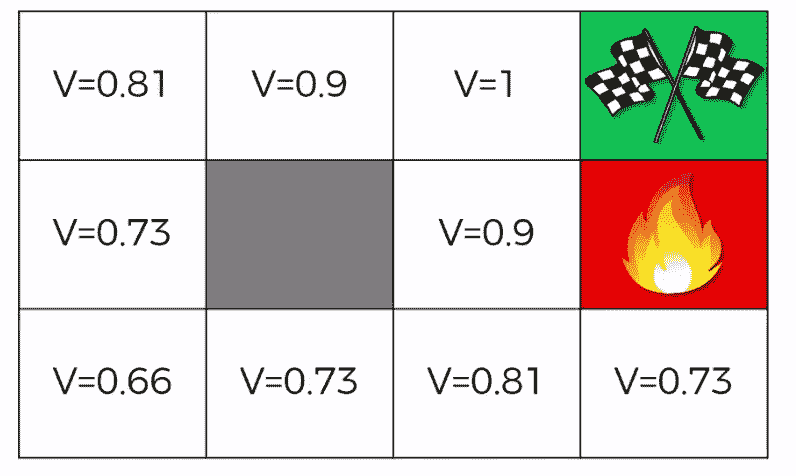

**确定性和非确定性环境**

有两种环境，一种是确定性的，在这种环境中，主体的运动方向是 100%确定的。意思是如果我们说代理向上移动，那么它必须向上移动。同时还有一种非确定性方法，其中涉及到代理动作的一些随机性。例如，如果我让他向上移动，那么有 80%的机会它会向上移动，而 10 %的机会向右移动，10%的机会向左移动。

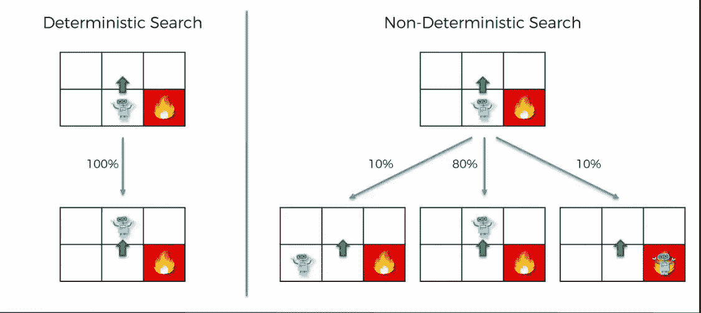

所以，当非确定性环境涉及时，贝尔曼方程就失效了。为了解决这个问题，引入了马尔可夫决策过程。这是贝尔曼方程的最新形式，增加了一个概率因素。在这种方法中，代理的先前状态并不重要，只有当前状态和所有即将到来的状态的概率才重要。所以，我们这样改变了贝尔曼方程:

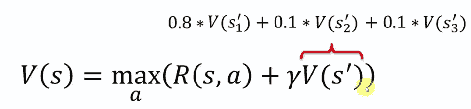

我们用所有可能状态的总和乘以它们的概率来代替下一个状态的值。

所以，下一个等式是这样的:

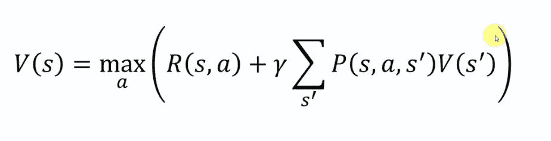

现在，在将这个公式应用到迷宫的每个状态之后，我们得到了这些结果值

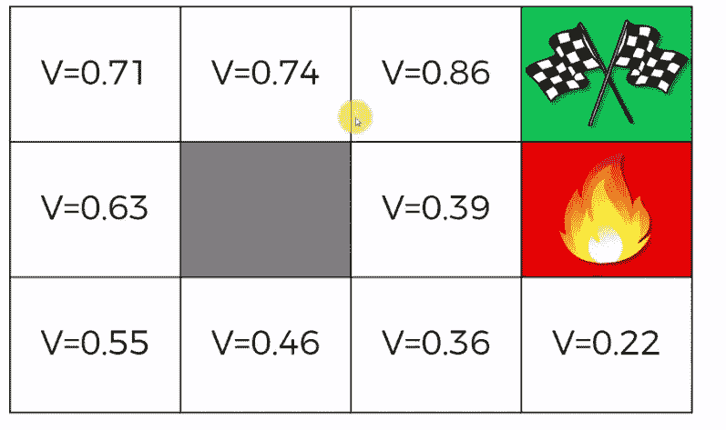

现在，您可以看到这些值与我们通过行李员收到的值之间的差异。现在你可以看到最右下角状态的值比(2，3)状态的值 0.39 小。所以，这件事表明，从状态 0.22，有很大的机会从两个方面得到负回报。

第一状态 V=0.22 = >如果向上移动则死亡(-ve 奖励状态)

其次状态的 V=0.22 = >如果向左移动->那么向上移动->再次向右移动的机会

(-ve 奖励状态)

现在，我想向代理展示等式提供的两条路径。

用**贝尔曼方程(也叫计划)对确定性环境进行**

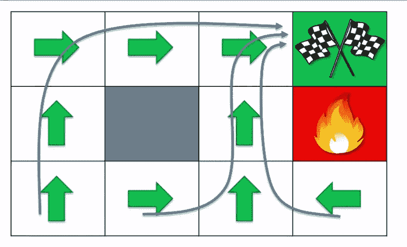

**MDPs 方程(也称为策略)为非确定性方法提供的路径**

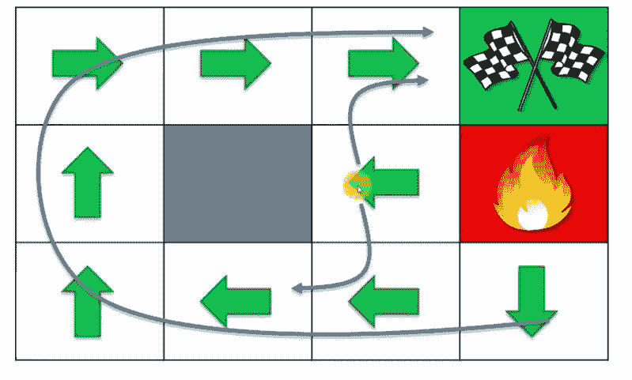

现在，在看到这些结果后，人们可能会感到惊讶，因为这些结果表明，即使在随机情况下，代理人也将学会远离火灾。比如占据右下方的位置。其中代理人将采取 80%的移动来击中向下的墙人，10%的机会向右移动，10%的机会向左移动。因此，0%的机会向上移动。

我们将**强化学习称为 Q-学习**。现在向它靠近。

什么是 **Q 值**？

基本上，q 值显示了每个状态下动作的质量。每个状态有四个 Q 值，这是执行一个动作的量化因素。而每个状态只有一个值。

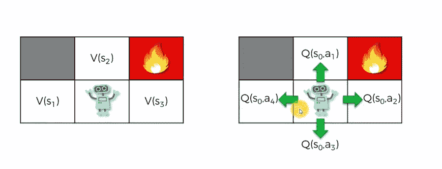

所以 Q 值和状态值之间有关系。其被提供给给定的等式

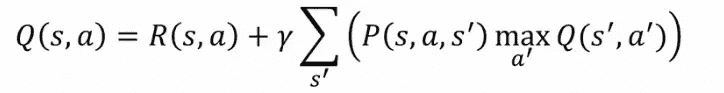

这个公式非常接近态值的公式。基本上，为了找到在特定方向(如向上)移动的 Q 值，首先放入该状态的奖励，并在其中加上乘以所有最大 Q 值与所有相应状态的概率之和的贴现因子。

**时差:**

在时间差的帮助下，代理将能够计算 Q 值和状态值。看看这个等式

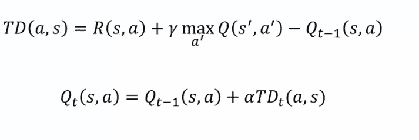

基本上，上述等式显示了由于随机性而出现的先前 q 值和 q 值的差异。因为 Q 值的变化随时间的推移而缓慢发生，所以我们称之为时间差异。

现在第二个方程是时间 t 的 q 值，这里α是代理的学习率。

下面给出由上述两个方程组成的最终方程。

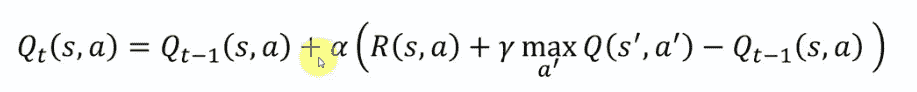

因此，随着时间的推移，时间差值将减小，因此，最终算法将收敛。但是，随着环境的不断变化，政策也会发生变化，了解时间上的差异会有一定的价值。

> (本讲座使用了 udemy 课程《人工智能 A-Z:学习如何构建人工智能》中的材料)