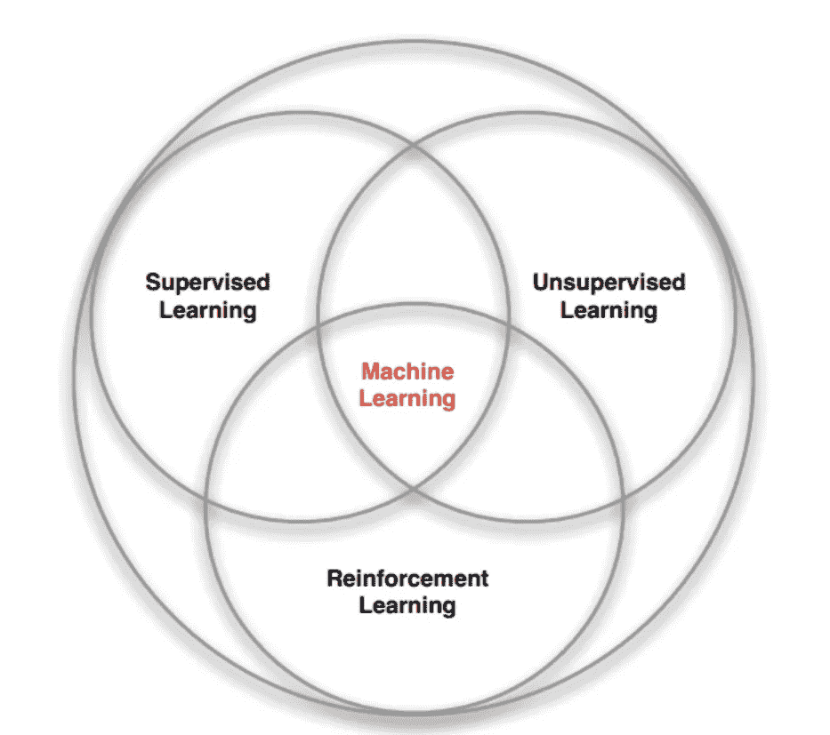

# 强化学习

> 原文：<https://medium.com/analytics-vidhya/reinforcement-learning-9f2b168d178a?source=collection_archive---------27----------------------->

在机器学习中，主要有三个领域。监督学习、非监督学习和强化学习。强化学习为各种计划和控制问题提供了解决方案。政策、环境模式、奖励信号和价值函数是强化学习的主要组成部分。

强化学习可以被认为是人工智能的一部分。它在人工智能系统和解决顺序决策问题中变得显而易见。并且能够在各个领域超过人类水平。强化学习在许多成功和失败中使用不同的动作和实验来与未知的环境互动。这样做是为了增加收到的奖励。

***强化学习与有监督和无监督学习的区别。***

关于机器学习，有三个主要领域:监督学习、非监督学习和强化学习。然而，强化学习不同于那些分支。

在监督学习中，机器从外部监督人给出的标记为的训练**数据中学习。当增加训练样本的数量时，将有助于改进该学习系统的执行过程。意料之外的学习是基于在一组**未标记的**数据中找到隐藏的结构。有时候强化学习看起来并不令人惊讶。然而，强化学习的主要目标是**最大化回报**而不是寻求隐藏结构。**

***让我们简单看一下强化学习系统的主要组件。***

政策、价值函数、奖励信号和模型是强化学习系统的主要组成部分。

**策略**可以是函数、搜索过程或查找表。强化过程的主要目标是确定最有利的政策。**价值函数**是利用价值函数预测的完整的未来报酬。通过使用该值函数来评估状态和动作之间的选择。**奖励信号**显示事件如何变好，以及变坏。奖励信号也陈述了问题的目标，其中代理的目标是增加总奖励。最后，**模型是关于环境的预测是环境模型所允许的。这是强化学习的附加部分。基于模型的方法使用计划和模型。**

**它已被用于许多领域。游戏为强化学习代理提供了最佳环境。**

*****那么让我们简洁地考虑一些强化学习系统的实际例子。*****

**强化学习主要用于为计算机游戏构建人工智能。AlphaGo、ATARI 就是这些电脑游戏的一些例子。也在机器人和工业自动化中使用强化学习。这是可能的强化学习允许系统从它自己的经验中学习它自己。此外，文本摘要引擎、对话代理是使用强化学习的一些实际例子。**