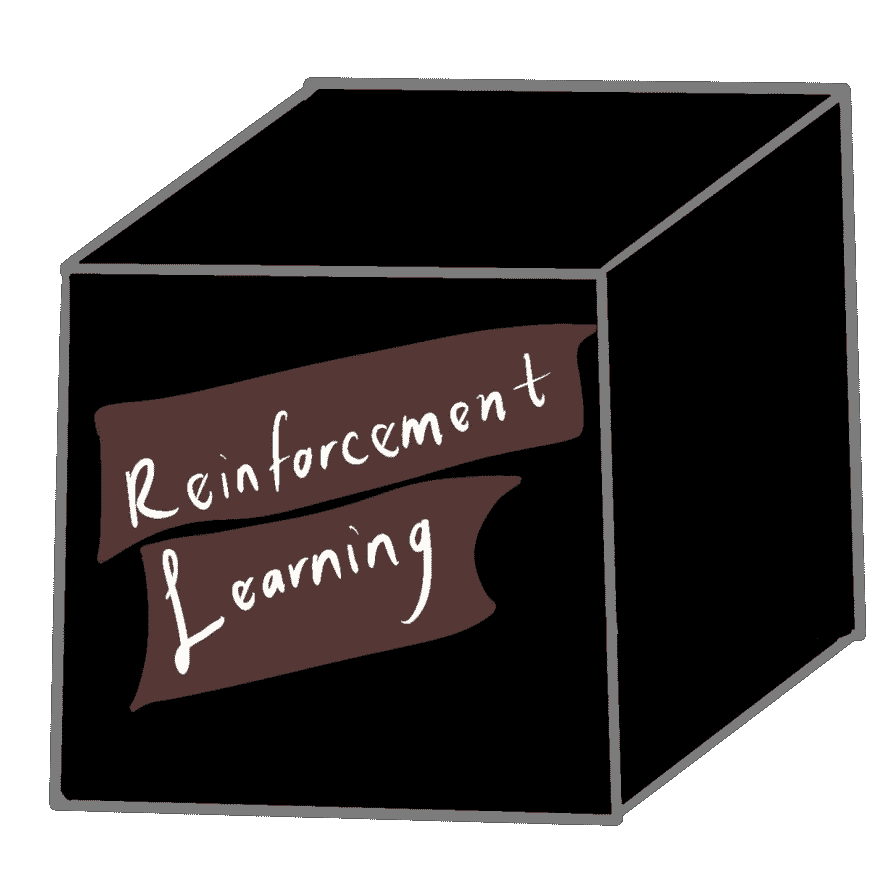

# 强化学习:表层解释

> 原文：<https://medium.com/analytics-vidhya/reinforcement-learning-a-surface-level-explanation-75690f03840d?source=collection_archive---------22----------------------->

在过去的 5 年多时间里，人工智能(AI)已经成为一个巨大的热门词汇，越来越多的人正在了解可以通过两种不同方式训练的人工神经网络，即监督学习和非监督学习。然而，还有一种不属于上述两类中的任何一类，这就是所谓的强化学习。

