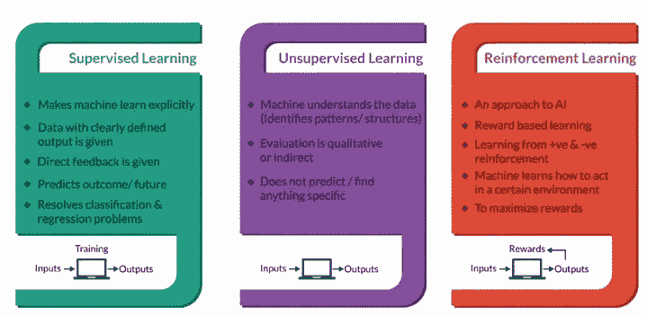
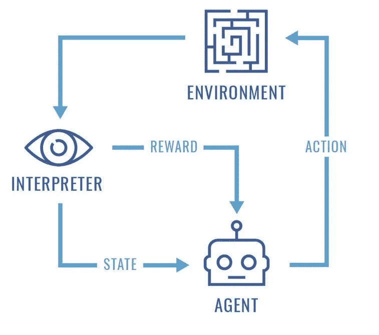
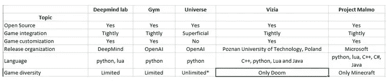
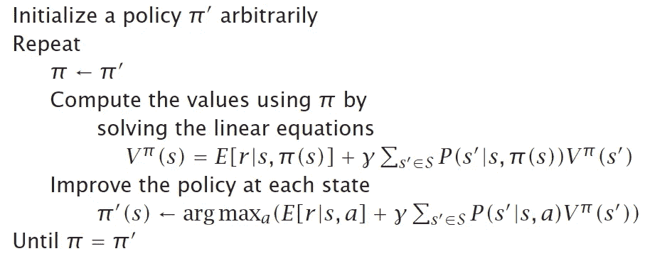
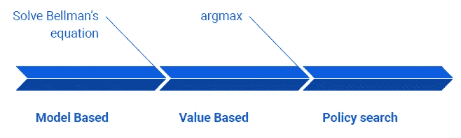
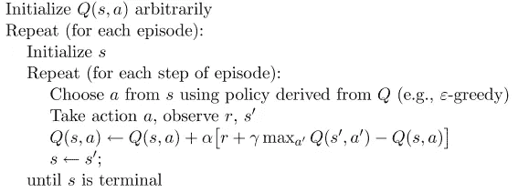

# 强化学习和博弈论——一种直观的理解

> 原文：<https://medium.com/analytics-vidhya/reinforcement-learning-and-game-theory-28208ee795f8?source=collection_archive---------5----------------------->

近年来，机器学习和深度学习技术在语音处理、预测、计算机视觉、机器翻译、预测、机器人等不同领域都有着令人瞩目的表现..各种机器学习概念的本质如下:

机器学习概念一瞥([来源](https://www.analyticsvidhya.com/blog/2016/12/artificial-intelligence-demystified/))

# 1.强化学习

*是什么让 RL 独一无二？*强化学习通过利用定义的参数，帮助机器学习决定等同于或在某些情况下远远超出人类理解的行动。

强化学习(RL)是一种面向目标的学习，在这种学习中，一个主体在一个环境中被训练，通过选择一个最佳的可能动作来达到一个目标。对于每一个行动，可以定义积极或消极的奖励。这些奖励作为注释，我们的模型可以从错误中学习，并在每次迭代中继续改进。

[来源](https://perfectial.com/blog/reinforcement-learning-applications/)

## 1.1 平台

这些平台用于模拟 RL 环境，RL 环境通常是用于训练代理的有限且固定的空间。基于需求，代理在环境中的范围可以是有限的或无限的。但是，环境通常被建模为一个随机的有限机器空间，其中的代理人观察并采取行动，以最大化的回报。

常用的开源 RL 平台对比如下。有关详细信息，请查看[开源 RL 平台概述](https://www.analyticsvidhya.com/blog/2016/12/getting-ready-for-ai-based-gaming-agents-overview-of-open-source-reinforcement-learning-platforms/)。

训练 RL 模型的各种平台的比较([来源](https://www.analyticsvidhya.com/blog/2016/12/getting-ready-for-ai-based-gaming-agents-overview-of-open-source-reinforcement-learning-platforms/))

## 1.2 参数

用于训练 RL 模型的必要参数如下:

代理:单个或多个代理
状态:S
动作:A(S)，A
模型:T(s，A，s') ~ Pr(s'|s，a)
奖励:r(s)，R(s，A)，R(s，A ')
策略:π(s) = a，π*(s)

## 1.3 RL-API

RL 中一些常用的接口如下:

规划器:模型(T，R) —策略
学习器:转换(s，a，R，s’)—策略
建模器:转换—模型
模拟器:模型—转换
基于 RL 的规划器:
模型—模拟器—学习器—策略
基于模型的规划器:
转换—建模器—规划器—策略

# 2.强化学习算法

## 2.1 马尔可夫决策过程

MDP 是一种决策算法，为有限环境空间中的机器提供最佳可能的动作状态，以使其报酬最大化。MDP 通常只考虑现状。如果我们需要考虑过去的行为来采取进一步的行动，我们必须将这些信息与当前状态结合起来。

为了求解 MDP，我们考虑以下两个假设:
●静止世界中的无限视界(注:视界或时间有限的情况也许是可能的。但是，对于本文，我们只考虑了无限)
●序列的效用，即偏好状态(有助于选择最佳策略)

**2.1.1 价值函数**

效用(价值)可以用贝尔曼方程来计算。其中，𝛾是将无限时间戳序列更改为有限值的
折扣因子。
值迭代可以如下进行:
●从任意效用开始
●使用
基于邻居更新效用●重复直到收敛

**2.1.2 策略迭代**

策略迭代的伪代码如下:

[来源](/@m.alzantot/deep-reinforcement-learning-demysitifed-episode-2-policy-iteration-value-iteration-and-q-978f9e89ddaa)

**2.1.3 MDP 方法**

三种常用的 MDP 方法是:
●政策搜索:国家-政策-行动
●基于价值:国家-效用-价值
●基于模型:(s，a)-(过渡，奖励)-(s '，r)

这三种方法可以联系如下:

## 2.2 Q-学习

Q-Learning 是动作-值函数，它被引入来进一步优化代理选择并计算最优效用和最优策略，而不需要学习转移概率或奖励函数。它可以被定义为到达状态的代理人的价值，同时采取行动(a)并在其后以最佳方式进行。

Q 学习的伪码如下(其中，α-学习率):

[来源](http://incompleteideas.net/book/first/ebook/node65.html)

**2 . 2 . 1 ɛ-greedy 勘探**

ɛ-greedy 探索是一种随机选择的方式。它使用贪婪极限无限探索(GLIE)来随时间衰减ɛ。这可以被认为是 RL 中减少次优遗憾的基本权衡。

因此，随着时间的推移，最佳 Q(学习-探索)和π(使用-开发)将被计算出来。像老虎机这样的探索开发问题是理解ɛ-greedy 探索的最好例子。

## 2.3.博弈论

博弈论通常被定义为冲突的数学，并被应用于各种领域，如经济学、心理学、人工智能、社会学等..在博弈论 w.r.t RL 中，策略就是战略，映射出所有可能的行动状态，与游戏中的一个参与者有关。

多智能体 RL (MARL)中的博弈类型有:
●静态博弈:玩家独立且同时决策
●阶段博弈:规则取决于具体阶段
●重复博弈:当一个博弈按顺序进行时

理解博弈论的基本博弈是“两人零和完全信息有限确定性博弈”。通过修改各种参数，如非确定性、隐藏信息、非零和，可以获得更深入的了解。安德鲁摩尔材料有广泛的游戏，提供了对各种博弈论概念的见解。

**纳什均衡**

考虑一个博弈中的 n 个玩家，策略分别为 s1，s2，…sn。当且仅当所有参与人的策略对应于该参与人的最优策略时，这些策略被称为在 NE 中。ne 的 3 个基本定理是:
●在 n 人纯策略博弈中，如果消除严格劣势
策略，除了一个组合之外消除了所有组合，那么它是唯一的 NE。任何 NE 都将在严格劣势策略的淘汰中幸存。
●若 n 是有限的，s(i)是有限的，则至少存在一个 ne。

**2.3.2 国内流离失所者战略**

针锋相对和冷酷触发是处理
重复囚徒困境(重复博弈)的一些著名策略。

TFT 中玩家的行动状态由以下策略决定:
●第一轮合作
●此后复制对手先前的移动

一个玩家在冷酷扳机中的行动状态如下:
●继续与其他玩家合作
●如果任何一个玩家叛逃一次，则继续叛逃直到永远

**2.3.3 最小最大轮廓**

●最小最大值档案通常代表一对收益，每个
玩家一个，代表玩家通过
防御恶意随机对手可以获得的收益。所以，这基本上就像零和游戏一样，每个玩家都试图减少另一个玩家的 T21 奖励。
●最小最大值曲线用于纯策略来寻找收益，在
混合策略的情况下，我们将使用安全级别收益。

**2.3.4 民俗定理**

●民间定理的总体思路是“在重复博弈中，
报复的可能性打开了合作的大门”。
●博弈论中，指特定的结果。它可以被描述为一组
收益，可以从重复博弈的纳什策略中得到。
●我们可以获得可行区域(平均。联合策略的收益)和
可接受区域(优选—最小最大剖面)
●任何严格支配最小最大/安全
水平的可行收益剖面都可以实现为纳什均衡收益，具有足够大的
贴现因子。因为，如果它严格控制了最小最大值剖面，它可以
用它作为威胁。

**2.3.5 子游戏完美**

●如果一个参与者总是选择最佳
反应，一个策略被称为子博弈完美，与历史无关。
●简单来说，子博弈完美避免了不可信的威胁，而
随着时间的推移继续选择最佳行动状态。
● TFT 和 Grim trigger 处于纳什均衡，但不是子博弈
完美。

**2.3.6 巴甫洛夫策略**

巴甫洛夫是另一种 IDP 策略，参与者同意就合作，不同意就有缺陷。巴甫洛夫同时满足纳什均衡和子博弈完美。计算民俗定理可以用来建立类似巴甫洛夫的机器。CFT 还可以在多项式时间内建立任何博弈的子博弈完美纳什均衡。使用 CFT 的一些优势是:
●巴甫洛夫，如果可能的话
●零和游戏(2 人游戏)
●至少一个玩家提高

# 3.致谢:

本文是对 RL 的一个基本概述。目前，我正在编写一个 RL 教程系列，它将让读者简要了解 RL 中的各种参数和技术，以及使用 python 的实际实现。这一系列教程是根据我对佐治亚理工学院的 RL 材料、国立研究大学高等经济学院的实用 RL 以及该领域专家的各种博客(我已经提到了相同内容的链接)的理解而创建的。