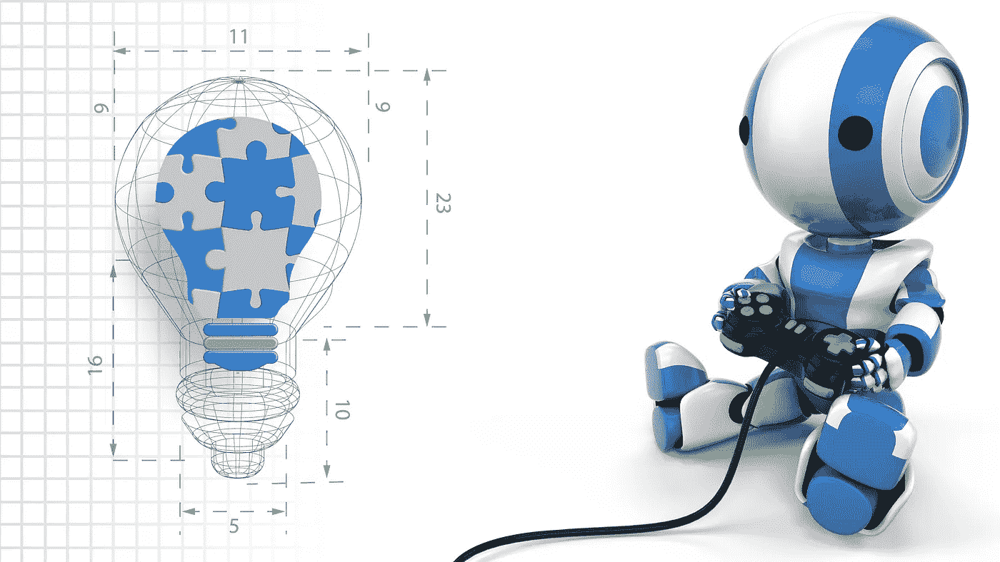
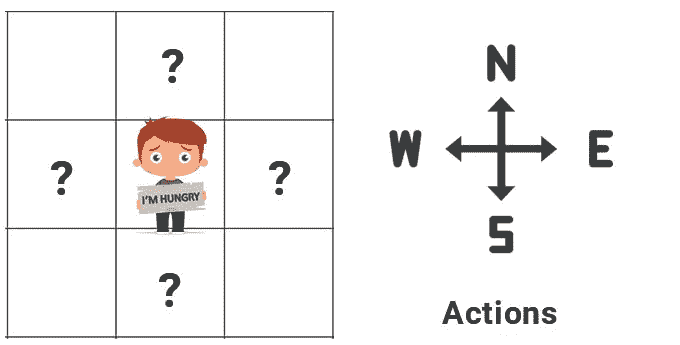
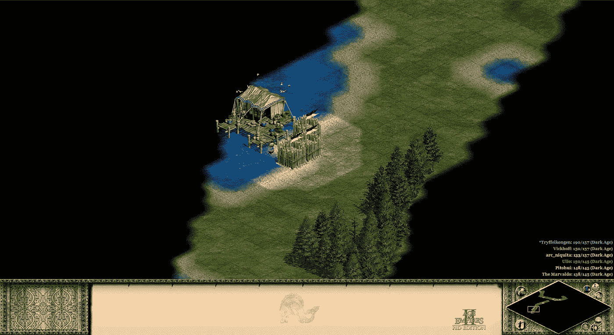
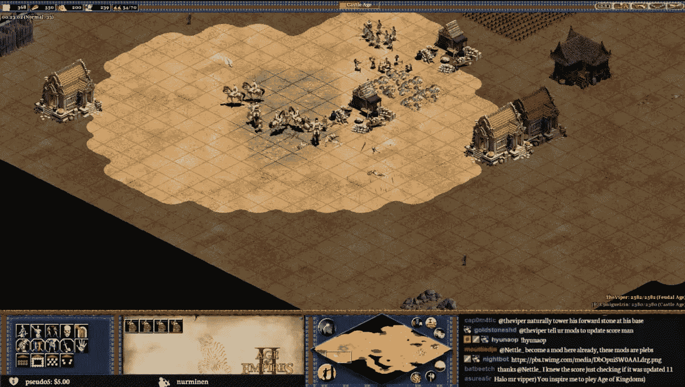
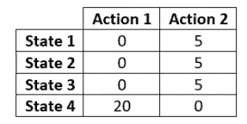
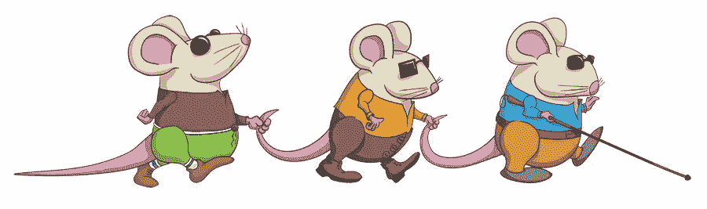
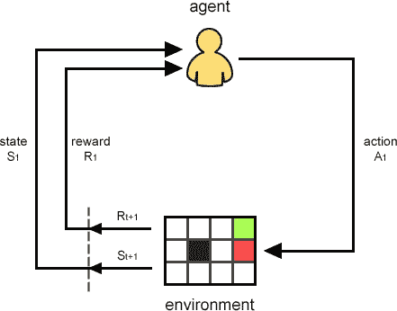
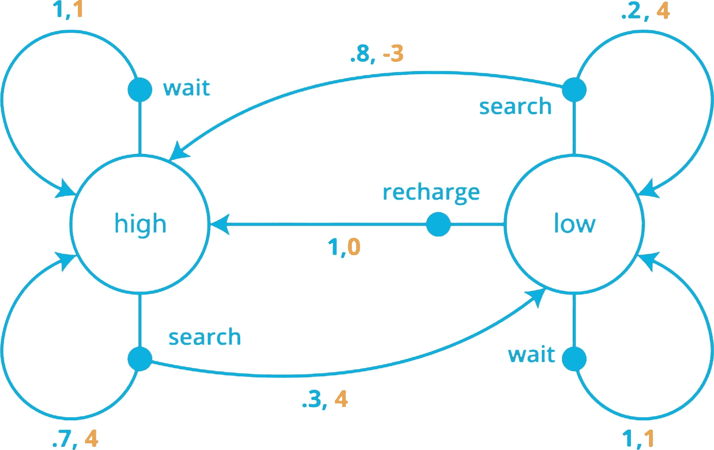
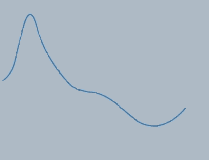
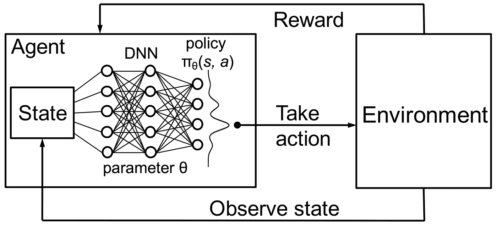

# 强化学习—基本理解

> 原文：<https://medium.com/analytics-vidhya/reinforcement-learning-basic-understanding-4fcb91ba4e4?source=collection_archive---------6----------------------->

## 使用基于价值的方法理解强化学习背后的基本概念



# 介绍

强化学习(RL)是一个机器学习领域，自 2015 年以来备受关注，此前谷歌的 [Deep Mind](https://deepmind.com/) 团队展示了自学成才的 DQN 代理人学习走路、掌握雅达利游戏以及在游戏[围棋](https://deepmind.com/research/case-studies/alphago-the-story-so-far)中击败亲人类选手。

观看 DeepMind 行走代理

DeepMind 学习玩突围

RL 是自学成才的软件代理人背后的科学，他们探索一个以前未知的世界，并最终在那个世界中脱颖而出。令人难以置信的是，你如何将一个代理引入一个充满敌意和完全未知的环境，在那里，代理只知道它可以执行哪些可用的操作，但仅此而已，并通过反复试验发现随着每次连续移动而改进的策略，达到超人的性能。

> 自出生以来，我们不都是探索我们世界的代理人吗？难道婴儿不是在出生时完全无助的代理人，对他们的周围环境一无所知，并通过使用他们的大脑，处理记忆和经验来增加他们在世界上的成功(奖励)，并逐步掌握生活中的特定任务吗？

本文将试图给出一些基本的理解(*省略了数学*)，这样你就可以开始你的强化学习科学之旅，探索这个奇妙的不断发展的科学领域。

# 强化学习的生物学类比


强化学习是基于试错法，通过评估不同的行动，从那些我们已经认为工作良好。

随着时间的推移，在几次尝试产生对主体的状态/动作策略有益的进化变异失败后，我们可能会发现一个对主体在环境中的表现有益的变异。

> 在生物学中，“这种政策变异”被称为“突变”。

地球上的生命是一个活生生的证据，证明了当你有数十亿年的时间与你的基因玩耍时，你可以通过突变实现什么。

大多数突变是有害的(甚至是致命的)，但有时一些突变可能会变成有益的，并导致物种的改进/进化。

正是由于这样的突变；我们的 DNA 形成了新的分支，将我们与先前的祖先物种区分开来。

> 我们基因组中偶尔的“探索”( DNA 突变)是物种进化的基石

*类似地，在 RL 中,“进化类比”是代理对每种情况(状态)采取的行动选择的改进。*

> 我们，连同所有现在和过去的有机体，只不过是第一个有机体的进化变异分支。我们共同的祖先……一个古老的原核细胞。
> 
> 只有 1.5%的基因让我们成为人类！
> 
> 我们与黑猩猩有 98.5%的 DNA 相同，与狗有 3/4 的 DNA 相同，与果蝇有 1/2 的 DNA 相同，与水仙花有 1/3 的 DNA 相同，然而我们在每个方面都是如此不同！

> 如果在生物学中，DNA 突变决定了基因表达的改变，同样地，在 RL 中，Q 表突变决定了行为选择的改变。

# 强化学习—关键术语和概念

假设你在某个外国城市醒来，你离开酒店，没人会说英语，你的手机没电了(所以你不能使用地图)，你很饿。你需要尽快去餐馆！

**环境**:所有城市街区都是一样的(网格世界)。环境就是你将要与之互动的东西。

> **RL 简而言之:**你将从环境的某个随机状态开始*(在我们网格世界中的随机区块)*，对环境的状态执行动作*(走到网格中的某个新区块)*， 环境将以一个新的状态*(你在网格上结束的一个新的块)*和一些奖励来作出响应，这些奖励表明你的动作*(移动到这个新的块)*对于前一个状态*(你决定采取这个特定方向的前一个块)*是多么有益。

**动作**:在这个网格世界中，你可以执行的整套动作(**动作集**)是移动[ *北*、*南*、*东*、*西* ]。最初，你没有理由偏爱任何一种行为。你不知道对于你现有的状态(*你所站的街区*)哪一个动作(*比如向东还是向西*)能让你更接近你的目标(*餐厅*)。



你生活在一个未知的世界。您只能执行可用的操作。是探索的时候了！

所以你不可避免地开始探索。你选择随机行动(**等概率策略)**在城市街区闲逛，直到你在某个餐馆结束。

**终点站状态**:所以逛了几个街区，最后你到了一家餐厅。当你访问这样一个**终端状态**时**剧集**就终止了，你现在可以坐下来评估你如何能改进你的策略(**政策**)，以便在未来的剧集中你能更有效地实现你的目标。

**插曲**:一个插曲，就是你每次从投胎到那个世界的那一刻，到你到达一个终结状态的旅程。你可能需要成千上万集才能真正理解世界动态，这样你才能逐步改进你的策略(政策)，直到你想出最好的一个。

**奖励**:在格子世界中游荡时，每行走一分钟，你获得-1 的负奖励。走正常的路障给了你负 1 的奖励，而拥挤的路障给了你负 3 的奖励，因为要花更长的时间通过它们。到达一家餐馆会给你+10 的正奖励。

你的**累积奖励**将每集所有正面和负面奖励汇总在一起。*消极奖励可以被认为是“惩罚”。*

> 非终点状态下的负回报是必要的，因为如果你最后只得到正回报，你的代理无论在城市中徘徊多久都会得到相同的总回报，所以它永远不会真正学习。

因此，只要我们还没有“到达终点状态”，就通过获得负奖励，我们激励代理人找到最快的出路，从而找到最小化惩罚的方法，以增加整体最终累积奖励。

> 因此，增加累积奖励应该转化为解决强化学习问题！

> 通过这种逻辑，我们假设通过增加总奖励导致 RL 的解，我们称之为“**奖励假设。**”



探索未知的世界

**状态**:每次你移动到一个新的街区，你都在探索环境(世界)允许你看到的东西。大多数时候，对世界的“看法”是相当有限的。通常，你无法知道十个街区后会发生什么，所以状态是环境允许你“看到”的信息，这样你就可以估计你的下一步行动应该是什么。

> 状态可以被认为是你在给定的世界位置对环境的观察。但是状态不仅是关于世界的信息，也是关于你自己的信息(你也是世界的一部分)。
> 
> 例如，如果你正在“学习如何走路”，状态可以是你在世界上的位置，地面信息，海拔等。但是状态也包括你的关节的方向，你的速度，等等。
> 
> **所以状态是你的代理在给定时间的“感官”。**



状态是环境允许你感知的“视图”

**Q-Table** :为了从这些经验中学习，我们需要跟踪一些*日志*关于每个状态的每个行为有多少回报(或没有回报)。

> Q 表可以被视为一个二维矩阵，其中行反映状态，列反映动作。该矩阵中的分数代表每个行动对所有可能状态的目标的积极或消极影响。



一个简单的 Q 表，其中两个可能的动作被分为 4 个可能的状态

因此，下次当您处于相同的状态时，查看该日志可能会有所帮助，它可以作为一个指示器，指示哪些操作似乎最适合该状态。这样，你将建立你的策略( **policy** )，该策略将指示为每个州选择什么样的最佳行动。

此日志包含在牌桌的每个状态下，您之前所有经历的预期总奖励的平均值。

**我们应该从一开始就相信我们的 Q 表吗？** **没有**！最初，你的 Q 表上的分数并不能反映好的选择！这是因为你从**等概率策略**开始(通过采取随机行动并将其表现记录到 Q 表中进行探索)，显然，这些奖励分数还不应该被认为是准确的。

因此，最初我们应该只是通过选择随机行动来探索，并不断用结果填充 Q 表。情节越多，我们就越应该相信我们的 Q 表，逐步降低选择的随机性，并根据我们的状态更频繁地选择 Q 表行动建议(**利用**)。

然而，即使经历了成千上万集，我们仍然应该不时地采取一些随机的行动来继续探索，也许会发现一些可能对特定状态更有益的行动。

通过在每集后逐渐降低对我们状态的探索(但绝不归零)，我们的 q 表将逐步调整，让我们提出一个**最优策略(π*)** ，在最短的可能时间内将我们带到餐馆。

这就是**ε-贪婪政策**。因此，epsilon-greedy-policy 表示，在大多数情况下，我们将遵循我们的 q-table 建议，为每个州选择最高评级的行动，但总是允许有一小部分机会选择随机行动。在我们选择了这样一个随机的选择(而不是 q 表建议)之后，我们应该严格遵循所有剩余步骤的政策，以检查这种“偏离政策”是否有益。

然后，我们在我们的 Q 表中记录由于这个随机状态/动作对的“迂回”而导致的改善或恶化，并继续进行可能…几千次！那么 Q-Table 将保存关于每个状态下每个动作做得有多好的更精确的分数！

****贪婪策略*** *总是盲目地遵循 q 表的指示，而****ε贪婪策略*** *大多遵循 q 表，但允许不时地进行一些“随机选择”，以观察它如何影响代理的得分。**

> *这意味着**贪婪策略**(跟随 q 表而不探索)不是有益的，因为我们永远不会进一步探索(因此停止学习)，而**ε贪婪策略**将在大部分时间跟随我们的策略，但偶尔会选择随机行动来检查它是否有利于我们的代理实现其目标。*

**

*“贪婪政策”就像盲人摸象——你需要“ε贪婪政策”来允许一些探索！*

> *ε贪婪策略不会盲目引导代理(像贪婪策略一样)。*

> *ε-Greedy-Policy 允许在原始策略的基础上进行随机发现，引入增加累积奖励的新策略，并最终导致最优策略(π*)。*

# *状态+行动→奖励+下一个状态(SARS)*

**不要惊慌，这个 SARS 事件是我们一直在关注的，它更多的是一个回顾而不是一些新概念！**

*正如我们到目前为止所看到的，环境提供给我们的投射，(*包括我们的力学——就像我们的关节或速度*)是我们感觉到的**状态**。*

*对于每个状态，我们说有一组可用的**动作**。*

*通过在给定的状态下执行一些动作，我们前进到下一个状态，同时我们得到一些积极或消极的奖励，因此我们可以评估我们的动作在前一个状态下是否有益。*

*这是代理在环境中前进的“循环”,直到它达到终止状态。*

1.  *S1+A1 →R1+S2*
2.  *S2+A2 →R2+S3*
3.  *S3+A3 →R3+S4*
4.  *…一直到 St(终端状态)*

*每一集所有奖励(R1+R2+R3…+Rt)的总和就是那一集的**累积奖励**，我们希望它越高越好。*

**

*基于当前状态，代理执行“动作”——环境返回“下一状态”和“回报”*

> ***状态/行动/奖励**:所以如果我们学习走路，我们的左脚在前面(这是我们的状态)，我们的行动也是将右脚向前移动(我们的行动)，那么我们最终会摔倒(我们的新状态)，我们会得到一个负面的奖励，以便理解我们将双脚向前移动的行为会对我们学习如何走路的努力产生负面影响。*
> 
> *因此，对于给定状态(其中左脚在前面)这个经历**即使是负面的，也提供了一些有价值的(不要做)信息。***
> 
> *因此，让我们在 Q 表中写下这一状态/动作对的最差分数！*

# *间断的还是连续的？*

*到目前为止，我们看到的是一个**阶段性任务**。这样的任务有一个明确的结束状态(在我们的例子中，结束状态是到达一家餐馆——相当于走出一个迷宫)。*

*最终状态(结束状态)可能并不总是意味着好的事情(比如达到我们的目标)。在自动驾驶汽车的类比中，我们可以通过到达目的地(正最终状态奖励)或崩溃(负最终状态奖励)来终止我们的模拟。在一盘棋中，我们可以以赢或输等方式结束。*

*然而，有些任务可能没有终点，但会永远继续下去。这些被称为**连续任务**。*

# *贴现率γ*

*现在，我们说，当我们填充 Q 表时，我们在表中的每个状态/行动单元写下，如果我们采取特定行动，然后从那时起坚持我们的政策，我们在该状态下的估计总回报是多少。*

*这个“总估计回报”是通过考虑所有(预期的)未来移动回报(在过去的生活中，在那个状态下采取相同的行动并记录所有回报直到某个终端状态后，我们已经总结出的*的平均值)来计算的。**

*但是，我们现在做的一个动作对于 500 个状态/动作来说应该是决定性的吗？*

> **折现率γ的存在是为了让更近的奖励比更远的(未来)奖励对我们的即时反应更有意义。**
> 
> *在决定采取行动时，将你的注意力主要放在眼前结果的重要性上，而不是放在长远的结果上，这是很有意义的。*
> 
> ***例子**:如果你学习如何走路，更重要的是尽最大努力采取行动，这样你现在就不会摔倒，而不是考虑到 50 米外的路会很滑而采取不同的行动。是的，因为你知道在不久的将来道路会很滑，你的政策应该包括“减速”，但现在最重要的是你要避开人行道上的裂缝，这样你才能保持平衡，不会马上摔倒。*

> *所以贴现率γ使得我们对未来看得越多，未来的回报就越不重要(所以我们把大部分注意力放在当前的情况上)*

*然而，一些简单的偶发任务，如到达餐馆，不需要应用贴现率γ。*

***那么这个折现率γ到底适用于哪里呢？***

*贴现率γ(γ)是一个你总是应用于连续任务的东西，但不一定应用于间断任务。*

*众所周知，通过 q 表，我们记录了每个状态下所有行为的预期总回报。*

*这意味着，对于大多数偶发任务来说，只需平均该状态/行动的总回报，并将其记录到我们的 q 表中。但是要记录从那个状态开始的总报酬，一直到结束，这就自动暗示我们已经到达了某个最终状态 St，否则就没有定义的“总报酬”。*

*但是在连续的任务(永远不会结束的任务)中，如果未来是无限的，我们就不能保持这样的日志(因此，如果没有“结束”，就没有“总回报”)。现在贴现率γ将被用作*衰减因子*，通过它我们考虑越来越少的未来预期回报，直到它们消失。我们利用这一点来“看到”未来的某个时刻，并能够处理连续的任务，而不是看到一个无限的未来，从而从一开始就无限地冻结我们的代理。*

> *正如我们所说，在情节任务中使用折现率γ是可能的，但很多时候我们可以不使用它，特别是对于不涉及许多重合状态的简单任务。*

# *马尔可夫决策过程(MDP)*

*这些状态、行动、奖励、它们的机制(被称为**【一步动力学】**)连同贴现率(γ)一起定义了一个[**【MDP】**](https://en.wikipedia.org/wiki/Markov_decision_process)**【马尔可夫决策过程】。***

*仅向代理提供可用动作的集合和折扣率γ。所有剩下的 MDP 部分都由代理商通过探索来发现。因此，一个好的 q 表创建将提供一个好的估计，让代理更接近于理解潜在的(未知的)MDP 是什么。*

> *一个**有限 MDP** 是有限状态自动机(或[有限状态机](https://en.wikipedia.org/wiki/Finite-state_machine))的概率(随机)等价物——如果你来自计算机科学领域的话。*

**

*回收机器人的 MDP 图(*来源:Udacity)*

*在上面的例子中，我们看到了回收机器人的 **MDP 图**。这里给出了两种可能的电池状态[高、低]。我们还被赋予了一组动作(搜索、等待、充电)。在这个“随机”模型中，我们还可以看到一个行为在什么情况下比另一个行为更受青睐，以及有什么样的回报。*

*例如，通过上面的 MDP 图，在高状态下，我们看到搜索有 70% (.7)的机会将电池保持在相同的高状态，并提供 4 的奖励，而它有 30% (.3)的机会将机器人的电池状态改为低，奖励为 4。*

> ****关于 MDP****的一个非常重要的观察是，你对一个状态的现有动作选择并不依赖于先前的动作/状态！**

*看上面的 MDP！为您的状态“高”选择操作“搜索”，不受任何先前状态/操作的影响！它只取决于单步动态，给你一个机会，你会选择这个行动，而不是其他的！*

# *深度强化学习(DRL)*

*就这些吗？肯定不是！我们仅仅触及了强化学习的一些基本概念(*有意回避数学*)。在我们开始谈论深度强化学习之前，还有很多东西要看(*包括数学*)。*

*然而，**许多人应该想知道神经网络在 RL** 中的位置。我的意思是，我们可以用状态/动作日志填充 q 表，并使用它来根据我们现有的状态选择动作！那么，为什么要首先通过神经网络来增加额外的复杂性呢？*

*嗯，通常任务要复杂得多。这将意味着一个不切实际的大 q 表，或者我们的问题根本不能用一个经典的 q 表来表达！*

*想象你打网球。球不能只来到你的右边或左边，所以它不能用简单的[左，右]状态来表示！它可以出现在你左右之间的任何地方，从上到下。这意味着我们处理可以是任何浮点值的实数(实数有无限的小数空间)来表示每个状态，将此转换为“无限值 q 表”(*，它根本无法定义*)。所以在连续的空间里，事物会分崩离析！*

*一个解决办法是**离散化**我们连续的空间世界，并创建虚拟的正方形，以便将这个问题转化为可以用 q 表处理的网格世界问题。*

**

*离散化:将连续数据转换成网格数据，这样我们就可以通过 q 表来处理问题*

*然而，这并不总是可行的，正如我们之前提到的，即使我们执行离散化，这也可能产生不切实际的大 q 表，其需要同样不切实际的大量情节，以便有效地填充每个动作/状态对的日志条目。*

*因此，在这里我们可以使用**函数逼近**来处理这样的问题，它可以将状态对应到动作。*

***深度神经网络**定义为**通用函数逼近器**。*

*为了看到大图(*如果你来自深度学习背景*)——借助神经网络(NN)——在图像分类问题中，我们将**像素转化为标签**。*

*嗯，在强化学习的情况下，想法是把**状态变成**动作。*

```
***In image classification problems...** 
Pixels -> [NN] -> Probabilities over Labels**In regression problems like stock exchange prediction**
data -> [NN] -> Prediction of tomorrow's stock value**In reinforcement learning...** 
Environment's State -> [NN] -> Action Values*
```

*所以主要的想法是创建一个在无限实值状态集上近似 q 表的东西，而不是一个离散的状态集。*

**

*在神经网络中，我们有:“输入=状态”和“输出=动作”*

*因为我们的神经网络权重(θ)是随机初始化的，所以它们可以被认为是等概率策略的一个实例。我们的政策反映了这种θ权重配置，所以我们将它称为π(θ)。因此，通过将θ权重改变为某个新的配置θ`,新策略将被称为π(θ` ),以此类推。*

> *在深度学习中，**分类**回答“是什么东西”，而**回归**回答“多少”是什么东西。*
> 
> *我们还说在我们的神经网络中“状态”进去(输入)，动作出来(输出)。*

*我们可以将 DQN 视为一个**回归模型**，它将一个状态作为输入，并尝试为每个可能的动作输出近似奖励分数(很像经典的 q 表)。*这就是为什么很有可能使用误差函数，例如我们在回归网络中常用的* ***MSE(均方误差)****——如果你使用过 NN，你就会知道我在说什么。**

*但是，即使我们使用回归技术来训练这个神经网络，**因为输出表示离散的动作得分**，并且我们喜欢具有最高得分的动作，**结果最终分类为**。(很像从给定状态的 q 表中选择得分最高的动作)。*

**所有这些澄清的原因是，人们有时想知道为什么处理这样的分类问题要使用 MSE 函数。* ***现在你知道你并没有真正分类*** *，你只是把两步合二为一。获取一个状态的 q 表动作值，并选择最上面的动作(顺便说一句，不要忘记，有时您必须随机选择而不是最上面的动作来选择探索)。**

> *重要的是要注意，当我们有一组离散的可能动作，并且我们根据最高动作得分来估计我们对单个动作比对其他动作的偏好程度时，就应用了所描述的对最受欢迎的动作进行评分的 NN 方法(因此我们针对每个状态的动作模拟类似于 q 表的得分)。*
> 
> *因此，如果我们可以向北、向南、向东或向西移动，我们可能会有一个大小为 4 的 softmax 输出图层，我们可以看到 4 个可能的操作中哪一个得到最高分。*
> 
> *然而，如果我们的输出动作应该包括多个变化(例如，将 10 个机器人关节同时移动 10 个不同的幅度作为单个动作响应)，我们就不再处理动作概率，因此我们的输出层可以由 10 个双曲正切函数(例如)组成，为 10 个可用关节中的每一个提供变化幅度。*

## *简而言之，DRL…*

*在深度强化学习中，你用神经网络来表示 Q 表。你试图通过改变神经网络的权重(梯度下降)来保持你对行动如何影响你的状态的世界的估计。*

*因此，通过函数逼近，我们试图预测一个给定状态的最佳拟合动作的概率，从而模拟一个 q 表。*

> *传统的离线分类训练(向您提供训练数据集)与在线训练的最大区别在于，在线训练是由您在探索的每一步中构建数据集，因为它会生成由数据集评估的结果。数据集的这种过渡创建会对神经网络造成明显的问题，并且可以用各种技术来处理。*

# *基于价值与基于策略的方法*

*正如本文的副标题所述，本文提供了一种基于价值的方法。*

*是的，到目前为止，我们一直在研究这种基于价值的方法，通过使用 q 表(直接或通过深度学习估计)来估计最优策略(π*)。*

*通过使用基于策略的方法直接改变神经网络的权重，并研究预期回报如何提高，也可以在没有状态/值函数的一些 q 表参考的情况下搜索这样的策略。*

*然后用**渐变上升**(对，上升，不是错别字！)，通过将神经网络权重调整到直接似乎产生更好的估计总体回报的政策，是另一种方法。*

*当然，基于策略的方法应该有自己的一篇文章，所以我们在这里不再深入探讨。*

*请记住，到目前为止，我们所看到的是理解基于价值的方法的非常早期的方法，它利用了 q 表。*

*如果它只是烤你的面条，要知道一些疯狂的科学将基于价值和基于政策的方法结合成所谓的**演员-评论家-方法**。*