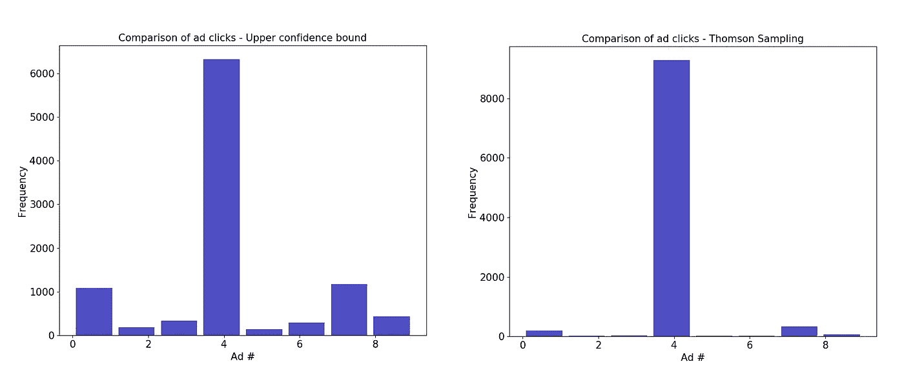
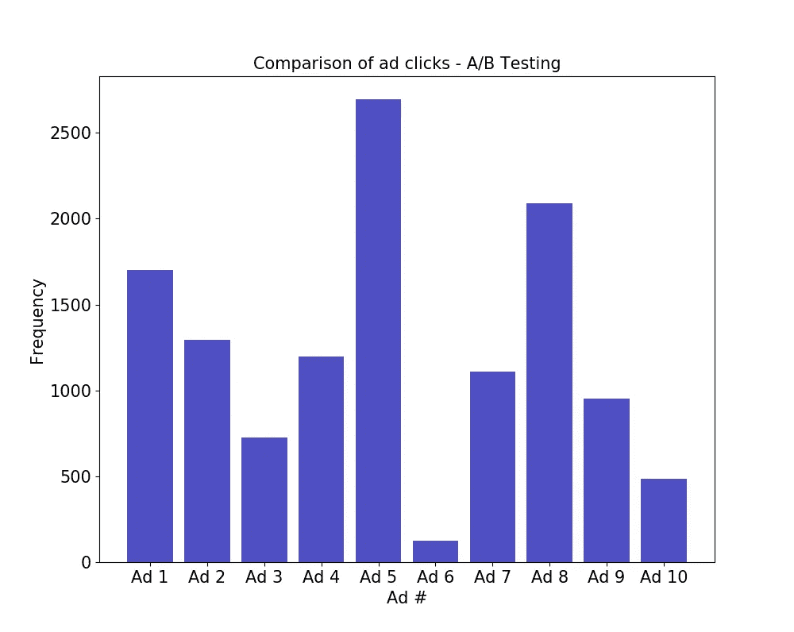

# 强化学习——初学者

> 原文：<https://medium.com/analytics-vidhya/reinforcement-learning-beginners-8b8ce043b408?source=collection_archive---------16----------------------->

高点击率优化了点击付费成本和流量

# **在没有任何数据的情况下开始的模型**

你可能认为所有的机器学习模型都可以分为有监督的、半监督的或者无监督的。然而，这是不正确的，有些算法不属于上述任何类型。其中之一就是强化学习模型。

使用奖励和惩罚作为输入来训练强化学习算法，以最大化企业的总收益。*从错误中学习*是捕捉这种算法本质的完美短语。

在这个项目中，我们将了解强化学习中两种常用的算法——置信上限(UCB)和汤姆逊抽样。

# 强化学习的应用

强化学习在数字营销中广泛使用，以增加网页流量和/或在线销售产品。常见的用例包括在用户账户上创建推荐，优化广告显示以最大化 CTR(点击率)，预测客户行为以及为广告选择最佳内容。

# **问题陈述**

在我们的问题中，一家销售电动汽车的虚构汽车公司 Vesla 希望向浏览其网站的用户显示广告。该公司数字营销团队的经理已经从内容团队收到了 10 幅新推出汽车 Fybertruck 的出色广告图像。她不知道应该在网站上使用哪个广告图像。由于为结账页面带来更多流量的压力很大，她更喜欢使用强化学习而不是 A/B 测试。

# **数据集**

数据集是从 Kaggle 下载的(数据集名称—[*Ads _ CTR _ optimization*](https://www.kaggle.com/akram24/ads-ctr-optimisation))。这 10，000 个数据点中的每一个都有用户点击不同广告的信息(总共 10 个广告)。例如，数据集中的用户 1 点击了广告# 1、#5 和#9。

# **置信上限**

UCB 是一种确定性算法。我们首先假设所有 10 个广告在开始时产生了相同的收益(在这种情况下是点击数)。最初的几轮是实验性的。我们向用户随机展示 10 个广告中的任何一个，并开始收集那些产生点击的广告的信息。例如，如果用户点击广告#5 和广告#7，这两个广告被奖励，因此他们有更好的信心(更高的信心意味着下次显示广告#5 或广告#7 时有更好的机会产生点击)。如果下一个用户下次没有点击这些广告中的一个，则广告#5 和广告#7 的可信度下降。这样，我们基于最大回报方法继续迭代 10，000 次。

# **汤姆逊采样**

汤姆森采样是一种概率算法。每个广告都有其奖励分配(点击数)。在这个算法中，我们尝试猜测广告的报酬分布，然后尝试最大化总报酬。我们首先假设广告的某种类型的分布，然后在分布上随机抽取一个点。接下来，我们检查广告是否有回报，然后调整广告的总回报，反过来，我们在每次迭代中调整广告的分布。经过 10，000 次迭代后，大数定律开始发挥作用，总回报收敛于广告的预期回报。

# **代码背后的直觉**

该代码应被视为地面真实信息。我们在 10，000 次迭代中随机展示 10 个广告，然后与真实情况进行匹配。一万次迭代后奖励最高的广告就是最好的。因此，我们不需要等到 10，000 个用户在网站上互动后才找到最好的，我们可以随时产生点击。

# **结果**

以下是从用于该问题的两种算法中获得的结果:

UCB 和汤姆森抽样的结果

A/B 测试结果:(这是通过在 10，000 次迭代之后取点击的总和来完成的):

A/B 测试的结果

汤姆森抽样似乎是提高用户参与度的最佳方法。A/B 测试好像挺贵的。

广告#4 显示 Fybertruck 为结账网页带来了最高的流量。

人们发现，汤姆逊抽样提供了更多的经验证据。虽然结果需要在每一轮 UCB 后更新，但汤姆逊采样可以批量运行，因此在计算效率上得到了额外的分数。

# **代码**

 [## chandravenky/机器学习-Python-预测

### 此时您不能执行该操作。您已使用另一个标签页或窗口登录。您已在另一个选项卡中注销，或者…

github.com](https://github.com/chandravenky/Machine-Learning---Python-Predictive/tree/master/12%20Reinforcement%20Learning) 

# **参考文献**

机器学习 A-Z —超级数据科学