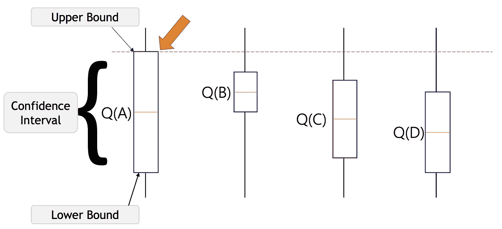
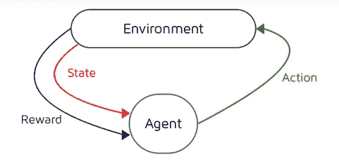
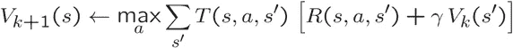
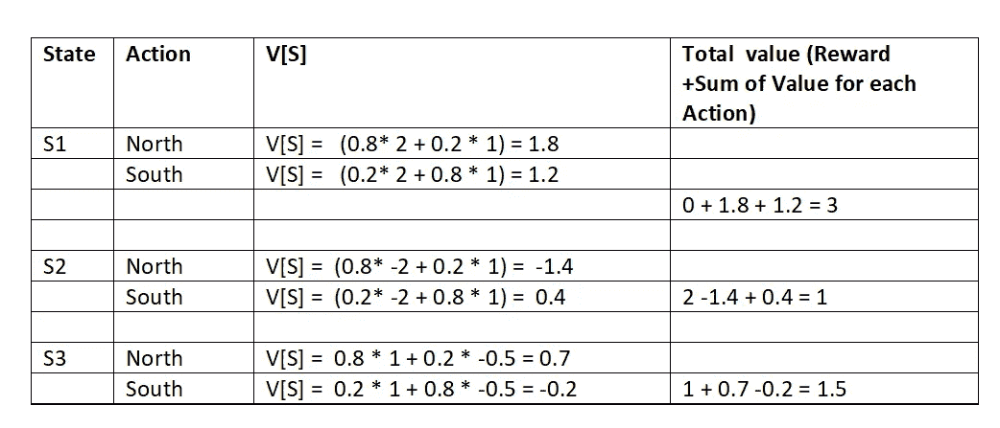
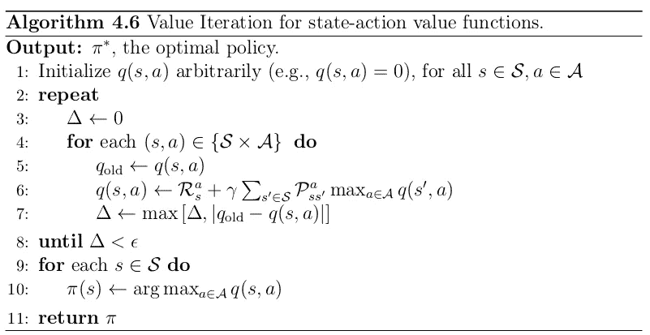
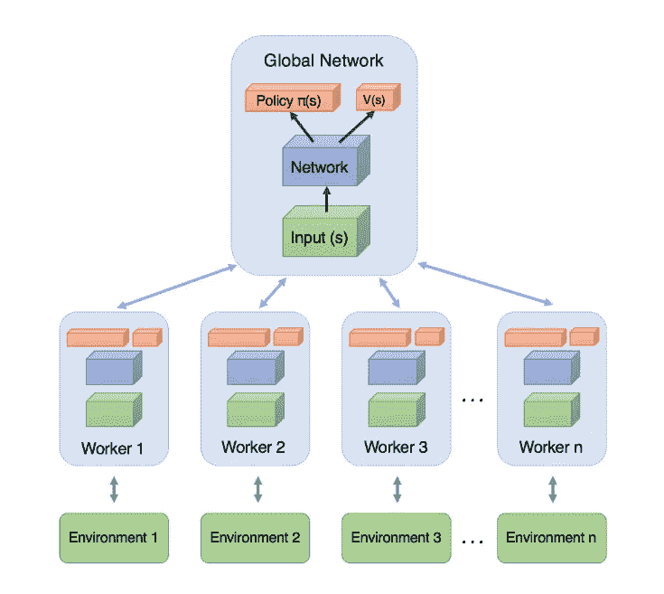

# 强化学习——初学者方法第二章

> 原文：<https://medium.com/analytics-vidhya/reinforcement-learning-beginners-approach-chapter-ii-a72e415c57ca?source=collection_archive---------15----------------------->

朱丽安·利贝曼在 [Unsplash](https://unsplash.com?utm_source=medium&utm_medium=referral) 上的照片

*你好，*

在最后一章中，我们讨论了强化学习及其应用。快速回顾-

*强化学习(Reinforcement learning)是机器学习方法的一个子集，其中代理在下一个时间步接收延迟奖励，以评估其之前的行为。常用于 Atari 和 Mario 之类的游戏。在最近的研究中，强化学习嵌入了神经网络来解决复杂的任务。*

*简而言之，强化学习就是将情境映射到行动。任何强化学习算法的主要目标都是最大化数字奖励信号。学习者寻找哪种行为会产生最大的回报，而不是采取哪种行为。*

> 如果你不熟悉强化学习的基础知识，我强烈建议读者跳过 [**强化学习—初学者方法第一章**](/analytics-vidhya/reinforcement-learning-beginners-approach-chapter-i-689f999cf572?source=your_stories_page---------------------------) 。

*在这一章中，我们的主要焦点将是用无模型和基于模型的学习来打破强化学习算法。*

> **路线图-**

*   ***与其他 ML 算法的比较***
*   ***多臂土匪-框架简介***
*   ***马氏决策过程***
*   ***策略优化或策略迭代方法***
*   ***异步优势优评(A3C)***
*   ***参考文献***

> **与其他机器学习算法的比较**

[来源](https://www.google.com/url?sa=i&url=https%3A%2F%2Ftowardsdatascience.com%2Freinforcement-learning-101-e24b50e1d292&psig=AOvVaw27IH7CMuGvgww7ifA4lVQb&ust=1592214345626000&source=images&cd=vfe&ved=0CAIQjRxqFwoTCLD2u-uCgeoCFQAAAAAdAAAAABAJ)

强化学习是机器学习技术的一个子集，它迫使代理在一个环境中使用来自行动者的动作和经验的反馈来学习。

**有监督学习-**

强化学习和监督学习使用映射进行输入和输出，在监督学习的情况下需要正确的*动作来执行任务* ***，但是在强化学习中使用奖励和惩罚进行正反馈和负反馈。***

此外，在监督学习中，我们有一个完全了解环境的监督者，他将与代理共享环境知识以完成任务。但是，当我们有多个子任务组合，代理可以执行这些子任务来实现目标时，问题就变得复杂了。

**无监督学习-**

虽然监督学习和强化学习都使用输入和输出之间的映射，但与监督学习不同，监督学习中提供给代理的反馈是执行任务的正确动作集，强化学习使用奖励和惩罚作为积极和消极行为的信号。 ***无监督学习* *分析是根据未标记的数据进行的，我们发现数据点之间的相互联系，并通过相似性或差异来构建它们。然而，强化学习引入了获得长期回报的最佳行动模式。***

**用深度学习-**

RL 与深度学习算法紧密结合，因为大多数 RL 使用深度学习模型。智能体训练的核心方法是神经网络。虽然神经网络最适合识别图像、声音和文本中的复杂模式。

> **多臂土匪-框架介绍**

根据维基百科-

> “在[概率论](https://en.wikipedia.org/wiki/Probability_theory)中，**多武装土匪问题**(有时称为 ***K* 或*N*-武装土匪问题**)是一个问题，其中必须在竞争(备选)选择之间以最大化其期望收益的方式分配一组固定的有限资源，当每个选择的属性在分配时只是部分已知，并且可以通过向选择分配资源而变得更好理解久而久之。”

多臂强盗是一种强化学习问题陈述，其中我们有由 n 个臂组成的吃角子老虎机，或者具有臂的强盗有其自己的成功概率分布。如果我们拉任何人的手臂，那么结果将是失败的随机奖励 R =0，成功的随机奖励 R =+1。这里的主要目的是以这样的顺序拉臂，使我们的总回报最大化。

解决多臂强盗问题的某些方法-

*   *没有探索:最幼稚的方法，也是最糟糕的方法。*
*   *随意探索*
*   *聪明地探索，偏好不确定性*

***置信上限是著名的多臂土匪问题解决方案之一。该算法将乐观原则与不确定性联系在一起。概括地说，如果我们对武器的选择没有把握，那就让我们把精力更多地放在它的探索上。***

[来源](https://www.geeksforgeeks.org/upper-confidence-bound-algorithm-in-reinforcement-learning/)

例如，我们有这四种行为，它们在某种程度上与不确定性有关。代理似乎不知道它的行动，所以用 UCB 算法，它会选择有机会更高上限的行动，这样他就可以获得更高的行动奖励，而且他可以了解这些行动。

置信上限具有减少不确定性的能力，但是随着时间的推移会有探索的滞后。UCB 平均比其他算法如ε-贪婪算法、乐观初始值算法等获得更大的回报。

> **马尔可夫决策过程**

根据维基百科-

> “在数学中，马尔可夫决策过程是离散时间随机控制过程。它提供了一个数学框架，用于在结果部分随机、部分受决策者控制的情况下模拟决策”

简单来说， ***马尔科夫的决策过程当前状态已经被观察，以便由一个智能体*** 来决定最佳行动。在了解 MDP 之前，让我们先了解几个术语

*   ***马氏性*** *由下面的数学等式所陈述——*

*状态****S****t 具有* *马氏性，当且仅当；*

> ***P*****S***t+1**|***S****=****P*****S***t+1****|***..， ***S*** *t* ，*

*马尔可夫性质的结论是，如果当前状态是已知的，并且我们没有关于该状态的任何历史信息，那么该状态足以提供未来的相同特征，就好像我们有所有的历史一样。*

*   ***马尔可夫过程***

**

*   *马尔可夫链或过程基本上是一个元组绑定状态 S 和转移函数 P (S，P)。整个系统可以由这两个分量 S 和 P 来定义，然而我们可以称之为具有马尔可夫性质的随机状态序列 ***。****
*   *举个**的例子**，如果你为一个婴儿的行为建立一个**马尔可夫链模型**，你可能会包括“玩”、“吃”、“睡觉”和“哭”等状态，这些状态和其他行为一起可以形成一个“状态空间”:一个所有可能状态的列表。此外，在状态空间的顶部，马尔可夫链告诉你从一个状态跳跃或“过渡”到任何其他状态的概率，例如，一个正在玩耍的婴儿在接下来的五分钟内不哭着入睡的可能性。*
*   *使用转移矩阵来匹配转移概率的马尔可夫链模型。 ***矩阵由具有状态空间行和列组成，且单元具有它们各自从一种状态转移到另一种状态的概率。****

*然而，MDP 是一个预测结果的模型。只有当信息由当前状态提供时，它才试图预测结果。决策者必须选择当前状态下可用的动作，导致模型进入下一步并向决策者提供奖励。*

*在每个时间戳处，代理的工作是执行可以改变环境状态的动作，并且代理从环境接收奖励或惩罚。 ***智能体的目标是发现最优策略，即在每种状态下需要采取的一组可能的行动，以最大化从环境中获得的回报的总价值。*** 此外，MDP 还用来把代理和环境配置成一种正式的方式。*

*当受控系统的完美模型可用时，***MDP 问题可以用动态规划(DP)技术来解决。当受控系统模型未知时，可应用时域差分(TD)技术求解 MDP*** 。考虑了用于解决 MDP 问题的三种算法:分别用于有限和无限状态空间的 Q 学习(QL)和模糊 Q 学习(FQL)算法。*

> ***策略优化或策略迭代方法***

*在跳到策略迭代之前，让我们先了解一下价值迭代的基础*

***值迭代**无非是学习所有状态的值，然后根据梯度行动。贝尔曼更新用于描述从价值迭代中获得的所有价值。在一些非限制性条件下，贝尔曼更新保证收敛到最优值。*

**

**一直在想跳过这一章后面的数学！！！**

*据观察，学习一个值可能需要无限长的时间。所以学习政策应该是最好的方法，而不是学习价值。*

***策略迭代**基本上是增量查看当前值并提取策略。由于作用空间有限，它比值迭代收敛得快。从概念上讲，对动作的任何改变都将在小的滚动平均更新结束之前发生。*

**

*[来源](https://towardsdatascience.com/policy-iteration-in-rl-an-illustration-6d58bdcb87a7)*

*此外，有两种类型的策略迭代技术*

*   ****策略提取*** *，这就是你如何从一个值到一个策略——策略使* ***最大化*** *高于期望值**
*   ****政策评估*** *。评估基本上是通过采用一个策略并根据策略运行值迭代来完成的。样本永远与策略联系在一起，但是我们知道我们必须运行迭代算法来减少提取相关* ***动作*** *信息的步骤。**

****Q 值迭代****

*最佳值可能很难从中提炼出政策。Q 值迭代以某种方式在 Q 因子上执行值迭代。q 因子只不过是简单的状态-动作值函数。让我们举一个直观的例子，S 和 A 是状态和动作空间。因此，应用状态-动作值函数，我们获得所有的状态-动作 *(s，a)* 对，对于 *S* 中的所有 *s* 和*A *a* ，*中的所有*A*，并且在这个扩展空间中建立一个具有对之间的转换的新的 MDP。*

**

*[来源](https://www.quora.com/What-are-the-advantages-of-using-Q-value-iteration-versus-value-iteration-in-reinforcement-learning)*

*大多数指令以值迭代开始的原因是，它更自然地嵌入到贝尔曼更新中。 **Q 值迭代需要将两个关键 MDP 值关系替换在一起**。这样做之后，就离 Q-learning 又近了一步，我们会了解的*

****质量学习或 Q 学习****

*让我们直截了当地介绍 Q 学习/质量学习——它是一种脱离策略的 RL 算法，帮助我们找到给定当前状态的最佳行动。这就是所谓的非策略算法——因为它从当前策略之外的动作中学习，比如采取随机动作，因此不需要策略。此外，Q 学习还帮助我们找到最大化总回报的策略。*

*Q-learning 通常需要准备一个 q-table 或矩阵，其中包含状态和行动值的维度。矩阵表中的初始值将为零。在矩阵表的某些更新之后，它成为我们的代理基于 q 值选择最佳动作的参考表。*

****——学习 Q 的阶段****

*   **代理从一个状态(s)开始，采取一个动作(a)并收到一个报酬(r)。**
*   **代理通过指向具有最大值* ***或*** *随机值(ε，ε)的 Q 表来选择动作。**
*   **更新 q 值。**

> *Q[状态，动作]= Q[状态，动作] + lr *(奖励+gamma * NP . max(Q[新状态，:)—Q[状态，动作])*

*关于 q-learning 还有很多，但我认为这足以让你有一个良好的开端。请参考参考部分了解更多信息。*

> ***异步优势演员-评论家(A3C)***

**

*[*强化学习走向强人工智能的布兰登观点*](https://arxiv.org/pdf/1803.02912v1.pdf)*

*Google Deep-mind ***发布的 A3C 是一个更简单、更健壮的算法，能够获得比其他任何强化学习算法都好得多的分数。此外，A3C 的一大亮点是它既有连续的动作空间，也有离散的动作空间。****

*A3C 是一个非常庞大的增强算法，因此我将会处理它以提供更好的理解。此外，请参考下一节阅读更多资料。*

*先用它的算法名来破一破——**异步优势演员-评论家(A3C)***

*   ***异步**这种算法 ***使用多个代理，每个代理都有自己的环境副本和网络参数。代理之间的通信或交互是异步发生的。这类似于中的真实场景，每个人都从其他人的经历中获得知识，从而让整个全球网络变得更好。****
*   *基本上，A3C 是价值迭代方法和政策梯度方法的结合。它利用这两种方法的力量来预测价值函数和最优政策函数。然而，学习代理用于更新价值函数，即政策函数(即行动者)的批评家。这里的政策功能无非是行动空间的**概率分布。***

***A3C 的优势:***

*   *该算法比强化学习算法更快、更鲁棒。*
*   **可用于离散和连续动作空间。**
*   **由于其获取知识的架构，A3C 比其他强化学习技术足够高效。**

> ****”将用深度强化学习算法的直观演练继续这个博客系列！！！！敬请期待"****

**[***在这里做结帐我的其他与 ML/DL 相关的博客***](https://shashwatwork.github.io/blog/) ***。”*****

> ****参考文献****

*   **[**强化学习入门**](http://incompleteideas.net/book/bookdraft2017nov5.pdf)**
*   **[**Pathmind**](https://pathmind.com/wiki/deep-reinforcement-learning)**
*   **[**牛逼-rl**](https://github.com/aikorea/awesome-rl)**
*   **[**局外人的 RL 之旅**](http://www.argmin.net/2018/06/25/outsider-rl/)**
*   **[**多臂强盗问题及其解决方案**](https://lilianweng.github.io/lil-log/2018/01/23/the-multi-armed-bandit-problem-and-its-solutions.html)**
*   **[**马氏决策过程**](https://towardsdatascience.com/reinforcement-learning-demystified-markov-decision-processes-part-1-bf00dda41690)**
*   **[**策略迭代方法**](/@m.alzantot/deep-reinforcement-learning-demysitifed-episode-2-policy-iteration-value-iteration-and-q-978f9e89ddaa)**
*   **[**深度强化学习的异步方法**](https://arxiv.org/pdf/1602.01783.pdf)**
*   **[**直观解释为 A3C**](/emergent-future/simple-reinforcement-learning-with-tensorflow-part-8-asynchronous-actor-critic-agents-a3c-c88f72a5e9f2)**
*   **[OpenAI](https://spinningup.openai.com/en/latest/spinningup/rl_intro2.html)**
*   **[**RL-YouTube 教程视频**](https://www.youtube.com/watch?v=2pWv7GOvuf0&list=PLqYmG7hTraZDM-OYHWgPebj2MfCFzFObQ)**

**如果你喜欢这个帖子，请关注我。如果你注意到思维方式、公式、动画或代码有任何错误，请告诉我。**

***干杯！***