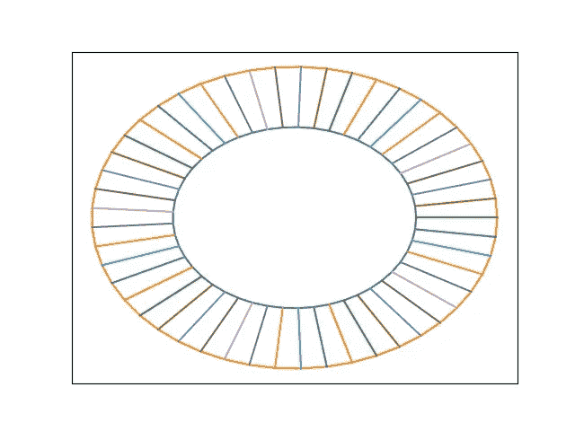
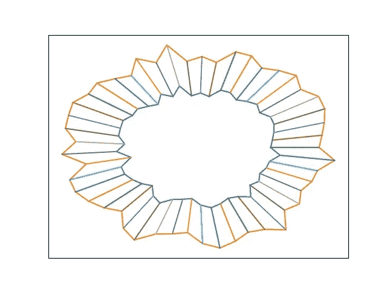
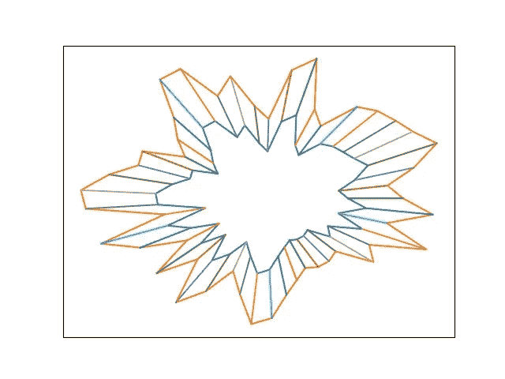
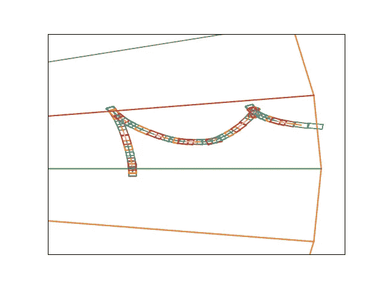
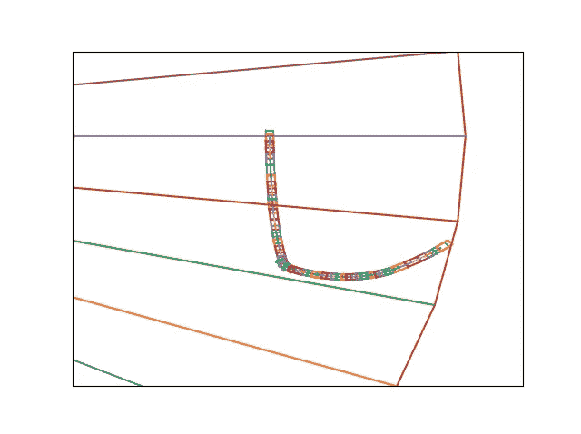
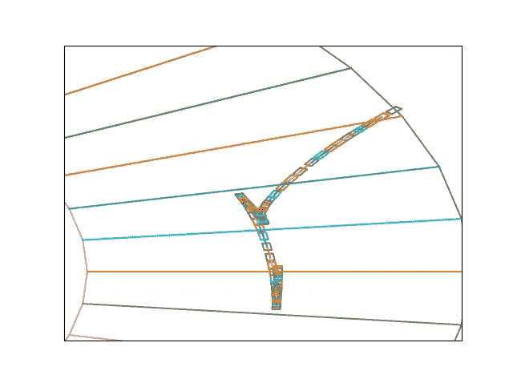
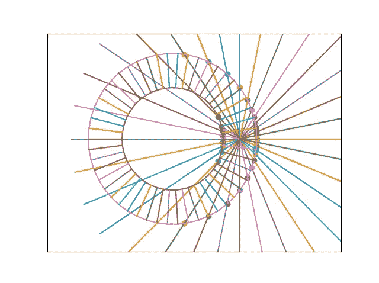

# 从头开始强化学习，第 1 部分:模拟器

> 原文：<https://medium.com/analytics-vidhya/reinforcement-learning-from-scratch-part-1-the-simulator-4fc7976e1e3d?source=collection_archive---------17----------------------->

到目前为止，我已经在 applied ML 工作了几年。尽管各种项目让我有幸涉猎了一些非常酷的模型架构，但强化学习是我最不擅长的事情；我还没有发现有必要将这种特殊的范例应用到我的任何项目中。

尽管如此，强化学习似乎是一个很酷的想法；根据从环境中收集的数据学习一组奖励的概念，除了奖励函数之外什么都没有，感觉像是这样一个广泛的概括，然而我们以某种方式使整个事情可微分，并把这个问题框定为一个跨越几乎光滑流形的复杂优化问题。在一个寒冷的冬日，我开始从头开始观看各种各样的模型。

然而，在我开始之前，我想从头开始创建一个环境。我想创造一个赛车游戏，但有一个转折；曲目是随机生成的，带有一个“温度”度量，它决定了曲目的难度。我想训练一种策略，当给定一条赛道时，它可以在不同的温度下稳健地跑圈。赛道的范围从 0 度的圆形赛道，一直到曲折弯曲的赛道，甚至对高温下的人类都具有挑战性。这样，通过根据模型在给定温度下的表现统计数据平滑地增加赛道温度，我希望创建一个可以在越来越困难的赛道上行驶的模型，从简单的赛道训练开始。

不同温度下的轨迹。从左到右分别为:T = 0，T = 0.2，T = 0.5。细分轨迹的线表示奖励边界；本文稍后将对此进行详细介绍。

您可能会看到磁道被细分为检查点，如穿过每个磁道的线条所示。每次我们的车经过其中一个点，我们都会奖励它的良好表现！每个关卡对应+1 的奖励。

然而，我们不希望汽车撞到墙上。这是非常糟糕的，并终止我们的模拟。如果发生这种情况，我们会用-5 的奖励来惩罚这辆车。

每辆车都遵循一个非常简单的物理模型。汽车有速度和角速度。在每个时间步，汽车可以选择修改其角速度和加速度，这将影响车辆在下一个时间步的位置。最大角速度和速度是有上限的。汽车以向量的形式进行这些运动，向量有四个元素，分别是前进(+速度)、左转(-角速度)、右转(+角速度)和后退(-速度)。1 告诉汽车以预定的加速度在该时间步长加速，而 0 告诉汽车什么也不做。

为了形象化起见，让我们为温度= 0 的轨道上的随机模型绘制几条这样的轨迹:

不太好。

不出所料，这辆车表现不佳；它在撞上墙之前盲目地四处行驶。没关系，一切都得从某处开始。让我们的车开得比这更好！

然而，在实现任何模型之前，一个奖励函数显然是不够的；汽车必须知道它为什么表现不好。因此，汽车配备了非常简陋的激光雷达；它以一组恒定的角度投射光线，然后返回该角度到最近墙壁的距离。

车载激光雷达

这组点就是输入网络的内容。这将通过网络运行，然后生成一组动作。动作将被输入物理模拟器，并给予奖励；该奖励将通过模型反向传播，然后根据给定的奖励更新权重。

当分数持续变高时，后续培训课程的温度将会升高，以便推广一种能够真正学会在课程中导航的模型，而不是简单地将赛道布局记忆在其内存中，而无法将知识转移到不同的赛道上。

随着试验台的建立，是时候实际处理一些数字和训练一些模型了！在第 2 部分中。

如果您想更详细地查看这些信息，请访问存储库[这里](https://github.com/Gezili/racecar)。忽略混乱，在写作的时候，这整个事情是在 8 个小时的过程中以黑客马拉松的方式完成的。

我对这个项目超级兴奋，并随时评论任何建议！